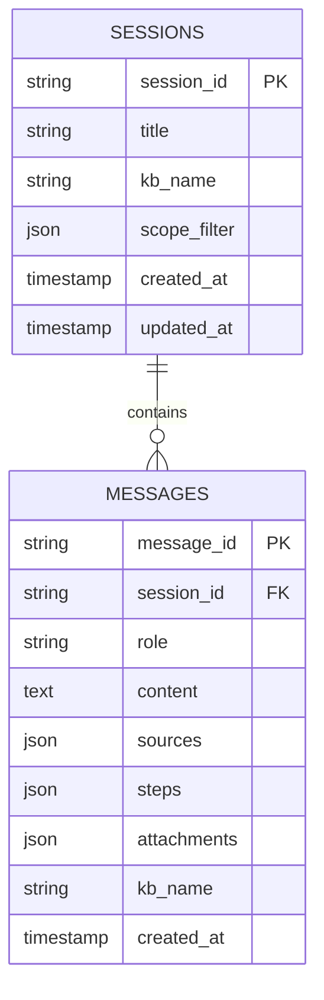

# 会话 API

问答控制台的对话持久化。会话存储元数据、**范围过滤状态**及带 sources/steps 的消息历史。

路由位于 `eagle_rag/api/query.py`（与 query 同标签）。模型：`eagle_rag/api/schemas/sessions.py`，存储：`eagle_rag/sessions/store.py`。

---

## 数据模型



---

## `GET /sessions`

列出会话，最新优先。

| 查询 | 默认 | 说明 |
|-------|---------|-------------|
| `limit` | 50 | 1–500 |
| `offset` | 0 | 分页 |
| `kb_name` | — | 按 KB 元数据过滤 |

### 响应 — `SessionListResponse`

数据库失败时降级为 `{ items: [], limit, offset }`（HTTP **200**，无 error 字段）。

---

## `POST /sessions`

显式创建会话（可选 —— 省略 `session_id` 时 `/query` 自动创建）。

请求体 — `SessionCreate`：

```json
{ "title": "Revenue policy review", "kb_name": "finance" }
```

**201** `SessionSummary`。**503** 数据库不可用。

---

## `GET /sessions/{session_id}`

`SessionSummary`：

| 字段 | 说明 |
|-------|-------------|
| `session_id` | UUID |
| `title` | 显示标题 |
| `kb_name` | 遗留单 KB 提示 |
| `scope_filter` | `{ kb_names, document_ids, tags }` 或 null |
| `created_at`、`updated_at` | ISO 时间戳 |

**404** 未找到。**503** DB 错误。

---

## `PATCH /sessions/{session_id}`

仅更新标题（请求体：`SessionCreate` 含 `title`）。**404** / **503** 同上。

---

## `DELETE /sessions/{session_id}`

级联删除消息。`DeletedResponse`。缺失 **404**。

---

## `GET /sessions/{session_id}/messages`

分页 `MessageListResponse`。

| 查询 | 默认 |
|-------|---------|
| `limit` | 100（最大 1000） |
| `offset` | 0 |

### `MessageOut`

| 字段 | 类型 | 说明 |
|-------|------|-------|
| `message_id` | string | UUID |
| `role` | `user \| assistant` | |
| `content` | string | 完整答案文本 |
| `sources` | `QuerySources \| null` | 持久化引用载荷 |
| `steps` | `QueryStep[] \| null` | 执行轨迹 |
| `attachments` | `string[] \| null` | 仅用户消息 |
| `kb_name` | string \| null | 写入时请求的 KB |
| `created_at` | string | ISO |

---

## 范围过滤持久化

每次 `/query` 与 `/query/stream` 请求时，`query.py` 中 `_resolve_session`：

1. 省略 `session_id` → `create_session(…, scope_filter=…)`
2. 提供 `session_id` → `set_session_scope_filter(session_id, scope_filter_dict)`

```python
scope_filter_dict = (
    req.scope_filter.model_dump()
    if req.scope_filter is not None and not req.scope_filter.is_empty()
    else None
)
```

UI 切换会话时，将范围恢复到 Zustand `useScopeStore`（`QAClient.handleSelectSession`）。

### 前端水合

```typescript
const sf = session?.scope_filter;
setScope({
  kbNames: idsToRefs(sf?.kb_names),
  documents: idsToRefs(sf?.document_ids),
  tags: idsToRefs(sf?.tags),
});
```

遗留回退：若仅设置 `session.kb_name`（非 `default`），水合为单个 KB 芯片。

---

## 查询时自动创建

首次 `/query` 时 `session_id` 为 null：

- 生成新 UUID
- 标题 = query 字符串前 30 字符
- 请求的 `kb_name` 与 `scope_filter` 写入会话行
- 立即追加用户消息
- 生成后（或 SSE `done`）追加助手消息

---

## 多租户

会话上的 `kb_name` 为元数据 —— 问答页以 `scope_filter` 为检索权威。`GET /sessions?kb_name=finance` 过滤历史抽屉中的会话列表。

---

## TanStack Query keys（前端）

| Hook | `queryKey` |
|------|------------|
| `useSessions` | `["sessions", params]` |
| `useSession` | `["session", sessionId]` |
| `useMessages` | `["messages", sessionId, params]` |

变更使 `["sessions"]` 及相关 `["session", id]` 失效。

---

## 相关文档

- [查询](query.md) —— 查询对会话的副作用
- [状态管理](../frontend/state-management.md) —— 范围 store 与会话 API
- [会话（后端）](../backend/sessions-notifications.md)
