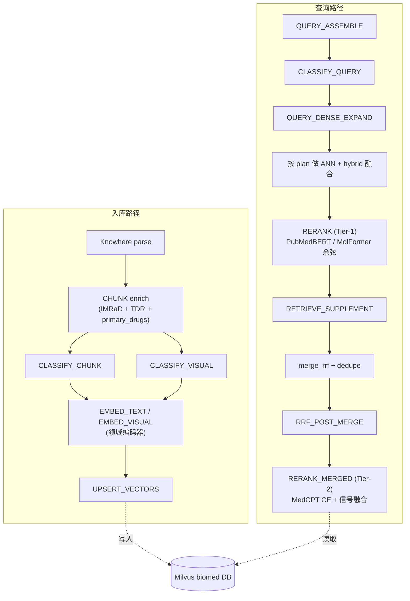

# Biomed 插件

`plugins/biomed` 是 Eagle-RAG 微内核的**实验性**仓库内垂类插件，用于在专用 Milvus Database（`biomed`，命名空间 `biomed`）之上提供生物医学文献、化合物与医学影像 RAG。插件仅通过 `HookBus` 与 `EncoderRegistry` 扩展点进入 Core - Core 在查询热路径上**不 import `plugins.biomed`**（ADR-008）。

配套文档：[Biomed 检索](biomed-retrieval.md)（检索算法深入）。横切上下文：[插件架构](plugin-architecture.md)。作者模板：`plugins/_template/`。

---

## 概览与边界

| 维度 | 取值 |
| --- | --- |
| 命名空间 | `biomed`（`EAGLE_RAG_PROFILE=biomed` 时与 `settings.plugins.default_namespace` 一致） |
| Milvus Database | `biomed`（由 `milvus_ns.milvus_db_name()` 推导） |
| 成熟度 | **实验性** - API、collection、编码器接线可能随版本调整 |
| 专用 collection | 5 个（`eagle_text_biomed`、`eagle_text_medcpt`、`eagle_chemical`、`eagle_medical_radiology`、`eagle_medical_pathology`） |
| 领域编码器 | 7 个，注册到 `EncoderRegistry` |
| 热路径 Hook | 12 个（不订阅 `PARSE`；`CHUNK` 仅做 enrich，见 ADR-005） |
| MCP 工具 | `biomed_query_entities`、`biomed_retrieve_compounds` |
| 边界 | 纯 RAG 数据层；无 Agent 工作流；MCP 工具只读（ADR-008） |



Core 负责编排、RRF、去重、`encoder_runtime` 分发；biomed 负责意图识别、路由、稠密扩写、Tier-1/Tier-2 重排、补召回与打分。详见下文 Core/插件边界契约章节。

---

## 专用 collection 与 schema

`ensure_biomed_collections`（`plugins/biomed/__init__.py`）遍历 `COLLECTION_DIMS`，按文本/视觉分别交给 `_ensure_text_collection` 或 `_ensure_visual_collection`。所有 collection 都在 `biomed` Milvus Database 内。

| Collection | 编码器 | 维度 | 度量 | Hybrid | 默认 `chunk_type` | 额外输出字段 |
| --- | --- | --- | --- | --- | --- | --- |
| `eagle_text_biomed` | `pubmedbert` | 768 | COSINE | 是 | `text` | `primary_drugs`、`biomed_section` |
| `eagle_text_medcpt` | `medcpt-query` | 768 | COSINE | 是 | `text` | `primary_drugs`、`biomed_section` |
| `eagle_chemical` | `molformer` | 768 | COSINE | 否 | `chemical` | - |
| `eagle_medical_radiology` | `medimageinsight` | 1024 | **IP** | 否 | `medical_image` | - |
| `eagle_medical_pathology` | `uni2` | 1536 | **IP** | 否 | `medical_image` | - |

### 文本 collection schema（`_ensure_text_collection`）

| 字段 | 类型 | 说明 |
| --- | --- | --- |
| `id` | VARCHAR(64) | 主键 |
| `vector` | FLOAT_VECTOR(dim) | HNSW 索引 `M=16, efConstruction=256` |
| `text` | VARCHAR(65535) | chunk 正文 |
| `document_id` | VARCHAR(64) | INVERTED 索引 |
| `kb_name` | VARCHAR(64) | 默认 `"default"`；INVERTED 索引 |
| `path` | VARCHAR(2048) | Knowhere doc_nav 路径 |
| `chunk_type` | VARCHAR(32) | 默认 `"text"`；INVERTED 索引 |
| `source_type` | VARCHAR(64) | INVERTED 索引 |
| `source_chunk_id` | VARCHAR(128) | 跨 collection 锚点 |
| `primary_drugs` | VARCHAR(2048) | 可空；药名 CSV（实体加权） |
| `biomed_section` | VARCHAR(64) | 可空；IMRaD/标签章节 |

### 视觉 collection schema（`_ensure_visual_collection`）

| 字段 | 类型 | 说明 |
| --- | --- | --- |
| `id` | VARCHAR(64) | 主键 |
| `vector` | FLOAT_VECTOR(dim) | HNSW 索引；**IP** 度量（L2 归一化的 CLIP 向量） |
| `image_path` / `image_id` | VARCHAR | 对象存储引用 |
| `document_id` / `kb_name` | VARCHAR | `kb_name` 默认 `"default"` |
| `chunk_type` | VARCHAR(32) | 默认 `"medical_image"` |
| `parent_section` / `content_summary` | VARCHAR | 四锚点字段 |
| `source_chunk_id` | VARCHAR(128) | 跨 collection 锚点 |
| `source_type` | VARCHAR(64) | |

### 在线迁移

`_ensure_biomed_section_field` 通过 `client.add_collection_field` 为已有但缺 `biomed_section` 列的 collection 做在线 schema 迁移，保证老 `biomed` 库在新字段引入后仍可用。

---

## 领域编码器

`plugins/biomed/encoders.py` 在 `BiomedPlugin.on_load` 调用 `register_encoders(ctx)`，向 `ctx.encoder_registry` 注册 7 个编码器：

| 标签 | 模态 | 维度 | 默认 HF checkpoint | 覆盖环境变量 |
| --- | --- | --- | --- | --- |
| `pubmedbert` | text | 768 | `microsoft/BiomedNLP-PubMedBERT-base-uncased-abstract-fulltext` | `EAGLE_BIOMED_PUBMEDBERT_MODEL` |
| `molformer` | text | 768 | `seyonec/ChemBERTa-zinc-base-v1` | `EAGLE_BIOMED_MOLFORMER_MODEL` |
| `medcpt-query` | text | 768 | `ncbi/MedCPT-Query-Encoder` | `EAGLE_BIOMED_MEDCPT_QUERY_MODEL` |
| `medcpt-article` | text | 768 | `ncbi/MedCPT-Article-Encoder` | `EAGLE_BIOMED_MEDCPT_ARTICLE_MODEL` |
| `medimageinsight` | visual | 1024 | `microsoft/BiomedCLIP-PubMedBERT_256-vit_base_patch16_224`（BiomedCLIP） | `EAGLE_BIOMED_MEDIMAGE_MODEL` |
| `uni2` | visual | 1536 | `MahmoodLab/UNI2-h` | `EAGLE_BIOMED_UNI2_MODEL` |
| `medcpt-rerank` | rerank | 1 | `ncbi/MedCPT-Cross-Encoder` | `EAGLE_BIOMED_MEDCPT_RERANK_MODEL` |

### 三种编码器模式

`LazyDomainEncoder` 的模式由 `plugin_options("biomed").encoder_mode` 或 `EAGLE_BIOMED_ENCODER_MODE`（默认 `auto`）决定：

| 模式 | 行为 |
| --- | --- |
| `deterministic` | 仅用哈希嵌入（SHA-256 -> dim，L2 归一化）。CI/测试，不下载 HF 权重。 |
| `require_native` | 权重加载失败即 `EncoderLoadError` 快速失败。生产安全。 |
| `auto` | 先尝试 native；失败时**仅当** `EAGLE_BIOMED_ALLOW_DETERMINISTIC=1` 才回退到 deterministic，否则抛错。 |

**医学影像编码器（`medimageinsight`、`uni2`）绝不回退到 Qwen3-VL。** 这是 `LazyDomainEncoder.encode_image` 内部强制的硬契约。Core 的 `eagle_visual` 保持 Qwen；biomed 的医学影像 collection 保持 BiomedCLIP/UNI2。

### `LazyDomainEncoder` 内部实现

- **懒加载**：HF 权重在首次 `encode_text` / `encode_image` 时加载，而非插件注册时。
- **文本编码**（`_encode_hf_text`）：`last_hidden_state` 按 `attention_mask` 加权均值池化；截断到 512 token；`_fit_dim`（截断或补零到 `self.dim`）；L2 归一化。
- **图像编码**（`_encode_vision_bytes`）：`PIL.Image.open(BytesIO).convert("RGB")`；`open_clip` 路径用 `preprocess(image).unsqueeze(0)` + `model.encode_image` + L2 归一化；HF vision 后端用 `image_embeds` 或均值池化的 `last_hidden_state`。

### BiomedCLIP via `open_clip`（跨模态检索）

`_prefer_open_clip` 对 `medimageinsight` 或任何含 `biomedclip`/`clip` 的 model id 返回 True。`_load_open_clip_backend` 通过 `_open_clip_model_ref` 规范化模型引用：

- HuggingFace Hub 引用加 `hf-hub:` 前缀，使用 `open_clip.create_model_from_pretrained` + `open_clip.get_tokenizer`。
- 本地 `.bin` checkpoint 使用 `EAGLE_BIOMED_OPENCLIP_ARCH`（默认 `ViT-B-16`）架构与 `EAGLE_BIOMED_OPENCLIP_PRETRAINED`（默认 `openai`）权重。

CLIP **文本塔**（`_encode_clip_text_query`）与图像塔共享同一嵌入空间，因此自然语言查询经 `encode_text` 编码后可与 `eagle_medical_radiology` 中由 `encode_image` 编码的向量匹配。这是文本 -> 影像跨模态检索的基础。

`uni2`（病理）仅支持 HuggingFace，没有文本塔，因此病理检索只能 image -> image。

### `LazyMedCPTReranker`

Tier-2 重排用的懒加载 MedCPT 交叉编码器。`score_pairs(query, texts)` 将 `(query, text)` 对以 `max_length=512` 分词，运行 `AutoModelForSequenceClassification`，取 `logits`（二维时挤压最后一列）。支持 CUDA。权重缺失且允许 deterministic 时回退到 `_deterministic_scores`（基于 SHA-256）。

### `EncoderRegistry` 集成

每个 collection 注册时携带 `CollectionProfile`（`default_encoder`、`hybrid_enabled`、`extra_output_fields`）：

```python
registry.register_collection(
    "eagle_text_biomed",
    dim=768,
    default_encoder="pubmedbert",
    hybrid_enabled=True,
    extra_output_fields=("primary_drugs", "biomed_section"),
)
```

`IngestOrchestrator.embed_and_upsert` 与 `RetrieverOrchestrator._retrieve_plan` 会调用 `encoder_registry.validate_plan(collection, encoder_name)`，维度不匹配即抛 `ValueError`（`modality="rerank"` 除外）。`RetrieverOrchestrator` 在查询时读取 `hybrid_enabled_for_collection` 与 `extra_output_fields_for_collection`。

---

## 入库流水线

### 格式选择器（`hooks_extra.biomed_format_selector`）

`INGEST_ROUTE_SELECTORS` 订阅者。将 biomed 文件扩展名路由到 Core `knowhere` 管线（返回 `"knowhere"`），其他格式弃权（`None`）：

`.pdb`、`.sdf`、`.mol`、`.mol2`、`.cif`、`.dcm`、`.nii`、`.nii.gz`

### CHUNK enrich（`chunker.biomed_chunk_transform`）

`CHUNK` transform hook。**仅 enrich 契约**（ADR-005）：绝不重新切分文本，绝不改写 `path` / 节点正文 / `doc_nav` / `chunk_id`。为每个节点标注：

1. **章节标签**（`detect_section`）：按 Knowhere `path` 段**由叶到根**遍历（`_section_from_path`），首个命中的 IMRaD/专利/标签别名胜出。仅当 `path` 为空时回退到文本标题启发式（`_section_from_text_heading`）：带序号标题正则、全大写短标题（<=6 词）、专利权利要求正则。规范化章节（`_SECTION_ALIASES`）：`abstract`、`introduction`、`methods`、`results`、`discussion`、`conclusion`、`claims`、`indications_and_usage`、`warnings`、`dosage`。未命中的非空 path -> `"body"`。
2. **文档类型**（`detect_doc_type`）：`compound` / `drug_label` / `patent` / `research` / `other`，依据文件名 token（`compound_`、`label_`）+ 正文（`prescribing information`、`what is claimed`）+ 章节。
3. **主要药物**（`_primary_drugs_for_node`）：对 `file_name`、`source_uri`、`path`、`text[:512]`、`document_id` 调 `umls.match_drug_entities`；保序去重；最多 8 个。写入 `metadata["primary_drugs"]`。
4. **TDR profile**：所有节点标注完成后，运行 `classify_document_text_profile(out)` + `apply_text_profile_to_nodes(out, profile)`（见下）。

### 分层文档路由器（TDR） - `doc_profile.py`

`classify_document_text_profile(nodes)` 返回 `DocumentTextProfile(profile, confidence, rule, tier, signals)`，判定文档是 `biomedical`（用 PubMedBERT）还是 `general`（用 Core `text-embedding-v4`）。三层：

#### Tier-0 - 路由器关闭

`plugin_options("biomed").doc_semantic_router.enabled == false` 时，返回 `biomedical`，置信度 0.5（`rule="router_disabled_default"`）。

#### Tier-1 - 信号融合

`build_document_sketch(nodes, max_chars=sketch_max_tokens*4)` 优先取 `section_summary` chunk 与 `content_summary` 元数据，然后是前 8 个节点正文。计算 4 个信号：

| 信号 | 公式 | 上限 |
| --- | --- | --- |
| **原型余弦差** | `proto_margin = score_bio - score_gen`，其中 `score_*` = PubMedBERT 嵌入后的文档 sketch 与 `plugins/biomed/doc_profile_prototypes.yaml` 中原型向量的最大余弦（5 个 biomedical 原型：试验摘要、PubMed 摘要、FDA 标签、ClinicalTrials.gov、激酶实验；3 个 general 原型：财报、新闻稿、年报） | [−1, 1] |
| **UMLS 密度** | `unique_entities / sqrt(len(sketch))` | [0, 1] |
| **IMRaD 多样性** | `distinct_imrad_sections / 3.0` | [0, 1] |
| **sketch 熵** | token 频率香农熵 / 5.0 | [0, 1] |

融合分（默认权重，可通过 `doc_semantic_router.fusion.weights` 覆盖）：

```
confidence = 0.55 * proto_margin + 0.25 * umls_density
           + 0.15 * imrad_diversity + 0.05 * sketch_entropy
```

决策带以 `confidence_threshold`（默认 0）± `llm_margin`（默认 0.12）划分：

- `confidence > threshold + margin` -> `biomedical`（`rule="tier1_fusion_biomedical"`）
- `confidence < threshold − margin` -> `general`（`rule="tier1_fusion_general"`）
- 否则 -> Tier-2 仲裁

#### Tier-2 - LLM 仲裁

`_llm_arbitrate(sketch, cfg)` 调用 `create_router_llm(settings.llm)`，发送 JSON 提示：

```
Classify the document sketch as biomedical or general corporate text.
Return JSON only: {"profile":"biomedical"|"general","confidence":0.0-1.0,"rationale":"..."}
```

解析失败、`llm.enabled=false` 或 LLM 不可用时，回退到 `ambiguous_default`（默认 `biomedical`）。

`apply_text_profile_to_nodes(nodes, profile)` 将 `biomed_text_profile`、`biomed_text_profile_rule`、`biomed_text_profile_confidence`、`biomed_text_profile_tier` 写入每个节点 metadata。`BiomedTextClassifier` 通过 `ClassificationContext.extra["text_profile*"]` 读取。

### 文本/视觉分类器（`classifiers.py`）

#### `BiomedTextClassifier.classify`

1. **SMILES 硬覆盖**：`_SMILES_RE`（`InChI=`、`SMILES`、`C(=O)`、`[C@]` 等方括号原子）命中 -> `eagle_chemical` / `molformer` / `chunk_type="chemical"` / 置信度 0.7 / `exclusive_group="biomed_text"`。
2. **TDR profile 路由**：
   - `text_profile == "general"` -> Core `eagle_text` / `text-embedding-v4` / `chunk_type="text"` / TDR 置信度（默认 0.6）。
   - 否则（`"biomedical"`）-> `eagle_text_biomed` / `pubmedbert` / `chunk_type="biomed_text"` / TDR 置信度（默认 0.75）。

`exclusive_group="biomed_text"` 触发 `ingest_helpers` 去重：每次入库同一分组只写一个 collection，因此一个 chunk 要么进 `eagle_text_biomed` 要么进 `eagle_text`，不会双写。

#### `BiomedImageClassifier.classify`

按 caption/alt_text/content_summary/parent_section 拼接文本 + modality + 扩展名关键字路由：

| 触发 | Collection | 编码器 | 置信度 |
| --- | --- | --- | --- |
| `_RADIOLOGY_RE`（CT/MRI/ultrasound/radiograph）或 modality `ct`/`mri`/`ultrasound`/`radiology` | `eagle_medical_radiology` | `medimageinsight` | 0.8 |
| `_PATHOLOGY_RE`（H&E/hematoxylin/biopsy/dysplasia/IHC）或 modality `pathology`/`histology`/`he` | `eagle_medical_pathology` | `uni2` | 0.8 |
| `_CHEMICAL_IMAGE_RE` 或 `.mol`/`.sdf`/`.pdb` | `eagle_chemical` | `molformer` | 0.75 |
| `.dcm`/`.nii`/`.nii.gz` | `eagle_medical_radiology` | `medimageinsight` | 0.85 |
| 兜底 | Core `eagle_visual` | `qwen3-vl` | 0.5 |

只有兜底路径会触及 Qwen3-VL；医学影像保持在 BiomedCLIP/UNI2。

### Embed 分发（`_embed_text` / `_embed_visual`）

`EMBED_TEXT` / `EMBED_VISUAL` 订阅者。当 `decision.target_encoder` 为 `text-embedding-v4` 或 `qwen3-vl`（或为空）时**弃权（返回 `None`）**，交由 Core 默认订阅者处理。否则：

- `_embed_text` -> `encoder_runtime.encode_text_chunk(chunk, encoder_name)`（写入 `metadata["embedding"]`）。
- `_embed_visual` -> `encoder_runtime.encode_visual_bytes_for_encoder(encoder_name, image_bytes)`。

`IngestOrchestrator.embed_and_upsert` 按 chunk_type 选择 hook，再由 `UPSERT_VECTORS`（Core 默认）写入 Milvus。

---

## UMLS / 本体集成

`plugins/biomed/umls.py` + `plugins/biomed/routing_rules.yaml`。

### 策展实体索引（`routing_rules.yaml`）

约 70 个策展实体，分 4 类，每个含 `aliases`、`cui`（UMLS CUI）、`pathways`、`related_drugs`：

- **受体酪氨酸激酶 / 癌基因**：HER2、EGFR、BRCA1/2、TP53、KRAS、NRAS、ALK、ROS1、BRAF、MET、RET、PIK3CA、PTEN、AKT、mTOR、MEK、JAK2、VEGF、VEGFR、CSF-1R、PD-L1、PD-1、CTLA4、BCL2、MYC、CDK4/6、FGFR、NOTCH1、WNT、ERK、CD20、KIT、FLT3、IDH1/2、PARP。
- **药物 / 小分子**：fruquintinib、savolitinib、surufatinib、sunitinib、cabozantinib、lenvatinib、regorafenib、sintilimab、camrelizumab、imatinib、metformin、aspirin、trastuzumab、pembrolizumab、nivolumab、olaparib、osimertinib、sotorasib、vemurafenib、palbociclib、bevacizumab、everolimus、venetoclax。
- **疾病**：乳腺/肺/结直肠/胰腺/肾癌、黑色素瘤、白血病、淋巴瘤、神经内分泌肿瘤、糖尿病、COVID-19。
- **通路**：PI3K-AKT、MAPK、JAK-STAT、apoptosis、angiogenesis。

另有 `entity_keywords`（29 个通用术语：kinase、pathway、receptor、mutation…）与 `chemical.name_aliases`（10 个常见药名 -> SMILES：aspirin -> `CC(=O)Oc1ccccc1C(=O)O`、imatinib、fruquintinib、savolitinib、surufatinib、sunitinib、osimertinib、gefitinib、lapatinib、caffeine、ethanol）。

### 可选 MRCONSO 合并

`load_umls_metathesaurus(path)` 解析真实 UMLS MRCONSO RRF 文件（环境变量 `EAGLE_BIOMED_UMLS_MRCONSO_PATH`，需 NLM 授权），只保留 `LAT=ENG` + `ISPREF=Y` 行。`_merged_index()` 按规范化 canonical 名合并策展 YAML + MRCONSO 别名；MRCONSO 中新增的实体以空 `pathways` / `related_drugs` 加入。文件缺失时优雅返回空 dict。

### 字母边界匹配（`_entity_pattern`）

`match_entities(query)` 为每个实体构造带字母边界的正则，避免短缩写在长单词内部误命中：

| 查询 | `EGFR` 模式 | `VEGFR` 模式 | 结果 |
| --- | --- | --- | --- |
| `"VEGFR1 expression"` | 不命中（在 `VEGFR` 内） | 命中 | `["VEGFR"]` |
| `"EGFR mutation"` | 命中 | 不命中 | `["EGFR"]` |
| `"PD-1 inhibitor"` | - | - | `["PD-1"]`（连字符保留） |
| `"metastatic site"` | - | - | `[]`（MET 不会在 `metastatic` 内命中） |

同时对 `entity_keywords` 用 `\b` 词边界匹配。

### 药物后缀正则

`match_drug_entities(query)` 是 `_drug_entity_keys()` 的子集过滤：`entity_type=="drug"` 或匹配 `_DRUG_SUFFIX`（`mab|zumab|limab|nib|tinib|rafenib|citinib|parib|senib|stat|formin$`）。无需显式 `entity_type` 即可自动归类药名。

### 扩写辅助

| 函数 | 用途 |
| --- | --- |
| `resolve_entity(entity)` | 返回 `{entity, found, cui, aliases, pathways, related_drugs}` |
| `expand_query_with_entities(query, limit=12)` | 按查询中首次出现排序；每个实体追加 2 别名 + 1 通路；返回 `"[biomed entities: alias1, alias2, ...]"`；去重并截断到 `limit` |
| `expand_query_for_dense_retrieval(query)` | `f"{query} {suffix}"` - 仅用于稠密嵌入；稀疏保留原始 query |
| `resolve_compound_query(smiles_or_name)` | 通过 `chemical.name_aliases` 将常见药名映射为 SMILES，否则原样返回。供 MCP `retrieve_compounds` 使用 |

---

## MCP 工具

`plugins/biomed/mcp_tools.py` 通过 `@register_mcp_tool(namespace="biomed", ...)` 注册两个工具：

### `biomed_query_entities`

从本地 UMLS 子集本体索引解析生物医学实体，返回别名、通路与相关药物。

| 属性 | 类型 | 必填 | 说明 |
| --- | --- | --- | --- |
| `entity` | string | 是 | 基因、药物、疾病或通路名（如 `HER2`、`imatinib`） |
| `kb_name` | string | 否 | 知识库范围 |

通过 `umls.resolve_entity` 返回 `{entity, found, cui, aliases, pathways, related_drugs}`。

### `biomed_retrieve_compounds`

用 MolFormer 嵌入在 `eagle_chemical` 做 ANN 检索相似化合物。接受 SMILES 或已知药名。

| 属性 | 类型 | 必填 | 说明 |
| --- | --- | --- | --- |
| `smiles_or_name` | string | 是 | SMILES 串或药名（如 `aspirin`、`CC(=O)Oc1ccccc1C(=O)O`） |
| `top_k` | integer | 否 | 最大命中数（默认 5，上限 50） |
| `kb_name` | string | 否 | 知识库范围 |

实现：

1. `resolve_compound_query(smiles_or_name)` - 药名 -> SMILES。
2. `encode_text_for_encoder("molformer", query)` - MolFormer 嵌入。
3. `get_milvus_pool().get(milvus_db_name(ns))` - biomed DB 客户端。
4. `client.search(collection_name="eagle_chemical", data=[vector], anns_field="vector", limit=min(top_k, 50), filter='kb_name == "..."', output_fields=[...])`。
5. 返回 `{query, collection, encoder, hits: [{compound_id, smiles, score, document_id, path, kb_name}]}`，对 `encode_failed` / `collection_missing` / `search_failed` 返回优雅错误信封。

### RAG-only 强制

`assert_rag_only_tool_name` 拒绝含 `execute_sql`、`send_email`、`mutate_`、`write_db` 等片段的名字。`PluginManager.register_mcp_tools` 只注册 `core` + `default_namespace` 插件的工具（G3），因此 biomed 实例只暴露 `core_*` + `biomed_*` 工具。

---

## 配置与依赖

### `settings.plugins.options.biomed`

通过 `plugin_options("biomed", settings)` 读取。旋钮：

| 旋钮 | 默认 | 用途 |
| --- | --- | --- |
| `default_dual_text_search` | `false` | 同时用 Core `eagle_text` + `text-embedding-v4` 检索 |
| `exploratory_search_collections` | `[]` | 额外始终检索的 collection |
| `use_general_rerank` | `false` | 强制用 Core `qwen3-rerank` 替代领域重排 |
| `rerank_policy` | `domain` | `domain` / `general` / `none` |
| `domain_rerank_encoder` | `medcpt-rerank` | Tier-2 CE 编码器标签 |
| `retrieval_scoring` | (5 个 profile) | 按 workflow 覆盖权重（见 [Biomed 检索](biomed-retrieval.md)） |
| `medcpt_dual_search` | `false` | 同时检索 `eagle_text_medcpt` |
| `collection_recall_top_k` | `20` | 每 plan 召回池大小 |
| `encoder_mode` | `auto` | `auto` / `require_native` / `deterministic` |
| `doc_semantic_router.enabled` | `true` | TDR 总开关 |
| `doc_semantic_router.sketch_max_tokens` | `2048` | 文档 sketch 大小 |
| `doc_semantic_router.prototype_config` | `plugins/biomed/doc_profile_prototypes.yaml` | 原型文本路径 |
| `doc_semantic_router.fusion.weights` | `{prototype: 0.55, umls: 0.25, imrad: 0.15, entropy: 0.05}` | TDR 融合权重 |
| `doc_semantic_router.confidence_threshold` | `0.0` | Tier-1 决策阈值 |
| `doc_semantic_router.llm_margin` | `0.12` | 模糊带 -> Tier-2 |
| `doc_semantic_router.llm.enabled` | `true` | Tier-2 LLM 仲裁开关 |
| `doc_semantic_router.llm.max_sketch_chars` | `6000` | LLM 提示 sketch 上限 |
| `doc_semantic_router.ambiguous_default` | `biomedical` | Tier-2 回退 |

### Profile 叠加（`profiles.biomed`）

除上述每插件旋钮外，`biomed` profile 还设置：

```yaml
profiles:
  biomed:
    plugins:
      enabled: [eagle_rag.plugins.core_defaults, plugins.biomed]
      default_namespace: biomed
    router:
      hybrid_text_collections: [eagle_text_biomed, eagle_text_medcpt]
    milvus:
      db_name: biomed
```

`router.hybrid_text_collections` 在决定哪些 collection 做 dense+sparse 融合时优先于 `EncoderRegistry.hybrid_enabled_for_collection`。

### 环境变量

| 变量 | 用途 |
| --- | --- |
| `EAGLE_RAG_PROFILE=biomed` | 激活 biomed profile |
| `EAGLE_BIOMED_ENCODER_MODE` | `auto` / `require_native` / `deterministic` |
| `EAGLE_BIOMED_ALLOW_DETERMINISTIC` | `1` 时允许 `auto` 模式回退到哈希嵌入（仅 CI；生产勿设） |
| `EAGLE_BIOMED_PUBMEDBERT_MODEL` / `_MOLFORMER_MODEL` / `_MEDIMAGE_MODEL` / `_UNI2_MODEL` / `_MEDCPT_RERANK_MODEL` / `_MEDCPT_QUERY_MODEL` / `_MEDCPT_ARTICLE_MODEL` | HF checkpoint 覆盖 |
| `EAGLE_BIOMED_UMLS_MRCONSO_PATH` | 可选 UMLS MRCONSO RRF 文件 |
| `EAGLE_BIOMED_OPENCLIP_ARCH`（默认 `ViT-B-16`）/ `EAGLE_BIOMED_OPENCLIP_PRETRAINED`（默认 `openai`） | 本地 open_clip checkpoint 架构与权重 |

### `pyproject.toml` biomed extra

```toml
[project.optional-dependencies]
biomed = ["open-clip-torch>=2.23.0"]
```

只有 `open-clip-torch` 是 biomed 专属（用于 BiomedCLIP 影像文本<->图像）。其余（`transformers`、`torch`、`torchvision`、`pillow`、`pymilvus`）已是 Core 依赖。安装：`uv sync --extra biomed`。

注意**不依赖 `rdkit`** - 分子相似度用 MolFormer 嵌入 + 余弦，而非位指纹上的 Tanimoto。

### Docker 叠加（`docker-compose.biomed.yml`）

定义 `x-biomed-env` 锚点，含 `EAGLE_RAG_PROFILE: biomed`、`PLUGIN_NAMESPACE: biomed`、预下载模型路径 `/opt/huggingface/biomed/{pubmedbert,molformer,medimageinsight,uni2,medcpt-rerank}`，以及 `EAGLE_BIOMED_ALLOW_DETERMINISTIC: ${...:-0}`（生产快速失败）。应用于 `api` / `worker-router` / `worker-knowhere` / `worker-pixelrag` / `frontend` 服务。

---

## 可观测性与评测基线

### 审计分类

biomed hook 通过 `ctx.audit.log_decision(category=..., ...)` 写决策。常见分类：`classify_chunk`、`classify_visual`、`route_query`、`biomed_rerank_t1`、`biomed_rerank_t2`、`retrieve_plan`、`rrf_dedupe`、`ingest_exclusive_skip`、`hook_failure`。Sink 扇出到 AI JSONL、Redis LIST、内存环形、Prometheus 计数器（best-effort，不影响热路径）。`GET /health/plugins` 暴露 `recent_decisions` + `audit_stats`。

### 评测基线（aligned smoke，46 条）

| 指标 | 结果 | Smoke 门槛 |
| --- | --- | --- |
| Hit@5 | **0.87** | >= 0.70 |
| Recall@5 | **0.87** | >= 0.50 |
| MRR | **0.85** | >= 0.55 |
| Term coverage | **0.87** | >= 0.80 |

较优化前 Hit@5 0.65 / MRR 0.43 提升。剩余 6 条扩展题失败为 UMLS 覆盖缺口（gefitinib、capmatinib、tepotinib 缺 `name_aliases` SMILES）与 MolFormer 对空 SMILES 召回弱 - 数据缺口，非架构问题。运维侧失败诊断见 `eval/biomed/RETRIEVAL.md`（文末有链接）。

---

## Core/插件边界契约

| 关注点 | Core | Biomed 插件 |
| --- | --- | --- |
| 编排 | `RetrieverOrchestrator`（hook 分发、RRF、去重、inject） | 注册 `QUERY_DENSE_EXPAND`、`RERANK`、`RETRIEVE_SUPPLEMENT`、`RRF_POST_MERGE`、`RERANK_MERGED` |
| 意图识别 | 仅 `QueryRetrievalIntent` dataclass | `plugins/biomed/query_intent.py` 经 `QUERY_DENSE_EXPAND` |
| RRF / 去重 / inject | `eagle_rag/router/rerank_fusion.py` 原语 | 使用 `inject_supplement_candidates`；不重写融合 |
| Hybrid 稀疏 | `hybrid_fuse_dense_sparse` 词项重叠（无领域逻辑） | 经 `QUERY_DENSE_EXPAND` + `EncoderRegistry` 提供 `sparse_terms` 与 collection 列表 |
| Milvus upsert 元数据 | 感知 schema 的透传（`milvus_text_store` / `milvus_visual_store`） | `CHUNK` hook 写入 `primary_drugs`、`biomed_section`、`biomed_doc_type` |
| 编码器分发 | `encoder_runtime.py` 共享辅助 | 经 `EncoderRegistry` 注册 7 个编码器 |
| 实体加权 / 过滤 | - | `RERANK`、`RERANK_MERGED`、`RETRIEVE_SUPPLEMENT` hook |

Core 在查询热路径上**不得** `import plugins.biomed`。biomed 评测与运维文档位于 `eval/biomed/`。

---

## 相关文档

| 文档 | 主题 |
| --- | --- |
| [Biomed 检索](biomed-retrieval.md) | 检索算法深入（意图、路由、Tier-1/Tier-2 重排、补召回、RRF） |
| [插件架构](plugin-architecture.md) | 横切微内核 + HookBus |
| [插件术语表](glossary-plugin.md) | 术语速查 |
| [多模态融合](multimodal-fusion.md) | Knowhere + PixelRAG 锚点（Core 一等公民） |
| [编写行业 RAG 插件](../guides/authoring-industry-plugin.md) | 如何新增垂类 |
| [ADR-005](adr/005-knowhere-eagle-boundary.md) | Knowhere 职责边界（CHUNK 仅 enrich） |
| [ADR-007](adr/007-plugin-implementation-status.md) | 编码器标签 + UMLS MRCONSO + PluginAudit |
| [ADR-008](adr/008-rag-only-plugin-platform.md) | RAG-only + 前端范围 |
| `eval/biomed/RETRIEVAL.md` | 运维侧检索管线 + 失败诊断 |
| `eval/biomed/EVAL.md` | 金标字段 + smoke 命令 |
