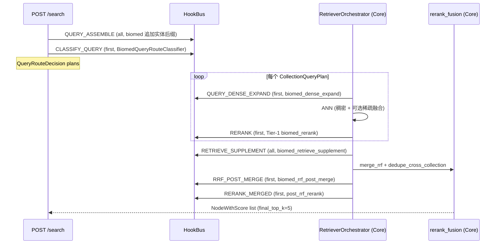

# Biomed 检索

本文档是 [Biomed 插件](biomed-plugin.md) 的算法配套，覆盖完整检索管线 - 意图识别、路由分类、稠密/稀疏扩写、hybrid 融合、Tier-1 按 plan 重排、实体锚定补召回、RRF 合并、RRF 后合并注入、Tier-2 合并重排融合 - 含生产用打分公式与权重表。

横切上下文：[插件架构](plugin-architecture.md)。运维侧失败诊断见 `eval/biomed/RETRIEVAL.md`（文末有链接）。

---

## 端到端检索流



模块归属：

| 阶段 | 归属 | 模块 |
| --- | --- | --- |
| 查询意图 | biomed | `plugins/biomed/query_intent.py` |
| 路由 | biomed | `plugins/biomed/query_route.py` |
| 稠密扩写 / 补召回 / RRF 注入 / 合并重排 | biomed | `plugins/biomed/retrieval_hooks.py` + `rerank.py` + `supplement.py` |
| 实体打分 | biomed | `plugins/biomed/scoring.py` |
| RRF / inject / dedupe 原语 | Core | `eagle_rag/router/rerank_fusion.py` |
| 编排（不 import biomed） | Core | `eagle_rag/plugins/retriever_orchestrator.py` |

Core 的 `RetrieverOrchestrator.retrieve` 驱动整个流程；biomed 逻辑仅通过 `plugin_namespace == "biomed"` 过滤的 hook 订阅者进入。

---

## 查询意图识别（`query_intent.py`）

`detect_retrieval_intent(query)` 仅从**查询文本**推断 `QueryRetrievalIntent(workflow, suppress_collections, section_cues, require_entity_match)` - **绝不**用评测金标里的 `workflow` 字段。顺序敏感：首个命中的 cue 胜出。

| workflow | 触发条件 | `suppress_collections` | `section_cues` | `require_entity_match` |
| --- | --- | --- | --- | --- |
| `chemical` | `_COMPOUND_CUE_RE`：`smiles` / `inchi` / `compound` / `ligand` / `molecular formula` | `()` | `("compound",)` | True |
| `regulatory` | `_LABEL_CUE_RE`：`drug label` / `prescribing information` / `indications and usage` / `dosage and administration` | `("eagle_chemical",)` | `warnings` / `dosage` / `indications_and_usage`（来自查询） | True |
| `combination` | `_COMBINATION_CUE_RE`（`combination` / `combined with` / `co-administered` / `plus`）且 `len(drugs) >= 2` | `()` | 查询中的 section cues | True |
| `drug_entity` | UMLS 药物实体命中（`match_drug_entities`） | `()` | 查询中的 section cues | True |
| `general` | 兜底 | `()` | 查询中的 section cues | False |

查询含 `warning` / `dosage` / `dosing` / `indications` / `usage` 时追加对应 section cue。

意图由 `biomed_dense_expand` 写入 `HookContext.extra["retrieval_intent"]`，使下游所有 hook（`RETRIEVE_SUPPLEMENT`、`RRF_POST_MERGE`、`RERANK_MERGED`）读取同一意图，无需重复推断。

---

## 查询路由分类（`query_route.py`）

`BiomedQueryRouteClassifier.route(query, plugin_namespace, has_image, route_mode, ...)` 构建多 collection 的 `QueryRouteDecision`。决策树：

1. `plugin_namespace != "biomed"` 时**弃权**（返回 `None`）-> 触发 Core `_default_classify_query`（G4：绝不自动检索专用 collection）。
2. 读取配置：`default_dual_text_search`、`medcpt_dual_search`、`exploratory_search_collections`、`collection_recall_top_k`（默认 20）。
3. 运行 `detect_retrieval_intent(query)` + `match_entities(query)`（UMLS）+ `match_drug_entities(query)`。
4. **Collection plan 组装**（顺序）：
   - `chemical_task`（intent.workflow == `"chemical"` 或查询含 SMILES）-> 加 `eagle_chemical` / `molformer`。
   - 否则 text/hybrid 模式 -> 加 `eagle_text_biomed` / `pubmedbert`。`medcpt_dual_search` 时同时加 `eagle_text_medcpt` / `medcpt-query`。`default_dual_text_search` 时同时加 Core `eagle_text` / `text-embedding-v4`。
   - 若药物命中且非 chemical 且 `eagle_chemical` 未被抑制 -> 加 `eagle_chemical`（任何 UMLS 实体有 `related_drugs` 时也加）。
   - 影像关键字 -> `eagle_medical_radiology` / `medimageinsight`。
   - 病理关键字 -> `eagle_medical_pathology` / `uni2`。
   - 视觉模式 / `has_image` / combination 工作流 + 药物 -> Core `eagle_visual` / `qwen3-vl`。
   - `exploratory_search_collections` 追加额外 collection。
5. 药物/UMLS 命中时设 `retrieval_hints["parent_doc_retrieval"] = False` - 关闭 Core 两阶段父文档检索，让 chunk 保持实体粒度。
6. 遵循 `intent.suppress_collections`（如 regulatory 抑制 `eagle_chemical`）。

分类器返回后，`apply_scope_aware_union`（`scope_routing.py`）在设置 scope 过滤（`kb_names` / `document_ids` / `tags`）时合并目录中发现的 collection - G21/G23/G29 强制 scope 文档/KB 在入库时用过的专用 plan。

---

## 稠密/稀疏扩写（`biomed_dense_expand`）

`QUERY_DENSE_EXPAND` 订阅者（每次查询被调用两次 - 一次 `encoder=None` 做全局意图 pass，之后按 plan 用 plan 的编码器）。返回 `ExpandedQuery(dense_query, sparse_terms, intent)`。

- **稠密查询改写**：仅当 `encoder == "pubmedbert"` 时，追加 `expand_query_for_dense_retrieval(query)` - 即 `f"{query} [biomed entities: alias1, alias2, pathway1, ...]"`。后缀按 UMLS 实体在查询中首次出现排序；每个实体 2 别名 + 1 通路；去重；截断到 12。其他编码器不改稠密查询。
- **稀疏词项**：`match_drug_entities(query)` + `intent.section_cues`（`_` 规范化为空格）。供 Core `hybrid_fuse_dense_sparse` 使用。
- **意图暂存**：`ctx.extra["retrieval_intent"] = intent`，供下游 hook 使用。

稀疏词项始终保留原始查询；只有稠密嵌入看到实体后缀。这种分离避免别名噪声污染词项匹配。

---

## Hybrid 稠密+稀疏融合（Core 原语）

`hybrid_fuse_dense_sparse`（`eagle_rag/retrievers/hybrid_text_retriever.py`）：

```
combined = alpha * dense_score + (1 - alpha) * sparse_score
```

- `dense_score` = Milvus ANN 距离（cosine，归一化到 `[0,1]`）。
- `sparse_score` = `sparse_score(query, text, extra_terms)` - 词项重叠度 `[0,1]`：`hits / len(terms)`，terms 含查询 token + `extra_sparse_terms`（药名、章节 cue）。
- `alpha` 来自 `settings.router.hybrid_alpha`。

**哪些 collection 融合**：`settings.router.hybrid_text_collections`（biomed profile：`eagle_text_biomed`、`eagle_text_medcpt`）优先；否则 `EncoderRegistry.hybrid_enabled_for_collection(collection)`。Core 的 hybrid 融合**不含**领域实体逻辑 - biomed 通过 `QUERY_DENSE_EXPAND` 提供 `sparse_terms`。

---

## Tier-1 按 plan 重排（`biomed_rerank`）

`RERANK` 订阅者位于 `plugins/biomed/hooks_extra.py`。按 collection 做余弦重排，可选实体过滤：

1. **编码器解析**：`eagle_text_biomed` 用 `pubmedbert`，`eagle_chemical` 用 `molformer`。其他 collection 弃权（返回 `None`）- 由 Core 或 Tier-2 处理。
2. **实体过滤**（仅当 `intent.require_entity_match` 且 `sparse_terms` 非空）：将节点过滤为 `entity_boost_score(meta, sparse_terms) > 0` 或任一词项出现在 `text[:512] path` blob 的节点。仅在过滤后非空时应用（否则保留原节点）。
3. **`cosine_rerank`**（`rerank.py`）：用编码器编码查询 + 每个节点正文（截断 2048 字符）；点积打分；降序排序。

`entity_boost_score`（`scoring.py`）：

| 条件 | 分数 |
| --- | --- |
| 任一 `primary_drugs` 元数据匹配查询药物 | 1.0 |
| 任一查询药物出现在 `path` / `file_name` / `document_name` / `source_uri` blob | 0.5 |
| 其他 | 0.0 |

`primary_drugs` 元数据由 `biomed_chunk_transform` 在入库时写入（见 [Biomed 插件](biomed-plugin.md) CHUNK enrich 章节），因此查询时实体加权无需重扫文本。

---

## 实体锚定补召回（`supplement_entity_anchored_hits`）

`RETRIEVE_SUPPLEMENT` 订阅者。关键检索优化：不依赖 `label_*` / `compound_*` 文件名前缀，而是按药名查询 PostgreSQL `documents` 注册表，找到所有提及该药的文档，再在这些 `document_id` 范围内做限定 ANN。

### 算法

1. **`_resolve_drug_terms(query)`**：优先 `match_drug_entities(query)`；若无，取首个 UMLS 实体的 `related_drugs[:4]`。保序去重。
2. **文件名无关 PG 查询**：`lookup_document_ids_by_name_terms(terms, kb_name, plugin_namespace)` - 对 `documents` 注册表 `WHERE name ILIKE %term%`。返回 `document_id` 列表。
3. **按 `(collection, encoder)` 限定 ANN**，来自 `_collections_for_intent(intent)`：
   - `chemical` 工作流 -> `eagle_chemical` / `molformer`。
   - 否则 `eagle_text_biomed` / `pubmedbert` + `eagle_chemical` / `molformer`（除非被抑制）。
4. **Limit**：每个 collection `min(recall_top_k, max(len(doc_ids) * 4, 8))`。
5. **`_rerank_entity_hits`**：`combined = entity * 2.0 + lexical + dense * 0.1`。entity 来自 `entity_boost_score`，lexical 来自 `sparse_score(query, text, extra_terms=drug_terms)`，dense 来自 Milvus 距离。

当 `require_entity_match=True` 时，经 `RRF_POST_MERGE` 在重排前注入，保证实体锚定命中进入重排候选池，即使全局 ANN 漏召回。

---

## RRF 合并与去重（Core 原语）

`merge_rrf`（`eagle_rag/router/rerank_fusion.py`）：

```
score[key] += 1.0 / (k + rank)   # k = settings.router.rrf_k（默认 60）
```

- **空列表排除**（G8）：零命中 plan 不贡献幽灵排名。
- **单一非空列表**：透传（不做融合数学）。
- **去重键**：`node.node_id`（回退 `source_chunk_id`，再回退 `(document_id, path)`）。

`dedupe_cross_collection`（G32）当超过一个 plan 成功时，按 `source_chunk_id`（优先）或 `(document_id, path)` 折叠重复，保留排名更高者。审计分类 `rrf_dedupe`。

RRF 是**唯一**的跨编码器合并机制 - 绝不混用原始跨嵌入分数。这让 PubMedBERT 768-d、MolFormer 768-d、MedCPT-Query 768-d、BiomedCLIP 1024-d、UNI2 1536-d collection 都能贡献到同一排序列表。

---

## RRF_POST_MERGE 注入（`biomed_rrf_post_merge`）

仅当 `intent.require_entity_match == True` 且 `supplement_nodes` 非空时触发。调用 `inject_supplement_candidates(merged, supplement, min_new=2)`：

- 在合并列表顶部注入最多 `min_new` 个未见过的补召回命中。
- 每个注入节点 `score += 100.0`，确保其能在重排裁剪中存活。

这保证实体锚定补召回命中进入 Tier-2 重排候选池。否则 RRF 基于排名的打分常常会把补召回命中推到 `final_top_k` 之下，无法获得公平重排。

---

## Tier-2 合并重排融合（`post_rrf_rerank`）

核心重排。`RERANK_MERGED` 订阅者位于 `plugins/biomed/rerank.py`。分离文本与 `ImageNode`；图像节点透传追加在末尾（不做 CE 打分）。

### 打分公式

```
final = w_ce * ce_norm + (w_entity * entity + w_sec * section - w_xdrug_penalty * xdrug)
```

#### MedCPT 交叉编码器归一化

`ce_norm = (ce_raw - ce_min) / (ce_max - ce_min)`（候选池 min-max 归一化）。

`ce_raw` 来自 `_medcpt_scores(query, text_nodes)`：

- 文本截断到 2048 字符。
- `score_rerank_for_encoder("medcpt-rerank", query, texts)` -> `LazyMedCPTReranker.score_pairs`（max_length=512，`AutoModelForSequenceClassification` logits）。
- 任何异常时回退到现有 `nws.score`（RRF 后排名分）。
- 若 `len(ce_scores) != len(text_nodes)`，整体回退到现有分数。

`medcpt-rerank` 为配置编码器（`plugin_options("biomed").domain_rerank_encoder`，默认 `medcpt-rerank`）。

#### 实体匹配分（`_entity_match_score`）

`boost_terms = _boost_terms_for_query(query)`：

- `match_drug_entities(query)` 非空时 -> 这些药物。
- 否则，对每个 `match_entities(query)` 实体取 `related_drugs[:6]`。

打分：

| 条件 | 分数 |
| --- | --- |
| `entity_boost_score(meta, query_drugs) >= 1.0`（primary_drugs 元数据匹配） | 1.0 |
| `entity_boost_score >= 0.5`（药物在 path/file_name/document_name/source_uri blob） | 0.75 |
| 任一查询药物在 `text[:512]` | 0.75 |
| 其他 | 0.0 |

#### 章节匹配分（`_section_match_score`）

`intent.section_cues` 在 `biomed_section` / `path` / `content_summary[:200]` blob 中的命中比例。cue 同时按原始（`indications_and_usage`）与 `_` -> 空格（`indications and usage`）匹配。

#### 跨药惩罚（`_cross_drug_penalty`）

当**全部**满足时返回 1.0（惩罚）：

- `primary_drugs` 元数据非空（按 list 或单字符串解析；JSON 数组也处理）。
- 元数据药物集合与 `query_drugs` **不相交**。
- `text[:512]` 或 `path` blob 中无查询药物。

否则返回 0.0。惩罚乘以 `w_xdrug_penalty`（按 profile 2.0-3.0）并从分数中**减去**。这能强力抑制药物特异性查询的 PMC 噪声 - 例如关于药物 A 的文档不应只因两者都是激酶抑制剂就为药物 B 的查询排名。

### Profile 权重表（`_PROFILE_WEIGHTS`）

可通过 `plugin_options("biomed").retrieval_scoring[<profile>]` 覆盖。默认权重：

| Profile | `w_ce` | `w_entity` | `w_sec` | `w_xdrug_penalty` | 适用 |
| --- | --- | --- | --- | --- | --- |
| `default`（= `general`） | 0.50 | 0.25 | 0.15 | 2.0 | 兜底 |
| `regulatory` | 0.30 | 0.20 | 0.35 | 2.5 | 药品标签 / 处方信息查询 - 章节最重要 |
| `drug_entity` | 0.35 | 0.35 | 0.10 | 3.0 | UMLS 药物实体命中 - 实体 + 强惩罚 |
| `chemical` | 0.25 | 0.40 | 0.10 | 3.0 | SMILES / 化合物查询 - 实体主导 |
| `combination` | 0.35 | 0.35 | 0.10 | 2.5 | 多药组合查询 |

profile 从 `intent.workflow` 选取；`general` 回退到 `_DEFAULT_WEIGHTS`。

### Chemical 工作流特殊路径

`intent.workflow == "chemical"` 时，融合打分后：

1. 过滤 `chemical_nodes` = `_entity_match_score(...) > 0` 的节点。
2. 非空时运行 `cosine_rerank(chemical_nodes, query, encoder="molformer")`。
3. 对融合列表中每个节点，若 MolFormer 余弦分超过融合分，取 MolFormer 分（及节点）。

这是**分子指纹式相似度** - MolFormer 嵌入 + 余弦距离。**不是**位指纹上的 Tanimoto（无 `rdkit` 依赖）。合并取 (融合, MolFormer) 中较高者，让化学结构相似性能挽救 MedCPT 低估的命中。

### `enrich_file_names` 回填

打分前，`enrich_file_names(text_nodes, plugin_namespace)` 从 PG `lookup_documents_sync` 回填 `file_name` / `document_name`，使 `entity_boost_score` 在 Milvus 元数据缺失这些字段时仍能工作。对早期未写入文件名元数据的入库至关重要。

### 重排策略解析

`resolve_rerank_policy("biomed", bus)`（`eagle_rag/plugins/rerank_policy.py`）：

1. `plugin_options("biomed").rerank_policy`（默认 `domain`）。
2. 未设且 `use_general_rerank=False` -> `DOMAIN`。
3. 未设且无 `RERANK_MERGED` 订阅者 -> `GENERAL`。

biomed 设 `rerank_policy: domain`，因此 `rerank_merged` 调用 `RERANK_MERGED`（biomed 的 `post_rrf_rerank`）而非 Core 的 `qwen3-rerank`。`general` 用 DashScope `qwen3-rerank`；`none` 跳过合并重排（透传裁剪）。所有路径写审计决策（`rerank_t2_domain` / `rerank_t2_general` / `rerank_t2_passthrough`）。

---

## 跨模态检索（BiomedCLIP）

`medimageinsight` 经 `open_clip` 加载，因此**文本塔与图像塔共享同一嵌入空间**：

- 文本查询经 `_encode_clip_text_query`（CLIP 文本塔）编码，匹配 `eagle_medical_radiology` 向量（CLIP 图像塔）。
- collection 用 **IP** 度量 + L2 归一化向量，等价于 cosine。
- 这使自然语言文本 -> 影像检索无需单独的查询编码器。

`uni2`（病理）仅支持 HuggingFace，无文本塔，因此病理检索只能 image -> image（查询图像字节经 `encode_image` 编码）。

**硬规则**：医学影像编码器（`medimageinsight`、`uni2`）**绝不**回退到 Qwen3-VL。Core 的 `eagle_visual` 保持 Qwen 处理非医学视觉（`BiomedImageClassifier` 兜底路径，置信度 0.5）。

---

## 生物医学专项优化汇总

| 优化 | 位置 | 效果 |
| --- | --- | --- |
| 字母边界 UMLS 匹配 | `umls._entity_pattern` | `EGFR` 不会在 `VEGFR` 内命中；`MET` 不会在 `metastatic` 内命中；`VEGFR` 仍能在 `VEGFR1-3` 内命中；`PD-1` 保留 |
| 药物后缀正则 | `umls._DRUG_SUFFIX` | `mab`/`nib`/`tinib`/`rafenib`/`parib`/`stat`/`formin$` 无需显式 `entity_type` 即可自动归类药名 |
| TDR 三层融合 | `doc_profile.py` | 避免将通用企业文本送入 PubMedBERT（会降质）；通用文档用 Core `text-embedding-v4` |
| IMRaD 章节 cue | `chunker._SECTION_ALIASES` | `indications_and_usage` / `warnings` / `dosage` 章节标签让 regulatory 重排可做章节加权 |
| `primary_drugs` 入库写入 | `chunker._primary_drugs_for_node` | 查询时实体加权零重扫 - 元数据已在 Milvus 行上 |
| 化学 MolFormer 再重排 | `rerank.post_rrf_rerank` chemical 分支 | 结构相似度挽救 MedCPT 低估的命中 |
| 文件名无关实体补召回 | `supplement.supplement_entity_anchored_hits` | PG 注册表名查询 + 限定 ANN；不依赖文件名前缀 |
| 跨药惩罚 | `rerank._cross_drug_penalty` | 强力抑制药物特异性查询的 PMC 噪声（惩罚 2.0-3.0x） |
| BiomedCLIP 跨模态 | `encoders._encode_clip_text_query` | 共享嵌入空间内的文本 -> 影像检索 |

---

## 已知限制与评测基线

Aligned smoke（46 条）：Hit@5 / Recall@5 **0.87**，MRR **0.85**，term coverage **0.87** - 较优化前 Hit@5 0.65 / MRR 0.43 提升。

剩余 6 条扩展题失败为数据/UMLS 缺口，非架构问题：

| ID | 类型 | 根因 |
| --- | --- | --- |
| q-exp-042 | competitive_intelligence | UMLS 未覆盖 gefitinib -> 无实体锚定；PubMedBERT 召回未进 Top-50 |
| q-exp-043 | compound_match | 金标在 `eagle_chemical`；MolFormer 对空 SMILES 召回弱 |
| q-exp-049 | competitive_intelligence | 金标仅在 `eagle_chemical`；text 路由未检索 chemical collection |
| q-exp-050 / q-exp-052 | compound_match | capmatinib / tepotinib 缺 `name_aliases` SMILES；MolFormer 未进 Top-50 |
| q-exp-053 | competitive_intelligence | everolimus 在 UMLS 但 `_resolve_drug_terms` 误用 `related_drugs` |

修复方向：UMLS 覆盖补全、化合物 SMILES 回填、化学感知路由（非 Core 耦合）。运维侧失败诊断分类（`failure_class`：`gold_corpus_gap` / `gold_over_specified` / `query_route_gap` / `ranking_gap` / `term_metric_strict` / `ok`）见 `eval/biomed/RETRIEVAL.md`（文末有链接）。

---

## 相关文档

| 文档 | 主题 |
| --- | --- |
| [Biomed 插件](biomed-plugin.md) | collection、编码器、入库、UMLS、MCP、配置 |
| [插件架构](plugin-architecture.md) | 横切微内核 + HookBus |
| [插件术语表](glossary-plugin.md) | 术语速查 |
| [ADR-004](adr/004-multi-encoder-rrf-fusion.md) | RRF / G4 / G8 / G14 / G32 |
| [ADR-005](adr/005-knowhere-eagle-boundary.md) | Knowhere 职责边界 |
| [ADR-007](adr/007-plugin-implementation-status.md) | 编码器标签 + UMLS MRCONSO |
| `eval/biomed/RETRIEVAL.md` | 运维侧检索管线 + 失败诊断 |
| `eval/biomed/EVAL.md` | 金标字段 + smoke 命令 |
