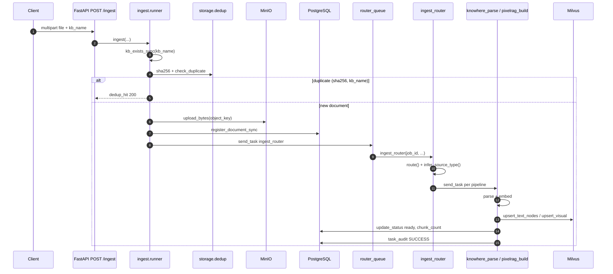
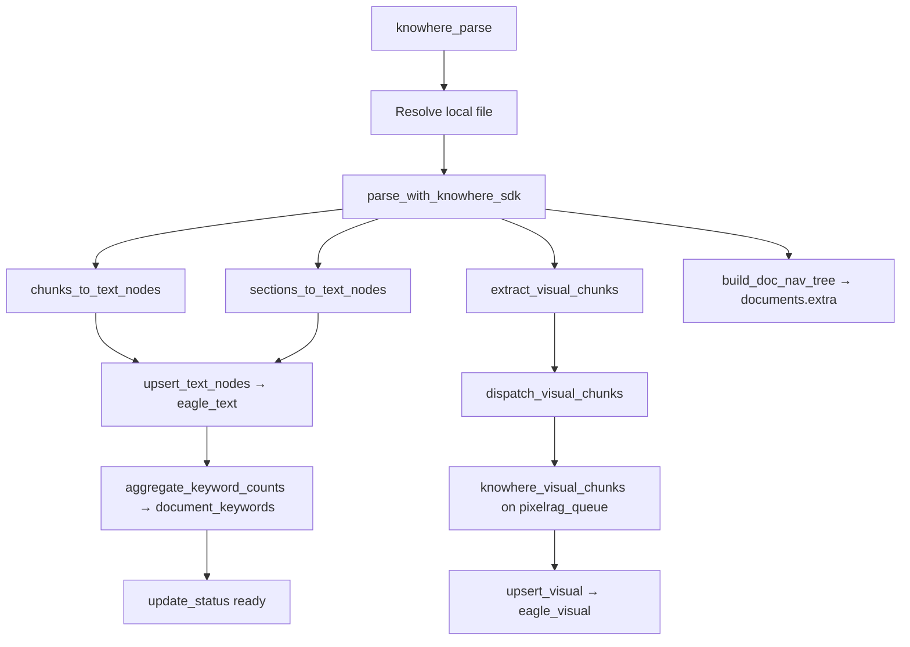
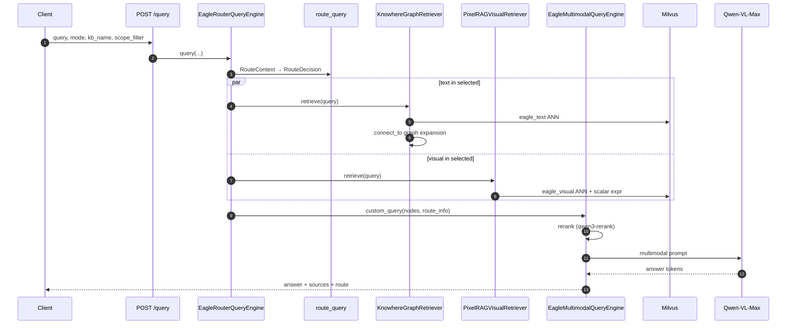
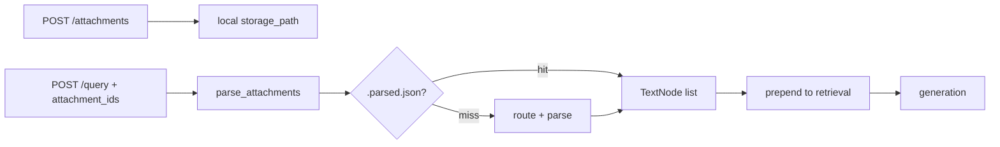

# 数据流

两条端到端流定义 Eagle-RAG：**摄入**（文档 → 向量）与**查询**（问题 → 带引用答案）。二者横跨 API、Celery、适配器、Milvus 与 PostgreSQL。本文追踪实际函数名与控制流。

---

## 理论与基础

### 索引时 vs 查询时

[RAG 综述（Gao 等，2023）](https://arxiv.org/abs/2312.10997) 区分：

| 阶段 | 成本特征 | Eagle-RAG 特点 |
| --- | --- | --- |
| **索引** | 高延迟、批/异步 | Celery 三队列管线；每文档数分钟 |
| **查询** | 低延迟、交互 | 亚秒级 ANN + 流式 VLM 生成 |

[Lewis 等，2020](https://arxiv.org/abs/2005.11401) 在查询时检索 — 索引新鲜度取决于摄入是否成功完成。

### 双索引数据模型

文本与视觉嵌入存于**独立 Milvus collection**，因为：

- 不同嵌入模型与维度（1536 vs 2048）
- 不同索引调优（HNSW 参数、规模化 DiskANN）
- 查询时在 `EagleRouterQueryEngine` + `EagleMultimodalQueryEngine` 融合

---

## 摄入流

**目标：** 将上传文件或 URL 转为可搜索向量，并保留引用溯源。



### 逐步实现

| 步骤 | 函数 / 模块 | 说明 |
| --- | --- | --- |
| 1. API 接受 | `eagle_rag/api/ingest.py` | 校验 `kb_name`；返回 `job_id` |
| 2. Runner 编排 | `eagle_rag/ingest/runner.py` `ingest()` | SHA-256 哈希；去重门 |
| 3. 去重 | `eagle_rag/storage/dedup.py` | PK `(sha256, kb_name)` |
| 4. 对象存储 | `eagle_rag/storage/minio_client.py` | `{document_id}/{filename}` |
| 5. 注册表 | `register_document_sync()` | 状态 `pending` → `processing` |
| 6. 路由任务 | `eagle_rag/ingest/router.py` 中 `ingest_router` | `@with_retry`，`router_queue` |
| 7. 路由 | `route(filename, local_path, kb_name, ...)` | 返回 `["knowhere"]` 或 `["pixelrag"]` 或两者 |
| 8. 派发 | `app.send_task(knowhere_parse \| pixelrag_build)` | 按管线队列 |
| 9. 解析 + 索引 | 见下文管线节 | |
| 10. 去重注册 | `dedup.register()` | **解析成功后** — 失败任务无去重行 |

### URL 来源

URL 摄入在 API 跳过 upfront MinIO/去重 — 文件在管线任务内懒取（`url_prefetch` 设置）。索引成功后应用去重。

### Knowhere 路径（`knowhere_parse`）



**状态转移**（`eagle_rag/tasks/state.py`）：

`PENDING` → `RENDERING`（Knowhere 解析）→ `EMBEDDING` → `INDEXING` → `SUCCESS`

**非阻塞副作用**（失败记日志，主任务继续）：

- 标签目录写入（`upsert_document_keywords`）
- 视觉派发（`dispatch_visual_chunks`）
- `doc_nav` 持久化（`update_extra`）

### PixelRAG 路径（`pixelrag_build`）

扫描 PDF、图片、URL、HTML：

1. 渲染页为切片（`pixelrag_render`）— 设置：`tile_height`、`viewport_width`、`pdf_dpi`
2. 嵌入切片（`_Qwen3VLVisualEncoder`）— 2048 维，L2 归一化
3. `upsert_visual_batch()` — `chunk_type=tile`
4. `update_status(ready)`；成功时 `dedup.register()`

队列：`pixelrag_queue`，并发 **1**。

---

## 查询流

**目标：** 路由问题，检索相关文本和/或视觉，重排，生成有依据答案与来源。



### `EagleRouterQueryEngine` 控制流

```python
# eagle_rag/router/router_engine.py — 简化
def query(self, query, mode=None, kb_name=None, scope_filter=None, attachments=None):
    attach_nodes, image_docs, attach_step, has_doc = self._prepare_attachments(attachments)
    nodes, decision = self.retrieve(query, mode=mode, kb_name=kb_name,
                                    scope_filter=scope_filter, has_doc_attachments=has_doc)
    nodes = attach_nodes + nodes  # 附件前置
    return EagleMultimodalQueryEngine().custom_query(query, nodes=nodes, route_info=decision.to_dict(), ...)
```

**`retrieve()` 内部：**

1. `_route_decision()` → `route_query(RouteContext)` — DeepSeek 或启发式
2. `_resolve_scope_filter(scope_filter)` → `(kb_names, document_ids, active)`
3. 构造带宽范围过滤的检索器
4. `_fetch_nodes()` — 每模态 `try/except`；失败时空列表

### `KnowhereGraphRetriever.retrieve()`

1. 经 Qwen `text-embedding-v4` 嵌入查询
2. 在 `eagle_text` 上 Milvus ANN，带 `kb_name` / `document_id` 元数据过滤
3. 对每个命中扩展 `metadata["connect_to"]` — Knowhere 知识图
4. 可选父文档：提升 `type="section_summary"` 召回

### `PixelRAGVisualRetriever.retrieve()`

1. 经 `_Qwen3VLVisualEncoder` 嵌入查询（与切片同空间）
2. `milvus_visual_store.py` 中 `search_visual()` — IP 搜索，`ef=64`
3. 标量 expr：`kb_name`、`document_id`、可选 `chunk_type`、`parent_section`

### 生成（`EagleMultimodalQueryEngine`）

1. 拆分文本 `TextNode` 与视觉 `ImageNode`
2. 重排文本候选（`settings.rerank.text`）
3. 构造 VLM 提示：文本块 + `content_summary` + 图像路径
4. 流式或阻塞调用 `settings.vlm`（Qwen-VL-Max）
5. 经 `_text_source()` / `_image_source()` 映射来源 — 按 `router.source_content_max_chars` 截断

---

## 流式（`POST /query/stream`）

SSE 事件顺序：

```
session → step* → sources → token* → done
```

实现（`eagle_rag/api/query.py`）：

- 守护线程将同步 `engine.query_stream()` 生成器桥接到异步 SSE
- 事件：`session`、`step`（route、recall、attach_parse）、`sources`、`token`、`done`
- `done` 时将助手消息持久化到 `sessions` / `messages` 表

### 仅检索

`POST /search` 与 `/search/stream` 调用 `engine.search()` / `search_stream()` — **无 VLM**。返回 `sources{text, image}` + `route` + `steps`。

---

## 附件流

查询时附件（`POST /attachments`）：



- **不写 Milvus** — 仅临时上下文
- 旁路缓存：`attachments.parse.cache_enabled=true` 时 `{storage_path}.parsed.json`
- TTL：`attachments.ttl_hours`（默认 24）
- 文档附件设 `has_doc_attachments=True` → 路由偏向 `hybrid`

代码：`eagle_rag/attachments/parser.py`。

---

## 处处 `kb_name`

两流均传递 `kb_name`：

| 阶段 | 传播 |
| --- | --- |
| 摄入 API | 请求体 → runner → Celery kwargs |
| 解析 | `chunks_to_text_nodes(..., kb_name=)` 元数据 |
| Milvus | 每个向量的标量字段 |
| 去重 | `(sha256, kb_name)` 复合 PK |
| 查询 | `MetadataFilters` / `_build_search_expr` |
| 会话 | `sessions.kb_name` 列 |
| MCP 工具 | 四个工具均接受 `kb_name` |

高级：`scope_filter` 并集语义 — [多租户](multi-tenancy.md)。

---

## 设计张力与调参

| 张力 | 表现 | 缓解 |
| --- | --- | --- |
| 最终一致窗口 | API 在审计 `PENDING` 后返回；向量在 Celery 后出现 | 轮询 `/tasks/{job_id}`；`SUCCESS` 前勿查询 |
| 去重竞态 | `register` 完成前两次上传同 hash | 罕见；第二次应命中 `dedup_hit` — 监控重复审计 |
| 文本就绪先于视觉 | `knowhere_parse` 中切片索引前 `update_status(ready)` | 视觉队列追上前混合查询可能仅文本 |
| 附件 vs 索引 | 查询时前置 `parse_attachments`，不写 Milvus | 会话内证据；其他用户或 MCP `retrieve_*` 不可见 |
| 流式线程桥接 | `stream_custom_query` + 线程池内同步 VLM | 每 SSE 客户端一线程 — 小 API 上限制并发流 |
| 有注册表无向量 | Milvus 写入尽力而为记录错误但审计仍可能成功 | KB 重建 / 重摄入；对比 `documents.chunk_count` 与 Milvus 计数 |

---

## 配置

| 设置 | 影响流 |
| --- | --- |
| `ingest.routing` | 摄入管线选择 |
| `router.mode` | 查询检索器选择 |
| `router.max_scope_documents` | 标签 → document_id 解析上限 |
| `router.source_content_max_chars` | 查询响应中来源载荷大小 |
| `attachments.parse.*` | 附件懒解析限制 |
| `celery.queues` | 摄入吞吐 |
| `knowhere.poll_timeout` | Knowhere 解析最长等待 |

---

## 故障模式与运维

| 故障点 | 用户影响 | 代码行为 |
| --- | --- | --- |
| `ingest_router` 重试耗尽 | 任务 `FAILED`；死信 | `@with_retry` + `DeadLetterTask` |
| `knowhere_parse` SDK 错误 | 文档 `failed` | 不注册去重 |
| 视觉派发错误 | 文本搜索可用；无图 | `dispatch_visual_chunks` 中记录 |
| Milvus upsert 错误 | 部分索引 | 可能仍标 `SUCCESS` |
| 文本检索器宕机 | 混合时仅视觉答案 | 警告日志；继续 |
| VLM 超时 | 答案字段错误 | 进程不崩溃 |
| 无效 `scope_filter` 标签 | 忽略标签 | `_resolve_scope_filter` 警告 |

**重放：** 修复根因后 `POST /tasks/{job_id}/retry` 或 `replay_dead_letter()`。

---

## 参考文献

- [摄入管线](../backend/ingest-pipeline.md)
- [路由矩阵](routing-matrix.md)
- [检索](../backend/retrieval.md)
- [生成](../backend/generation.md)
- [API 查询](../api/query.md)
- [Lewis 等，2020](https://arxiv.org/abs/2005.11401)
- [Milvus 混合搜索](https://milvus.io/docs/multi-vector-search.md)
