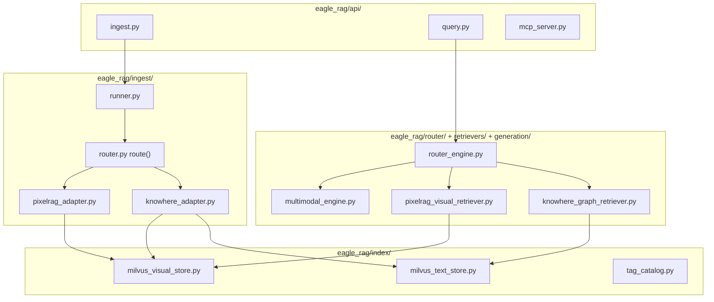
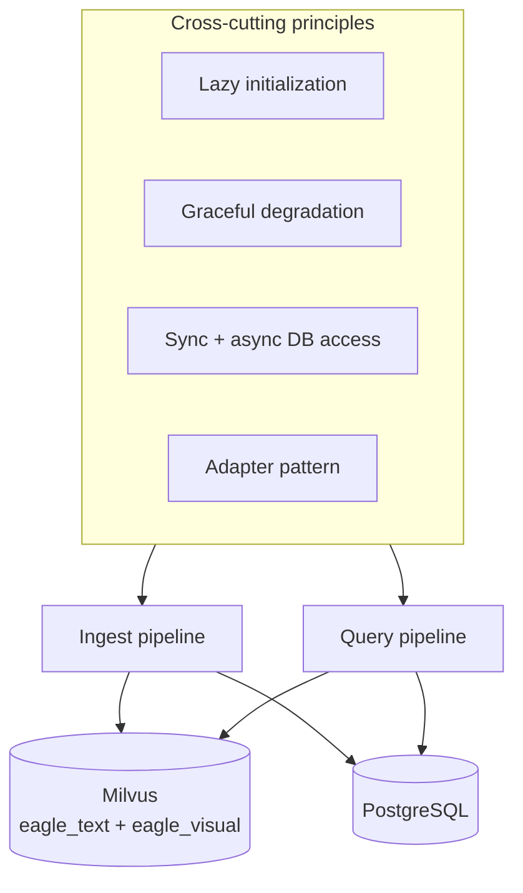

# 架构

:octicons-project-24: 本节说明 Eagle-RAG **为何**如此设计以及数据**如何**流转。深入各模块 [后端](../backend/index.md) 与 [前端](../frontend/index.md) 参考前请先读这里。

---

## 理论与基础

### 问题空间

企业知识很少是纯文本。团队摄入 PDF（文本与扫描）、电子表格、幻灯片、图片与网页 — 然后提出需要**段落**、**表格版式**或**示意图位置**的问题。

| 内容类型 | 纯文本 RAG 失败模式 |
| --- | --- |
| 架构示意图 | 摘要写「图 3 展示各层」— 无像素位置 |
| 合并单元格电子表 | 扁平 CSV 丢失表头层次 |
| 扫描合同 | OCR 摘要漏掉印章/签名区域 |

单一文本嵌入管线丢失视觉细节；纯图像管线丢失结构与引用。[MuRAG（Chen 等，2022）](https://arxiv.org/abs/2210.02928) 表明多模态检索在证据跨模态时提升 QA。

[Gao 等，2023](https://arxiv.org/abs/2312.10997) 将生产 RAG 分为索引、检索、生成子系统 — Eagle-RAG 将各层映射到显式模块与存储层。

### 设计论点

Eagle-RAG 架构回答三个问题：

1. **用哪个解析器？** → 按格式 + 内容形态路由（[路由矩阵](routing-matrix.md)）
2. **如何融合文本与视觉？** → 语义树锚定融合（[多模态融合](multimodal-fusion.md)）
3. **如何隔离租户？** → 端到端 `kb_name` 标量过滤（[多租户](multi-tenancy.md)）

---

## 设计目标

1. :octicons-file-binary-24: **天生多模态** — 独立管线、嵌入与 Milvus collection，在单一生成引擎汇聚。
2. :octicons-organization-24: **默认多租户** — 每层强制 `kb_name`，非事后补丁。
3. :octicons-shield-check-24: **优雅降级** — 探测依赖；单点故障降级功能而非整系统。
4. :octicons-pulse-24: **可观测** — 健康探测、SSE 日志、队列指标、内置管理仪表盘。

---

## Eagle-RAG 实现

### 模块图

### 横切原则

| 原则 | 实现 | 文档 |
| --- | --- | --- |
| 懒初始化 | `get_settings()`、Milvus 客户端、`_Qwen3VLVisualEncoder` | [系统设计](system-design.md) |
| 优雅降级 | 检索器 `try/except` → `[]`；非阻塞视觉派发 | [可靠性](reliability.md) |
| 同步 + 异步 DB | `*_sync` / 异步 store 对 | [系统设计](system-design.md) |
| 适配器模式 | `knowhere_adapter`、`pixelrag_adapter` → LlamaIndex 节点 | [系统设计](system-design.md) |

---

## 章节

| 主题 | 页面 | 深度 |
| --- | --- | --- |
| 原则与容器 | [系统设计](system-design.md) | 懒初始化、C4、模型栈 |
| 摄入与查询序列 | [数据流](data-flow.md) | 端到端序列图 |
| 文档 → 管线选择 | [路由矩阵](routing-matrix.md) | `route()` 逐行 |
| `kb_name` 隔离 | [多租户](multi-tenancy.md) | 去重、范围过滤 |
| 文本 + 视觉融合 | [多模态融合](multimodal-fusion.md) | ANN、锚定字段、代码路径 |
| 重试与降级 | [可靠性](reliability.md) | Celery、死信、状态机 |

---

## 一览

**栈摘要**：FastAPI API · Celery worker（3 队列）· Knowhere HTTP 解析器 · PixelRAG 进程内库 · Milvus 双 collection · PostgreSQL 元数据 · MinIO 对象 · Redis broker · Next.js 前端 · `/mcp` MCP。

---

## 设计张力与调参

| 张力 | 出现位置 | 关注点 |
| --- | --- | --- |
| ANN 召回 vs 查询 p99 | `eagle_text` / `eagle_visual` HNSW `ef` | 用户反馈「明显缺块」时提高 `ef`；提高 `top_k` 前先 profiling |
| 双编码器召回 vs 交叉编码器精度 | `KnowhereGraphRetriever` → `multimodal_engine.py` 中 `_rerank` | `top_k` 高而 `top_n` 低浪费重排预算；`top_k` 过低饿死重排器 |
| 图扩展噪声 | `knowhere_graph_retriever.py` 中 `connect_to` 跟随 | 每个 ANN 命中可能拉取关联表/脚注节点 — 改善表格 QA，增加 token |
| PDF 探测假阴性 | `probe_pdf_form` 阈值 | 稀疏 OCR PDF 对 pypdf 可能像「文本」；按 KB 调 `pdf_text_page_ratio` |
| 范围并集基数 | `_resolve_scope_filter` + `max_scope_documents` | 大标签并集膨胀 Milvus `document_id in [...]` — 上限防 expr 爆炸 |
| 租户过滤正确性 | 每条查询路径须下推 `kb_name` | 共享 collection 仅在所有入口（REST、MCP、search）测试过滤时安全 |

懒初始化冷启动延迟见 [系统设计](system-design.md)；Milvus 或 Knowhere 部分不可用时的降级见 [可靠性](reliability.md)。

---

## 配置

架构相关设置（完整列表：[配置](../getting-started/configuration.md)）：

| 键 | 架构影响 |
| --- | --- |
| `kb_name` | 默认租户分区 |
| `milvus.visual_index_type` | 视觉 ANN：HNSW vs DiskANN |
| `ingest.routing` | 摄入管线选择器链 |
| `router.mode` | 查询时检索器选择 |
| `celery.queues` | Worker 池拓扑 |
| `pdf_probe` | 扫描 vs 文本 PDF 分类 |

---

## 故障模式与运维

| 子系统宕机 | 用户可见影响 | 恢复 |
| --- | --- | --- |
| Knowhere | 文本摄入失败；URL/Office 阻塞 | 恢复 `:5005`；重放任务 |
| PixelRAG worker | 视觉索引不全；混合查询视觉为空 | 修 OOM；排空 `pixelrag_queue` |
| Milvus | 检索为空；KB 健康 `offline` | 恢复 Milvus；可能需重新摄入 |
| PostgreSQL | 会话/摄入 API 错误 | 从备份恢复 DB |
| DeepSeek（路由） | `router.llm.enabled` 时回退关键词启发式 | 或关闭 LLM 路由 |
| Qwen-VL | 生成错误信息 | 修复 `VLM_API_KEY` |

健康聚合：`GET /health` — 每依赖 3 秒超时。见 [可靠性](reliability.md)。

---

## 外部锚点

| 资源 | 架构角色 |
| --- | --- |
| [LlamaIndex](https://docs.llamaindex.ai/) | `TextNode`、`MilvusVectorStore`、查询引擎 |
| [Milvus](https://milvus.io/docs) | ANN + 标量过滤 |
| [Knowhere](https://github.com/Ontos-AI/knowhere) | 语义文档解析器 |
| [PixelRAG](https://github.com/StarTrail-org/PixelRAG) | 视觉切片 + 嵌入 |
| [MCP](https://modelcontextprotocol.io/) | Agent 工具协议 |
| [Lewis 等，2020](https://arxiv.org/abs/2005.11401) | RAG 基础 |
| [HNSW](https://arxiv.org/abs/1603.09320) | 默认视觉 ANN |

---

## 参考文献

- [学习路径](../learning-path.md) — curated 阅读顺序
- [术语表](../glossary.md) — 术语
- [AGENTS.md](https://github.com/fintax-ai/eagle-rag/blob/master/AGENTS.md) — Agent 约束
