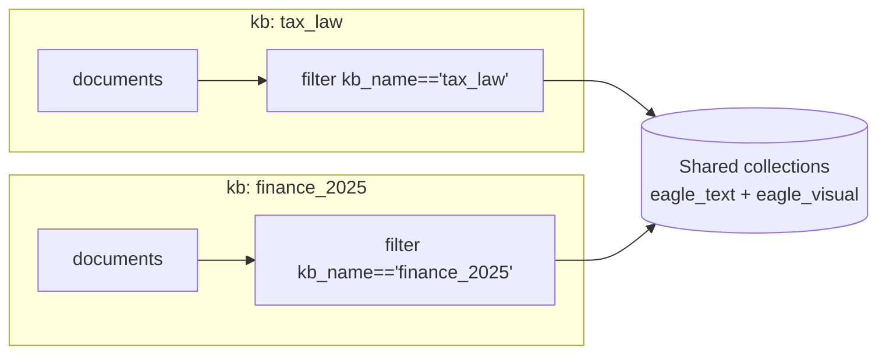

# 多租户

单 Eagle-RAG 部署可服务 **finance**、**patent**、**pharma** 等知识库，无需独立 Milvus 集群。隔离在每一层由 `kb_name` 强制 — 从 API 请求到 Milvus 标量过滤与去重键。

---

## 理论与基础

### 多租户 RAG 模式

[Gao 等，2023](https://arxiv.org/abs/2312.10997) 将租户隔离列为生产关切：检索不得返回其他租户的块。

常见模式：

| 模式 | 隔离机制 | Eagle-RAG |
| --- | --- | --- |
| 每租户独立向量库 | 物理隔离 | 未用 — 运维开销 |
| 每租户独立 collection | Milvus 逻辑隔离 | 未用 — 模式蔓延 |
| **共享 collection + 元数据过滤** | 每次查询 `kb_name` 标量过滤 | **选用** |
| 每租户独立部署 | 全栈复制 | 基础设施层可选 |

Milvus 以倒排索引高效标量过滤（[Milvus 过滤](https://milvus.io/docs/scalar_index.md)）— 过滤在 ANN 搜索前或期间下推，减少扫描向量。

### 为何非全局文件去重？

同一物理文件（SHA-256）可属于**多个**知识库 — 如同时与 `tax_law`、`compliance` 相关的监管 PDF。复合去重键 `(sha256, kb_name)` 允许跨租户重复字节，同时防止单租户内重传。

---

## 租户键

`kb_name` 匹配 `^[a-z0-9_]+$`，为 `knowledge_bases` 主键，创建后**不可变**。

默认：`default`（`KB_NAME` 环境变量 / `settings.kb_name`）。



所有租户向量存于**共享** Milvus collection；查询时标量过滤划界。

---

## Eagle-RAG 实现

### 隔离机制

| 层 | 机制 | 代码 |
| --- | --- | --- |
| 去重 | PK `(sha256, kb_name)` | `eagle_rag/storage/dedup.py` |
| Milvus 文本 | `MetadataFilters` → `kb_name == "..."` | `eagle_rag/index/milvus_text_store.py` |
| Milvus 视觉 | `kb_name` 字段 + `_build_search_expr` 倒排索引 | `eagle_rag/index/milvus_visual_store.py` |
| PostgreSQL | `kb_name` 列 + 租户表索引 | `eagle_rag/db/models/` |
| MinIO | 经 `document_id` 注册表逻辑隔离 | `eagle_rag/storage/minio_client.py` |
| API | 写/查询带 `kb_name`；回退 `settings.kb_name` | API 路由 |
| MCP | 四工具均接受 `kb_name` | `eagle_rag/api/mcp_server.py` |
| Celery | 任务 kwargs 含 `kb_name` | `knowhere_parse`、`pixelrag_build`、`ingest_router` |
| 会话 | `sessions.kb_name` | `eagle_rag/db/models/sessions.py` |
| 标签 | `document_keywords.kb_name` | `eagle_rag/index/tag_catalog.py` |

### 去重流

```python
# eagle_rag/storage/dedup.py — 概念
# PK: (sha256, kb_name)
check_duplicate(sha256, kb_name)  # 上传前
register(sha256, document_id, kb_name=...)  # 仅成功解析后
```

失败解析任务**不**注册去重 — 同一文件可重传。

### Milvus 文本过滤

`KnowhereGraphRetriever` 构造 LlamaIndex `MetadataFilters`：

```python
# milvus_text_store / retriever 中的模式
MetadataFilter(key="kb_name", value=kb_name, operator=FilterOperator.EQ)
# 多 KB 范围：
# kb_name in ["tax_law", "pharma"]
```

### Milvus 视觉过滤

```python
# eagle_rag/index/milvus_visual_store.py — _build_search_expr 模式
expr_parts = [f'kb_name == "{kb_name}"']
if document_ids:
    expr_parts.append(f'document_id in [{quoted_ids}]')
# 与 ANN search_params 组合
```

`ensure_collection()` 中为 `kb_name` 创建倒排索引。

### Milvus 表达式示例

```
kb_name == 'pharma' and year in [2025, 2026] and document_id in ['doc_a', 'doc_b']
```

### 摄入传播

```python
# knowhere_parse — effective_kb 解析
effective_kb = kb_name if kb_name is not None else get_settings().kb_name

nodes = chunks_to_text_nodes(..., kb_name=effective_kb)
upsert_text_nodes(nodes)

upsert_visual(..., kb_name=effective_kb)
```

每行向量携带 `kb_name` 标量 — 无事后租户分配。

---

## 范围过滤（查询时）

除单一 `kb_name` 外，`QueryRequest.scope_filter` 接受：

```json
{
  "kb_names": ["tax_law", "pharma"],
  "document_ids": ["doc_uuid_1"],
  "tags": ["增值税", "2025"]
}
```

### 解析：`_resolve_scope_filter()`

```python
# eagle_rag/router/router_engine.py:122-150
def _resolve_scope_filter(scope_filter) -> tuple[list[str], list[str], bool]:
    kb_names = list(scope_filter.get("kb_names") or [])
    document_ids = list(scope_filter.get("document_ids") or [])
    tags = list(scope_filter.get("tags") or [])
    if not (kb_names or document_ids or tags):
        return [], [], False  # 未激活 — 走遗留 kb_name 路径

    doc_set = dict.fromkeys(document_ids)
    if tags:
        cap = get_settings().router.max_scope_documents  # 默认 500
        for doc_id in resolve_tags_to_document_ids(tags, cap=cap):
            doc_set.setdefault(doc_id, None)
    return kb_names, list(doc_set), True
```

**并集（OR）语义** — 任一匹配 KB、显式 document ID 或标签解析文档均包含块。

`active=True` 时，检索器以 `kb_names` + `document_ids` 列表构造 — 下推到 Milvus `in` 谓词。

### 标签目录

- 表：`document_keywords` — 摄入时从 Knowhere 块 `keywords` 聚合
- API：`GET /tags` — 分面列表
- 解析：`resolve_tags_to_document_ids(tags, cap=500)` — 跨 KB 标签并集
- 摄入时标签写入失败为**非阻塞**

持久化于 `sessions.scope_filter` 以保持对话连续性。

---

## 每 KB 配置

知识库不仅是分区：

| 字段 | 用途 | 代码 |
| --- | --- | --- |
| `display_name`、`description`、`theme`、`icon` | 前端 KB 模块 | `eagle_rag/kb/registry.py` |
| `pdf_text_page_ratio` | 覆盖全局 PDF 探测 | `ingest_router` 中 `get_pdf_ratio_sync(kb_name)` |

```yaml
# 全局默认
pdf_probe:
  text_page_ratio: 0.2

# knowledge_bases 表每 KB 覆盖
# pdf_text_page_ratio: 0.15  → 传给 route(text_page_ratio=...)
```

---

## KB 生命周期

| 操作 | 模块 | 行为 |
| --- | --- | --- |
| 创建 / 校验 | `eagle_rag/kb/registry.py` | 正则校验 `kb_name` |
| 删除（级联） | `eagle_rag/kb/lifecycle.py` | Milvus delete expr → documents → images → dedup → tasks → KB 行 |
| 重建 | 管理 API | 从 `source_uri` 重新摄入所有 `ready` 文档 |
| 健康 | `eagle_rag/kb/health.py` | `online` / `degraded` / `offline` |

### 健康规则

| 状态 | 条件 |
| --- | --- |
| **online** | Milvus 可达；该 KB 近一小时无 `failed` 任务 |
| **degraded** | Milvus OK 但近期有失败 |
| **offline** | Milvus 不可达 |

API：[知识库](../api/knowledge-bases.md)。内部：[KB 管理](../backend/kb-management.md)。

---

## 设计张力与调参

| 张力 | 代码 / 配置 | 后果 |
| --- | --- | --- |
| 过滤下推 vs 客户端范围 | `_build_filters` 中 `scope_filter` OR 并集 | 某条 MCP 工具路径缺 `kb_name` 会泄漏跨租户命中 — 须测试所有表面 |
| 存储重复 vs 去重键 | `(sha256, kb_name)` 复合 PK | 同字节在两 KB = 两份完整索引副本；租户隔离下的预期行为 |
| 标签并集广度 | `resolve_tags_to_document_ids(..., cap=max_scope_documents)` | 触顶会静默截断标签扩展 — 收窄标签或有意识提高上限 |
| 不可变 `kb_name` | KB 注册表 | 重命名租户需重新摄入 / Milvus 元数据迁移，非 SQL UPDATE |
| 默认租户回退 | API 省略值时用 `get_settings().kb_name` | 多 KB 部署中 Agent 应始终传显式 `kb_name` |

### 安全说明

Eagle-RAG **默认无认证**（`auth.enabled: false`）。多租户是**数据组织**层，非密码学隔离。仅在可信网络暴露或加 API 密钥/反向代理认证。

---

## 配置

| 键 | 效果 |
| --- | --- |
| `KB_NAME` / `kb_name` | API 省略时的默认租户 |
| `router.max_scope_documents` | 标签 → document_id 解析上限 |
| `kb.text_entity_limit` | 文本容量警告阈值 |
| `kb.visual_entity_limit` | 视觉容量警告阈值 |
| 每 KB `pdf_text_page_ratio` | 摄入路由灵敏度 |

```bash
KB_NAME=pharma task be:api
EAGLE_RAG_ROUTER__MAX_SCOPE_DOCUMENTS=1000
```

---

## 故障模式与运维

| 故障 | 影响 | 缓解 |
| --- | --- | --- |
| API 调用缺 `kb_name` | 回退 `settings.kb_name` | Agent 始终传显式 `kb_name` |
| 标签解析错误 | 忽略标签；其他范围维仍生效 | 检查 `document_keywords` 表 |
| 范围超 500 文档 | 标签解析截断 | 谨慎提高 `max_scope_documents` |
| KB 删除部分失败 | 可能孤儿向量 | 重跑级联删除；Milvus 按 `kb_name` expr |
| 遗留向量无 `kb_name` | `ensure_collection` 删 collection | 迁移前备份 |
| MCP 工具参数 KB 错误 | 检索错误租户数据 | 校验 Agent 工具输入 |

### 审计查询

```sql
-- 每 KB 文档数
SELECT kb_name, count(*) FROM documents GROUP BY kb_name;

-- 每 KB 向量（经文档注册表）
SELECT kb_name, sum(chunk_count) FROM documents WHERE status='ready' GROUP BY kb_name;
```

Milvus 按 expr 计数：`kb_name == 'pharma'`（管理端或 pymilvus）。

!!! tip "API 默认"
    客户端省略 `kb_name` 时服务器用 `settings.kb_name`。多租户 Agent 建议每请求显式 `kb_name`。

---

## 参考文献

- [Milvus 标量过滤](https://milvus.io/docs/scalar_index.md)
- [Milvus 多租户模式](https://milvus.io/docs/multi_tenancy.md)
- [Gao 等，2023](https://arxiv.org/abs/2312.10997)
- [数据流 — kb_name 传播](data-flow.md)
- [API 知识库](../api/knowledge-bases.md)
- [术语表 — kb_name](../glossary.md)
