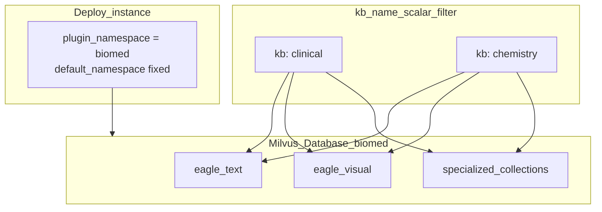

# 多租户

Eagle-RAG 在**两个维度**上隔离数据：

| 维度 | 标识符 | 机制 |
| --- | --- | --- |
| **领域（Domain）** | `plugin_namespace` | 物理 Milvus **Database** + PostgreSQL 仓储过滤（部署时） |
| **知识库（Knowledge base）** | `kb_name` | 单一领域 Database **内部**的标量过滤（请求时） |

单个进程绑定一个领域（`settings.plugins.default_namespace`）。在该领域内，多个 KB（`finance`、`patent`、`pharma` 等）共享基础 collection，并通过 `kb_name` 分隔。跨领域检索依赖**多个实例**，而非 Core 扇出。

权威细节：[插件架构](plugin-architecture.md)。决策记录：[ADR-001](adr/001-milvus-database-isolation.md)、[ADR-002](adr/002-single-domain-deployment.md)。

---

## 理论与基础

### 多租户 RAG 模式

[Gao 等，2023](https://arxiv.org/abs/2312.10997) 将租户隔离列为生产关切：检索不得返回其他租户的块。

| 模式 | 隔离机制 | Eagle-RAG |
| --- | --- | --- |
| 每个**领域**独立向量 **Database** | 物理 Milvus DB | **选用**，对应 `plugin_namespace` |
| 每个 KB 独立 collection | 逻辑蔓延 | KB 层未采用 |
| **共享 collection + 元数据过滤** | 每次 ANN 携带 `kb_name` 标量 | **选用**，对应领域 DB 内的 KB |
| 每个领域独立部署 | 全栈复制 | **选用**，多行业场景（每领域一实例） |

Milvus 标量过滤配合倒排索引（[Milvus 过滤](https://milvus.io/docs/scalar_index.md)）在 ANN 期间下推 `kb_name` / `document_id`。领域边界更强：客户端通过 `MilvusClientPool` 以 `db_name=` 构造 — 无按请求的 `using_database`。

### 为何非全局文件去重？

同一物理文件（SHA-256）可属于**多个**知识库 — 例如同时出现在 `tax_law` 与 `compliance` 的监管 PDF。去重主键为 `(sha256, kb_name, plugin_namespace)`，因此相同字节可跨 KB/领域存在，同时防止在同一领域的同一 KB 内重复上传。

---

## 双层模型



| 术语 | 含义 | 运行时可变？ |
| --- | --- | --- |
| `plugin_namespace` | 领域绑定（= Milvus DB 名称映射） | **否** — 部署配置 / profile |
| `kb_name` | KB 标识，`^[a-z0-9_]+$`，与 namespace 组成 PK | 经 KB API 创建/删除；不可重命名 |

在 UI/API 文案中**不要**将 `kb_name` 称为「namespace」— 该词保留给 `plugin_namespace`。

默认 KB：`default`（`KB_NAME` / `settings.kb_name`）。  
默认领域：`core`（`PLUGIN_NAMESPACE` / `settings.plugins.default_namespace`，或 `EAGLE_RAG_PROFILE`）。

---

## Eagle-RAG 实现

### 隔离机制

| 层 | 机制 | 代码 |
| --- | --- | --- |
| 领域解析 | 信任 `default_namespace`；不匹配 → **403** | `eagle_rag/db/namespace.py` |
| 去重 | PK `(sha256, kb_name, plugin_namespace)` | `eagle_rag/storage/dedup.py` |
| Milvus | 每领域 `MilvusClientPool.get(db_name)` | `eagle_rag/index/milvus_pool.py` |
| Milvus 文本/视觉 | `kb_name`（+ scope）标量过滤 | `milvus_text_store.py` / `milvus_visual_store.py` |
| 专用 collection | 同一 DB；领域插件 schema | 例如 `eagle_text_biomed` |
| PostgreSQL | 仓储注入 `plugin_namespace` | `eagle_rag/db/repositories/` |
| MinIO / MCP 缓存 | 键包含 `plugin_namespace` | storage + `mcp_cache` |
| API / MCP | 写/查询带 `kb_name`；领域来自 settings | routers + `core_*` tools |
| Celery | kwargs 含 `kb_name`（+ settings 中的 namespace） | ingest tasks |
| 会话 / 标签 | 行级 namespace 作用域 | repositories + `tag_catalog` |

### 领域绑定（G19）

```python
# eagle_rag/db/namespace.py — conceptual
def resolve_namespace(requested: str | None = None) -> str:
    default = settings.plugins.default_namespace
    if not requested:
        return default
    if settings.plugins.allow_namespace_override:  # tests only
        return requested
    if requested != default:
        raise HTTPException(403, ...)  # production
    return default
```

### 去重流

```python
# PK: (sha256, kb_name, plugin_namespace)
check_duplicate(sha256, kb_name, plugin_namespace=...)
register(sha256, document_id, kb_name=..., plugin_namespace=...)
```

失败解析任务**不**注册去重 — 同一文件可重传。

### Milvus 过滤（单一 DB 内）

```
kb_name == 'pharma' and year in [2025, 2026] and document_id in ['doc_a', 'doc_b']
```

`KnowhereGraphRetriever` 使用 LlamaIndex `MetadataFilters`；视觉存储在 `_build_search_expr` 中构造 `expr`。`ensure_collection()` 中为 `kb_name` 创建倒排索引。

### 摄入传播

每行向量携带 `kb_name`。领域由进程绑定的 Milvus Database（及 PG `plugin_namespace` 列）隐式确定。有效 KB：

```python
effective_kb = kb_name if kb_name is not None else get_settings().kb_name
```

摄入成功后，`collections_used` 记录在文档上并并入 KB 目录（[ADR-006](adr/006-ingest-query-routing-contract.md)）。

---

## 范围过滤（查询时）

除单一 `kb_name` 外，`QueryRequest.scope_filter` 接受：

```json
{
  "kb_names": ["tax_law", "pharma"],
  "document_ids": ["doc_uuid_1"],
  "tags": ["增值税", "2025"]
}
```

**并集（OR）语义** — 任一匹配的 KB、显式 document ID 或标签解析出的文档均包含其块。标签经 `resolve_tags_to_document_ids(plugin_namespace, tags, cap=...)` 解析。

范围激活时，检索器将 `kb_names` + `document_ids` 列表下推到 Milvus `in` 谓词。

**范围感知的 collection 计划：** 若作用域内的 KB/文档/标签目录包含专用 collection，`RetrieverOrchestrator` 会强制采用这些 collection 计划，即使 Core 默认分类器只会命中 `eagle_text` / `eagle_visual`（[ADR-006](adr/006-ingest-query-routing-contract.md)）。

持久化于 `sessions.scope_filter` 以保持对话连续性（会话按 namespace 作用域）。

---

## 每 KB 配置

| 字段 | 用途 | 代码 |
| --- | --- | --- |
| `display_name`、`description`、`theme`、`icon` | 前端 KB 模块 | `eagle_rag/kb/registry.py` |
| `collections_used` | 成功摄入写入的 collection 目录 | `knowledge_bases` + repositories |
| `pdf_text_page_ratio` | 覆盖全局 PDF 探测 | `get_pdf_ratio_sync(kb_name)` |

KB 主键为 `(kb_name, plugin_namespace)`。

---

## KB 生命周期

| 操作 | 模块 | 行为 |
| --- | --- | --- |
| 创建 / 校验 | `eagle_rag/kb/registry.py` | 正则校验 `kb_name`；绑定实例 namespace |
| 删除（级联） | `eagle_rag/kb/lifecycle.py` | **领域 DB** 内 Milvus delete → documents → images → dedup → tasks → KB 行 |
| 重建 | 管理 API | 清空 `collections_used`，重新摄入，重算目录 |
| 健康 / 统计 | `kb/health.py`、`kb/stats.py` | 按插件清单扇出专用 collection |

API：[知识库](../api/knowledge-bases.md)。内部：[KB 管理](../backend/kb-management.md)。

---

## 设计张力与调参

| 张力 | 后果 |
| --- | --- |
| 领域 vs KB 概念混淆 | 错误心智模型 → Agent 将「namespace」当作 `kb_name` 传入，或期望运行时切换领域 |
| 过滤下推 vs 客户端范围 | 某条 MCP 路径缺少 `kb_name` / scope 会在**领域 DB 内**跨 KB 泄漏 |
| 存储重复 vs 去重键 | 相同字节在两个 KB = 两份索引副本；属预期 |
| 标签并集广度 | `max_scope_documents` 上限会静默截断 |
| 不可变 `kb_name` | 重命名需重新摄入，不能 SQL UPDATE |
| 多行业 | 每个 `EAGLE_RAG_PROFILE` 运行一实例；单次查询不要扇出多个 Milvus DB |

### 安全说明

Eagle-RAG **默认无认证**（`auth.enabled: false`）。隔离是**数据组织**层，非密码学多租户。仅在可信网络暴露，或增加 API 密钥 / 反向代理认证。领域 403 防止误用跨 namespace 的 API 覆盖 — 不能替代网络层认证。

---

## 配置

| 键 | 效果 |
| --- | --- |
| `EAGLE_RAG_PROFILE` | 叠加 `profiles.<name>` → `default_namespace` + `milvus.db_name` |
| `PLUGIN_NAMESPACE` / `plugins.default_namespace` | 实例领域绑定 |
| `plugins.allow_namespace_override` | 仅测试 — 允许请求覆盖 |
| `KB_NAME` / `kb_name` | API 省略时的默认 KB |
| `router.max_scope_documents` | 标签 → document_id 解析上限 |

```bash
EAGLE_RAG_PROFILE=biomed task be:api   # domain = biomed Milvus DB
KB_NAME=clinical                       # default KB inside that domain
```

---

## 故障模式与运维

| 故障 | 影响 | 缓解 |
| --- | --- | --- |
| API 调用缺 `kb_name` | 回退 `settings.kb_name` | Agent 应传显式 `kb_name` |
| `plugin_namespace` 不匹配 | **403** | 客户端与实例 profile 对齐 |
| profile 错误 | ANN 为空 / 专用 collection 错误 | 检查 `/health/plugins` 的 `default_namespace` |
| 标签解析错误 | 忽略标签；其他范围维仍生效 | 检查该 namespace 的 `document_keywords` |
| KB 删除部分失败 | 可能孤儿向量 | 在正确的 Milvus DB 中重跑级联 |
| MCP 参数 KB 错误 | **领域内**跨 KB 泄漏 | 校验 Agent 工具输入 |

### 审计查询

```sql
-- Documents per KB within a domain
SELECT kb_name, count(*) FROM documents
WHERE plugin_namespace = 'biomed' GROUP BY kb_name;

-- KB collection catalog
SELECT kb_name, collections_used FROM knowledge_bases
WHERE plugin_namespace = 'biomed';
```

!!! tip "两个标识符"
    部署绑定**领域**（`plugin_namespace`）。请求选择 **KB**（`kb_name`）。MCP Core 工具：`core_ingest`、`core_query`、`core_retrieve_text`、`core_retrieve_visual`。

---

## 参考文献

- [插件架构](plugin-architecture.md)
- [ADR-001 Milvus Database 隔离](adr/001-milvus-database-isolation.md)
- [ADR-002 单领域部署](adr/002-single-domain-deployment.md)
- [ADR-006 摄入–查询路由契约](adr/006-ingest-query-routing-contract.md)
- [Milvus 标量过滤](https://milvus.io/docs/scalar_index.md)
- [数据流](data-flow.md) · [API 知识库](../api/knowledge-bases.md) · [术语表](../glossary.md)
