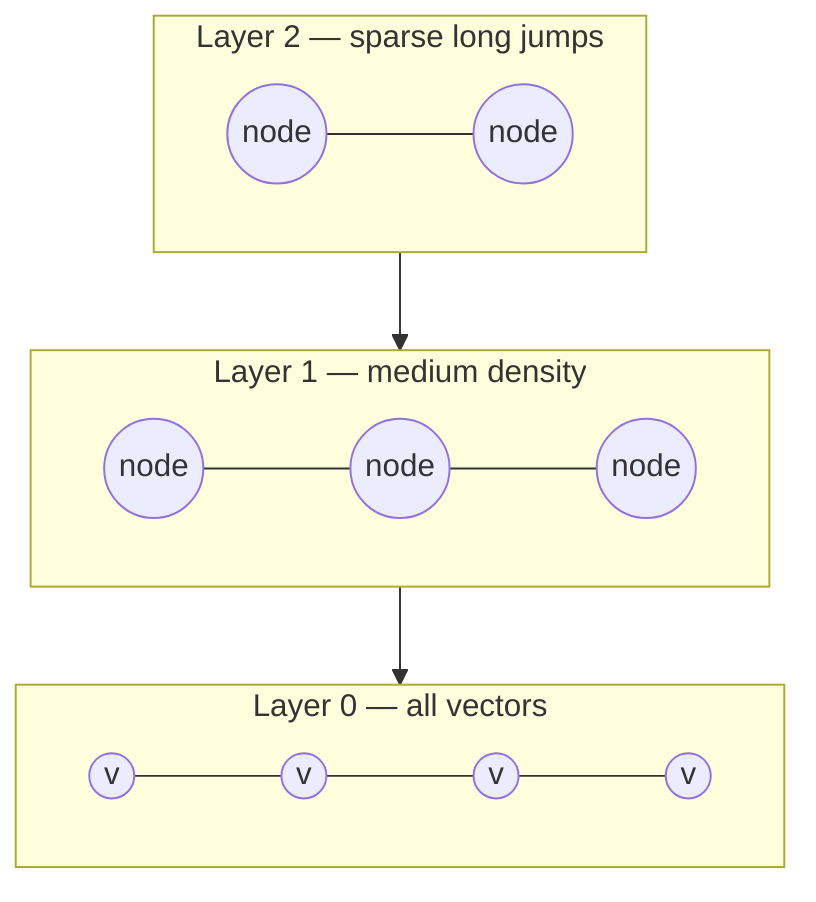
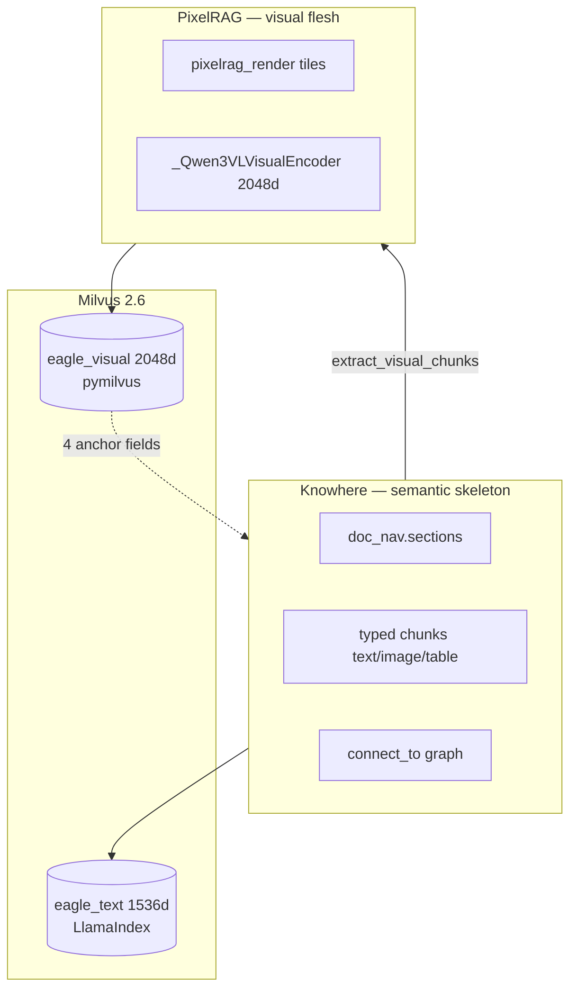
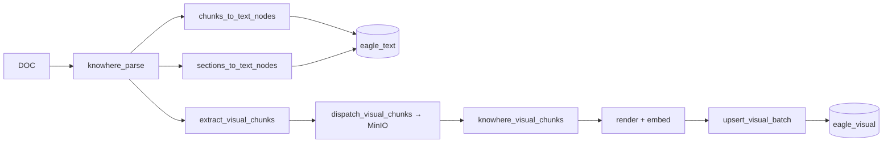
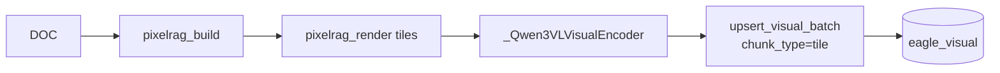
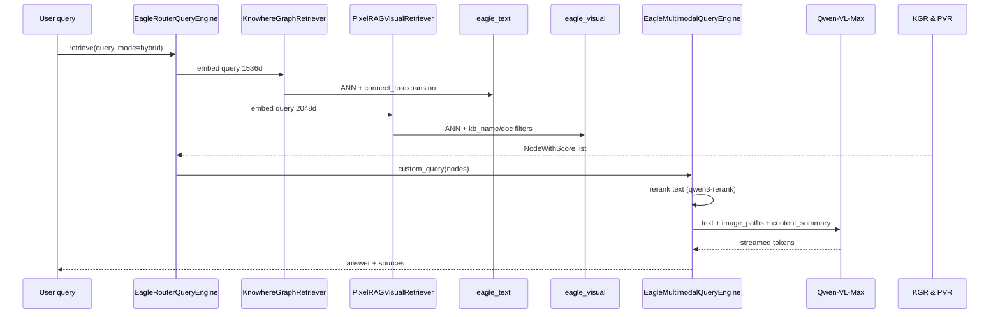

# 多模态融合

**语义树锚定像素融合**在单一 Milvus 集群内将 Knowhere 文档结构与 PixelRAG 视觉切片链接。本文说明理论、实际代码路径（`extract_visual_chunks` → `upsert_visual`），以及 ANN 数学、权衡、配置与故障模式。

## 插件架构边界（已交付）

PixelRAG 视觉模态（render + Qwen3-VL + `eagle_visual`）是 **Core 一等公民**；域插件不能禁用它。四锚点桥接（`chunk_type` / `parent_section` / `content_summary` / `source_chunk_id`）默认经 `INGEST_VISUAL_EXTRACT` hook 实现；域插件可覆盖锚定赋值。跨集合文档树使用 `reconstruct_document` 与 `GET /documents/{id}/structure`。

**检索 vs 生成融合：** 在 Core 内，文本（`eagle_text`）与视觉（`eagle_visual`）命中在 `EagleMultimodalQueryEngine` 中合并以供 VLM prompt。域插件可在同一 Milvus Database 增加**专用集合**；`RetrieverOrchestrator` 按 plan 运行 ANN 并以 **RRF** 合并（[ADR-004](adr/004-multi-encoder-rrf-fusion.md)）— 不同于生成时的 text+visual 合并。参见 [插件架构](plugin-architecture.md)。

---

## 理论与基础

### 细节丢失问题

文本摘要适用于段落，但对版式敏感内容失败：

| 内容 | 文本摘要丢失 |
| --- | --- |
| 架构示意图 | 层位置、残差分支拓扑、注意力头布局 |
| 复杂 HTML 表 | 合并单元格、表头层次、数字对齐 |
| 扫描表单 | 复选框状态、印章位置、手写 |

纯文本 RAG 检索到 *「image-1 Transformer Architecture」* 这类句子 — 无法回答 *「残差连接哪一侧是 LayerNorm？」* 所需像素。

[MuRAG（Chen 等，2022）](https://arxiv.org/abs/2210.02928) 表明检索多模态证据（文本 + 图像）可提升视觉丰富文档上的开放域 QA。Eagle-RAG 融合设计增加**结构锚定**，使视觉搜索可按文档章节限定，无需跨 collection JOIN。

### 双向量空间

文本与图像处于不同嵌入流形：

| 模态 | 模型 | 维度 | 度量 |
| --- | --- | --- | --- |
| 文本 | Qwen `text-embedding-v4` | 1536 | 余弦（LlamaIndex 默认） |
| 视觉 | Qwen3-VL-Embedding-2B | 2048 | L2 归一化向量上的 IP |

[Gao 等，2023](https://arxiv.org/abs/2312.10997) 讨论多向量检索 — Eagle-RAG 在查询时跑两次 ANN，在生成引擎融合。

### ANN：HNSW 直觉

[HNSW（Malkov & Yashunin，2016）](https://arxiv.org/abs/1603.09320) 构建邻近图层次：



搜索从顶层（粗）开始，贪心下降到下层（细）。参数：

| 参数 | Eagle-RAG 值 | 含义 |
| --- | --- | --- |
| `M` | 16 | 每节点最大双向链接数 |
| `efConstruction` | 256 | 构建时候选列表大小 |
| `ef`（搜索） | 64 | 查询时候选列表大小 |

`MILVUS_VISUAL_INDEX_TYPE=diskann` 时 [DiskANN](https://papers.nips.cc/paper/2019/hash/09853c7ff1cb93b59a86b8e886786b9b-Abstract.html) 以磁盘驻留 Vamana 替代内存图。

### IP 与 L2 归一化下的余弦

向量 \(\mathbf{a}, \mathbf{b}\) 且 \(\|\mathbf{a}\| = \|\mathbf{b}\| = 1\)：

\[
\mathbf{a} \cdot \mathbf{b} = \cos\theta
\]

Eagle-RAG upsert 前 L2 归一化视觉嵌入。Milvus `metric_type=IP` 在单位向量上**等价于余弦相似度** — 避免 Milvus 余弦度量怪癖同时保持排序。

---

## 双栈、单集群



| 组件 | 角色 |
| --- | --- |
| [Knowhere](https://github.com/Ontos-AI/knowhere) | 文档解析器 → `ParseResult`（块 + `doc_nav.sections`）。Eagle-RAG `knowhere.mode`：**`api`**（HTTP `:5005` + `knowhere-python-sdk`）或 **`parser`**（[`knowhere-parse-sdk`](https://github.com/zhiweio/knowhere-parse-sdk)，进程内） |
| [PixelRAG](https://github.com/StarTrail-org/PixelRAG) | 渲染 + 嵌入库（Eagle-RAG 无 FAISS） |
| [Milvus](https://milvus.io/docs) | 双 collection；视觉 ANN 用 HNSW 或 DiskANN |

!!! note "Knowhere vs Milvus HNSW"
    `Ontos-AI/knowhere` 是**文档解析服务**。Milvus 的 HNSW/DiskANN 引擎托管视觉向量 — 不同项目，命名相似。

---

## Milvus 中的视觉向量索引

Eagle-RAG 经 `pymilvus.MilvusClient` 将视觉嵌入持久化到 `eagle_visual`，标量倒排索引与向量共置，支持混合过滤 + ANN（[Milvus 过滤](https://milvus.io/docs/scalar_index.md)）。

### `ensure_collection()` — 模式与索引

```python
# eagle_rag/index/milvus_visual_store.py — 关键字段
schema.add_field("id", DataType.VARCHAR, max_length=64, is_primary=True)
schema.add_field("vector", DataType.FLOAT_VECTOR, dim=2048)
schema.add_field("kb_name", DataType.VARCHAR, max_length=64, default_value="default")
schema.add_field("document_id", DataType.VARCHAR, max_length=64)
schema.add_field("chunk_type", DataType.VARCHAR, max_length=16, default_value="tile")
schema.add_field("parent_section", DataType.VARCHAR, max_length=512, nullable=True)
schema.add_field("content_summary", DataType.VARCHAR, max_length=2048, nullable=True)
schema.add_field("source_chunk_id", DataType.VARCHAR, max_length=128, nullable=True)
# + image_path, page, position, year, source_type
```

**向量索引**（`_vector_index_params`）：

=== "HNSW（默认）"

    ```python
    {"index_type": "HNSW", "metric_type": "IP",
     "params": {"M": 16, "efConstruction": 256}}
    ```

    内存图 — 数千万 2048 维向量低延迟。

=== "DiskANN"

    设 `MILVUS_VISUAL_INDEX_TYPE=diskann`。磁盘驻留 Vamana — 突破十亿级切片内存上限。

**标量倒排索引**于 `kb_name`、`document_id`、`source_type`、`year`、`chunk_type`、`parent_section` — 加速向量搜索前或期间的过滤下推（[Milvus 过滤](https://milvus.io/docs/scalar_index.md)）。

**迁移：** 缺 `kb_name` 的遗留 collection 删除并重建。新字段经 `add_collection_field()` 添加，无需整库删除。

### ANN 调参张力（HNSW）

| 参数 | 构建 / 搜索 | 调高时召回 ↑ | 调高时代价 |
| --- | --- | --- | --- |
| `M` | 构建（`16`） | 图连通性 — 难查询召回更好 | 索引体积、构建时间 |
| `efConstruction` | 构建（`256`） | 索引质量 | 构建时间 |
| `ef` | 搜索（`search_visual` 中 `64`） | 查询时召回 | 查询延迟 |

语料超出内存时切换 DiskANN（`MILVUS_VISUAL_INDEX_TYPE=diskann`）— 用延迟换磁盘驻留图（[DiskANN，NeurIPS 2019](https://papers.nips.cc/paper/2019/hash/09853c7ff1cb93b59a86b8e886786b9b-Abstract.html)）。

---

## 创新 2：Qwen3-VL 视觉编码

`eagle_rag/ingest/pixelrag_adapter.py` 中 `_Qwen3VLVisualEncoder` 单例：

### 架构直觉

- **双塔** — 查询文本与文档图像映射到共享 2048 维空间
- **末 token 池化** — 在聊天模板后 `<|endoftext|>`（EOS）取表示；捕获完整图像+指令上下文
- **L2 归一化** — upsert 前 \(\|\mathbf{v}\|_2 = 1\) → IP 搜索 = 余弦
- **`provider == "pixelrag"`** — 配置错误时 `_ensure_loaded()` 抛错；**无 mock 嵌入**

### 预处理

| 设置 | 默认 | 用途 |
| --- | --- | --- |
| `pixelrag.viewport_width` | 875 px | 渲染宽度 — 对齐 28 px ViT patch |
| `pixelrag.tile_height` | 8192 px | 每页垂直切片 |
| `pixelrag.quality` | 85 | 切片 JPEG 质量 |
| `pixelrag.embed_instruction` | `"Represent the user's input."` | 查询/文档共享指令 |

Qwen3-VL-Embedding 的截图微调相对通用 CLIP 编码器提升文档版式召回（[PixelRAG 论文](https://github.com/StarTrail-org/PixelRAG)）。

### 懒单例模式

```python
# pixelrag_adapter.py 中的模式
_encoder: _Qwen3VLVisualEncoder | None = None

def _get_encoder() -> _Qwen3VLVisualEncoder:
    global _encoder
    if _encoder is None:
        _encoder = _Qwen3VLVisualEncoder(...)
    return _encoder
```

API 进程在 worker 或处理器调用 `embed()` 前不加载 GPU 权重。

---

## 创新 3：四个锚定字段

### 提取：`extract_visual_chunks()`

```python
# eagle_rag/ingest/knowhere_adapter.py:401-448
def extract_visual_chunks(parse_result) -> list[dict]:
    visual_chunks: list[dict] = []
    parent_section = ""
    for chunk in parse_result.chunks:
        ctype = getattr(chunk, "type", "text")
        if ctype == "text":
            parent_section = getattr(chunk, "path", "") or ""
            continue
        if ctype in ("image", "table"):
            visual_chunks.append({
                "chunk_id": getattr(chunk, "chunk_id", None),
                "type": ctype,
                "data": getattr(chunk, "data", None) if ctype == "image" else None,
                "html": ... if ctype == "table" else None,
                "summary": _meta(chunk, "summary", "") or "",
                "parent_section": parent_section,
                "file_path": _meta(chunk, "file_path", "") or "",
            })
    return visual_chunks
```

**不变量：** `parent_section` = 文档顺序中**最近前序文本块**的 `path`。保持阅读顺序的章节归属。

### 派发：`dispatch_visual_chunks()`

```python
# eagle_rag/ingest/knowhere_adapter.py:451-537
def dispatch_visual_chunks(job_id, document_id, visual_chunks, *, kb_name, source_type):
    for chunk in visual_chunks:
        # image → MinIO {document_id}/visual_chunks/{chunk_id}.ext
        # table → MinIO {document_id}/visual_chunks/{chunk_id}.html
        upload_bytes(object_key, ...)
    visual_job_id = f"{job_id}:visual"  # 与 knowhere_parse 生命周期分离
    app.send_task("eagle_rag.tasks.knowhere_visual_chunks",
                  kwargs={..., "chunks": chunk_descriptors},
                  queue="pixelrag_queue")
```

**为何独立 `visual_job_id`：** 共享父 `job_id` 会在父达 `SUCCESS` 而视觉任务进入 `RENDERING` 时冲突 — 非法状态转移 → Celery 无限重试。

### 编码 + upsert：`knowhere_visual_chunks` → `upsert_visual()`

`pixelrag_queue` 上任务：

1. 从 MinIO 下载视觉 blob
2. 经 PixelRAG 渲染/嵌入（表可能将 HTML 渲为图）
3. 调用 `upsert_visual()` 或 `upsert_visual_batch()`

```python
# eagle_rag/index/milvus_visual_store.py:277-328
def upsert_visual(*, image_id, vector, image_path, document_id,
                  kb_name=None, chunk_type=None, parent_section=None,
                  content_summary=None, source_chunk_id=None, ...):
    upsert_visual_batch([{...}])

def upsert_visual_batch(items: list[dict]) -> None:
    client = get_visual_client()
    rows = [_build_row(it) for it in items]
    client.upsert(collection_name=_collection_name(), data=rows)
```

`_build_row()` 将 `kb_name` 回退到 `get_settings().kb_name`；纯 PixelRAG 路径默认 `chunk_type` 为 `"tile"`。

### 锚定字段参考

| 字段 | 写入方 | 含义 | Milvus 过滤 |
| --- | --- | --- | --- |
| `chunk_type` | `knowhere_visual_chunks` / `pixelrag_build` | `tile` / `image` / `table` | EQ |
| `parent_section` | `extract_visual_chunks` | 最近文本块 `path` | LIKE |
| `content_summary` | Knowhere 块摘要 | VLM 提示上下文 | — |
| `source_chunk_id` | Knowhere `chunk_id` | 链到 `eagle_text` 节点 | EQ |

**为何四个字段？**

| 字段 | 解决的问题 |
| --- | --- |
| `parent_section` | 章节范围视觉搜索：`parent_section like "%3 Model Architecture%"` |
| `content_summary` | VLM 文本上下文，无需再取 `eagle_text` |
| `source_chunk_id` | 跨 collection 下钻到文本块 |
| `chunk_type` | 区分整页切片与行内图 |

---

## 父文档检索

长 Knowhere 文档的两阶段检索：

### 阶段 1：章节摘要

`sections_to_text_nodes()` 递归遍历 `doc_nav.sections`：

```python
# eagle_rag/ingest/knowhere_adapter.py:272-337
digest = hashlib.sha1(f"{document_id}:{path}".encode()).hexdigest()[:16]
node = TextNode(text=summary, id_=f"sec_{digest}")
node.metadata = {"type": "section_summary", "path": path, "chunk_count": chunk_count, ...}
```

稳定 ID 支持重解析时幂等 upsert。

### 阶段 2：路径前缀下钻

细粒度块 `path` 与章节摘要共享前缀：

```
doc/3 Model Architecture          ← section_summary
doc/3 Model Architecture/3.2 Attention/...  ← leaf chunk
```

`KnowhereGraphRetriever` 可过滤 `MetadataFilter(key="path", ...)` 或前缀匹配 — 父子关联无需额外表。

### 视觉阶段

文本章节召回后，过滤视觉：

```
parent_section like "%doc/3 Model Architecture%" and chunk_type == "image"
```

在 `milvus_visual_store.py` 的 `_build_search_expr()` 中由 `PixelRAGVisualRetriever` 实现。

---

## 摄入路径

### 路径 A：含嵌入视觉的 Knowhere 文档



### 路径 B：全视觉文档（`pixelrag_build`）

扫描 PDF、图像、URL、HTML：



`chunk_type=tile`；`parent_section` 可能为空；`content_summary` 来自页元数据（若有）。

路径 A 上视觉派发失败**不**阻塞文档 `ready` — 文本检索仍可用。

---

## 查询路径



视觉命中的 `content_summary` 在单图歧义时丰富 VLM 提示。

生成详见 [多模态引擎](../backend/generation.md)。检索见 [检索](../backend/retrieval.md)。

---

## 设计张力与调参

| 张力 | 代码 / 设置 | 为何重要 |
| --- | --- | --- |
| 池化几何 | `_Qwen3VLVisualEncoder` 中 `<\|im_end\|>` 末 token | 须匹配 Qwen3-VL-Embedding 训练；均值池化会改变查询–切片几何 |
| 度量 vs 归一化 | L2 归一化 2048 维向量上 `metric_type=IP` | 内积等于余弦；未归一化向量破坏排序 |
| 切片粒度 | `pixelrag.tile_height`、`viewport_width`（875 → 28px patch） | 更小切片 ↑ 脚注召回；摄入嵌入成本近似线性 ↑ |
| 锚定字段基数 | `upsert_visual` 上四个字段 | 无 `chunk_type` 的 `parent_section LIKE` 会混表格切片与图切片 |
| 异步视觉子任务 | `ready` 后的 `knowhere_visual_chunks` | 文本 QA 不阻塞；切片落地前章节范围视觉过滤无效 |
| 非阻塞派发 | `dispatch_visual_chunks` 吞掉错误 | 监控 pixelrag 队列 / 死信 — 静默视觉缺口 |
| 文本 vs 视觉模型不匹配 | 1536 维文本 + 2048 维视觉 | 混合模式须跑双检索器；生成在 VLM 提示中合并 |

---

## 配置

| 键 | 对融合的影响 |
| --- | --- |
| `milvus.dim_visual` | 须匹配编码器输出（2048） |
| `milvus.visual_index_type` | `hnsw` vs `diskann` |
| `pixelrag.tile_height` | 每页切片数 — 召回粒度 |
| `pixelrag.viewport_width` | Patch 对齐（875 → 28px 倍数） |
| `pixelrag.embed_device` | `auto` / `cuda` / `mps` / `cpu` |
| `embedding.visual.provider` | 须为 `pixelrag` |
| `router.structure_max_nodes` | PostgreSQL 中 `doc_nav` 树上限 |
| `kb.visual_entity_limit` | 视觉向量容量规划 |

```bash
MILVUS_VISUAL_INDEX_TYPE=diskann
PIXELRAG_EMBED_DEVICE=cuda
```

---

## 故障模式与运维

| 故障 | 系统行为 | 运维动作 |
| --- | --- | --- |
| `dispatch_visual_chunks` 异常 | 记录；`knowhere_parse` 仍 `SUCCESS` | 检查 MinIO；重放视觉子任务 |
| `knowhere_visual_chunks` OOM | Worker 崩溃；重试 → 死信 | 保持 `pixelrag_queue` c=1；加内存 |
| Milvus upsert 失败 | 记录；可能缺视觉 | 检查 Milvus；重新摄入 |
| 缺 `parent_section` | 视觉命中仍可全局搜 | `pixelrag_build` 切片预期行为 |
| 编码器加载失败 | `pixelrag_build` `FAILED` | 验证 `pixelrag_embed` 安装、GPU 驱动 |
| 维度不匹配 | Milvus 插入错误 | 确保 `dim_visual: 2048` 与模型一致 |
| 遗留 collection 无 `kb_name` | `ensure_collection` 自动删建 | **数据丢失** — 升级前备份 |

### 验证

```bash
# Knowhere 摄入含图后
curl localhost:8000/documents/{id}/structure  # doc_nav 树
# 混合查询 — 检查响应中图像来源
uv run pytest tests/test_knowhere_visual_chunks.py -q
```

---

## 参考文献

| 资源 | 贡献 |
| --- | --- |
| [MuRAG，Chen 等，2022](https://arxiv.org/abs/2210.02928) | 多模态检索动机 |
| [Gao 等，2023](https://arxiv.org/abs/2312.10997) | 多向量 RAG 综述 |
| [HNSW](https://arxiv.org/abs/1603.09320) | 默认视觉 ANN |
| [DiskANN，NeurIPS 2019](https://papers.nips.cc/paper/2019/hash/09853c7ff1cb93b59a86b8e886786b9b-Abstract.html) | 磁盘 ANN 选项 |
| [Milvus 混合搜索](https://milvus.io/docs/multi-vector-search.md) | 双 collection 模式 |
| [Milvus 标量索引](https://milvus.io/docs/scalar_index.md) | 锚定字段倒排索引 |
| [PixelRAG](https://github.com/StarTrail-org/PixelRAG) | MLSys 2026 Best Paper |
| [Knowhere](https://github.com/Ontos-AI/knowhere) | 语义解析器 SDK |
| [Qwen3-VL-Embedding](https://huggingface.co/Qwen) | 模型卡 |
