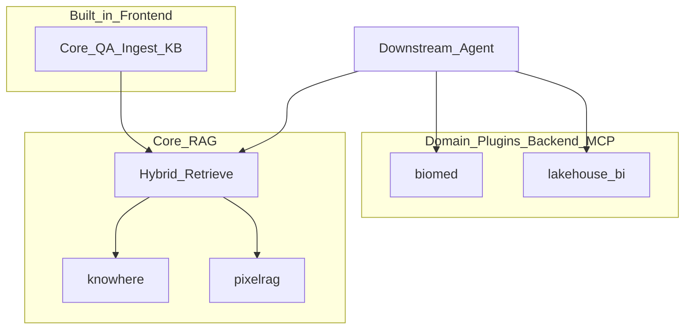
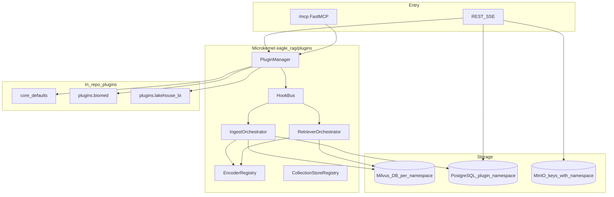
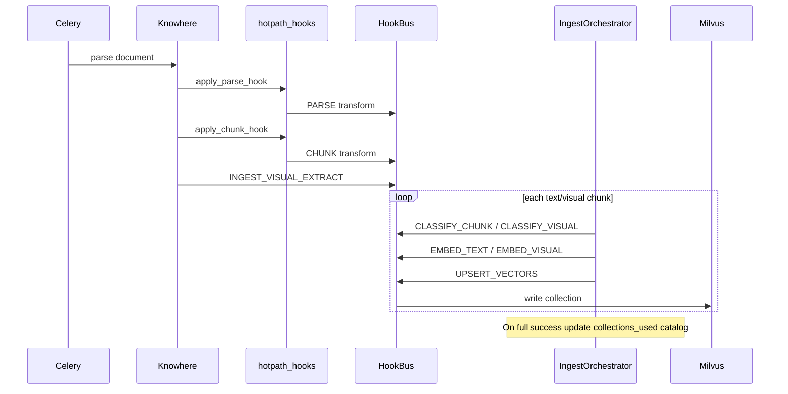
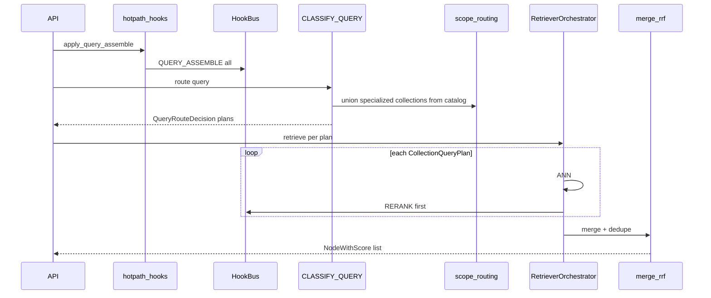

# 插件架构

Eagle-RAG 是 **微内核 RAG 平台**：领域无关的 Core，加上进程内行业插件以提升召回质量。插件与 Core 共享进程、模型与 MCP 端点；每个部署实例绑定单一行业命名空间。

英文正本：[plugin-architecture.md](../../en/architecture/plugin-architecture.md)。

二开指南：[编写行业 RAG 插件](../guides/authoring-industry-plugin.md)。模板：`plugins/_template/`。

---

## 产品边界

Eagle-RAG 是面向 Agent 的 **纯 RAG 数据层**，不是业务 Agent 应用平台。

| 做（本系统职责） | 不做（下游 Agent / 客户应用） |
| --- | --- |
| 入库、分块、多编码器检索、RRF、溯源 | 业务工作流、多步规划 / 反思 |
| REST / SSE / MCP 暴露 **检索与入库** | Text-to-SQL 执行、改库、发邮件、下单 |
| 行业插件提升 **召回质量** | 行业 Agent UI、审批流、仪表盘 |
| 结构化上下文包 + sources | 替 Agent 做决策或业务闭环 |

| 表面 | 范围 |
| --- | --- |
| **内置前端** | **仅 Core** — knowhere（语义结构）+ pixelrag（视觉）混合检索 |
| **垂类插件**（biomed、lakehouse-bi、…） | **仅后端 + MCP** — 本仓库不提供垂类 UI |
| **下游** | Agent / 客户自建 UI，经 MCP 或 API |

见 [ADR-008](adr/008-rag-only-plugin-platform.md)。



---

## 设计摘要

| 关注点 | 机制 |
| --- | --- |
| 扩展模型 | 进程内加载 `settings.plugins.enabled`（仅同仓模块；无 pip `entry_points`） |
| 实例绑定 | `settings.plugins.default_namespace` = Milvus Database + PG repository 过滤（[ADR-002](adr/002-single-domain-deployment.md)） |
| KB 租户 | 同一领域 DB 内的 `kb_name` 标量过滤（[多租户](multi-tenancy.md)） |
| 热路径 hook | `PARSE` / `CHUNK` / `QUERY_ASSEMBLE`，见 `eagle_rag/plugins/hotpath_hooks.py` |
| 入库编排 | `IngestOrchestrator` + `CLASSIFY_*` / `EMBED_*` / `UPSERT_VECTORS` |
| 查询编排 | `QueryRouteClassifier` → `RetrieverOrchestrator` → 分路 rerank → RRF 合并 |
| MCP | `{namespace}_{name}`；实例仅暴露 `core_*` + `default_namespace` 工具 |
| 配置旋钮 | `settings.plugins.options[<namespace>]`，经 `plugin_options()` 读取 — 非 Core 行业 typed settings |

Core 本身也是插件（`eagle_rag.plugins.core_defaults`，namespace `core`），与垂类走同一 hook / MCP 扩展路径。

---

## 分层架构



| 模块 | 职责 |
| --- | --- |
| `eagle_rag/plugins/manager.py` | 发现、校验（G3）、加载、注册 MCP / Celery 模块 |
| `eagle_rag/plugins/hookbus.py` | `invoke_first` / `invoke_all` / `invoke_transform`，按 namespace 过滤 |
| `eagle_rag/plugins/contract.py` | `PluginManifest` + `Plugin` 协议 |
| `eagle_rag/plugins/hotpath_hooks.py` | 将 PARSE / CHUNK / QUERY_ASSEMBLE 接入 Knowhere 与 router |
| `eagle_rag/plugins/ingest_orchestrator.py` | 分块：分类 → 编码 → 写入 |
| `eagle_rag/plugins/retriever_orchestrator.py` | 多 collection ANN + RRF |
| `eagle_rag/plugins/mcp_registry.py` | `@register_mcp_tool` + RAG-only 命名守卫 |
| `eagle_rag/plugins/core_defaults.py` | 默认分类器、编码器、knowhere/pixelrag 管线 |
| `eagle_rag/db/namespace.py` | 解析 / 拒绝请求中的 `plugin_namespace` vs 实例默认值 |
| `eagle_rag/db/repositories/` | 所有 PG 读写强制注入 `plugin_namespace` |
| `eagle_rag/index/milvus_pool.py` | 池化 `MilvusClient(uri, db_name=)` — 禁止 per-request 切库 |

---

## 核心概念

### `plugin_namespace` 与 `kb_name`

| 术语 | 含义 |
| --- | --- |
| `plugin_namespace` | 部署时领域绑定（= Milvus Database）。由配置固定；**不是**运行时 UI 切换器。 |
| `kb_name` | 该 Database 内的知识库 id（标量过滤）。用户选 KB，不选领域。 |

API / UI 文案中勿将二者混称为 “namespace”。

### 单域部署

每个进程绑定一个 `default_namespace`。跨行业检索靠 **多实例**，Core 不做跨 Milvus Database fan-out。同一 DB 内，单次 query **可以**跨多个 collection（如 `eagle_text` + `eagle_text_biomed` + `eagle_visual`）。

生产环境 repository 只信任 `settings.plugins.default_namespace`。请求显式传入且与实例不一致 → **403**（除非 `plugins.allow_namespace_override`，仅测试）。见 [ADR-002](adr/002-single-domain-deployment.md)。

### 基础 vs 专用 collection

每个领域 Database 恒有：

- `eagle_text` — Knowhere 语义块（Qwen 文本嵌入，1536 维）
- `eagle_visual` — PixelRAG tile / 图 / 表（Qwen3-VL，2048 维）

插件可增专用 collection（声明在 `PluginManifest.provides_specialized_collections`）。Core 默认路由 **永不**自动查专用 collection（[ADR-004](adr/004-multi-encoder-rrf-fusion.md) G4）；仅领域 `QueryRouteClassifier` 或 scope-aware catalog 并集可加入。

PixelRAG 视觉是 Core **一等公民**，不是可裁剪插件。可插拔的是领域分块、分类器、编码器与专用 collection。

---

## 插件契约

插件模块导出模块级 `plugin` 对象，实现：

```python
class Plugin(Protocol):
    manifest: PluginManifest
    def register_hooks(self, bus: HookBus) -> None: ...
    def on_load(self, ctx: PluginContext) -> None: ...
    def on_unload(self) -> None: ...
    def ensure_collections(self, ctx: PluginContext) -> None: ...
    # optional
    def register_mcp_tools(self) -> None: ...
```

`PluginManifest` 字段：

| 字段 | 用途 |
| --- | --- |
| `namespace` | 领域 id（`core`、`biomed`、`lakehouse-bi`、…） |
| `version` | 语义化版本 |
| `milvus_db_name` | 目标 Milvus Database（可选；经 `milvus_ns` 映射） |
| `depends_on` | 依赖的其他 namespace；拓扑排序加载 |
| `provides_pipelines` | 加载时注册的入库管线名 |
| `provides_specialized_collections` | 额外 Milvus collection（reconstruct / stats 扇出） |
| `provides_mcp_tools` | 声明的工具短名（文档 / health） |
| `resource_hints` | 可选 GPU / 加载顺序提示 |

`PluginManager.load_all()`：

1. 始终确保启用 `eagle_rag.plugins.core_defaults`。
2. 导入各模块；拒绝重复 namespace。
3. 校验 G3：非 `core` 的已启用插件必须等于 `default_namespace`。
4. 按依赖顺序调用 `on_load` → `ensure_collections` → `register_hooks`。
5. 经 `CELERY_TASKS` hook 收集 Celery 任务模块。
6. 仅对 `core` + `default_namespace` 调用 `register_mcp_tools()`。

---

## Hook 系统

### 调用模式

| 模式 | 方法 | 语义 |
| --- | --- | --- |
| `FIRST` | `invoke_first` | 首个非 `None` 胜出（优先级降序） |
| `TRANSFORM` | `invoke_transform` | 管道：每个订阅者变换当前值 |
| `ALL` | `invoke_all` | 收集全部结果；用于 `QUERY_ASSEMBLE` / `CELERY_TASKS` |

`namespace=None` 的订阅者对所有上下文生效；其余仅当 `HookContext.plugin_namespace` 匹配时运行。Core 默认常用低优先级（`-1000`）作回落；垂类常用高优先级（`100`）。

### 异常策略（G13）

| 路径 | 策略 |
| --- | --- |
| 入库 / 分类 / 编码 / upsert / PARSE / CHUNK | **Fail-fast** → `HookInvocationError` |
| `QUERY_ASSEMBLE` | 按订阅者 try/except；降级并记审计 |

### Hook 一览

| Hook | 模式 | 典型用途 |
| --- | --- | --- |
| `PARSE` | transform | 丰富 Knowhere `ParseResult` |
| `CHUNK` | transform | 行业分块 / typed metadata（orchestrator 前） |
| `INGEST_VISUAL_EXTRACT` | first | 抽取视觉块 + 四锚点字段 |
| `CLASSIFY_CHUNK` / `CLASSIFY_VISUAL` | first | 路由 chunk → collection + encoder |
| `CLASSIFY_QUERY` | first | 生成多 collection `QueryRouteDecision` |
| `EMBED_TEXT` / `EMBED_VISUAL` | first | 经 `EncoderRegistry` 的领域编码器 |
| `UPSERT_VECTORS` | transform | 持久化向量（默认写 Milvus） |
| `INGEST_ROUTE_SELECTORS` | first | 额外「格式 → 管线」选择器 |
| `QUERY_ASSEMBLE` | all | ANN 前 query 扩写 / 实体 hint |
| `RERANK` | first | 分路领域重排 |
| `RETRIEVE_VISUAL_FILTER` | first | 视觉过滤覆盖 |
| `CELERY_TASKS` | all | 额外 Celery include 模块 |

热路径接线：

- `apply_parse_hook` / `apply_chunk_hook` — Knowhere 入库路径
- `apply_query_assemble` — router ANN 前（受 `plugins.query_assemble_enabled` 控制）

---

## 入库路径

固定顺序（G26）：

```text
PARSE → CHUNK → INGEST_VISUAL_EXTRACT → CLASSIFY_* → IngestOrchestrator (EMBED_* → UPSERT_VECTORS)
```



`IngestOrchestrator.classify` 走 `CLASSIFY_*`；`embed_and_upsert` 按 `ClassificationDecision.target_encoder` 经 `EncoderRegistry` / `encoder_runtime` 编码落库。

### Collection catalog（入库 ↔ 查询契约）

仅在入库 **终态成功**（`documents.status=success`、全 chunk 写入后）更新：

- `documents.extra["collections_used"]` — 文档级
- `knowledge_bases.collections_used` — KB 级并集

失败 / 部分成功不污染 catalog。查询 scope 用该 catalog 在文档/KB/tags 曾写入专用 collection 时强制加入对应 plans（[ADR-006](adr/006-ingest-query-routing-contract.md)）。

格式路由（Knowhere vs PixelRAG）仍在 `eagle_rag/ingest/router.py` — 见 [路由矩阵](routing-matrix.md)。插件可通过 `INGEST_ROUTE_SELECTORS` 补充。

---

## 查询路径



### 默认 vs 领域路由（G4 / G20）

- **Core** `CLASSIFY_QUERY`：仅 `eagle_text`（hybrid / 有图时加 `eagle_visual`）。永不查专用 collection。
- **Biomed**：规则 + UMLS 实体触发可加入 `eagle_text_biomed` / 化学 / 医学影像 collection；abstain 回落 Core。无实体命中的纯文本默认只查 `eagle_text`（`default_dual_text_search: false`）。
- **Scope-aware 并集**：`scope_filter` 的 KB / document / tags catalog 含专用 collection 时，即使分类器 abstain 也强制加入对应 plans。

### 多编码器合并（G8 / G14 / G32）

1. 按 `CollectionQueryPlan` 做 ANN（best-effort：失败路跳过并审计）。
2. 可选分路 `RERANK` hook。
3. 用 RRF 合并（`eagle_rag/router/rerank_fusion.py`）— 禁止跨 embedding 空间 raw score。
4. 按 `source_chunk_id`（非空）或 `(document_id, path)` 去重。

父文档检索（`settings.router.parent_doc_retrieval`，默认 `true`）仍是 Core 在 `eagle_text` 上的两阶段 Milvus 路径（先 `section_summary`，再 path 下钻）。Eagle **不调用** Knowhere 的 `RetrievalAgent` / `WorkflowOrchestrator`（[ADR-005](adr/005-knowhere-eagle-boundary.md)）。

---

## 隔离模型

### Milvus（[ADR-001](adr/001-milvus-database-isolation.md)）

- 每个 `plugin_namespace` 对应一个独立 Milvus **Database**（`core` → `default`，`lakehouse-bi` → `lakehouse_bi`，…）。
- 向量上不设 `plugin_namespace` 标量字段；隔离靠物理 DB。
- `MilvusClientPool` 在构造时绑定 `db_name`。禁止 per-request `using_database`，禁止对池内 client `close()`。

### PostgreSQL

领域表一律经 repository 注入 `plugin_namespace`。不同 namespace 下同名 `kb_name` 不串线。覆盖 documents、keywords/tags、sessions、images 元数据、task audit、notifications、MCP call log。

### 对象存储 / 缓存

图片 object key、原始文档 key、MCP cache key 均贯穿 `plugin_namespace`，多实例共享 MinIO/Redis 时仍隔离。

---

## MCP 表面

单一 FastMCP 应用挂载于 `/mcp`（默认 HTTP）。

| 规则 | 细节 |
| --- | --- |
| 命名 | `{namespace}_{name}`，下划线分隔（`core_ingest`、`biomed_query_entities`） |
| 注册 | 显式 `plugin.register_mcp_tools()`；装饰器 `@register_mcp_tool` |
| 实例过滤（G3） | 仅 `core_*` + `default_namespace` 插件工具 |
| RAG-only | `assert_rag_only_tool_name` 拒绝副作用片段（`execute_sql`、`send_email`、…） |
| Breaking change | 插件化前的裸名（`ingest`）**不提供** alias |

Core 工具：`core_ingest`、`core_query`、`core_retrieve_text`、`core_retrieve_visual`。

垂类示例：

- Biomed：`biomed_query_entities`、`biomed_retrieve_compounds`
- Lakehouse：`lakehouse_bi_query_semantic_context`、`lakehouse_bi_retrieve_historical_analysis`

见 [ADR-003](adr/003-mcp-tool-naming-and-registration.md) 与 [MCP 工具](../api/mcp-tools.md)。

---

## 部署 profile

通过 `EAGLE_RAG_PROFILE`（或 YAML `active_profile`）启用。Profile 对顶层 settings 做 deep-merge。

```yaml
# eagle_rag/settings.yaml（节选）
plugins:
  enabled:
    - eagle_rag.plugins.core_defaults
  default_namespace: ${PLUGIN_NAMESPACE:-core}
  allow_namespace_override: false
  query_assemble_enabled: true
  options:
    biomed:
      default_dual_text_search: false
      encoder_mode: auto   # auto | require_native | deterministic

profiles:
  core:
    plugins:
      enabled: [eagle_rag.plugins.core_defaults]
      default_namespace: core
    milvus:
      db_name: default
  biomed:
    plugins:
      enabled: [eagle_rag.plugins.core_defaults, plugins.biomed]
      default_namespace: biomed
    milvus:
      db_name: biomed
  lakehouse-bi:
    plugins:
      enabled: [eagle_rag.plugins.core_defaults, plugins.lakehouse_bi]
      default_namespace: lakehouse-bi
    milvus:
      db_name: lakehouse_bi
```

默认 compose profile 为 `core`。启用 biomed / lakehouse-bi 需对应 profile 并重启。Docker 镜像打包 `plugins/`；compose override 挂载 `./plugins` 便于本地迭代。

---

## 已交付垂类插件

### `plugins/biomed`

| 能力 | 细节 |
| --- | --- |
| 专用 collection | `eagle_text_biomed`、`eagle_chemical`、`eagle_medical_radiology`、`eagle_medical_pathology` |
| 文本编码器 | PubMedBERT（经 `EncoderRegistry`） |
| 医学影像 | 放射 → MedImageInsight；病理 → UNI 2 — **永不**回落 Qwen3-VL |
| 查询路由 | 规则 + 本地 UMLS 子集（`routing_rules.yaml` / `umls.py`）；不用 LLM 分类 |
| MCP | 实体查询 + 化合物检索（MolFormer ANN → `eagle_chemical`） |
| 编码器模式 | `auto` / `require_native` / `deterministic`（CI） |

### `plugins/lakehouse_bi`

| 能力 | 细节 |
| --- | --- |
| Collection | 仅基础 `eagle_text` / `eagle_visual` |
| Hooks | `PARSE` / `CHUNK` 语义层 typed metadata；`QUERY_ASSEMBLE` hint |
| MCP | 只读语义上下文 + 历史分析检索 |
| 边界 | 仅检索 — 不执行 SQL；connector 导出元数据文件供入库 |

### `plugins/_template`

新行业插件最小骨架：manifest、hooks、MCP 注册、README。

---

## 模型

| 角色 | 归属 | 模型 |
| --- | --- | --- |
| 路由 / 生成 LLM | Core | DeepSeek |
| VLM | Core | Qwen-VL-Max |
| 文本嵌入 | Core 默认 | Qwen `text-embedding-v4`（1536） |
| 视觉嵌入 | Core 默认 | Qwen3-VL-Embedding-2B（2048） |
| 重排 | Core | Qwen `qwen3-rerank` |
| 领域编码器 | 插件 | 如 PubMedBERT、MedImageInsight、UNI 2、MolFormer |

垂类可注册额外编码器；Core 仍用 DeepSeek/Qwen 做全局路由与生成。

---

## 可观测性

`PluginManager.health_payload()`（经 admin health 暴露）报告：

- `default_namespace`、已启用模块、manifests
- 专用 collection、声明的 MCP 工具、Celery 模块

KB stats / collection 列表会扇出绑定 namespace 的 `provides_specialized_collections`。Hook 与 ANN 分路失败记入 `PluginAudit` / HookBus 审计列表。

---

## 源码布局

```text
eagle_rag/plugins/          # 微内核
  manager.py
  hookbus.py / hooks.py / hotpath_hooks.py
  contract.py / context.py
  ingest_orchestrator.py / retriever_orchestrator.py
  classifier.py / routing.py / scope_routing.py
  encoder_registry.py / encoder_runtime.py
  mcp_registry.py / milvus_ns.py
  core_defaults.py
  ingest_catalog.py / ingest_tracker.py / …
plugins/                    # 同仓垂类插件
  _template/
  biomed/
  lakehouse_bi/
tests/plugins/              # 契约、隔离、hook、垂类测试
```

---

## 相关文档

| 文档 | 主题 |
| --- | --- |
| [编写行业 RAG 插件](../guides/authoring-industry-plugin.md) | 如何新增垂类 |
| [插件术语表](glossary-plugin.md) | 术语速查 |
| [多模态融合](multimodal-fusion.md) | Knowhere + PixelRAG 锚点 |
| [路由矩阵](routing-matrix.md) | 格式 → 管线 |
| [ADR-001](adr/001-milvus-database-isolation.md) | Milvus DB = 领域 |
| [ADR-002](adr/002-single-domain-deployment.md) | 单域实例 |
| [ADR-003](adr/003-mcp-tool-naming-and-registration.md) | MCP 命名 / G3 |
| [ADR-004](adr/004-multi-encoder-rrf-fusion.md) | RRF / G4 |
| [ADR-005](adr/005-knowhere-eagle-boundary.md) | Knowhere 职责边界 |
| [ADR-006](adr/006-ingest-query-routing-contract.md) | Catalog + scope-aware plans |
| [ADR-007](adr/007-plugin-implementation-status.md) | Profile / 编码器 / UMLS 说明 |
| [ADR-008](adr/008-rag-only-plugin-platform.md) | RAG-only + 前端范围 |
