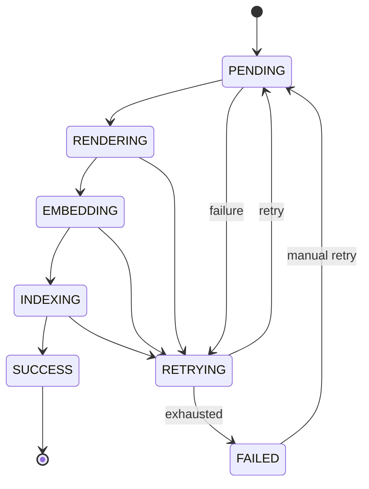
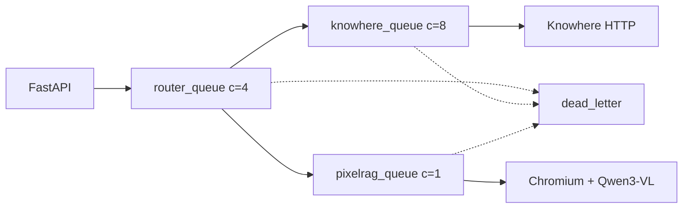

# 可靠性与降级

生产 RAG 依赖解析器、向量库、模型 API 与 worker。Eagle-RAG 假定**部分失败是常态**，设计为在能力降低下继续运行 — 而非全盘宕机。

---

## 理论与基础

### RAG 中的故障域

| 域 | 典型故障 | 未处理时的爆炸半径 |
| --- | --- | --- |
| **解析器**（Knowhere、PixelRAG） | 超时、OOM、SDK 错误 | 摄入卡住；索引损坏 |
| **向量库**（Milvus） | 网络分区、内存压力 | 检索为空 |
| **模型 API**（DeepSeek、Qwen） | 限流、密钥过期 | 无答案 |
| **Worker**（Celery） | 进程崩溃、队列积压 | 索引陈旧 |
| **Broker**（Redis） | 连接丢失 | 任务派发失败 |

分布式系统文献推荐**优雅降级** — 降低服务质量而非整请求失败（[Michael Nygard，*Release It!*](https://pragprog.com/titles/mnee2/release-it-second-edition/)）— 与**舱壁** — 隔离资源池（Eagle-RAG 三个 Celery 队列）。

### 至少一次任务投递

`acks_late=True` 与 `task_reject_on_worker_lost=True` 的 Celery 提供至少一次语义。幂等性要求于：

- 去重 `(sha256, kb_name)`
- Milvus upsert 按主键（`id` / 节点 `id_`）
- 章节摘要 ID `sec_{sha1(document_id:path)[:16]}`

---

## 设计意图

| 原则 | 含义 | 示例 |
| --- | --- | --- |
| 解析配置失败即关闭 | 错误解析配置 → 显式失败 | `KnowhereError`，无 mock 解析 |
| 次要写入尽力而为 | 主路径成功；附加可失败 | 标签目录、`doc_nav`、视觉派发 |
| 探测隔离 | 单慢依赖不阻塞 `/health` | 每依赖 3 秒超时 |
| 有界重试 | 指数退避 + 死信 | `max_retries: 3` |
| 检索器隔离 | 单模态失败不 500 查询 | 空列表 + 警告日志 |

跨模块：[后端索引](../backend/index.md)、[可观测性](../ops/observability.md)。

---

## Eagle-RAG 实现

### 降级模式

| 模式 | 位置 | 效果 |
| --- | --- | --- |
| **失败即关闭** | `parse_with_knowhere_sdk()` | `KnowhereError` → 任务 `FAILED` |
| **快速失败** | `visual_encoder.get_visual_encoder()` | 未知 `provider` → `ValueError` |
| **尽力写入** | Milvus upsert 边缘情况 | 记录日志；摄入可能完成 |
| **非阻塞副作用** | `knowhere_parse` 步骤 5.2、5.5、5.7 | 标签目录、视觉派发、doc_nav |
| **懒单例** | Store、编码器 | 导入时无连接风暴 |
| **幂等 collection** | `ensure_collection()` | 可重复调用；字段迁移 |
| **SSE 回退** | `/query/stream`、`/admin/logs` | Redis 宕机 → 内存队列 + 5 秒心跳 |
| **探测隔离** | `/health` | 每依赖独立 `try/except` |
| **`unknown` vs `down`** | PixelRAG 探测 | 未配置 → `unknown`，非红色 |
| **检索器空列表** | `_fetch_nodes()` | 降级答案，非 500 |
| **MCP `resilient_call`** | `mcp_server.py` | `{"error": ...}` 保持会话 |
| **标签解析失败** | `_resolve_scope_filter()` | 忽略标签；继续 |
| **QUERY_ASSEMBLE hook 失败** | `hotpath_hooks.apply_query_assemble` | 每订阅者 try/except；失败 hook 跳过；查询继续 |
| **命名空间不匹配** | `eagle_rag/db/namespace.py` | 显式 `plugin_namespace` ≠ `default_namespace` → **403**（除非 `allow_namespace_override`） |
| **编码器模式不可用** | `EncoderRegistry` / `plugins.options` 中 `encoder_mode` | 按插件契约回退；入库可能跳过专用集合 |
| **专用 plan 尽力** | `RetrieverOrchestrator` | 单集合 plan 失败 → 记录日志 + 继续其他 plan |
| **插件加载探测** | `GET /health/plugins` | 已加载清单 + Celery 模块列表；导入失败体现在响应中 |

### 插件运维

`GET /health/plugins` 返回 `default_namespace`、`enabled_modules`、每插件 `manifests`（含 `milvus_db_name`、`provides_specialized_collections`、`provides_mcp_tools`）及 `celery_modules` 供 worker 一致性检查。在 profile 变更或插件部署后使用。

### `knowhere_parse` 故障分类

```python
# eagle_rag/ingest/knowhere_adapter.py — 结构
try:
    parse_result = parse_with_knowhere_sdk(...)     # 失败即关闭
    upsert_text_nodes(nodes)                          # 失败即关闭（主索引）
    try:
        upsert_document_keywords(...)                 # 尽力而为
    except Exception:
        logger.warning(...)
    try:
        dispatch_visual_chunks(...)                   # 尽力而为
    except Exception:
        logger.warning(...)
    try:
        update_extra(doc_nav)                         # 尽力而为
    except Exception:
        logger.warning(...)
    update_status(document_id, "ready")               # SUCCESS 路径
except Exception as exc:
    update_state(job_id, TaskState.FAILED, ...)
    retry_on_failure(self, exc)
```

---

## 任务状态机

每个摄入任务在 `task_audit` 跟踪。`eagle_rag/tasks/state.py` 强制 `ALLOWED_TRANSITIONS`：



| 规则 | 理由 |
| --- | --- |
| `SUCCESS` 为终态 | 触发 `ingest_complete` 通知 |
| `FAILED` → 手动 `PENDING` | 运维经 API 重放 |
| 非法转移抛错 | 审计行保持一致 |
| 独立 `visual_job_id` | 避免 `SUCCESS` → `RENDERING` 冲突 |

---

## 重试与死信

`eagle_rag/tasks/dead_letter.py`：

### `@with_retry` 装饰器

```python
def with_retry(*, name, queue, base=DeadLetterTask, max_retries=None, retry_backoff=None):
    # 注册 Celery 任务，含：
    # autoretry_for=(Exception,)
    # retry_backoff = settings.celery.retry_backoff * 2^retries
    # acks_late=True
    # base=DeadLetterTask → on_failure 发往 dead_letter 队列
```

用于：`ingest_router`、`knowhere_parse`、`pixelrag_build`。

### `retry_on_failure(task, exc)`

自定义异常处理器的手动重试路径：

```python
if task.request.retries < max_retries:
    countdown = retry_backoff * (2 ** task.request.retries)
    update_state(job_id, TaskState.RETRYING, ...)
    raise task.retry(exc=exc, countdown=countdown)
else:
    send_to_dead_letter(job_id, task.name, payload, repr(exc))
```

### 死信操作

| 函数 | 用途 |
| --- | --- |
| `send_to_dead_letter()` | 发布到 `dead_letter` 队列；审计标 `FAILED` |
| `drain_dead_letter(limit)` | 管理端检查消息 |
| `replay_dead_letter(job_id)` | 根因修复后重新派发 |

Celery worker 设置（`eagle_rag/tasks/celery_app.py`）：

| 设置 | 值 | 用途 |
| --- | --- | --- |
| `task_acks_late` | `True` | 任务完成后 ack |
| `worker_prefetch_multiplier` | `1` | 公平派发 |
| `task_reject_on_worker_lost` | `True` | Worker 崩溃时重新入队 |
| `task_time_limit` | 3600s | 硬杀失控任务 |
| `task_soft_time_limit` | 3300s | 优雅关闭窗口 |

---

## 队列拓扑与背压



| 队列 | 瓶颈 | 扩缩指引 |
| --- | --- | --- |
| `router_queue` | CPU 轻 | 水平扩至 4+ worker |
| `knowhere_queue` | Knowhere HTTP 吞吐 | 扩至 8；关注 Knowhere 容量 |
| `pixelrag_queue` | **内存 + GPU** | **保持并发 1**；垂直扩容 |

**`pixelrag_queue` 并发 = 1** — Chromium 渲染 + Qwen3-VL 编码器易 OOM。生产 Compose 可能将 worker 内存上限 4 GB。

Beat 任务（启用时）：每 30s 采样队列 `LLEN` → `metric_sample` 表供运维仪表盘。

---

## 幂等保证

| 操作 | 保证 | 机制 |
| --- | --- | --- |
| 去重 | 原子检查并注册 | PostgreSQL 事务 |
| `register_document` | Upsert | `INSERT ON CONFLICT DO UPDATE` |
| Milvus 文本 upsert | 按节点 `id_` 覆盖 | LlamaIndex upsert |
| Milvus 视觉 upsert | 按 PK `id` 覆盖 | `client.upsert()` |
| `ensure_collection` | 幂等创建 | `has_collection` 检查 |
| 章节摘要 ID | 重解析稳定 | `sec_{sha1(document_id:path)[:16]}` |
| MCP 检索缓存 | 键来自查询 + 范围 | 空结果不缓存 |

---

## 健康与可观测

### `/health` 探测模型

每依赖独立探测（约 3 秒超时）：

| 依赖 | 探测 | 状态值 |
| --- | --- | --- |
| PostgreSQL | 简单查询 | `up` / `down` |
| Redis | PING | `up` / `down` |
| Milvus | Collection 列表 | `up` / `down` |
| MinIO | Bucket 存在 | `up` / `down` |
| Knowhere | HTTP 健康 | `up` / `down` |
| PixelRAG | 导入 + provider 检查 | `unknown` / `up` / `down` |

仅非关键依赖失败时聚合 API 进程仍为 **up**。

### 遥测

| 通道 | 配置 | 内容 |
| --- | --- | --- |
| AI 事件 JSONL | `telemetry.ai_log_file` | `ingest`、`route`、`query` 结构化事件 |
| 运维日志 | `telemetry.op_log_file` | loguru 轮转 |
| OpenTelemetry | `telemetry.tracing_enabled` | 可选 OTLP 导出 |

`TelemetryMiddleware` — 每请求 SERVER span 带 `request_id`。

### SSE 日志回退

Redis pub/sub 不可用于 `/admin/logs` 时：

- 每连接内存 `asyncio.Queue`
- 5 秒心跳保持连接
- 无 Redis 时无跨实例扇出

---

## 设计张力与调参

| 张力 | 机制 | 运维杠杆 |
| --- | --- | --- |
| 可用性 vs 索引完整度 | 摄入时 Milvus 尽力写入；视觉派发错误仅记录 | 注册表显示 `ready` 但搜索为空时重跑摄入或 KB 重建 |
| 部分答案 vs 硬错误 | 检索失败返回 `[]`；混合模式继续另一路径 | 监控 `ai_logger` 中带 `error` 字段的 `retrieve` 事件 |
| 至少一次副作用 | `acks_late` + 重试 → 可能重复切片 upsert | 幂等 `image_id` / 块 ID；重放前检查死信 |
| 文本优先 UX vs 视觉保真 | `knowhere_parse` 在 `knowhere_visual_chunks` 前标 `ready` | 视觉队列排空前用户可能只得文本答案 |
| 探测失败开放 vs 误路由 | PDF 探测异常 → 当作文本 PDF | 扫描表单多的 KB 降低 `text_page_ratio` |
| 健康信号 vs 探测延迟 | Celery `inspect.ping` 超时 1.0s | `down` ≠ `unknown` — 见 [排障](../ops/troubleshooting.md) 探测矩阵 |
| QUERY_ASSEMBLE 降级 | `apply_query_assemble` 中每订阅者 try/except | 检查 `GET /health/plugins`；插件日志 |
| 命名空间 403 | `resolve_namespace()` | 对齐客户端与 `EAGLE_RAG_PROFILE` / `default_namespace` |
| 编码器模式回退 | `plugins.options.<ns>.encoder_mode` | 验证编码器依赖；见插件清单 |
| 专用 plan 部分成功 | `RetrieverOrchestrator` 每 plan 尽力 | 范围/目录并集；检查文档上 `collections_used` |

---

## 配置

| 键 | 可靠性影响 |
| --- | --- |
| `celery.max_retries` | 默认 3 |
| `celery.retry_backoff` | 指数退避基秒（60） |
| `knowhere.poll_timeout` | 最长解析等待（1800s） |
| `knowhere.max_retries` | SDK HTTP 重试 |
| `mcp.circuit_fail_threshold` | MCP 熔断（5） |
| `mcp.tool_timeout` | MCP 工具秒（30） |
| `telemetry.enabled` | 结构化事件日志 |

```bash
EAGLE_RAG_CELERY__MAX_RETRIES=5
KNOWHERE_POLL_TIMEOUT=3600
```

---

## 故障模式与运维

### 事件手册

| 症状 | 诊断 | 响应 |
| --- | --- | --- |
| 任务 `RETRYING` 循环 | 瞬时 Knowhere/Milvus | 等待；查退避日志 |
| `pixelrag_queue` 深度增长 | 渲染瓶颈 | **勿**提高并发；加内存 |
| 所有查询为空 | Milvus 宕机或错误 host | `task health`；修 `MILVUS_HOST` |
| 混合查询仅文本 | 视觉检索器异常 | 查 worker-pixelrag 日志 |
| 死信增长 | 系统性失败 | `drain_dead_letter`；修根因；重放 |
| SSE 流断开 | 代理超时 | 每 5 秒心跳；查 nginx `proxy_read_timeout` |
| 重复文档 | 注册前去重竞态 | 罕见预期；去重捕获重传 |

### 运维清单

- [ ] 监控 `/health`、`/health/plugins` 与 `/admin/probes`
- [ ] 关注 `pixelrag_queue` LLEN — 积压信号渲染瓶颈
- [ ] 修复 Knowhere 或 API 密钥后重放 `FAILED` 任务
- [ ] 根因修复后排空死信
- [ ] 触及模型的升级后运行 `task db:migrate`
- [ ] `.env` 变更后重启 worker（`get_settings` 缓存）
- [ ] Milvus 模式迁移前备份 PostgreSQL + MinIO

### 恢复命令

```bash
task health
task logs:worker SERVICE=worker-pixelrag
# 管理 API：POST /tasks/{job_id}/retry
# 修复后：经管理模块重放死信
```

排障：[ops/troubleshooting](../ops/troubleshooting.md)。备份：[ops/backup-restore](../ops/backup-restore.md)。

---

## 参考文献

- [Celery 任务重试文档](https://docs.celeryq.dev/en/stable/userguide/tasks.html#retrying)
- [Milvus 可用性](https://milvus.io/docs/admin_guide.md)
- [Gao 等，2023](https://arxiv.org/abs/2312.10997) — 生产 RAG 关切
- [系统设计 — 优雅降级](system-design.md)
- [数据流](data-flow.md)
- [任务队列](../backend/task-queue.md)
