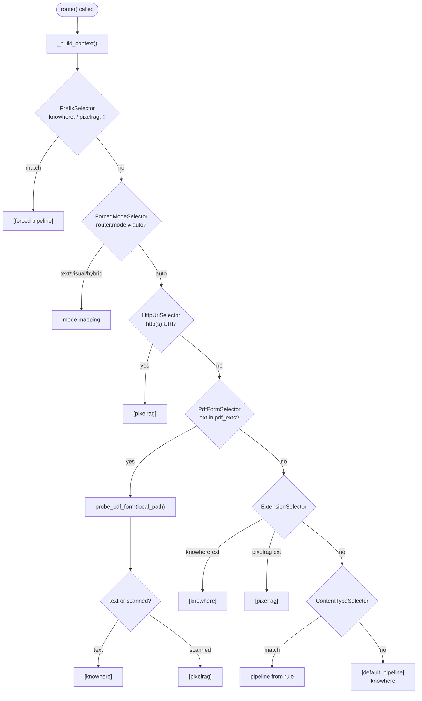
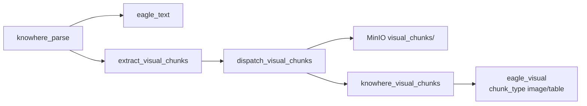

# 路由矩阵

路由矩阵在**摄入时**决定**哪些解析管线**处理文档。位于 `eagle_rag/ingest/router.py`，以严格**选择器链**求值 — 首个非 `None` 结果胜出。

!!! warning "非查询时路由"
    摄入路由（`route()`）≠ 查询路由（`eagle_rag/router/router_engine.py` 中 `route_query()`）。本文覆盖摄入；查询路由见 [路由引擎](../backend/router-engine.md)。

---

## 理论与基础

### 为何需要路由？

不同文档**形态**需要不同解析器：

| 形态 | 解析需求 | 管线 |
| --- | --- | --- |
| 文本型 PDF、Office、CSV | 语义树、类型化块、`connect_to` 图 | Knowhere |
| 扫描 PDF、照片、网页 | 像素切片、保版式嵌入 | PixelRAG |

按**格式 + 内容形态**路由 — 非按主题 — 行为可预测。财务表与专利表在文本结构化时均走 Knowhere。

[Gao 等，2023](https://arxiv.org/abs/2312.10997) 指出文档类型感知预处理可提升下游检索质量。

### PDF：文本 vs 扫描

文本 PDF 嵌入可选字符流；扫描 PDF 为图像序列。启发式分类避免纯图 PDF 进文本解析器（OCR 差）或文本 PDF 走昂贵视觉切片。

Eagle-RAG 用**页级统计**（非 ML 分类器）— 快速、可解释、经 `pdf_probe` 可调。

---

## Eagle-RAG 实现

### 入口：`route()`

```python
# eagle_rag/ingest/router.py:238-273
def route(
    *,
    filename: str,
    content_type: str | None = None,
    source_uri: str | None = None,
    source_type_hint: str | None = None,
    local_path: str | None = None,
    kb_name: str | None = None,
    text_page_ratio: float | None = None,
) -> list[str]:
    cfg = get_settings().ingest.routing
    ctx = _build_context(
        filename, content_type, source_uri, local_path, kb_name,
        text_page_ratio, prefix_force=cfg.prefix_force,
    )
    chain = _build_chain(cfg, probe=probe_pdf_form)
    return chain.select(ctx)
```

**返回：** `["knowhere"]`、`["pixelrag"]` 或 `["knowhere", "pixelrag"]`（混合摄入）。

**不使用：** `source_type_hint`（仅经 `infer_source_type()` 的元数据）、`kb_name` 做路由（传给下游；每 KB PDF 比例经 `text_page_ratio` 参数）。

### 上下文构造：`_build_context()`

```python
# eagle_rag/ingest/router.py:181-206
def _build_context(...) -> IngestRouteContext:
    cleaned_name, forced_prefix = _strip_prefix(filename, prefix_force)
    ext = _lower_ext(cleaned_name)
    is_http = _is_http_uri(source_uri)
    return IngestRouteContext(
        filename=filename,
        cleaned_name=cleaned_name,
        ext=ext,
        content_type=content_type,
        source_uri=source_uri,
        is_http=is_http,
        local_path=local_path,
        forced_prefix=forced_prefix,
        kb_name=kb_name,
        text_page_ratio=text_page_ratio,
    )
```

`IngestRouteContext` 为所有选择器消费的 dataclass。

### 选择器链：`_build_chain()`

```python
# eagle_rag/ingest/router.py:209-227
def _build_chain(cfg, *, probe) -> FallbackChain:
    selectors = [
        PrefixSelector(prefix_force=cfg.prefix_force),
        ForcedModeSelector(router_mode=_router_mode()),
        HttpUriSelector(),
        PdfFormSelector(probe=probe, pdf_exts=cfg.pdf_exts),
        ExtensionSelector(knowhere_exts=cfg.knowhere_exts, pixelrag_exts=cfg.pixelrag_exts),
        ContentTypeSelector(rules=cfg.content_type_rules),
    ]
    return FallbackChain(selectors, default_pipeline=cfg.default_pipeline)
```

`FallbackChain.select(ctx)` 遍历选择器；首个非 `None` 列表返回。若均为 `None`，将 `default_pipeline` 包装为单元素列表。

`probe` 显式传入，测试可 patch `probe_pdf_form` 而无陈旧引用。

---

## 决策优先级（详述）



### 第 1 级 — 文件名前缀（`PrefixSelector`）

配置：`ingest.routing.prefix_force`：

```yaml
prefix_force:
  "knowhere:": knowhere
  "pixelrag:": pixelrag
```

`knowhere:report.pdf` → `["knowhere"]`；前缀经 `_strip_prefix()` 剥离。

**用例：** 无视扩展名强制管线 — 如视觉实验用 `pixelrag:text-heavy.pdf`。

### 第 2 级 — `settings.router.mode`（`ForcedModeSelector`）

读取 `_router_mode()` → `get_settings().router.mode`（小写）。

| `router.mode` | 返回管线 |
| --- | --- |
| `text` | `["knowhere"]` |
| `visual` | `["pixelrag"]` |
| `hybrid` | `["knowhere", "pixelrag"]` |
| `auto` | `None`（继续链） |

!!! note "同名设置、不同阶段"
    `ROUTER_MODE` 在非 `auto` 时影响**摄入**（`ForcedModeSelector`）与**查询**（`route_query`）。仅控制摄入可用文件名前缀或扩展名规则。

### 第 3 级 — HTTP/HTTPS URL（`HttpUriSelector`）

`source_uri` 以 `http://` 或 `https://` 开头 → `["pixelrag"]`。

PixelRAG 渲染网页（CDP/Playwright 后端）— Knowhere 期望文件上传。

### 第 4 级 — PDF 形态探测（`PdfFormSelector` + `probe_pdf_form`）

扩展名 ∈ `ingest.routing.pdf_exts`（默认 `.pdf`）且 `local_path` 已设时：

#### 算法：`probe_pdf_form()`

```python
# eagle_rag/ingest/router.py:133-173
def probe_pdf_form(file_path: str, *, text_page_ratio: float | None = None) -> str:
    probe_cfg = get_settings().pdf_probe
    ratio_threshold = text_page_ratio if text_page_ratio is not None else probe_cfg.text_page_ratio
    chars_threshold = probe_cfg.avg_chars_per_page

    pages_text = _extract_pdf_pages_text(file_path)  # pypdf → pdfplumber 回退
    if pages_text is None or len(pages_text) == 0:
        return "text"  # 失败开放到 Knowhere

    total_pages = len(pages_text)
    text_pages = sum(1 for t in pages_text if len(t or "") > chars_threshold)
    computed_ratio = text_pages / total_pages
    avg_chars = sum(len(t or "") for t in pages_text) / total_pages

    if computed_ratio < ratio_threshold or avg_chars < chars_threshold:
        return "scanned"
    return "text"
```

**指标：**

| 指标 | 公式 | 默认阈值 |
| --- | --- | --- |
| `text_page_ratio` |（字符数 > `avg_chars_per_page` 的页数）/ 总页数 | `< 0.2` → 扫描 |
| `avg_chars_per_page` | 全页平均字符数 | `< 50` → 扫描 |

**分类：**

| `probe_pdf_form` 结果 | 管线 |
| --- | --- |
| `"text"` | `["knowhere"]` |
| `"scanned"` | `["pixelrag"]` |

**失败开放：** 缺文件、解析失败或零页 → `"text"`（Knowhere）。理由：文本解析器在扫描文档上降级；视觉管线处理文本 PDF 浪费但不阻塞。

**每 KB 覆盖：** `ingest_router` 在 `knowledge_bases` 表有设置时传 `get_pdf_ratio_sync(kb_name)` 的 `text_page_ratio`。

#### 文本提取：`_extract_pdf_pages_text()`

1. **主路径：** `pypdf.PdfReader` — 每页 `page.extract_text()`
2. **回退：** `pdfplumber.open()` — 同样逐页提取
3. **失败：** 返回 `None` → 探测默认为 `"text"`

### 第 5 级 — 扩展名（`ExtensionSelector`）

来自 `settings.ingest.routing`：

| 扩展名集合 | 管线 |
| --- | --- |
| `knowhere_exts` | `.docx`、`.doc`、`.md`、`.txt`、`.xlsx`、`.csv`、`.pptx`、`.json` 等 | `knowhere` |
| `pixelrag_exts` | `.png`、`.jpg`、`.html`、`.webp` 等 | `pixelrag` |

### 第 6 级 — Content-Type（`ContentTypeSelector`）

扩展名未知时回退 — 规则来自 `content_type_rules`：

```yaml
content_type_rules:
  - {match: "text/", mode: startswith, pipeline: knowhere}
  - {match: "image/", mode: startswith, pipeline: pixelrag}
  - {match: spreadsheet, mode: contains, pipeline: pixelrag}
```

### 默认

`default_pipeline: knowhere` — 未知扩展名优先结构化文本解析。

---

## `source_type`（仅元数据）

```python
# eagle_rag/ingest/router.py — simplified
def infer_source_type(filename, source_uri=None, source_type_hint=None) -> str:
    if source_type_hint:                      # free-form hint wins
        return source_type_hint.strip().lower()
    for rule in get_settings().ingest.source_type.rules:  # Core default: []
        if _has_keyword(text, rule.keywords):
            return rule.source_type
    return cfg.default  # "other"
```

**不影响 `route()`。** 存于文档注册表与 Milvus 元数据，供查询过滤。Core 默认 `rules: []`（无 finance/tax 硬编码）；行业关键词放在部署 profile / 领域配置。

---

## `ingest_router` Celery 任务

`route()` 返回管线列表后：

```python
# eagle_rag/ingest/router.py — ingest_router（简化）
@with_retry(name="eagle_rag.tasks.ingest_router", queue="router_queue", bind=True)
def ingest_router(self, job_id, document_id, filename, local_path, kb_name, ...):
    pipelines = route(filename=filename, local_path=local_path, kb_name=kb_name, ...)
    source_type = infer_source_type(filename, source_uri, source_type_hint)
    for pipeline in pipelines:
        if pipeline == "knowhere":
            app.send_task("eagle_rag.tasks.knowhere_parse", queue="knowhere_queue", ...)
        elif pipeline == "pixelrag":
            app.send_task("eagle_rag.tasks.pixelrag_build", queue="pixelrag_queue", ...)
```

调用自：`eagle_rag/ingest/runner.py` 在 MinIO 上传与 `register_document` 之后。

附件懒解析亦调用 `route()` — `eagle_rag/attachments/parser.py`。

---

## 文档内路由（仅 Knowhere）

文档级路由选**主**管线。Knowhere 文档还会从嵌入图/表产生**视觉索引**：



| 维度 | 决定 | 示例 |
| --- | --- | --- |
| 文档级 | 整文档管线 | 文本 PDF → Knowhere |
| 文档内 | 图/表块 → 视觉编码 | Word 中表格 → `eagle_visual` |

`extract_visual_chunks()` 按序遍历 `ParseResult.chunks`：

- `type=="text"` → 更新 `parent_section = chunk.path`
- `type in ("image", "table")` → 追加含 `parent_section`、`summary`、`chunk_id` 的描述符

视觉派发失败**仅记录** — 文本索引与文档 `SUCCESS` 仍完成。

---

## 查询时路由（对比）

`EagleRouterQueryEngine._route_decision()` → `route_query(RouteContext)`：

| 输入信号 | 效果 |
| --- | --- |
| `mode` 参数 | 覆盖 `settings.router.mode` |
| `has_doc_attachments` | 偏向 `hybrid` |
| `filters.pipeline` | `knowhere` → 文本；`pixelrag` → 视觉 |
| DeepSeek LLM | 从查询文本分类 text/visual/hybrid |
| 启发式 | `router.heuristic.rules` 关键词规则 |

含文档的附件偏向 `hybrid`。详见 [路由引擎](../backend/router-engine.md)。

---

## 插件覆盖（入库 + 查询）

**入库格式 → 流水线不变** — `eagle_rag/ingest/router.py` 中 `route()` 仍按扩展名、PDF 探测与文件名前缀决定 Knowhere vs PixelRAG。插件不替换该矩阵。

解析/分块之后，**插件微内核**扩展入库与查询：

| 阶段 | Hook / 组件 | 角色 |
| --- | --- | --- |
| 入库分类 | `CLASSIFY_*` | 域块路由（如双编码器文本） |
| 入库嵌入 / upsert | `EMBED_*`、`UPSERT_VECTORS` | 绑定 Milvus Database 内专用集合 |
| 查询路由 | `QueryRouteClassifier` / `CLASSIFY_QUERY` | 增加专用集合 plan（Core 默认永不自动查询 — G4） |
| 查询检索 | `RetrieverOrchestrator` | 多集合 ANN + RRF 合并 |
| 上下文组装 | `QUERY_ASSEMBLE` | 为 Agent 组装结构化上下文包 |

域 `source_type` 规则在 `settings.plugins.options[<namespace>]` — 不在 Core `ingest.source_type.rules`。参见 [插件架构](plugin-architecture.md) 与 [ADR-006](adr/006-ingest-query-routing-contract.md)。

---

## 设计张力与调参

| 张力 | 旋钮 | 深入说明 |
| --- | --- | --- |
| 摄入 vs 查询路由目标 | `ingest.routing` vs `router.mode` | 同为「router」— 摄入选解析器；查询选检索器。查询强制 `visual` 不会重解析仅 Knowhere 的文档 |
| PDF 探测精度/召回 | `text_page_ratio`、`avg_chars_per_page`、每 KB 覆盖 | 比例统计**页数**是否超字符阈值，非总字符 — 2 页扫描件有一页 OCR 垃圾可能翻转分类 |
| 探测错误失败开放 | `probe_pdf_form` 异常 → `text` | 可用性收益；损坏 PDF 误路由 Knowhere（乱码文本索引） |
| 前缀覆盖 | `knowhere:` / `pixelrag:` 文件名 | 黄金测试可绕过探测；生产误前缀整文档走错管线 |
| 扩展名列表维护 | YAML 中 `knowhere_exts` / `pixelrag_exts` | `.html` 走 PixelRAG 用无头渲染 — 比 Knowhere markdown 路径更重 |
| `source_type` 元数据 | `infer_source_type` 关键词 | **不影响** `route()` — 仅分面；勿指望 `source_type_hint` 改变路由 |

---

## 配置

| 键 | 位置 | 效果 |
| --- | --- | --- |
| `ingest.routing.prefix_force` | `settings.yaml` | 第 1 级覆盖 |
| `ingest.routing.knowhere_exts` / `pixelrag_exts` | `settings.yaml` | 第 5 级 |
| `ingest.routing.pdf_exts` | `settings.yaml` | 触发探测的扩展名 |
| `ingest.routing.default_pipeline` | `settings.yaml` | 最终回退 |
| `pdf_probe.text_page_ratio` | `settings.yaml` | 扫描阈值 |
| `pdf_probe.avg_chars_per_page` | `settings.yaml` | 每页字符阈值 |
| `router.mode` | 环境变量 `ROUTER_MODE` | 第 2 级强制摄入 + 查询默认 |
| `knowledge_bases.pdf_text_page_ratio` | PostgreSQL 每 KB | 覆盖全局探测比例 |

```bash
# 强制所有摄入走 Knowhere（亦影响查询默认）
ROUTER_MODE=text

# 进程级覆盖
EAGLE_RAG_PDF_PROBE__TEXT_PAGE_RATIO=0.15
```

---

## 故障模式与运维

| 症状 | 原因 | 缓解 |
| --- | --- | --- |
| 扫描 PDF 进了 Knowhere | 探测失败开放；阈值低 | 降低 `text_page_ratio`；用 `pixelrag:filename.pdf` 前缀 |
| 文本 PDF 进了 PixelRAG | 文本层极稀疏 | 提高阈值；用 `knowhere:` 前缀 |
| URL 摄入恒为 PixelRAG | 设计如此（`HttpUriSelector`） | 下载后以文件上传走 Knowhere |
| 混合摄入重复工作 | `router.mode=hybrid` | 仅有意双索引时使用 |
| `source_type` 错误 | 关键词不匹配 | 摄入 API 传 `source_type_hint` |
| `route()` 意外管线 | 检查选择器顺序 | 加日志；`tests/test_ingest_assets.py` 单测 |

### 测试路由

```bash
uv run pytest tests/test_ingest_assets.py tests/test_ingest_smoke.py -q
```

测试 patch `probe_pdf_form` 以确定性 PDF 分类。

---

## 参考文献

- [多模态融合](multimodal-fusion.md) — 文档内视觉派发
- [数据流](data-flow.md) — 完整摄入序列
- [摄入管线](../backend/ingest-pipeline.md)
- [AGENTS.md](https://github.com/fintax-ai/eagle-rag/blob/master/AGENTS.md) — 路由矩阵表
- [Gao 等，2023](https://arxiv.org/abs/2312.10997)
