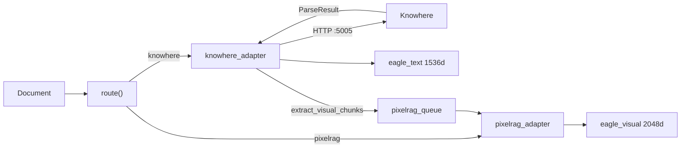
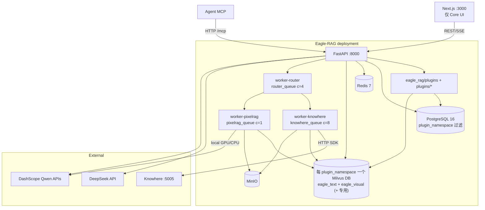
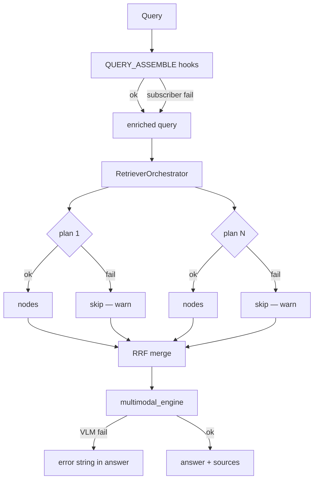

# 系统设计

Eagle-RAG 是面向 Agent 与 LLM 的行业无关、多模态 RAG **数据层**。**微内核**承载进程内行业插件；**两层隔离**将领域部署绑定（`plugin_namespace` = Milvus Database）与知识库租户（`kb_name` = 该 Database 内 Milvus 标量过滤）分开。五个设计原则贯穿各模块；本文说明各原则背后的理论、实际代码路径，以及设计张力、配置与故障行为。

完整插件契约、Hook 目录与部署模型见 [插件架构](plugin-architecture.md)。

---

## 理论与基础

### RAG 作为分层系统

[Gao 等，2023](https://arxiv.org/abs/2312.10997) 将 RAG 分解为：

| 层 | 功能 | Eagle-RAG 主要模块 |
| --- | --- | --- |
| **插件** | 领域分类 / 嵌入 / 路由 / 组装 | `eagle_rag/plugins/`、仓库内 `plugins/` |
| **索引** | 解析 → 分块 → 嵌入 → 存储 | `ingest/`、`index/`、`IngestOrchestrator`、Celery 任务 |
| **检索** | 查询嵌入 → ANN → 过滤 → 扩展 | `retrievers/`、`RetrieverOrchestrator`、`router_engine.py` |
| **生成** | 重排 → 提示 → LLM/VLM | `generation/multimodal_engine.py` |

[Lewis 等，2020](https://arxiv.org/abs/2005.11401) 确立检索条件化可降低知识密集型任务幻觉。Eagle-RAG 增加**多模态**索引（双向量空间）、**插件命名空间** Milvus Database 隔离与**多租户** `kb_name` 标量过滤（[Milvus 混合搜索](https://milvus.io/docs/multi-vector-search.md)）。

### ANN 索引选择

视觉向量（2048 维）在规模上可能超出内存：

| 算法 | 论文 | 复杂度 | Eagle-RAG 用法 |
| --- | --- | --- | --- |
| **HNSW** | [Malkov & Yashunin，2016](https://arxiv.org/abs/1603.09320) | O(log N) 搜索；图在内存 | 默认 `MILVUS_VISUAL_INDEX_TYPE=hnsw` |
| **DiskANN** | [Subramanya 等，NeurIPS 2019](https://papers.nips.cc/paper/2019/hash/09853c7ff1cb93b59a86b8e886786b9b-Abstract.html) | 磁盘驻留 Vamana 图 | `diskann` 用于十亿级视觉切片 |

HNSW 构建邻近图层次：上层粗导航，下层细搜索。参数 `M`（每节点邻居数）与 `efConstruction` 在构建时间/召回与搜索质量间权衡。

---

## 原则 1：懒初始化

### 为何

导入时连接会导致：

- 冷启动慢（Milvus、PostgreSQL、GPU 模型加载）
- 开发环境缺依赖时级联导入失败
- 单元测试脆弱，需完整基础设施

### 如何实现 — 代码走读

**设置单例（含 profile 叠加）：**

```python
# eagle_rag/config.py
@lru_cache(maxsize=1)
def get_settings() -> Settings:
    path_str = os.environ.get("EAGLE_RAG_SETTINGS_PATH", str(_DEFAULT_SETTINGS_PATH))
    data = _apply_profile(_load_yaml(Path(path_str)))  # EAGLE_RAG_PROFILE → profiles.<name>
    return Settings(**data)
```

`_apply_profile()` 在设置 `EAGLE_RAG_PROFILE`（或 YAML `active_profile`）时深度合并 `profiles.<name>`。环境变量 `EAGLE_RAG_PROFILE` 优先于 YAML。每进程加载一次；测试在用例间调用 `get_settings.cache_clear()`。

**Milvus 文本存储：**

`eagle_rag/index/milvus_text_store.py` 中 `get_text_vector_store()` / `get_text_index()` — 在首次检索或摄入 upsert 时构造 `MilvusVectorStore`，而非 `import eagle_rag` 时。

**Milvus 客户端池（按 Database）：**

```python
# eagle_rag/index/milvus_pool.py
class MilvusClientPool:
    def get(self, db_name: str | None = None, *, plugin_namespace: str | None = None) -> MilvusClient:
        if db_name is None:
            db_name = milvus_db_name(plugin_namespace)
        # ... 池化 MilvusClient(uri=..., db_name=db_name) — 不在请求间切换 DB
```

`MilvusClientPool` 在创建客户端时绑定 `db_name`（每个 Milvus Database 一个池化客户端）。`milvus_visual_store.py` 中遗留的模块级 `_client` 仍为向后兼容懒初始化；新路径使用 `get_milvus_pool()`。

**视觉编码器单例：**

`eagle_rag/ingest/visual_encoder.py` 中 `get_visual_encoder()` — `provider=pixelrag` 时首次 encode 加载本地 Qwen3-VL-Embedding-2B；`provider=dashscope` 时走百炼 API（无本地权重）。API 进程除非直接处理视觉任务，否则不占 GPU 内存。领域编码器（`pubmedbert`、`molformer`、`medimageinsight` BiomedCLIP/`open_clip`、`uni2`）在插件 `on_load` 时通过 `EncoderRegistry` 懒加载。

**FastAPI 应用：**

```python
# eagle_rag/api/app.py
settings = get_settings()  # 仅配置 — 不连 DB
app = FastAPI(..., lifespan=get_combined_lifespan(mcp_app))
```

`app` 创建后导入路由；导入时不连 Milvus。`PluginManager.load_all()` 在 lifespan 启动时运行。

### 权衡

| 优点 | 缺点 |
| --- | --- |
| 启动快；无 Docker 可测 | 首请求承担连接 + 模型加载延迟 |
| 缺依赖在使用点失败、错误清晰 | 配置变更需重启进程 |

---

## 原则 2：优雅降级

### 为何

RAG 依赖解析器、向量库、模型 API、worker 与可选领域插件。内网数据层在单点故障时不可全盘失败。

### 降级矩阵

| 故障 | 代码位置 | 行为 |
| --- | --- | --- |
| Knowhere SDK 不可达 | `parse_with_knowhere_sdk()` | `KnowhereError` → 任务 `FAILED`；**无 mock 解析** |
| 未知视觉嵌入 provider | `visual_encoder.get_visual_encoder()` | `ValueError`；无随机向量 |
| 百炼视觉嵌入缺密钥 / API 错误 | `DashScopeQwen3VLEncoder` | 快速失败 `ValueError` / `RuntimeError`；无空向量 |
| VLM API 密钥缺失 | `multimodal_engine.py` | 响应中错误字符串；无未处理 500 |
| 摄入时 Milvus 写入失败 | `upsert_text_nodes` / `upsert_visual` | 可能记录日志并继续（摄入可用性） |
| 标签解析失败 | `_resolve_scope_filter()` | 记录警告；忽略标签维度 |
| 视觉派发失败 | `dispatch_visual_chunks()` | 记录错误；`knowhere_parse` 仍 `SUCCESS` |
| 关键词目录写入失败 | `knowhere_parse` 步骤 5.2 | 非阻塞警告 |
| `doc_nav` 持久化失败 | `knowhere_parse` 步骤 5.7 | 非阻塞警告 |
| 文本检索器异常 | `_fetch_nodes()` | `logger.warning`；跳过文本模态 |
| 视觉检索器异常 | `_fetch_nodes()` | `logger.warning`；跳过视觉模态 |
| `QUERY_ASSEMBLE` Hook 订阅者失败 | `hookbus.invoke_all()` | 记录警告；跳过失败插件提示；继续查询 |
| 专用集合检索计划失败 | `RetrieverOrchestrator.retrieve()` | 记录警告；跳过该计划；对其余命中 RRF 合并（尽力而为） |
| 请求中 `plugin_namespace` 错误 | `api/deps.py`、`db/namespace.py` | HTTP **403**（除非 `plugins.allow_namespace_override`） |
| 领域编码器加载/编码失败 | `plugins/*/encoders.py`、`encoder_runtime` | 受影响块/计划抛出 `EncoderLoadError`；无 OpenAI/Cohere 回退 |
| Redis 宕机影响 SSE 日志 | notifications 路由 | 内存 `asyncio.Queue` + 5 秒心跳 |
| MCP 工具异常 | `mcp_server.py` 中 `resilient_call()` | `{"error": ...}` 不破坏会话 |

### 健康探测语义

`GET /health` — 每依赖在独立 `try/except` 中约 3 秒超时探测：

- **`up`** — 探测成功
- **`down`** — 已探测且失败
- **`unknown`** — 未配置（如视觉提供方未激活时的 PixelRAG）

`GET /health/plugins` — 已加载插件清单、Celery 任务模块与命名空间绑定（worker 一致性探测）。

区分*误配置*与*故障*。

---

## 原则 3：同步 + 异步双路 DB 访问

### 为何

FastAPI 处理器为**异步**；Celery worker 为**同步**。仅异步 ORM 会迫使 worker 使用 `asyncio.run()` 或在 API 中阻塞事件循环。

### 如何实现

`eagle_rag/db/repositories/` 中 repository 提供成对 API，并通过 `instance_namespace()` **强制 `plugin_namespace`**：

| 模式 | 异步（API） | 同步（Celery） |
| --- | --- | --- |
| KB 存在 | `kb_exists()` | `kb_exists_sync()` |
| 文档注册 | `register_document()` | `register_document_sync()` |
| 去重检查 | `check_duplicate()` | `check_duplicate_sync()` |

`eagle_rag/db/namespace.py` 从 `settings.plugins.default_namespace` 解析实例绑定命名空间，并拒绝显式不匹配（生产环境 403）。

JSONB 列：写入时 `json.dumps` + `::jsonb`；读取时对遗留字符串值防御性 `_loads`。

连接池：`POSTGRES_DSN` 分离异步（`asyncpg`）与同步（`psycopg`）引擎。

### 权衡

重复 repository 方法增加维护，但避免 worker/事件循环耦合 — FastAPI + Celery 代码库的常见模式。

---

## 原则 4：适配器模式

### 为何

Knowhere（HTTP → `ParseResult`）与 PixelRAG（渲染 → 切片）产出不同原生格式。检索与生成须看到统一的 **LlamaIndex** `TextNode` / `ImageNode` 及一致元数据（`kb_name`、`document_id`、`path`）。

### 适配器流



**`knowhere_adapter.py` 关键函数：**

| 函数 | 输出 |
| --- | --- |
| `parse_with_knowhere_sdk()` | `ParseResult` |
| `chunks_to_text_nodes()` | 含 `connect_to`、`path` 的 `list[TextNode]` |
| `sections_to_text_nodes()` | `type="section_summary"` 节点 |
| `extract_visual_chunks()` | 视觉派发描述符 |
| `knowhere_parse` | Celery 任务 — 完整管线 |

**`pixelrag_adapter.py` 关键函数：**

| 函数 | 输出 |
| --- | --- |
| `pixelrag_build` | 完整视觉文档摄入 |
| `knowhere_visual_chunks` | Knowhere 图/表 → 切片 → 向量 |
| `get_visual_encoder().embed_*()` | 2048 维 L2 归一化向量 |

!!! note "单 Knowhere 文档 → 双索引"
    `knowhere_parse` 后，文本块与章节摘要进入 `eagle_text`。图/表块派发到 `pixelrag_queue` 上 `knowhere_visual_chunks`，四个锚定字段写入 `eagle_visual`。领域插件可通过 `IngestOrchestrator` 增加专用集合。见 [多模态融合](multimodal-fusion.md)。

---

## 原则 5：微内核 + 插件

### 为何

行业特定召回（生物医学编码器、湖仓元数据、实体扩展）须在不动平台主干、不重新硬编码金融领域的前提下扩展 Core。

### 如何实现

| 组件 | 角色 |
| --- | --- |
| `PluginManager` | 从 `settings.plugins.enabled` 加载（仓库内模块）；`core_defaults` 始终最先 |
| `HookBus` | `invoke_first` / `invoke_all` / `invoke_transform`，带命名空间过滤 |
| 热路径 Hook | `PARSE` / `CHUNK` / `QUERY_ASSEMBLE`，经 `hotpath_hooks.py` |
| `IngestOrchestrator` | 每块 `CLASSIFY_*` → `EMBED_*` → `UPSERT_VECTORS` |
| `RetrieverOrchestrator` | 多集合 ANN 计划 → 每计划重排 → RRF 合并（`rerank_fusion.py`） |
| `EncoderRegistry` | 插件 `on_load` 时注册领域编码器 |
| `mcp_registry` | `@register_mcp_tool`，带 RAG-only 命名守卫 |

**单域部署：** 每进程绑定一个 `settings.plugins.default_namespace`（= Milvus Database + PG 过滤）。跨行业检索靠**多实例**，而非运行时切换领域（[ADR-002](adr/002-single-domain-deployment.md)）。

**G4 路由规则：** Core 默认从不自动查询专用集合；仅领域 `QueryRouteClassifier` 或 scope 感知目录并集可加入。

**界面对应：**

| 界面 | 范围 |
| --- | --- |
| 内置 Next.js UI | **仅 Core** — Knowhere + PixelRAG 混合 |
| 领域插件（biomed **实验性**、lakehouse-bi **开发中** 等） | **仅后端 + MCP** — 本仓库无领域 UI |

完整 Hook 目录、清单字段与编写指南：[插件架构](plugin-architecture.md) · [ADR-008](adr/008-rag-only-plugin-platform.md)。

---

## C4 容器视图



部署层次：基础设施 → Knowhere 子栈 → 应用。详见 [ops/docker](../ops/docker.md)。

---

## 模型栈（Core：DeepSeek + Qwen）

| 角色 | 模型 | 维度 | 配置路径 |
| --- | --- | --- | --- |
| LLM / 路由 | DeepSeek-V4-Pro | — | `settings.llm` |
| VLM 生成 | Qwen-VL-Max | — | `settings.vlm` |
| 文本嵌入 | `text-embedding-v4` | 1536 | `settings.embedding.text` |
| 视觉嵌入 | 本地 Qwen3-VL-Embedding-2B 或百炼 `qwen3-vl-embedding` | 2048 | `settings.embedding.visual` |
| 重排 | `qwen3-rerank` | — | `settings.rerank.text` |

**仅 Core** — 无 OpenAI / Cohere 适配器。新 Core 模型经 LlamaIndex 集成包接入。

**领域插件**可通过 `EncoderRegistry` 注册额外编码器（如 `plugins/biomed` 中 `pubmedbert` 768 维、`molformer` 768 维、`medimageinsight` BiomedCLIP/`open_clip` 1024 维、`uni2` 1536 维）。医学影像编码器从不回退到 Qwen3-VL；加载失败抛出 `EncoderLoadError`，除非显式启用测试用确定性模式。

**路由 LLM：** `router.llm.enabled=true` 时 `route_query()` 用 DeepSeek 与 `router.llm.prompt_template`。启发式回退：YAML 中 `router.heuristic.rules`。领域插件可提供 `QueryRouteClassifier` 以规划专用集合检索。

---

## MCP 集成架构

FastMCP 挂载于 FastAPI `/mcp`：

```python
# eagle_rag/api/app.py — 模式
mcp_app = build_mcp_app()
app = FastAPI(..., lifespan=get_combined_lifespan(mcp_app))
app.mount(settings.mcp.streamable_http_path, mcp_app)
```

`get_combined_lifespan` 链接：

1. 应用启动（DB 池、`PluginManager.load_all()`、遥测）
2. `StreamableHTTPSessionManager` 任务组 — 防止 MCP 请求时「Task group is not initialized」

**暴露工具（G3）：** Core 工具 `core_ingest`、`core_query`、`core_retrieve_text`、`core_retrieve_visual`，以及仅来自 `default_namespace` 插件的 `{namespace}_*` 工具。名称经 `eagle_rag/plugins/mcp_registry.py`（`@register_mcp_tool`）注册；裸 `ingest` / `query` 名称被拒绝（RAG-only 平台边界）。

`resilient_call()` 包装工具执行：超时、熔断（`circuit_fail_threshold`）、可选 Redis 缓存（`cache_ttl`）。

---

## 配置

| 设置 | 设计影响 |
| --- | --- |
| `EAGLE_RAG_PROFILE` | 叠加 `settings.yaml` 中 `profiles.<name>`（插件、`default_namespace`、编码器） |
| `get_settings()` 缓存 | profile / `.env` 变更后重启 |
| `plugins.default_namespace` | 本实例的 Milvus Database + PG repository 过滤 |
| `plugins.options[<namespace>]` | 经 `plugin_options()` 的每插件旋钮 — 非 Core 类型化行业设置 |
| `milvus.visual_index_type` | HNSW vs DiskANN |
| `embedding.visual.provider` | `pixelrag`（本地 HF）或 `dashscope`（百炼）；ingest+query 须同 provider；切换需重建 `eagle_visual` |
| `router.llm.enabled` | LLM vs 启发式查询路由 |
| `celery.queues.pixelrag_queue.concurrency` | 须为 1 — 防 OOM |
| `mcp.standalone` | 独立 uvicorn `:8081` vs API 挂载 |
| `telemetry.tracing_enabled` | OpenTelemetry 导出 |

完整参考：[配置](../getting-started/configuration.md)。

---

## 故障模式与运维

### 启动失败

| 症状 | 原因 | 动作 |
| --- | --- | --- |
| API 启动崩溃 | 未知 `EAGLE_RAG_PROFILE` | 使用 `core`、`biomed` 或 `lakehouse-bi`；检查 YAML `profiles:` |
| API 启动，首次查询 Milvus 错 | 懒初始化 — Milvus 未就绪 | 等待 Milvus 健康；确认 `default_namespace` Database 存在 |
| 首次 MCP 工具调用 500 | 生命周期未初始化 | 确保使用 `get_combined_lifespan` |
| Worker 导入 PixelRAG 错 | 缺 GPU 驱动/包 | 检查 `pixelrag` 安装；用 CPU `embed_device` |
| 启动时插件加载错误 | `enabled` 插件 ≠ `default_namespace`（G3） | 对齐 profile 中 `plugins.enabled` 与 `default_namespace` |

### 运行时降级路径



### 运维清单

- [ ] 部署前确认 `EAGLE_RAG_PROFILE` 与目标领域一致
- [ ] 检查 `/health/plugins` — 已加载命名空间、清单、Celery 模块与 worker 一致
- [ ] 验证 Milvus 重启后懒单例未持有陈旧连接
- [ ] `settings.yaml` 变更后重启 worker（`get_settings` 已缓存）
- [ ] 监控 `/health` — 区分 `unknown` 与 `down`
- [ ] 保持 `pixelrag_queue` 并发为 1

---

## 设计张力摘要

| 张力 | 位置 | 调参 |
| --- | --- | --- |
| 冷启动 vs 快速导入 | `get_settings()`、`get_text_index()`、`get_visual_encoder()`、领域编码器 | 部署后首条查询承担连接 + 模型/API 准备；用冒烟检索预热 worker |
| 每进程配置不可变 | settings 上 `@lru_cache` | `settings.yaml` / `.env` / profile 变更后重启 API + worker |
| 降级 vs 静默错误答案 | 检索器 `[]`、VLM `None`、跳过的 RRF 计划 | 生成中优先显式错误字符串，而非无上下文幻觉 |
| 适配器规范化成本 | Knowhere `ParseResult` → 多个 `TextNode` | 大文档 = 嵌入 API 费用随块数线性增长 |
| 索引写入严格度 | 文本 upsert 失败时 `knowhere_parse` 失败 | 视觉路径仍尽力而为 — 不对称为有意设计 |
| 单域 vs 多集合 | 单 Milvus DB 内 `RetrieverOrchestrator` | 专用计划尽力而为；Core 从不自动扇出到领域集合 |

---

## 参考文献

- [Lewis 等，2020](https://arxiv.org/abs/2005.11401)
- [Gao 等，2023](https://arxiv.org/abs/2312.10997)
- [HNSW](https://arxiv.org/abs/1603.09320)
- [DiskANN](https://papers.nips.cc/paper/2019/hash/09853c7ff1cb93b59a86b8e886786b9b-Abstract.html)
- [Milvus 文档](https://milvus.io/docs)
- [LlamaIndex](https://docs.llamaindex.ai/)
- [MCP 规范](https://modelcontextprotocol.io/)
- [插件架构](plugin-architecture.md) · [多租户](multi-tenancy.md)
- [ADR-001 Milvus 数据库隔离](adr/001-milvus-database-isolation.md) · [ADR-002 单域部署](adr/002-single-domain-deployment.md) · [ADR-008 纯 RAG 插件平台](adr/008-rag-only-plugin-platform.md)
- [数据流](data-flow.md) · [可靠性](reliability.md) · [多模态融合](multimodal-fusion.md)
