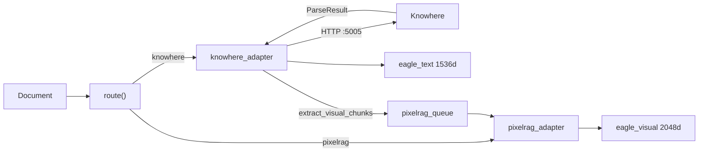
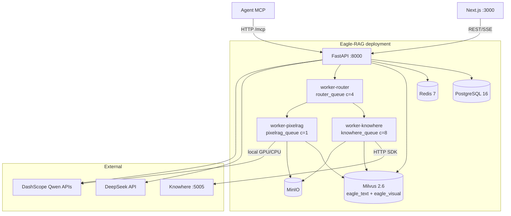
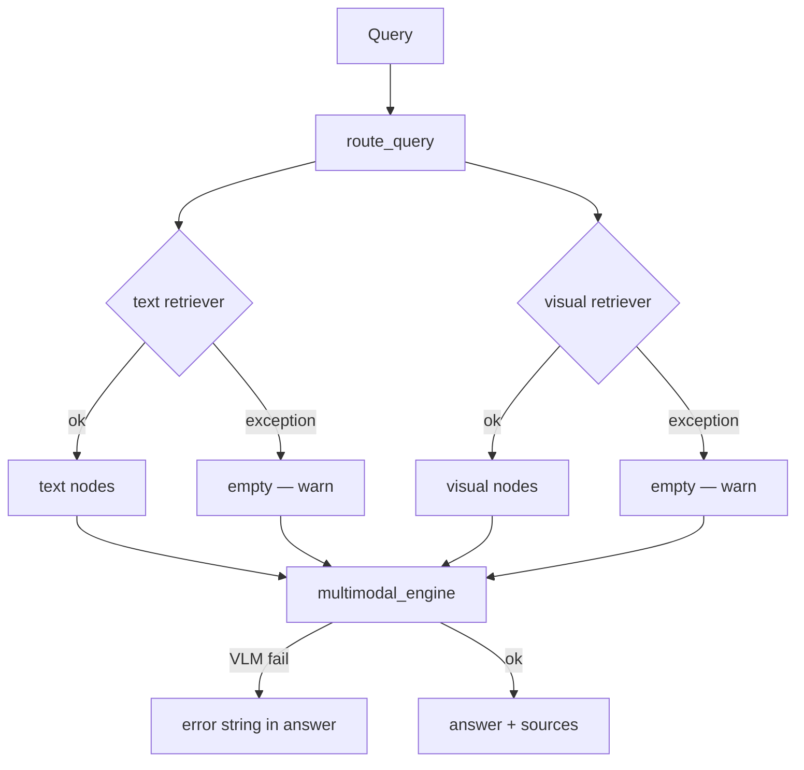

# 系统设计

Eagle-RAG 是行业无关、多租户多模态 RAG 知识库。四个设计原则贯穿各模块；本文说明各原则背后的理论、实际代码路径，以及设计张力、配置与故障行为。

---

## 理论与基础

### RAG 作为分层系统

[Gao 等，2023](https://arxiv.org/abs/2312.10997) 将 RAG 分解为：

| 层 | 功能 | Eagle-RAG 主要模块 |
| --- | --- | --- |
| **索引** | 解析 → 分块 → 嵌入 → 存储 | `ingest/`、`index/`、Celery 任务 |
| **检索** | 查询嵌入 → ANN → 过滤 → 扩展 | `retrievers/`、`router_engine.py` |
| **生成** | 重排 → 提示 → LLM/VLM | `generation/multimodal_engine.py` |

[Lewis 等，2020](https://arxiv.org/abs/2005.11401) 确立检索条件化可降低知识密集型任务幻觉。Eagle-RAG 增加**多模态**索引（双向量空间）与**多租户**标量过滤（[Milvus 混合搜索](https://milvus.io/docs/multi-vector-search.md)）。

### ANN 索引选择

视觉向量（2048 维）在规模上可能超出内存：

| 算法 | 论文 | 复杂度 | Eagle-RAG 用法 |
| --- | --- | --- | --- |
| **HNSW** | [Malkov & Yashunin，2016](https://arxiv.org/abs/1603.09320) | O(log N) 搜索；图在内存 | 默认 `MILVUS_VISUAL_INDEX_TYPE=hnsw` |
| **DiskANN** | [Subramanya 等，NeurIPS 2019](https://papers.nips.cc/paper/2019/hash/09853c7ff1cb93b59a86b8e886786b9b-Abstract.html) | 磁盘驻留 Vamana 图 | `diskann` 用于十亿级视觉切片 |

HNSW 构建邻近图层次：上层粗导航，下层细搜索。参数 `M`（每节点邻居数）与 `efConstruction` 在构建时间/召回与搜索质量间权衡。

---

## 原则 1：懒初始化

### 为何

导入时连接会导致：

- 冷启动慢（Milvus、PostgreSQL、GPU 模型加载）
- 开发环境缺依赖时级联导入失败
- 单元测试脆弱，需完整基础设施

### 如何实现 — 代码走读

**设置单例：**

```python
# eagle_rag/config.py
@lru_cache(maxsize=1)
def get_settings() -> Settings:
    path_str = os.environ.get("EAGLE_RAG_SETTINGS_PATH", str(_DEFAULT_SETTINGS_PATH))
    data = _load_yaml(Path(path_str))
    return Settings(**data)
```

每进程加载一次。测试在用例间调用 `get_settings.cache_clear()`。

**Milvus 文本存储：**

`eagle_rag/index/milvus_text_store.py` 中 `get_text_vector_store()` / `get_text_index()` — 在首次检索或摄入 upsert 时构造 `MilvusVectorStore`，而非 `import eagle_rag` 时。

**Milvus 视觉客户端：**

```python
# eagle_rag/index/milvus_visual_store.py
_client: MilvusClient | None = None

def get_visual_client() -> MilvusClient:
    global _client
    if _client is None:
        ensure_collection()  # 幂等创建 + load
    return _client
```

**视觉编码器单例：**

`eagle_rag/ingest/pixelrag_adapter.py` 中 `_Qwen3VLVisualEncoder` — 首次 `embed()` 时加载 Qwen3-VL-Embedding-2B。API 进程除非直接处理视觉任务，否则不占 GPU 内存。

**FastAPI 应用：**

```python
# eagle_rag/api/app.py
settings = get_settings()  # 仅配置 — 不连 DB
app = FastAPI(..., lifespan=get_combined_lifespan(mcp_app))
```

`app` 创建后导入路由；导入时不连 Milvus。

### 权衡

| 优点 | 缺点 |
| --- | --- |
| 启动快；无 Docker 可测 | 首请求承担连接 + 模型加载延迟 |
| 缺依赖在使用点失败、错误清晰 | 配置变更需重启进程 |

---

## 原则 2：优雅降级

### 为何

RAG 依赖解析器、向量库、模型 API 与 worker。内网数据层在单点故障时不可全盘失败。

### 降级矩阵

| 故障 | 代码位置 | 行为 |
| --- | --- | --- |
| Knowhere SDK 不可达 | `parse_with_knowhere_sdk()` | `KnowhereError` → 任务 `FAILED`；**无 mock 解析** |
| PixelRAG provider ≠ `pixelrag` | `pixelrag_adapter._ensure_loaded()` | `ValueError`；无随机向量 |
| VLM API 密钥缺失 | `multimodal_engine.py` | 响应中错误字符串；无未处理 500 |
| 摄入时 Milvus 写入失败 | `upsert_text_nodes` / `upsert_visual` | 可能记录日志并继续（摄入可用性） |
| 标签解析失败 | `_resolve_scope_filter()` | 记录警告；忽略标签维度 |
| 视觉派发失败 | `dispatch_visual_chunks()` | 记录错误；`knowhere_parse` 仍 `SUCCESS` |
| 关键词目录写入失败 | `knowhere_parse` 步骤 5.2 | 非阻塞警告 |
| `doc_nav` 持久化失败 | `knowhere_parse` 步骤 5.7 | 非阻塞警告 |
| 文本检索器异常 | `_fetch_nodes()` | `logger.warning`；跳过文本模态 |
| 视觉检索器异常 | `_fetch_nodes()` | `logger.warning`；跳过视觉模态 |
| Redis 宕机影响 SSE 日志 | notifications 路由 | 内存 `asyncio.Queue` + 5 秒心跳 |
| MCP 工具异常 | `mcp_server.py` 中 `resilient_call()` | `{"error": ...}` 不破坏会话 |

### 健康探测语义

`GET /health` — 每依赖在独立 `try/except` 中约 3 秒超时探测：

- **`up`** — 探测成功
- **`down`** — 已探测且失败
- **`unknown`** — 未配置（如视觉提供方未激活时的 PixelRAG）

区分*误配置*与* outage*。

---

## 原则 3：同步 + 异步双路 DB 访问

### 为何

FastAPI 处理器为**异步**；Celery worker 为**同步**。仅异步 ORM 会迫使 worker 使用 `asyncio.run()` 或在 API 中阻塞事件循环。

### 如何实现

`eagle_rag/db/stores/` 中 store 提供成对 API：

| 模式 | 异步（API） | 同步（Celery） |
| --- | --- | --- |
| KB 存在 | `kb_exists()` | `kb_exists_sync()` |
| 文档注册 | `register_document()` | `register_document_sync()` |
| 去重检查 | `check_duplicate()` | `check_duplicate_sync()` |

JSONB 列：写入时 `json.dumps` + `::jsonb`；读取时对遗留字符串值防御性 `_loads`。

连接池：`POSTGRES_DSN` 分离异步（`asyncpg`）与同步（`psycopg`）引擎。

### 权衡

重复 store 方法增加维护，但避免 worker/事件循环耦合 — FastAPI + Celery 代码库的常见模式。

---

## 原则 4：适配器模式

### 为何

Knowhere（HTTP → `ParseResult`）与 PixelRAG（渲染 → 切片）产出不同原生格式。检索与生成须看到统一的 **LlamaIndex** `TextNode` / `ImageNode` 及一致元数据（`kb_name`、`document_id`、`path`）。

### 适配器流



**`knowhere_adapter.py` 关键函数：**

| 函数 | 输出 |
| --- | --- |
| `parse_with_knowhere_sdk()` | `ParseResult` |
| `chunks_to_text_nodes()` | 含 `connect_to`、`path` 的 `list[TextNode]` |
| `sections_to_text_nodes()` | `type="section_summary"` 节点 |
| `extract_visual_chunks()` | 视觉派发描述符 |
| `knowhere_parse` | Celery 任务 — 完整管线 |

**`pixelrag_adapter.py` 关键函数：**

| 函数 | 输出 |
| --- | --- |
| `pixelrag_build` | 完整视觉文档摄入 |
| `knowhere_visual_chunks` | Knowhere 图/表 → 切片 → 向量 |
| `_Qwen3VLVisualEncoder.embed()` | 2048 维 L2 归一化向量 |

!!! note "单 Knowhere 文档 → 双索引"
    `knowhere_parse` 后，文本块与章节摘要进入 `eagle_text`。图/表块派发到 `pixelrag_queue` 上 `knowhere_visual_chunks`，四个锚定字段写入 `eagle_visual`。见 [多模态融合](multimodal-fusion.md)。

---

## C4 容器视图



部署层次：基础设施 → Knowhere 子栈 → 应用。详见 [ops/docker](../ops/docker.md)。

---

## 模型栈（仅 DeepSeek + Qwen）

| 角色 | 模型 | 维度 | 配置路径 |
| --- | --- | --- | --- |
| LLM / 路由 | DeepSeek-V4-Pro | — | `settings.llm` |
| VLM 生成 | Qwen-VL-Max | — | `settings.vlm` |
| 文本嵌入 | `text-embedding-v4` | 1536 | `settings.embedding.text` |
| 视觉嵌入 | Qwen3-VL-Embedding-2B | 2048 | `settings.embedding.visual` |
| 重排 | `qwen3-rerank` | — | `settings.rerank.text` |

无 OpenAI / Cohere 适配器。新模型经 LlamaIndex 集成包接入。

**路由 LLM：** `router.llm.enabled=true` 时 `route_query()` 用 DeepSeek 与 `router.llm.prompt_template`。启发式回退：YAML 中 `router.heuristic.rules`。

---

## MCP 集成架构

FastMCP 挂载于 FastAPI `/mcp`：

```python
# eagle_rag/api/app.py — 模式
mcp_app = build_mcp_app()
app = FastAPI(..., lifespan=get_combined_lifespan(mcp_app))
app.mount(settings.mcp.streamable_http_path, mcp_app)
```

`get_combined_lifespan` 链接：

1. 应用启动（DB 池、遥测）
2. `StreamableHTTPSessionManager` 任务组 — 防止 MCP 请求时「Task group is not initialized」

工具在 `eagle_rag/api/mcp_server.py` + `TOOL_DEFINITIONS` 注册：`ingest`、`query`、`retrieve_text`、`retrieve_visual`。

`resilient_call()` 包装工具执行：超时、熔断（`circuit_fail_threshold`）、可选 Redis 缓存（`cache_ttl`）。

---

## 配置

| 设置 | 设计影响 |
| --- | --- |
| `get_settings()` 缓存 | `.env` 变更后重启 |
| `milvus.visual_index_type` | HNSW vs DiskANN |
| `embedding.visual.provider` | 须为 `pixelrag` — 否则快速失败 |
| `router.llm.enabled` | LLM vs 启发式查询路由 |
| `celery.queues.pixelrag_queue.concurrency` | 须为 1 — 防 OOM |
| `mcp.standalone` | 独立 uvicorn `:8081` vs API 挂载 |
| `telemetry.tracing_enabled` | OpenTelemetry 导出 |

完整参考：[配置](../getting-started/configuration.md)。

---

## 故障模式与运维

### 启动失败

| 症状 | 原因 | 动作 |
| --- | --- | --- |
| API 启动，首次查询 Milvus 错 | 懒初始化 — Milvus 未就绪 | 等待 Milvus 健康 |
| 首次 MCP 工具调用 500 | 生命周期未初始化 | 确保使用 `get_combined_lifespan` |
| Worker 导入 PixelRAG 错 | 缺 GPU 驱动/包 | 检查 `pixelrag` 安装；用 CPU `embed_device` |

### 运行时降级路径



### 运维清单

- [ ] 验证 Milvus 重启后懒单例未持有陈旧连接
- [ ] `settings.yaml` 变更后重启 worker（`get_settings` 已缓存）
- [ ] 监控 `/health` — 区分 `unknown` 与 `down`
- [ ] 保持 `pixelrag_queue` 并发为 1

---

## 设计张力摘要

| 张力 | 位置 | 调参 |
| --- | --- | --- |
| 冷启动 vs 快速导入 | `get_settings()`、`get_text_index()`、`_Qwen3VLVisualEncoder` | 部署后首条查询承担连接 + 模型加载；用冒烟检索预热 worker |
| 每进程配置不可变 | settings 上 `@lru_cache` | `settings.yaml` / `.env` 变更后重启 API + worker |
| 降级 vs 静默错误答案 | 检索器 `[]`、VLM `None` | 生成中优先显式错误字符串，而非无上下文幻觉 |
| 适配器规范化成本 | Knowhere `ParseResult` → 多个 `TextNode` | 大文档 = 嵌入 API 费用随块数线性增长 |
| 索引写入严格度 | 文本 upsert 失败时 `knowhere_parse` 失败 | 视觉路径仍尽力而为 — 不对称为有意设计 |

---

## 参考文献

- [Lewis 等，2020](https://arxiv.org/abs/2005.11401)
- [Gao 等，2023](https://arxiv.org/abs/2312.10997)
- [HNSW](https://arxiv.org/abs/1603.09320)
- [DiskANN](https://papers.nips.cc/paper/2019/hash/09853c7ff1cb93b59a86b8e886786b9b-Abstract.html)
- [Milvus 文档](https://milvus.io/docs)
- [LlamaIndex](https://docs.llamaindex.ai/)
- [MCP 规范](https://modelcontextprotocol.io/)
- [数据流](data-flow.md) · [可靠性](reliability.md) · [多模态融合](multimodal-fusion.md)
