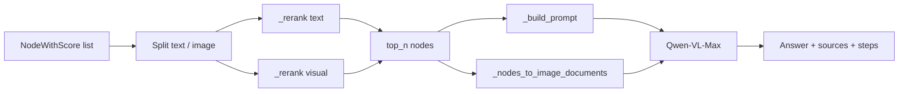

# 生成

生成引擎将检索到的 `NodeWithScore` 转为有依据、带引用的答案，经视觉-语言模型（VLM）完成。它实现 RAG 流水线最后阶段：**拆分 → 重排 → prompt → VLM 生成 → sources**。

**源码模块：** `eagle_rag/generation/multimodal_engine.py`

---

## 1. 理论背景

### 1.1 RAG 生成

检索后，LLM 接收检索段落作为上下文并据此生成答案（Lewis et al., *Retrieval-Augmented Generation for Knowledge-Intensive NLP Tasks*, arXiv:2005.11401）。Eagle-RAG 扩展为**多模态 RAG**：文本 chunk 与视觉 tile 图片一并送入 VLM（Qwen-VL-Max）。

### 1.2 双编码器召回 vs 交叉编码器重排

检索用双编码器（快、近似 top-K）。生成前用**交叉编码器重排**（Qwen `qwen3-rerank`，经 `DashScopeRerank`）联合打分 query-passage，在更小 K 上更高精度（Nogueira & Cho, arXiv:1901.04085）。

| 阶段 | 模型类型 | 速度 | 精度 |
|-------|-----------|-------|-----------|
| 召回（检索） | 双编码器 | 快 | 中等 |
| 重排（生成） | 交叉编码器 | 较慢 | 高 |
| 生成 | VLM | 最慢 | N/A |

视觉节点**尚无**重排器 —— 回退为按分数降序排序。

### 1.3 多模态 prompting

VLM 接收：

1. 结构化文本上下文（参考段落 + 附件文本 + 图片说明）。
2. 实际图片字节/URL 作为多模态输入。

遵循“图像即上下文”范式（Alayrac et al., *Flamingo*, arXiv:2204.14198；Qwen-VL 系列）。

### 1.4  grounding 与引用

Prompt 要求模型用 `[n]` 索引引用参考文本，描述图片时不捏造 URL —— 降低 grounded 生成中的幻觉（Shi et al., *REPLUG*, arXiv:2301.12652）。

### 1.5 父文档上下文

章节摘要（`type="section_summary"`）与细粒度 chunk 可能同时出现在重排结果中。Prompt 包含 `path` 元数据，便于 VLM 理解文档结构 —— 支持层级上下文（父文档检索模式）。

---

## 2. 流水线



---

## 3. 代码走读

### 3.1 EagleMultimodalQueryEngine

继承 LlamaIndex `CustomQueryEngine`。关键字段：

| 字段 | 默认 | 用途 |
|-------|---------|---------|
| `multi_modal_llm` | `_DashScopeVLM` | 经 DashScope SDK 的 Qwen-VL |
| `text_reranker` | `DashScopeRerank` | 交叉编码器文本重排 |
| `image_reranker` | `None` | 未接入视觉重排 |
| `top_n` | 3 | 重排后保留数 |

### 3.2 入口

**同步：** `custom_query(query_str, nodes, route_info, ...)`

**流式：** `stream_custom_query(...)` → 产出 SSE dict：

| 事件 | 数据 |
|-------|------|
| `step` | `{name: "rerank", text_top, visual_top, ...}` |
| `sources` | `{text: [...], image: [...]}` |
| `token` | `{delta: "..."}` |
| `done` | `{answer, sources, route, steps}` |

由 `EagleRouterQueryEngine.query()` / `query_stream()` 调用。

### 3.3 `_prepare_generation`

1. 拆分节点：非 ImageNode 的 `TextNode` vs `ImageNode`。
2. 各路径独立 `_rerank()`。
3. 检测语言（含 CJK 则 `zh`，否则 `en`）。
4. 分离 KB 文本与附件文本（`metadata.source == "attachment"`）。
5. `_build_prompt()` + `_nodes_to_image_documents()`。
6. 组装 `sources` 与 `steps` 追踪链。

### 3.4 `_rerank`（关键路径）

```python
def _rerank(nodes, reranker, query_str, top_n):
    if reranker is not None:
        processed = reranker.postprocess_nodes(nodes, query_str=query_str)
    else:
        processed = nodes
    processed = sorted(processed, key=lambda n: n.score or 0.0, reverse=True)
    return processed[:top_n]
```

- 使用 LlamaIndex `BaseNodePostprocessor.postprocess_nodes()` 接口。
- 重排器失败 → 回退原分数排序。
- 遥测：`ai_logger.info("rerank", stage="text"|"visual", kept=..., top=[...])`。
- OpenTelemetry span：`rerank`。

### 3.5 `_build_prompt`

结构化中文 prompt 模板：

```
你是多模态问答助手，请基于以下参考信息回答用户问题。

【参考文本】
[1] 路径: doc/Chapter 1
{chunk content}

【用户附件】
[1] 文件: upload.pdf
{attachment text}

【参考图片】
[1] image_id=..., 页码=..., 章节=..., 摘要=...

【用户问题】
{query}

图片已作为多模态输入提供。回答时勿使用 Markdown 图片语法...
请用中文/English回答。
```

图片说明携带融合锚定（`parent_section`, `content_summary`），便于语义定位而无需 VLM OCR。

### 3.6 VLM 调用

**`_DashScopeVLM`** 绕过已弃用且 ChatMessage 不兼容的 `llama-index-multi-modal-llms-dashscope`，直接调用 `dashscope.MultiModalConversation`：

```python
messages = [{
    "role": "user",
    "content": [
        {"image": "data:image/png;base64,..."},  # per ImageDocument
        {"text": prompt},
    ],
}]
```

**同步：** `complete(prompt, image_documents)` → `_VLMResponse(text=...)`

**流式：** `stream_complete(...)`，`incremental_output=True` → 产出 delta token。

失败：返回 `"生成失败：{error}"`，不抛错。

### 3.7 ImageDocument 解析（`_nodes_to_image_documents`）

每个视觉节点的优先级链：

1. `ImageDocument(image_path=...)` — MinIO 预签名 URL 或本地路径。
2. `ImageDocument(image_url=...)` — 回退。
3. `ImageDocument(image=get_image_bytes(image_id))` — URL 不可达时的字节回退。

不可读节点跳过（debug 日志）。

### 3.8 Source 映射

**文本 source**（`_text_source`）：

```json
{
  "type": "text|section_summary|table|...",
  "path": "doc/Chapter 1",
  "level": 2,
  "document_id": "...",
  "score": 0.87,
  "content": "...(capped at source_content_max_chars)...",
  "summary": "...",
  "keywords": ["..."],
  "page_nums": [1, 2],
  "kb_name": "finance",
  "source_type": "policy"
}
```

**图片 source**（`_image_source`）：

```json
{
  "type": "image",
  "image_id": "...",
  "image_path": "minio://...",
  "page": 3,
  "position": "strip_2",
  "chunk_type": "tile|image|table",
  "parent_section": "doc/Financial Statements",
  "content_summary": "Balance sheet table",
  "source_chunk_id": "chunk_abc",
  "score": 0.75
}
```

### 3.9 Steps 追踪

完整链暴露给前端：

```
route → recall → [attach_parse] → rerank → generate
```

每步携带诊断元数据，供查询检查器 UI 使用。

---

## 4. Milvus schema（生成只读）

生成不直接查 Milvus —— 消费预检索节点。理解元数据字段有助于调试 source 映射：

| 元数据字段 | 出现在文本 source | 出现在图片 source |
|---------------|----------------------|------------------------|
| `path` | ✓ | — |
| `document_id` | ✓ | ✓ |
| `kb_name` | ✓ | ✓ |
| `chunk_type` | — | ✓ |
| `parent_section` | — | ✓ |
| `content_summary` | — | ✓（亦在 prompt 说明中） |

---

## 5. LlamaIndex 集成

| LlamaIndex 组件 | Eagle-RAG 用法 |
|---------------------|-----------------|
| `CustomQueryEngine` | `EagleMultimodalQueryEngine` 基类 |
| `NodeWithScore` | 来自 router/检索器 |
| `TextNode` / `ImageNode` | 重排前拆分 |
| `ImageDocument` | VLM 多模态输入 |
| `DashScopeRerank` | `llama_index.postprocessor.dashscope_rerank` |
| `BaseNodePostprocessor` | 经 `postprocess_nodes()` 的重排接口 |

VLM **未**用 LlamaIndex 包装 —— 原生 DashScope SDK，兼容 llama-index-core ≥ 0.12。

---

## 6. 设计张力与调参

| 张力 | 代码路径 | 后果 | 调节 |
| --- | --- | --- | --- |
| **召回–重排–生成漏斗** | `top_k`（router）→ `_rerank` → `top_n`（默认 3） | `top_k=20, top_n=3` 对 17 条丢弃段落仍跑 DashScope rerank；`top_k=3, top_n=3` 重排器只见弱 ANN 尾部 | 漏事实时提高 `top_k`；为延迟保持 `top_n` 较低 |
| **非对称重排覆盖** | `_rerank`：文本用 `DashScopeRerank`；视觉 `image_reranker=None` | 视觉证据仅按 ANN 分数排序 —— 高 IP ≠ 最适合问题的图 | 手动压低视觉 `top_k`；未来视觉 reranker 接此处 |
| **重排失败模式** | `postprocess_nodes` except → 按原 ANN 分数排序 | 交叉编码器故障静默回退双编码器顺序 | 对无成功 `latency_ms` 模式的 `rerank` 遥测告警 |
| **VLM 上下文预算** | `_build_prompt` + `_nodes_to_image_documents` | 每张图 tile 占 vision token；`top_n` 文本 + N 图可超 Qwen-VL 上下文 | 先降 `top_n` 或视觉 `top_k`，再截 prompt 文本 |
| **证据截断不对称** | `_text_source` 用 `source_content_max_chars` 给 API 响应 | prompt 可能比返回的 `sources` 含更全 chunk —— UI 少于模型所见 | 为证据面板提高 `router.source_content_max_chars`，非为模型 |
| **附件优先** | Router 以 score 1.0 前置附件节点 | 附件必进 rerank 池 —— `top_n` 小时可挤掉 KB 命中 | 有 `attachments[]` 时增大 `top_n` |
| **语言模板分叉** | `_detect_language` + `_CJK_PATTERN` | 中英混排查询只选一种模板；引用格式不同 | UI 语言 ≠ 查询语言时在 API 显式传 `language` |
| **流式 vs 同步错误面** | `_invoke_vlm_stream` 产出 token；中途 error | 客户端可能在 `error` 事件前已渲染部分答案 | 前端应等 `done` 事件再定稿引用 |

**交叉编码器理论（为何 `top_n` 要小）：** Nogueira & Cho（arXiv:1901.04085）—— rerank 时联合 query–passage 编码为 O(pairs)；Eagle-RAG 生产配置有意保持 `top_n` ≤ 5。

---

## 7. 配置与调优

```yaml
vlm:
  model: qwen3.6-flash          # Qwen-VL-Max family
  api_key: ${VLM_API_KEY}

rerank:
  text:
    model: qwen3-rerank         # qwen3-rerank
    api_key: ${DASHSCOPE_API_KEY}

router:
  source_content_max_chars: 4000  # caps source payload in response
```

**查询时参数：**

| 参数 | 默认 | 效果 |
|-----------|---------|--------|
| `top_k`（检索） | 5 | 近似最近邻召回宽度 |
| `top_n`（生成） | 3 | 重排后上下文大小 |

**调优指南：**

| 目标 | 动作 |
|------|--------|
| 答案上下文更多 | 增大 `top_n`（注意 VLM token 上限） |
| 精度更好 | 检索增大 `top_k`，保持 `top_n` 较小 |
| 生成更快 | 禁用重排器（回退分数排序） |
| API 响应更小 | 降低 `source_content_max_chars` |
| 英文答案 | 用英文提问（自动检测） |

---

## 8. 测试

**主测：** `tests/test_router_generation.py`

| 契约 | 验证 |
|----------|-------------|
| 文本重排 | Mock `DashScopeRerank.postprocess_nodes` 重排节点 |
| 重排回退 | 重排器异常 → 按分数降序 |
| Prompt 组装 | 参考文本、附件、图片说明齐全 |
| VLM 调用 | Mock `complete()` 收到 prompt + image_documents |
| 流式 token | `stream_complete` 产出增量 delta |
| Source 映射 | 图片 source 含融合锚定 |
| 语言检测 | CJK 查询 → 中文指令 |
| 失败消息 | VLM None → "生成失败：未配置多模态大模型" |

---

## 9. 流式 SSE 集成

`EagleRouterQueryEngine.query_stream()` 包装生成事件：

```
session → step(route) → step(recall) → step(attach_parse?) → step(rerank) → sources → token* → done
```

前端经 `POST /query/stream` 消费（见 [api-layer](api-layer.md)）。

---

## 10. 错误处理哲学

| 失败 | 行为 |
|---------|----------|
| 重排器不可用 | 分数排序（优雅） |
| VLM 不可用 | 答案中为失败消息 |
| VLM API 错误 | 返回 `"生成失败：{error}"` |
| 图片加载失败 | 跳过图片，继续文本 |
| 流式为空 | 回退同步 `complete()` |

生成不向 API 层抛错 —— 错误嵌入响应。

---

## 11. 参考文献

- Lewis et al., *Retrieval-Augmented Generation for Knowledge-Intensive NLP*, [arXiv:2005.11401](https://arxiv.org/abs/2005.11401)
- Nogueira & Cho, *Passage Re-ranking with BERT*, [arXiv:1901.04085](https://arxiv.org/abs/1901.04085)
- Reimers & Gurevych, *Sentence-BERT*, [arXiv:1908.10084](https://arxiv.org/abs/1908.10084)
- Alayrac et al., *Flamingo*, [arXiv:2204.14198](https://arxiv.org/abs/2204.14198)
- Shi et al., *REPLUG*, [arXiv:2301.12652](https://arxiv.org/abs/2301.12652)
- Gao et al., *RAG Survey*, [arXiv:2312.10997](https://arxiv.org/abs/2312.10997)
- DashScope multimodal API: [help.aliyun.com/document_detail/2712576.html](https://help.aliyun.com/document_detail/2712576.html)
- LlamaIndex CustomQueryEngine: [docs.llamaindex.ai/module_guides/deploying/query_engine](https://docs.llamaindex.ai/en/stable/module_guides/deploying/query_engine/)
- LlamaIndex DashScopeRerank: [docs.llamaindex.ai/en/stable/examples/node_postprocessor/DashScopeRerank](https://docs.llamaindex.ai/en/stable/examples/node_postprocessor/DashScopeRerank/)
