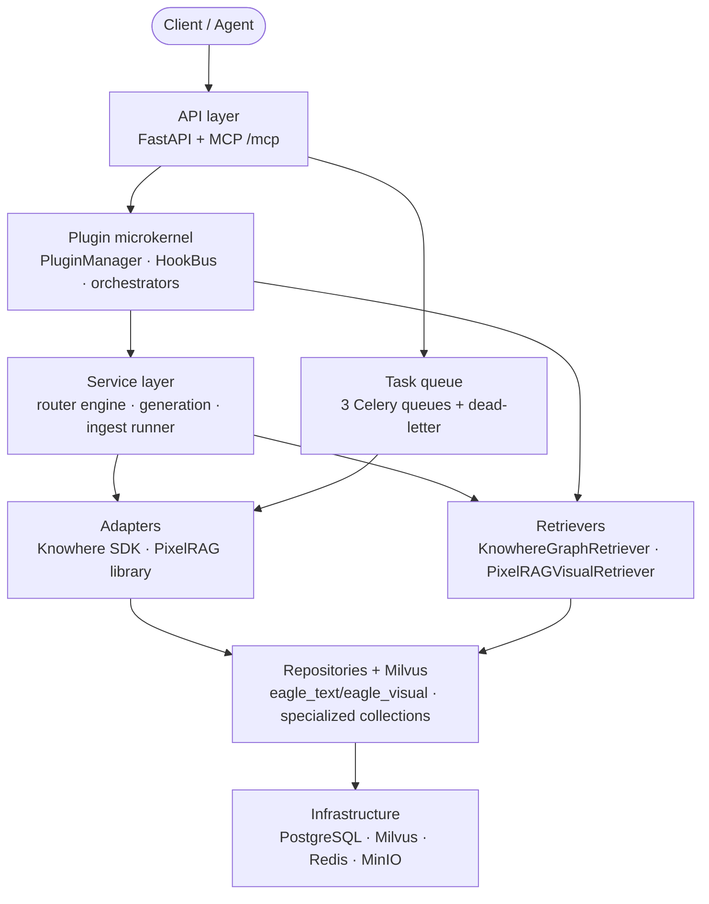

# 后端

Eagle-RAG 后端是一个**行业无关、多租户的多模态 RAG 数据层**，面向 Agent 与 LLM。它组合了 [FastAPI](https://fastapi.tiangolo.com/)（HTTP API）、[Celery](https://docs.celeryq.dev/)（异步摄取）、[LlamaIndex](https://docs.llamaindex.ai/)（检索编排）、[Milvus](https://milvus.io/docs)（按域隔离的向量数据库）、PostgreSQL（元数据/审计），以及进程内 **插件微内核**（`eagle_rag/plugins/`）。部署时的 `plugin_namespace` 绑定 Milvus Database 与 PostgreSQL 仓储过滤；请求时的 `kb_name` 在该域内隔离知识库。参见[插件架构](../architecture/plugin-architecture.md)。

应用入口：`eagle_rag/api/app.py`。REST 无鉴权中间件（内网）。Schema 迁移：`task db:migrate`。

---

## 什么是 RAG 后端？

检索增强生成（RAG）用外部知识增强 LLM。Eagle-RAG 实现四项职责：

| 职责 | 模块 | 关键论文 |
|---------------|--------|-----------|
| **摄取** — 解析、分块、嵌入、索引 | `eagle_rag/ingest/` + Celery | Karpukhin 等，DPR（[arXiv:2004.04906](https://arxiv.org/abs/2004.04906)） |
| **检索** — ANN + 图扩展 + 跨模态 | `eagle_rag/retrievers/` | G-Retriever（[arXiv:2402.07629](https://arxiv.org/abs/2402.07629)），CLIP（[arXiv:2103.00020](https://arxiv.org/abs/2103.00020)） |
| **路由** — 文本 / 视觉 / 混合选择 | `eagle_rag/router/` | Self-RAG（[arXiv:2310.11511](https://arxiv.org/abs/2310.11511)） |
| **生成** — 重排 + VLM + 带引用回答 | `eagle_rag/generation/` | Lewis 等，RAG（[arXiv:2005.11401](https://arxiv.org/abs/2005.11401)），交叉编码器重排（[arXiv:1901.04085](https://arxiv.org/abs/1901.04085)） |

Eagle-RAG 在文本 RAG 之上扩展了**双管线**架构：通过 [Knowhere](https://github.com/Ontos-AI/knowhere) 做结构化解析，通过 PixelRAG（`pixelrag_render` + Qwen3-VL 嵌入）做视觉瓦片编码。两者写入不同 Milvus collection，在检索时通过视觉瓦片上的四个锚点字段融合。

---

## 分层架构



两条横切流程：

1. **摄取** — 文档入 → 向量出（API → Celery → 适配器 → Milvus）。
2. **查询** — 问题入 → 带引用回答出（API → 路由 → 检索 → 重排 → VLM）。

序列图见[架构/数据流](../architecture/data-flow.md)。

---

## 双数据库驱动策略

| 驱动 | 占位符 | 使用者 |
|--------|------------|---------|
| **asyncpg**（异步） | `$1`, `$2` | FastAPI 处理器 |
| **psycopg2**（同步） | `%s` | Celery 任务、同步 store |

Celery worker 无法共享 asyncpg 连接池。Alembic 在 `alembic/env.py` 中规范化 DSN。

---

## Milvus collection 与域隔离

每个部署实例通过 `MilvusClientPool`（`eagle_rag/index/milvus_pool.py`）绑定一个 Milvus **Database** — `db_name` 在客户端构造时设定，不按请求切换。每个域 Database 中的基础 collection：

| Collection | Dim | Metric | Index | 嵌入模型 |
|------------|-----|--------|-------|------------|
| `eagle_text` | 1536 | COSINE | HNSW（LlamaIndex） | Qwen text-embedding-v4 |
| `eagle_visual` | 2048 | IP | HNSW M=16, efConstruction=256 | Qwen3-VL-Embedding-2B |

域插件可添加**专用 collection**（如 `eagle_text_biomed`）。Core 默认路由永不自动查询这些 collection（G4）；仅域 `QueryRouteClassifier` 或 scope 感知的 catalog 并集可加入它们。

域内 KB 隔离：每次查询使用 `kb_name == "{tenant}"`。Scope 并集：`(kb_name in [...] or document_id in [...])`。跨域检索使用多实例，而非 Core 跨 Milvus Database 扇出。

---

## LlamaIndex 集成映射

| LlamaIndex 类型 | Eagle-RAG 角色 |
|----------------|---------------|
| `TextNode` | Knowhere 分块 + 章节摘要 |
| `ImageNode` | 视觉检索命中 |
| `VectorStoreIndex` | 对 `eagle_text` 的文本 ANN |
| `MilvusVectorStore` | LlamaIndex ↔ Milvus 文本桥接 |
| `BaseRetriever` | KnowhereGraphRetriever、PixelRAGVisualRetriever |
| `CustomQueryEngine` | EagleMultimodalQueryEngine |
| `DashScopeRerank` | 交叉编码器文本重排 |
| `MetadataFilters` | kb_name / scope / 分面 → Milvus expr |

视觉向量绕过 LlamaIndex vector store（由 pymilvus 直接管理）。

---

## 文档索引

每页包含理论背景、代码走读、**设计张力与调优**（与代码路径绑定的参数级权衡）、Milvus schema/expr、LlamaIndex 映射、配置键、测试与参考文献。

### 横切张力（延伸阅读）

| 症状 | 从这里开始 |
| --- | --- |
| 回答中缺少分块 | [retrieval](retrieval.md) §8、[vector-stores](vector-stores.md) §8（`ef`、过滤器） |
| 引用弱或噪声大 | [generation](generation.md) §6（`top_k`/`top_n`、视觉重排缺口） |
| 管线/解析器选错 | [ingest-pipeline](ingest-pipeline.md) §6、[router-engine](router-engine.md) §7 |
| 摄取卡住 / 瓦片重复 | [task-queue](task-queue.md) §9（acks、DLQ） |
| 租户或 scope 泄漏 | [retrieval](retrieval.md) §8、[kb-management](kb-management.md) §8 |
| 插件 / namespace 不匹配 | [database](database.md) §3、[插件架构](../architecture/plugin-architecture.md) |

| 页面 | 行数 | 范围 |
|------|-------|-------|
| [api-layer](api-layer.md) | 200+ | FastAPI 应用、路由、SSE、查询引擎单例 |
| [ingest-pipeline](ingest-pipeline.md) | 400+ | runner、router、Knowhere/PixelRAG 适配器、Celery 任务 |
| [retrieval](retrieval.md) | 400+ | KnowhereGraphRetriever、PixelRAGVisualRetriever、过滤器 |
| [vector-stores](vector-stores.md) | 400+ | eagle_text + eagle_visual schema、索引参数、registry |
| [router-engine](router-engine.md) | 350+ | route_query 选择器、EagleRouterQueryEngine |
| [generation](generation.md) | 350+ | 拆分、重排、提示词、VLM 流式 |
| [task-queue](task-queue.md) | 300+ | Celery 配置、with_retry、死信 |
| [storage](storage.md) | 200+ | MinIO、去重、附件、图像 store |
| [database](database.md) | 250+ | SQLModel 表、Alembic、ER 图 |
| [kb-management](kb-management.md) | 200+ | KB registry、生命周期、统计、健康 |
| [admin-module](admin-module.md) | 200+ | MCP 日志、队列指标、配置快照 |
| [sessions-notifications](sessions-notifications.md) | 200+ | 聊天会话、scope 持久化、通知 |
| [mcp-server](mcp-server.md) | 250+ | Core MCP 工具（`core_*`）、插件注册、HTTP/stdio、韧性 |
| [schemas](schemas.md) | 250+ | Pydantic v2 请求/响应契约 |

---

## 横切关注点

在架构章节中记录：

- **[插件架构](../architecture/plugin-architecture.md)** — 微内核、钩子、编排器、MCP G3 过滤、仅 RAG 边界。
- **[多租户](../architecture/multi-tenancy.md)** — `plugin_namespace`（域）+ `kb_name`（KB）、去重 PK、Milvus `db_name`、仓储过滤、MinIO 前缀。
- **[可靠性](../architecture/reliability.md)** — 惰性单例、Knowhere 失败即停、PixelRAG 快速失败、尽力写入。
- **[路由矩阵](../architecture/routing-matrix.md)** — 按格式 + 内容形态选择摄取管线。
- **[多模态融合](../architecture/multimodal-fusion.md)** — 四个视觉锚点字段、父文档检索。

---

## 模型栈（仅 DeepSeek + Qwen）

| 用途 | 模型 | Dim |
|-----|-------|-----|
| 文本 LLM / 路由 | DeepSeek（`deepseek-v4-pro`） | — |
| VLM 生成 | Qwen-VL（`qwen3.6-flash`） | — |
| 文本嵌入 | Qwen（`text-embedding-v4`） | 1536 |
| 视觉嵌入 | Qwen3-VL-Embedding-2B | 2048 |
| 文本重排 | Qwen（`qwen3-rerank`） | — |

无 OpenAI / Cohere 适配器。配置：`eagle_rag/settings.yaml`。

---

## 关键测试文件

| 领域 | 测试文件 |
|------|-----------|
| 检索器 | `tests/test_retrievers.py` |
| 路由 + 生成 | `tests/test_router_generation.py` |
| 摄取路由 | `tests/test_ingest_assets.py`、`tests/test_ingest_smoke.py` |
| Knowhere 章节 | `tests/test_knowhere_sections.py` |
| 视觉分块 | `tests/test_knowhere_visual_chunks.py` |
| Milvus 结构 | `tests/test_milvus_structure_fetch.py` |
| API 集成 | `tests/test_api_query_sessions_documents_tasks.py` |
| MCP | `tests/test_mcp_*.py` |
| 插件 | `tests/plugins/test_*.py` |
| 附件 | `tests/test_attachments_parser.py` |

运行：`uv run pytest tests/`

---

## 快速开始

```bash
uv sync
task db:migrate
uv run uvicorn eagle_rag.api.app:app --host 0.0.0.0 --port 8000

# Celery workers（独立终端）
celery -A eagle_rag.tasks.celery_app worker -Q router_queue -c 4
celery -A eagle_rag.tasks.celery_app worker -Q knowhere_queue -c 8
celery -A eagle_rag.tasks.celery_app worker -Q pixelrag_queue -c 1
```

---

## 参考文献

- Gao 等，*RAG Survey*，[arXiv:2312.10997](https://arxiv.org/abs/2312.10997)
- Karpukhin 等，*Dense Passage Retrieval*，[arXiv:2004.04906](https://arxiv.org/abs/2004.04906)
- Lewis 等，*Retrieval-Augmented Generation*，[arXiv:2005.11401](https://arxiv.org/abs/2005.11401)
- Milvus 文档：[milvus.io/docs](https://milvus.io/docs)
- LlamaIndex 文档：[docs.llamaindex.ai](https://docs.llamaindex.ai/)
- AGENTS.md — 本仓库的 Agent 编码约束
