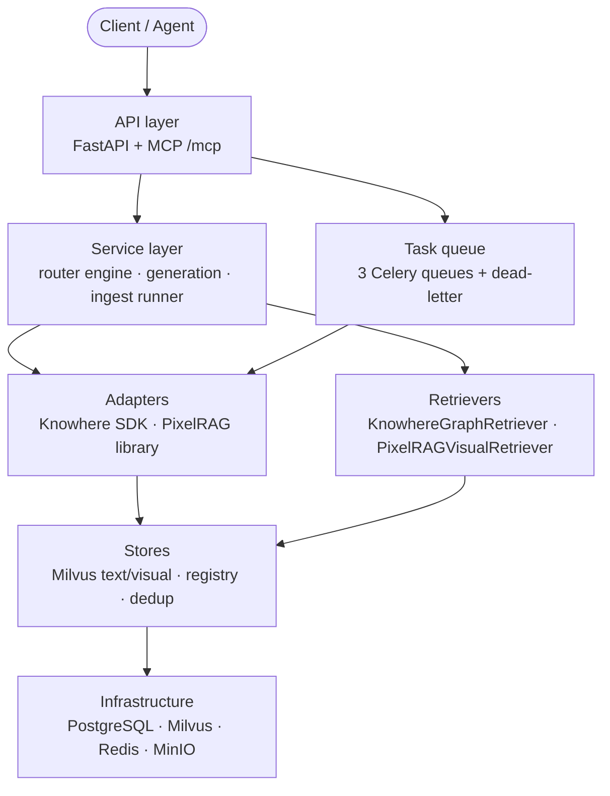

# 后端

Eagle-RAG 后端是面向 Agent 与 LLM 的**行业无关、多租户（`kb_name`）多模态 RAG 数据层**。它组合 [FastAPI](https://fastapi.tiangolo.com/)（HTTP API）、[Celery](https://docs.celeryq.dev/)（异步入库）、[LlamaIndex](https://docs.llamaindex.ai/)（检索编排）、[Milvus](https://milvus.io/docs)（双向量 collection）与 PostgreSQL（元数据/审计）。单一 `kb_name` 贯穿各层，用于隔离知识库。

应用入口：`eagle_rag/api/app.py`。REST 无鉴权中间件（内网部署）。Schema 迁移：`task db:migrate`。

---

## 什么是 RAG 后端？

检索增强生成（Retrieval-Augmented Generation）用外部知识增强 LLM。Eagle-RAG 实现四项职责：

| 职责 | 模块 | 关键论文 |
|---------------|--------|-----------|
| **入库（Ingest）** — 解析、分块、嵌入、索引 | `eagle_rag/ingest/` + Celery | Karpukhin et al. DPR（[arXiv:2004.04906](https://arxiv.org/abs/2004.04906)） |
| **检索（Retrieve）** — 近似最近邻 + 图扩展 + 跨模态 | `eagle_rag/retrievers/` | G-Retriever（[arXiv:2402.07629](https://arxiv.org/abs/2402.07629)）、CLIP（[arXiv:2103.00020](https://arxiv.org/abs/2103.00020)） |
| **路由（Route）** — 文本 / 视觉 / 混合选择 | `eagle_rag/router/` | Self-RAG（[arXiv:2310.11511](https://arxiv.org/abs/2310.11511)） |
| **生成（Generate）** — 交叉编码器重排 + VLM + 带引用答案 | `eagle_rag/generation/` | Lewis et al. RAG（[arXiv:2005.11401](https://arxiv.org/abs/2005.11401)）、交叉编码器重排（[arXiv:1901.04085](https://arxiv.org/abs/1901.04085)） |

Eagle-RAG 在文本 RAG 之上扩展为**双流水线**架构：通过 [Knowhere](https://github.com/Ontos-AI/knowhere) 做结构化解析，通过 PixelRAG（`pixelrag_render` + Qwen3-VL 嵌入）做视觉 tile 编码。两者写入独立 Milvus collection，在检索阶段通过视觉 tile 上的四个锚定字段融合。

---

## 分层架构



两条横切流程：

1. **入库** — 文档进 → 向量出（API → Celery → 适配器 → Milvus）。
2. **查询** — 问题进 → 带引用答案出（API → 路由 → 检索 → 重排 → VLM）。

时序图见 [architecture/data-flow](../architecture/data-flow.md)。

---

## 双数据库驱动策略

| 驱动 | 占位符 | 使用者 |
|--------|------------|---------|
| **asyncpg**（异步） | `$1`, `$2` | FastAPI 处理器 |
| **psycopg2**（同步） | `%s` | Celery 任务、同步 store |

Celery worker 无法共享 asyncpg 连接池。Alembic 在 `alembic/env.py` 中规范化 DSN。

---

## Milvus collection（`eagle_text` + `eagle_visual`）

| Collection | 维度 | 度量 | 索引 | 嵌入模型 |
|------------|-----|--------|-------|------------|
| `eagle_text` | 1536 | COSINE | HNSW（LlamaIndex） | Qwen text-embedding-v4 |
| `eagle_visual` | 2048 | IP | HNSW M=16, efConstruction=256 | Qwen3-VL-Embedding-2B |

租户隔离：每次查询 `kb_name == "{tenant}"`。范围并集：`(kb_name in [...] or document_id in [...])`。

---

## LlamaIndex 集成映射

| LlamaIndex 类型 | Eagle-RAG 角色 |
|----------------|---------------|
| `TextNode` | Knowhere chunk + 章节摘要 |
| `ImageNode` | 视觉检索命中 |
| `VectorStoreIndex` | 对 `eagle_text` 的文本近似最近邻 |
| `MilvusVectorStore` | LlamaIndex ↔ Milvus 文本桥接 |
| `BaseRetriever` | KnowhereGraphRetriever、PixelRAGVisualRetriever |
| `CustomQueryEngine` | EagleMultimodalQueryEngine |
| `DashScopeRerank` | 交叉编码器文本重排 |
| `MetadataFilters` | kb_name / scope / facet → Milvus expr |

视觉向量绕过 LlamaIndex vector store（由 pymilvus 直接管理）。

---

## 文档索引

每页包含理论背景、代码走读、**设计张力与调参**（与代码路径绑定的参数级权衡）、Milvus schema/expr、LlamaIndex 映射、配置键、测试与参考文献。

### 横切张力（延伸阅读）

| 症状 | 从这里开始 |
| --- | --- |
| 答案缺 chunk | [retrieval](retrieval.md) §8、[vector-stores](vector-stores.md) §8（`ef`、过滤器） |
| 引用弱或噪声大 | [generation](generation.md) §6（`top_k`/`top_n`、视觉重排缺口） |
| 流水线/解析器选错 | [ingest-pipeline](ingest-pipeline.md) §6、[router-engine](router-engine.md) §7 |
| 入库卡住/重复 tile | [task-queue](task-queue.md) §9（acks、DLQ） |
| 租户或范围泄漏 | [retrieval](retrieval.md) §8、[kb-management](kb-management.md) §8 |

| 页面 | 行数 | 范围 |
|------|-------|-------|
| [api-layer](api-layer.md) | 200+ | FastAPI 应用、路由、SSE、查询引擎单例 |
| [ingest-pipeline](ingest-pipeline.md) | 400+ | runner、router、Knowhere/PixelRAG 适配器、Celery 任务 |
| [retrieval](retrieval.md) | 400+ | KnowhereGraphRetriever、PixelRAGVisualRetriever、过滤器 |
| [vector-stores](vector-stores.md) | 400+ | eagle_text + eagle_visual schema、索引参数、registry |
| [router-engine](router-engine.md) | 350+ | route_query 选择器、EagleRouterQueryEngine |
| [generation](generation.md) | 350+ | 拆分、重排、prompt、VLM 流式 |
| [task-queue](task-queue.md) | 300+ | Celery 配置、with_retry、死信 |
| [storage](storage.md) | 200+ | MinIO、去重、附件、图片 store |
| [database](database.md) | 250+ | SQLModel 表、Alembic、ER 图 |
| [kb-management](kb-management.md) | 200+ | KB registry、生命周期、统计、健康 |
| [admin-module](admin-module.md) | 200+ | MCP 日志、队列指标、配置快照 |
| [sessions-notifications](sessions-notifications.md) | 200+ | 聊天会话、范围持久化、通知 |
| [mcp-server](mcp-server.md) | 250+ | 四个 MCP 工具、HTTP/stdio、韧性 |
| [schemas](schemas.md) | 250+ | Pydantic v2 请求/响应契约 |

---

## 横切关注点

架构章节文档：

- **[多租户](../architecture/multi-tenancy.md)** — 各表 `kb_name`、去重 PK、Milvus 过滤、MinIO 前缀。
- **[可靠性](../architecture/reliability.md)** — 懒加载单例、Knowhere 失败即停、PixelRAG 快速失败、尽力写入。
- **[路由矩阵](../architecture/routing-matrix.md)** — 按格式 + 内容形态选择入库流水线。
- **[多模态融合](../architecture/multimodal-fusion.md)** — 四个视觉锚定字段、父文档检索。

---

## 模型栈（仅 DeepSeek + Qwen）

| 用途 | 模型 | 维度 |
|-----|-------|-----|
| 文本 LLM / 路由 | DeepSeek（`deepseek-v4-pro`） | — |
| VLM 生成 | Qwen-VL（`qwen3.6-flash`） | — |
| 文本嵌入 | Qwen（`text-embedding-v4`） | 1536 |
| 视觉嵌入 | Qwen3-VL-Embedding-2B | 2048 |
| 文本重排 | Qwen（`qwen3-rerank`） | — |

无 OpenAI / Cohere 适配器。配置：`eagle_rag/settings.yaml`。

---

## 关键测试文件

| 领域 | 测试文件 |
|------|-----------|
| 检索器 | `tests/test_retrievers.py` |
| 路由 + 生成 | `tests/test_router_generation.py` |
| 入库路由 | `tests/test_ingest_assets.py`、`tests/test_ingest_smoke.py` |
| Knowhere 章节 | `tests/test_knowhere_sections.py` |
| 视觉 chunk | `tests/test_knowhere_visual_chunks.py` |
| Milvus 结构 | `tests/test_milvus_structure_fetch.py` |
| API 集成 | `tests/test_api_query_sessions_documents_tasks.py` |
| MCP | `tests/test_mcp_*.py` |
| 附件 | `tests/test_attachments_parser.py` |

运行：`uv run pytest tests/`

---

## 快速开始

```bash
uv sync
task db:migrate
uv run uvicorn eagle_rag.api.app:app --host 0.0.0.0 --port 8000

# Celery workers（独立终端）
celery -A eagle_rag.tasks.celery_app worker -Q router_queue -c 4
celery -A eagle_rag.tasks.celery_app worker -Q knowhere_queue -c 8
celery -A eagle_rag.tasks.celery_app worker -Q pixelrag_queue -c 1
```

---

## 参考文献

- Gao et al., *RAG Survey*, [arXiv:2312.10997](https://arxiv.org/abs/2312.10997)
- Karpukhin et al., *Dense Passage Retrieval*, [arXiv:2004.04906](https://arxiv.org/abs/2004.04906)
- Lewis et al., *Retrieval-Augmented Generation*, [arXiv:2005.11401](https://arxiv.org/abs/2005.11401)
- Milvus documentation: [milvus.io/docs](https://milvus.io/docs)
- LlamaIndex documentation: [docs.llamaindex.ai](https://docs.llamaindex.ai/)
- AGENTS.md — 本仓库 Agent 编码约束
