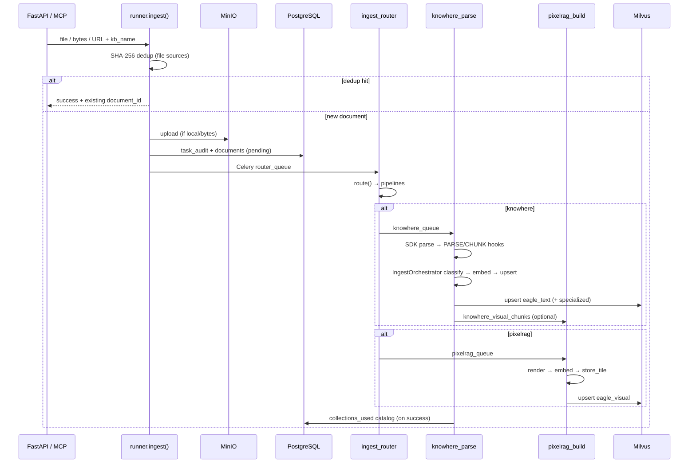

# 摄取管线

摄取管线将原始文档（本地文件、字节流、MinIO 对象或 URL）转换为可搜索的 Milvus 向量与 PostgreSQL registry 记录。Eagle-RAG 采用**双管线**设计：经 [Knowhere](https://github.com/Ontos-AI/knowhere) 做结构化文本解析，经 PixelRAG（`pixelrag_render` + 本地 Qwen3-VL 嵌入）做视觉瓦片编码。Celery 路由任务决定每份文档运行哪条（哪些）管线。解析/分块后，**插件微内核**运行 `IngestOrchestrator`，配合 `CLASSIFY_*` / `EMBED_*` / `UPSERT_VECTORS` 钩子，支持域编码器与专用 collection。

**源模块：** `eagle_rag/ingest/runner.py`、`eagle_rag/ingest/router.py`、`eagle_rag/ingest/knowhere_adapter.py`、`eagle_rag/ingest/pixelrag_adapter.py`、`eagle_rag/ingest/selectors.py`、`eagle_rag/plugins/ingest_orchestrator.py`、`eagle_rag/plugins/hotpath_hooks.py`

钩子目录与 `collections_used` 契约见[插件架构](../architecture/plugin-architecture.md)。

---

## 1. 理论背景

### 1.1 面向 RAG 的文档解析与分块

经典 RAG 索引固定大小文本分块。Knowhere 扩展为**语义骨架解析**：类型化分块（`text`、`table`、`image`）携带层级（`path`、`level`）、摘要、关键词与跨块关系（`connect_to`）。这与**结构感知分块**研究一致，表明保留文档层级可提升检索精度（Gao 等，*Retrieval-Augmented Generation for Large Language Models: A Survey*，arXiv:2312.10997）。

### 1.2 稠密段落检索（DPR）与双编码器

文本分块用**双编码器**（Qwen `text-embedding-v4`，1536 维）嵌入并存入 Milvus。查询时在相同空间嵌入（非对称 `text_type=query` vs `document`），取最近邻 — 标准**稠密段落检索**范式（Karpukhin 等，*Dense Passage Retrieval for Open-Domain Question Answering*，arXiv:2004.04906）。

### 1.3 视觉 / 跨模态嵌入

扫描 PDF、图像与 URL 绕过文本提取，渲染为**视觉瓦片**。每块由视觉-语言嵌入模型（Qwen3-VL-Embedding-2B，2048 维）编码。查询经文本侧编码进入**相同向量空间** — 一种**跨模态检索**（Radford 等，*Learning Transferable Visual Models From Natural Language Supervision*，arXiv:2103.00020；CLIP 式对齐）。

PixelRAG 嵌入在文档截图上微调，适合 OCR 失败的表格/图表/示意图检索。

### 1.4 图增强检索（摄取侧）

Knowhere 分块携带 `connect_to` 边（chunk_id 引用）。检索时 `KnowhereGraphRetriever` 沿这些边扩展 ANN 命中 — 轻量**图增强检索**模式，与 G-Retriever（He 等，arXiv:2402.07629）相关，但限于文档内部关系而非外部知识图。

### 1.5 父文档检索

Knowhere 的 `doc_nav.sections` 树产出 `type="section_summary"` TextNode。检索可先召回粗粒度章节摘要，再经 `path` 前缀下钻 — **父文档 / 层级检索**策略（Liu 等，*Lost in the Middle*，arXiv:2307.03172；LlamaIndex 父子分块）。

### 1.6 路由作为分类问题

摄取路由按**格式 + 内容形态**选择管线（文本 PDF vs 扫描 PDF、扩展名、URL）。查询路由（独立模块）选择 text/visual/hybrid 检索。两者均用带有序选择器的 **FallbackChain** 策略模式。

---

## 2. 端到端流程



---

## 3. 代码走读

### 3.1 统一入口：`runner.py`

`ingest()` 是 FastAPI（`POST /ingest`）与 MCP（`core_ingest` 工具）调用的唯一同步入口。

**四种输入源：**

| 源 | 参数 | 去重 | MinIO 上传 |
|--------|-----------|-------|--------------|
| 本地文件 | `file_path` | 是（SHA-256） | 无 `object_key` 时上传 |
| 字节 | `file_bytes` + `filename` | 是 | 是 |
| MinIO 键 | `object_key` + `filename` | 是 | 否（已存储） |
| URL | `source_uri`（http/https） | 否 | 否 |

**关键设计决策：**

1. **`kb_name` 校验** — KB 未注册则抛出（经 repositories 的 `kb_exists_sync`）。
2. **去重延后** — `dedup.register()` 仅在成功 `knowhere_parse` 后执行，失败作业不阻塞重新上传。PK：`(sha256, kb_name, plugin_namespace)`。
3. **不派发 `local_path`** — API 容器临时文件 worker 容器不可达；worker 经 `object_key` 获取。
4. **PG 优雅降级** — 审计/registry 失败仅记录日志，不阻塞 Celery 派发。
5. **Namespace 绑定** — repositories 从 `settings.plugins.default_namespace` 注入 `plugin_namespace`。

```python
# runner.py — 注册后派发
send_task_with_trace(
    "eagle_rag.ingest.router.ingest_router",
    queue="router_queue",
    kwargs={
        "job_id": job_id,
        "document_id": document_id,
        "name": name,
        "object_key": object_key,
        "local_path": None,  # workers use MinIO
        "kb_name": kb,
        "sha256": sha256,
        ...
    },
)
```

返回：`{"job_id", "status", "dedup_hit", "document_id"}`。

### 3.2 路由矩阵：`router.py`

`route()` 返回管线列表：`["knowhere"]`、`["pixelrag"]` 或 `["knowhere", "pixelrag"]`。

**覆盖优先级（高 → 低）：**

| # | 选择器 | 触发 | 结果 |
|---|----------|---------|--------|
| 1 | `PrefixSelector` | 文件名 `knowhere:` / `pixelrag:` | 强制单管线 |
| 2 | `ForcedModeSelector` | `settings.router.mode` = text/visual/hybrid | 强制管线 |
| 3 | `HttpUriSelector` | `source_uri` 为 http/https | pixelrag |
| 4 | `PdfFormSelector` | PDF + `local_path` | knowhere（文本）或 pixelrag（扫描） |
| 5 | `ExtensionSelector` | 扩展名在 knowhere/pixelrag 集合中 | 对应管线 |
| 6 | `ContentTypeSelector` | MIME 规则 | 对应管线 |
| — | default | 未知 | `settings.ingest.routing.default_pipeline`（knowhere） |

**PDF 形态探测**（`probe_pdf_form`）：

- 经 pypdf 逐页提取文本 → pdfplumber 回退。
- 计算 `text_page_ratio`（超字符阈值页数 / 总页数）与 `avg_chars_per_page`。
- 低于 `settings.pdf_probe` 阈值时返回 `"scanned"`；否则 `"text"`。
- 解析失败默认为 `"text"`（Knowhere 优雅降级）。

`source_type_hint` 与 `kb_name` **不**影响路由 — `source_type` 仅为元数据（`infer_source_type`）。

**Celery 任务 `ingest_router`**（`router_queue`，并发 4）：

1. `TaskState.RENDERING` — 「路由进行中」
2. `route()` + `infer_source_type()`
3. `register_document()` 并附带管线列表
4. `app.send_task` 到 `knowhere_queue` / `pixelrag_queue`
5. `TaskState.SUCCESS` — 「已派发到 {pipelines}」

异常时：`retry_on_failure(self, exc)`。

### 3.3 Knowhere 适配器：`knowhere_adapter.py`

#### SDK 客户端

```python
client = knowhere.Knowhere(api_key=..., base_url=..., timeout=...)
result = client.parse(
    file=Path(file_path),
    file_name=file_name,
    parsing_params=...,
    poll_interval=...,
    poll_timeout=...,
)
```

失败即停：SDK 错误抛出 `KnowhereError` → 任务 FAILED，无静默回退。

#### 分块 → TextNode 映射

| 分块类型 | 文本内容 | 元数据 |
|------------|-------------|----------|
| `text` | `chunk.content` | path、level、summary、keywords、connect_to、page_nums |
| `table` | `chunk.html` | 同上 + type=table |
| `image` | `metadata.summary` | 同上 + type=image |

所有节点携带 `document_id`、`source_type`、`kb_name`。`document_top_summary` 仅存于元数据（不拼入文本 — 避免嵌入稀释）。

#### 章节摘要（父文档）

`sections_to_text_nodes()` 遍历 `parse_result.doc_nav.sections`，产出 `type="section_summary"` 节点，稳定 ID（`sec_{sha1[:16]}`）。

#### 视觉分块派发（多模态融合）

`extract_visual_chunks()` 收集带 `parent_section` 锚点的 image/table 分块。`dispatch_visual_chunks()` 上传到 MinIO 并将 `knowhere_visual_chunks` 发到 `pixelrag_queue`，使用**独立 job_id**（`{parent_job_id}:visual`）避免状态机冲突。

#### 任务 `knowhere_parse` 状态机

| 阶段 | TaskState | 动作 |
|-------|-----------|--------|
| 获取 | RENDERING | 需要时从 MinIO 下载 |
| 解析 | RENDERING | Knowhere SDK |
| 嵌入准备 | EMBEDDING | chunks → TextNodes + section nodes |
| 索引 | INDEXING | `upsert_text_nodes()` |
| 标签 | （非阻塞） | `upsert_document_keywords()` |
| 视觉 | （非阻塞） | 派发到 pixelrag_queue |
| doc_nav | （非阻塞） | `update_extra({"doc_nav": ...})` |
| 完成 | SUCCESS | registry ready + dedup.register + collections_used catalog |

### 3.4 插件摄取路径

Knowhere 解析后，热路径钩子接入域定制：

| 阶段 | 钩子 | 模块 |
|-------|------|--------|
| 解析增强 | `PARSE` | `eagle_rag/plugins/hotpath_hooks.py` |
| 域分块 | `CHUNK` | `eagle_rag/plugins/hotpath_hooks.py` |
| 视觉提取 | `INGEST_VISUAL_EXTRACT` | HookBus |
| 分类 | `CLASSIFY_CHUNK` / `CLASSIFY_VISUAL` | `IngestOrchestrator.classify()` |
| 嵌入 + upsert | `EMBED_*` → `UPSERT_VECTORS` | `IngestOrchestrator.embed_and_upsert()` |

固定顺序（G26）：`PARSE → CHUNK → INGEST_VISUAL_EXTRACT → CLASSIFY_* → IngestOrchestrator`。

仅在**成功**摄取时（`documents.status=success`，所有分块已写入）：

- `documents.extra["collections_used"]` — 每文档
- `knowledge_bases.collections_used` — KB 级并集

失败或部分摄取不更新 catalog。查询 scope 用此 catalog 做专用 collection 计划（[ADR-006](../architecture/adr/006-ingest-query-routing-contract.md)）。

### 3.5 PixelRAG 适配器：`pixelrag_adapter.py`

PixelRAG **仅为库** — 无 `pixelrag serve`、无 FAISS、无 `pixelrag.build()`。

#### 渲染管线

| 源 | 函数 |
|--------|----------|
| URL | `pixelrag_render.render_url()` |
| PDF | `pixelrag_render.render_pdf()` |
| 其他文件 | `pixelrag_render.render_file()` |

输出：瓦片字典 `{image_bytes, page, position, width, height}`。

#### 视觉编码器单例

`_Qwen3VLVisualEncoder` 惰性加载 Qwen3-VL-Embedding-2B：

- 末 token 池化 + L2 归一化（与 `pixelrag_embed.embed_cpu` 一致）
- 图像与文本查询共享向量空间
- 提供者必须为 `embedding.visual.provider == "pixelrag"`（否则快速失败）
- 设备：`auto` → cuda → mps → cpu

#### 任务 `pixelrag_build`（`pixelrag_queue`，并发 1）

1. 解析源（local_path / URL / MinIO 下载）
2. `render_to_tiles()` → `embed_tiles()`
3. 每瓦片：`store_tile()`（MinIO/本地）+ `upsert_visual()`（Milvus）
4. `update_status(document_id, "ready")`

#### 任务 `knowhere_visual_chunks`

处理 Knowhere 提取的 image/table 分块：从 MinIO 下载 → 渲染 → 嵌入 → upsert，并写入融合锚点字段（`chunk_type`、`parent_section`、`content_summary`、`source_chunk_id`）。

---

## 4. Milvus schema 与过滤表达式（摄取写入）

### 4.1 文本 collection `eagle_text`

经 LlamaIndex `MilvusVectorStore` + `VectorStoreIndex.insert_nodes()` 写入。

**元数据字段**（存于动态字段 / `_node_content`）：

| 字段 | 类型 | 设置者 |
|-------|------|--------|
| `path` | string | Knowhere 分块 path |
| `level` | int | `infer_level_from_path()` |
| `summary` | string | Knowhere metadata |
| `type` | string | text/table/image/section_summary |
| `keywords` | list | Knowhere metadata |
| `connect_to` | list | Knowhere 跨块引用 |
| `document_id` | string | ingest |
| `source_type` | string | infer_source_type |
| `kb_name` | string | 多租户键 |
| `page_nums` | list | Knowhere metadata |
| `chunk_count` | int | 仅 section_summary |

**过滤 expr 示例**（检索时使用，非摄取）：

```
kb_name == "finance" and source_type == "policy" and type == "section_summary"
```

### 4.2 视觉 collection `eagle_visual`

经 `upsert_visual()` / `upsert_visual_batch()` 写入。

| 字段 | 类型 | 说明 |
|-------|------|-------|
| `id` / `image_id` | VARCHAR(64) PK | `{document_id}_{tile_index}` |
| `vector` | FLOAT_VECTOR(2048) | IP 度量，HNSW M=16，efConstruction=256 |
| `image_path` | VARCHAR(512) | MinIO 对象键 |
| `document_id` | VARCHAR(64) | |
| `kb_name` | VARCHAR(64) | 默认 `default` |
| `chunk_type` | VARCHAR(16) | tile / image / table |
| `parent_section` | VARCHAR(512) | Knowhere path 锚点 |
| `content_summary` | VARCHAR(2048) | Knowhere 视觉摘要 |
| `source_chunk_id` | VARCHAR(128) | Knowhere chunk_id 锚点 |

**过滤 expr 示例：**

```
kb_name == "pharma" and chunk_type == "table" and parent_section like "%Financial%"
```

---

## 5. LlamaIndex 集成

| LlamaIndex 类型 | Eagle-RAG 用法 |
|-----------------|-----------------|
| `TextNode` | Knowhere 分块 + 章节摘要 → `eagle_text` |
| `ImageNode` | 检索时从 Milvus 视觉命中创建（摄取时不创建） |
| `VectorStoreIndex` | `get_text_index()` 单例，基于 `MilvusVectorStore` |
| `NodeRelationship.SOURCE` | `_attach_source_ref()` 绑定 document_id |
| `MetadataFilter` / `MetadataFilters` | 检索器从 kb_name、source_type、year 构建 |

视觉向量绕过 LlamaIndex vector store — 由 `pymilvus.MilvusClient` 直接管理，因嵌入模型非标准 LlamaIndex 集成。

---

## 6. 设计张力与调优

| 张力 | 阶段 | 症状 | 缓解 |
| --- | --- | --- | --- |
| **去重 vs 重解析** | `check_duplicate(sha256, kb_name, plugin_namespace)` 短路 | 解析器升级不重新索引未变字节 | 删除 registry 行或改 `kb_name` 强制重摄取 |
| **PDF 探测错误** | `probe_pdf_form` 失败即开 → `text` | 扫描 deck 被索引为垃圾文本 | 降低每 KB `pdf_text_page_ratio`；用 `pixelrag:` 前缀 |
| **Knowhere 失败即停** | `KnowhereError` → 任务 `FAILED` | SDK 超时不产生部分文本索引 | 提高 `knowhere.poll_timeout`；扩展 Knowhere worker |
| **视觉派发尽力而为** | `dispatch_visual_chunks` 仅记日志失败 | `ready` 文档但 `eagle_visual` 为空 | 监控 `pixelrag_queue` + 死信；重跑视觉子任务 |
| **章节摘要空洞** | `sections_to_text_nodes` 跳过空 `summary` / `chunk_count==0` | 父文档检索缺分支 | 修复 Knowhere 解析质量；单靠重分块无法修复 |
| **分块图完整性** | Knowhere manifest 的 `connect_to` | 图弱 → 检索器扩展无用 | 校验 Knowhere 输出 manifest；对比摄取日志 |
| **嵌入成本线性** | `chunks_to_text_nodes` + 批嵌入 | 500 页政策 → 数百次 DashScope 调用 | 摄取 SLA 主要由嵌入主导，非 Milvus upsert |
| **混合摄取双倍工作** | `route()` 返回双管线 | 相同字节经 Knowhere + PixelRAG | 用路由覆盖；非必要勿用 `hybrid` 摄取模式 |
| **MinIO 上传软失败** | runner 在 MinIO 错误时继续 | worker 依赖临时 `local_path` | 确保 worker 共享存储或任务结束前上传成功 |

**状态机说明：** `knowhere_visual_chunks` 失败**不**回滚 `documents.status=ready` — 设计上文本 QA 可继续；请相应调监控。

---

## 7. 配置与调优

### 6.1 摄取路由（`settings.yaml` → `ingest.routing`）

```yaml
ingest:
  routing:
    prefix_force:
      "knowhere:": knowhere
      "pixelrag:": pixelrag
    knowhere_exts: [.docx, .doc, .md, .txt, .xlsx, .csv, .pptx, .json]
    pixelrag_exts: [.png, .jpg, .jpeg, .webp, .gif, .html]
    default_pipeline: knowhere
  source_type:
    rules: [...]   # 仅元数据
    default: other
```

### 6.2 PDF 探测

```yaml
pdf_probe:
  text_page_ratio: 0.2      # 低于 → 扫描
  avg_chars_per_page: 50
```

经 `get_pdf_ratio_sync(kb_name)` 每 KB 覆盖。

### 6.3 Knowhere SDK

```yaml
knowhere:
  base_url: http://localhost:5005
  poll_interval: 10
  poll_timeout: 1800
  parsing_params:
    model: advanced
    ocr_enabled: true
```

### 6.4 PixelRAG 渲染/嵌入

```yaml
pixelrag:
  tile_height: 8192
  viewport_width: 875
  pdf_dpi: 200
  backend: cdp          # cdp | playwright
  embed_device: auto    # cuda | mps | cpu
  embed_instruction: "Represent the user's input."
```

### 6.5 Celery 队列

```yaml
celery:
  queues:
    router_queue: { concurrency: 4 }
    knowhere_queue: { concurrency: 8 }
    pixelrag_queue: { concurrency: 1 }   # GPU 内存限制
  max_retries: 3
  retry_backoff: 60
```

**调优提示：**

- I/O 密集解析可提高 `knowhere_queue` 并发；除非多 GPU，保持 `pixelrag_queue` 为 1。
- 降低 `pdf_probe.text_page_ratio` 可将更多 PDF 路由到 PixelRAG（适合混合文档）。
- 用文件名前缀 `pixelrag:report.pdf` 强制视觉管线，无需改全局配置。

---

## 8. 测试

| 测试文件 | 验证契约 |
|-----------|-------------------|
| `tests/test_ingest_smoke.py` | 端到端摄取派发、路由任务接线 |
| `tests/test_ingest_assets.py` | 路由矩阵：扩展名、PDF 探测、前缀覆盖 |
| `tests/test_knowhere_sections.py` | `sections_to_text_nodes` 父文档 ID 与元数据 |
| `tests/test_knowhere_visual_chunks.py` | 视觉分块提取 + 派发到 pixelrag_queue |
| `tests/test_ingest_url_validation.py` | URL 源校验 |
| `tests/test_mcp_resilience.py` | 带断路器的 MCP `core_ingest` 工具 |
| `tests/plugins/test_hotpath_hooks.py` | PARSE / CHUNK 钩子接线 |
| `tests/plugins/test_core_defaults.py` | Core 分类 / 嵌入默认 |

**行为契约：**

- 去重命中返回 `status="success"` 且不派发 Celery。
- 路由为每种文件类型派发正确队列。
- Knowhere SDK 失败 → 任务 FAILED（无静默回退）。
- PixelRAG 库缺失 → 首次嵌入调用快速失败。
- 视觉派发失败对 knowhere_parse SUCCESS 非阻塞。

---

## 9. 运营说明

### 8.1 多租户

每条摄取路径传播 `kb_name` 与 `plugin_namespace`：

- 去重 PK：`(sha256, kb_name, plugin_namespace)`
- Milvus 标量：`kb_name == '{kb}'`（域 Database 内）
- 文档 registry：`documents.kb_name` + 仓储注入的 `plugin_namespace`

### 8.2 幂等性

- 章节节点 ID 在重解析间 SHA-1 稳定。
- 视觉 upsert 按 PK `image_id` 覆盖。
- 去重防止 KB 内重复文件摄取。

### 8.3 失败模式

| 失败 | 行为 |
|---------|----------|
| MinIO 上传（API） | 致命 — worker 无法获取文件 |
| PostgreSQL 审计 | 非致命 — 记录日志，继续派发 |
| Knowhere SDK | FAILED + 重试 + 死信 |
| 标签 catalog 写入 | 非致命 |
| 视觉派发 | 非致命 |

---

## 10. 参考文献

- Karpukhin 等，*Dense Passage Retrieval for Open-Domain Question Answering*，[arXiv:2004.04906](https://arxiv.org/abs/2004.04906)
- Gao 等，*Retrieval-Augmented Generation for Large Language Models: A Survey*，[arXiv:2312.10997](https://arxiv.org/abs/2312.10997)
- Radford 等，*Learning Transferable Visual Models From Natural Language Supervision (CLIP)*，[arXiv:2103.00020](https://arxiv.org/abs/2103.00020)
- He 等，*G-Retriever: Retrieval-Augmented Generation for Textual Graph Understanding*，[arXiv:2402.07629](https://arxiv.org/abs/2402.07629)
- Liu 等，*Lost in the Middle: How Language Models Use Long Contexts*，[arXiv:2307.03172](https://arxiv.org/abs/2307.03172)
- Nogueira & Cho，*Passage Re-ranking with BERT (cross-encoder)*，[arXiv:1901.04085](https://arxiv.org/abs/1901.04085)
- Knowhere SDK：[github.com/Ontos-AI/knowhere](https://github.com/Ontos-AI/knowhere)
- Milvus 过滤表达式：[milvus.io/docs/boolean.md](https://milvus.io/docs/boolean.md)
- LlamaIndex VectorStoreIndex：[docs.llamaindex.ai](https://docs.llamaindex.ai/en/stable/module_guides/indexing/vector_store_index/)
- Celery 路由：[docs.celeryq.dev](https://docs.celeryq.dev/en/stable/userguide/routing.html)
