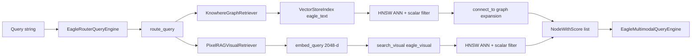

# 检索

Eagle-RAG 检索在路由查询引擎后组合两个专用检索器：**KnowhereGraphRetriever** 负责结构化文本（1536 维，Milvus `eagle_text` + 图扩展），**PixelRAGVisualRetriever** 负责视觉 tile（2048 维，Milvus `eagle_visual`）。两者均返回 LlamaIndex `NodeWithScore`，供生成引擎消费。

**源码模块：** `eagle_rag/retrievers/knowhere_graph_retriever.py`、`eagle_rag/retrievers/pixelrag_visual_retriever.py`

---

## 1. 理论背景

### 1.1 稠密段落检索（DPR）

**双编码器**检索将查询与文档独立编码到共享嵌入空间，再经近似最近邻（ANN）搜索找最近邻。这是现代开放域问答的基础（Karpukhin et al., arXiv:2004.04906）。

Eagle-RAG 文本检索使用 Qwen `text-embedding-v4`（1536 维，余弦相似度），采用**非对称编码**：文档用 `text_type=document`，查询用 `text_type=query` —— 商业嵌入 API 中常见的质量提升做法。

### 1.2 图增强检索

纯向量搜索可能漏掉结构相关 chunk（例如与说明段落链接的表格）。Knowhere chunk 携带 `connect_to` 边。近似最近邻召回后，检索器沿这些边经 LlamaIndex docstore **扩展** —— 文档内部图增强，灵感来自 G-Retriever（He et al., arXiv:2402.07629）与 HippoRAG（Gutiérrez et al., arXiv:2405.14831）。

### 1.3 跨模态（文本到图像）检索

视觉检索将**文本查询**编码到与文档截图 tile 相同的 2048 维空间（Qwen3-VL-Embedding-2B）。自然语言问题可检索相关页面区域 —— 将 CLIP 范式（Radford et al., arXiv:2103.00020）用于文档截图。

### 1.4 父文档检索

Knowhere 在细粒度 chunk 旁索引 `type="section_summary"` 节点。两阶段策略：

1. 召回章节摘要（粗粒度、高信噪比）。
2. 经 `path` 前缀下钻到子 chunk。

遵循父文档检索器模式（LlamaIndex `RecursiveRetriever`；Chen et al., arXiv:2310.09435 层级索引）。

### 1.5 重排（下游）

检索返回 top-K 候选；**交叉编码器重排**在生成引擎完成（`DashScopeRerank` / qwen3-rerank）。双编码器快但近似；交叉编码器联合编码 query+passage，在更小 K 上精度更高（Nogueira & Cho, arXiv:1901.04085；Reimers & Gurevych, arXiv:1908.10084）。

---

## 2. 架构



---

## 3. 代码走读：KnowhereGraphRetriever

**文件：** `eagle_rag/retrievers/knowhere_graph_retriever.py`

### 3.1 构造参数

| 参数 | 用途 |
|-----------|---------|
| `top_k` / `similarity_top_k` | 近似最近邻召回数（默认 5） |
| `kb_name` | 单 KB Milvus 过滤 |
| `kb_names` + `document_ids` | 高级范围（OR 并集） |
| `source_type`, `year` | 分面过滤（AND） |
| `document_id` | 客户端后过滤 |

### 3.2 过滤器组装（`_build_filters`）

构建 LlamaIndex `MetadataFilters`：

```python
# Single tenant
MetadataFilter(key="kb_name", value="finance", operator=FilterOperator.EQ)

# Scope union (OR)
MetadataFilters(
    filters=[
        MetadataFilter(key="kb_name", value=["finance", "pharma"], operator=FilterOperator.IN),
        MetadataFilter(key="document_id", value=["doc-a", "doc-b"], operator=FilterOperator.IN),
    ],
    condition=FilterCondition.OR,
)

# Combined with facets (AND)
MetadataFilters(filters=[scope_group, source_type_filter, year_filter], condition=FilterCondition.AND)
```

由 `MilvusVectorStore` 翻译为 Milvus 布尔表达式。

### 3.3 检索流程（`_retrieve`）

1. `get_text_index()` — 懒加载 `VectorStoreIndex` 单例。
2. `text_index.as_retriever(similarity_top_k=K, filters=...)` → 近似最近邻搜索。
3. 可选客户端 `document_id` 过滤。
4. **图扩展：** 对每个命中读取 `metadata["connect_to"]`，从 docstore 取相关节点，按 `node_id` 去重，继承父分数。
5. 遥测：`ai_logger.info("retrieve", retriever="text", ...)`。

### 3.4 错误降级

任何 Milvus/嵌入异常 → 记 warning，返回 `[]`。路由引擎决定是否仅用视觉结果继续。

### 3.5 图扩展细节

`connect_to` 项可为纯 chunk_id 字符串或 dict `{target, relation, ref, position}`。docstore 缺失或目标不存在则静默跳过 —— 扩展为尽力而为。

---

## 4. 代码走读：PixelRAGVisualRetriever

**文件：** `eagle_rag/retrievers/pixelrag_visual_retriever.py`

### 4.1 检索流程

```python
query_vector = embed_query(query_str)          # Qwen3-VL text encoding, 2048-d
results = search_visual(
    query_vector,
    top_k=self.top_k,
    kb_name=..., kb_names=..., document_ids=...,
    year=..., source_type=...,
    parent_section=..., chunk_type=...,
)
nodes = [self._to_node_with_score(r) for r in results]
```

### 4.2 ImageNode 构建

每个 Milvus 命中变为带元数据的 `ImageNode`：

| 字段 | 来源 |
|-------|--------|
| `image_id`, `document_id`, `page`, `position` | Milvus 标量 |
| `kb_name`, `year`, `source_type` | Milvus 标量 |
| `chunk_type`, `parent_section`, `content_summary`, `source_chunk_id` | 融合锚定 |

Milvus 返回 None 时分数默认 1.0。

### 4.3 跨模态编码

`embed_query()` 委托 `_Qwen3VLVisualEncoder.embed_text()` —— 与入库相同的单例。保证查询与 tile 向量在同一归一化空间（末 token 池化 + L2 范数）。

---

## 5. Milvus schema 与过滤表达式

### 5.1 文本 collection `eagle_text`

**向量：** 1536 维 FLOAT_VECTOR，COSINE 度量（经 LlamaIndex `MilvusVectorStore`）。

**过滤用标量/元数据字段：**

| 字段 | expr 示例 |
|-------|-------------|
| `kb_name` | `kb_name == "default"` |
| `document_id` | `document_id == "550e8400-..."` |
| `source_type` | `source_type == "financial"` |
| `year` | `year == 2025` |
| `type` | `type == "section_summary"` |
| `path` | `path like "report/Chapter 3%"` |

**组合示例：**

```
kb_name == "finance" and source_type == "policy"
```

```
(kb_name in ["finance", "pharma"] or document_id in ["doc-1", "doc-2"]) and year == 2025
```

索引参数（LlamaIndex Milvus 集成管理）：HNSW + COSINE；标量字段作为 dynamic metadata 索引。

### 5.2 视觉 collection `eagle_visual`

**向量：** 2048 维 FLOAT_VECTOR，**IP**（内积）度量。

**索引参数**（`milvus_visual_store.py`）：

| 索引类型 | 参数 |
|------------|--------|
| HNSW（默认） | `M=16`, `efConstruction=256`, 搜索 `ef=64` |
| DiskANN | `metric_type=IP`, 无额外搜索参数 |

**标量倒排索引：** `kb_name`, `document_id`, `source_type`, `year`, `chunk_type`, `parent_section`。

**过滤示例：**

```
kb_name == "pharma" and chunk_type == "tile"
```

```
document_id == "abc-123" and year in [2024, 2025]
```

```
(kb_name in ["finance"] or document_id in ["doc-x"]) and source_type == "financial" and parent_section like "%Balance Sheet%"
```

由 `search_visual()` 内 `_build_search_expr()` 构建。

---

## 6. LlamaIndex 集成

| 组件 | 角色 |
|-----------|------|
| `BaseRetriever` | 两检索器均继承；实现 `_retrieve(QueryBundle)` |
| `TextNode` | Knowhere text/table/image/section_summary chunk |
| `ImageNode` | 视觉命中（检索时创建，不在 docstore） |
| `NodeWithScore` | 带相似度分数的统一输出 |
| `VectorStoreIndex` | 经 `as_retriever()` 的文本近似最近邻 |
| `MetadataFilters` | 声明式标量过滤 → Milvus expr |
| `QueryBundle` | 包装查询字符串供 `_retrieve` |

视觉检索**不**用 `VectorStoreIndex` —— 直接调用 `pymilvus.MilvusClient.search()`，因嵌入为自定义 Qwen3-VL 单例，非 LlamaIndex `BaseEmbedding`。

**Docstore 图扩展：** `text_index.docstore.get_node(target_id)` 取已在 Milvus/LlamaIndex 存储中索引的相关 `TextNode`。

---

## 7. 范围过滤

两种范围机制并存：

### 7.1 旧版 `scope: list[str]`

文档 ID 列表；检索后客户端过滤（`_filter_by_scope`）。

### 7.2 高级 `scope_filter: ScopeSelection`

```json
{
  "kb_names": ["finance", "pharma"],
  "document_ids": ["doc-a"],
  "tags": ["增值税", "2025"]
}
```

- 标签经 `document_keywords` 表解析为 document ID（`resolve_tags_to_document_ids`）。
- 并集（OR）语义：`(kb_name IN ...) OR (document_id IN ...)` 下推到 Milvus。
- 受 `router.max_scope_documents` 上限（默认 500）。

---

## 8. 设计张力与调参

| 张力 | 位置 | 效果 | 缓解 |
| --- | --- | --- | --- |
| **图扩展分数继承** | `knowhere_graph_retriever._retrieve`：扩展节点继承父 `nws.score` | 链接表/脚注与主命中同 rank，即使与 query 向量相似度低 | 扩展加噪声时降低 `top_k`；在 facet 中过滤 `type` |
| **扩展深度** | 仅从初始 ANN 命中的 `connect_to` 一跳 | 多跳推理链不遍历 | 在 Knowhere 解析时丰富 `connect_to`，非改 retriever |
| **Docstore 可用性** | `text_index.docstore` try/except → 跳过扩展 | docstore 同步与否导致相同 ANN 结果有无图扩展 | 重建索引后验证 docstore 与 Milvus 节点 ID 一致 |
| **范围 OR 基数** | `_build_filters`：`kb_names OR document_ids` AND facet | 大 tag→doc 并集接近 `max_scope_documents` —— 尾部文档静默排除 | 收窄 tag；在 `ai_logger` route 事件监控解析 doc 数 |
| **遗留 scope 后过滤** | `scope_filter` 未激活时 `_filter_by_scope` | Milvus 返回全局 top-K 再 Python 过滤 —— 浪费 ANN 且分数偏 | 多文档 QA 优先 `scope_filter` 下推 |
| **视觉 query–image 鸿沟** | `embed_query` 文本在 2048-d 截图空间 | 纯政策文本问题召回无关页区域 | Router `visual` 路径；用 `chunk_type` / `parent_section` 过滤 |
| **空检索器降级** | except → `[]` | Hybrid 查询静默变单路径 | 在 SSE 的 `recall` 步看 `text_count`/`visual_count` |
| **章节摘要下钻** | retriever 内父文档模式非自动 | 须过滤 `type=="section_summary"` 或靠 path 重叠进 prompt | 客户端两阶段搜索或未来 retriever 模式 |

**ANN + 过滤交互：** 有倒排索引时 Milvus 在 HNSW 搜索中应用标量谓词；无则 post-ANN 过滤 —— 同一 `expr`，不同延迟特征（见 [vector-stores](vector-stores.md) §8）。

---

## 9. 配置与调优

### 8.1 检索 top_k

查询时经 `QueryRequest.top_k`（默认 5）设置，传给两检索器为 `similarity_top_k` / `top_k`。

### 8.2 嵌入

```yaml
embedding:
  text:
    model: text-embedding-v4
    dim: 1536
  visual:
    provider: pixelrag
    model: Qwen/Qwen3-VL-Embedding-2B
    dim: 2048
```

### 8.3 Milvus 视觉索引

```yaml
milvus:
  visual_index_type: hnsw    # hnsw | diskann
  dim_text: 1536
  dim_visual: 2048
```

**调优指南：**

| 目标 | 调整 |
|------|-----------|
| 更高召回 | 增大 `top_k`（5 → 10） |
| 更快视觉搜索 | HNSW 降低 `ef`（牺牲召回） |
| 大规模视觉语料 | 切换 `diskann` |
| 更窄结果 | 加 `source_type` / `year` 分面 |
| 章节优先检索 | 过滤 `type == "section_summary"` 再按 path 下钻 |

### 8.4 重排（下游）

```yaml
rerank:
  text:
    model: qwen3-rerank
```

生成引擎 `top_n`（默认 3）控制重排后数量 —— 见 [generation](generation.md)。

---

## 10. 测试

**主测：** `tests/test_retrievers.py`

| 测试领域 | 契约 |
|-----------|----------|
| 文本近似最近邻召回 | Mock `get_text_index().as_retriever().retrieve()` |
| kb_name 过滤下推 | `MetadataFilter(key="kb_name", ...)` 传给检索器 |
| 图扩展 | 从 docstore 取 `connect_to` 目标并去重 |
| 范围并集 | `kb_names` + `document_ids` OR 过滤器组装 |
| 视觉 embed + 搜索 | Mock `embed_query` + `search_visual` |
| ImageNode 元数据 | 融合锚定字段保留 |
| 错误降级 | 异常 → 空列表，不抛错 |
| 分面过滤 | `source_type`, `year`, `chunk_type`, `parent_section` |

**相关：**

- `tests/test_milvus_structure_fetch.py` — 从 Milvus 重建文档结构
- `tests/test_router_generation.py` — 端到端 route → retrieve → generate

---

## 11. MCP 暴露

MCP 工具直接调用检索器：

| 工具 | 检索器 |
|------|-----------|
| `retrieve_text` | `KnowhereGraphRetriever` |
| `retrieve_visual` | `PixelRAGVisualRetriever` |

均接受 `kb_name`、`top_k` 与分面过滤。

---

## 12. 性能特征

| 检索器 | 瓶颈 | 典型延迟驱动 |
|-----------|-----------|----------------------|
| 文本 | DashScope 嵌入 API + Milvus 近似最近邻 | 到 DashScope 的网络 RTT |
| 视觉 | 本地 Qwen3-VL 编码（首次调用加载模型）+ Milvus 近似最近邻 | GPU/CPU 推理 |
| 图扩展 | Docstore 查找 | 每个命中的 `connect_to` 边数 |

两检索器均发出 OpenTelemetry span（`retrieve.text`, `retrieve.visual`）与 AI 遥测 JSONL 事件。

---

## 13. 参考文献

- Karpukhin et al., *Dense Passage Retrieval*, [arXiv:2004.04906](https://arxiv.org/abs/2004.04906)
- Nogueira & Cho, *Passage Re-ranking with BERT*, [arXiv:1901.04085](https://arxiv.org/abs/1901.04085)
- Reimers & Gurevych, *Sentence-BERT*, [arXiv:1908.10084](https://arxiv.org/abs/1908.10084)
- Radford et al., *CLIP*, [arXiv:2103.00020](https://arxiv.org/abs/2103.00020)
- He et al., *G-Retriever*, [arXiv:2402.07629](https://arxiv.org/abs/2402.07629)
- Gutiérrez et al., *HippoRAG*, [arXiv:2405.14831](https://arxiv.org/abs/2405.14831)
- Chen et al., *Dense Hierarchical Retrieval*, [arXiv:2310.09435](https://arxiv.org/abs/2310.09435)
- Milvus HNSW index: [milvus.io/docs/index.md](https://milvus.io/docs/index.md)
- Milvus boolean expressions: [milvus.io/docs/boolean.md](https://milvus.io/docs/boolean.md)
- LlamaIndex retrievers: [docs.llamaindex.ai/module_guides/querying/retriever](https://docs.llamaindex.ai/en/stable/module_guides/querying/retriever/)
- LlamaIndex metadata filters: [docs.llamaindex.ai/examples/vector_stores/MilvusIndexDemo](https://docs.llamaindex.ai/en/stable/examples/vector_stores/MilvusIndexDemo/)
