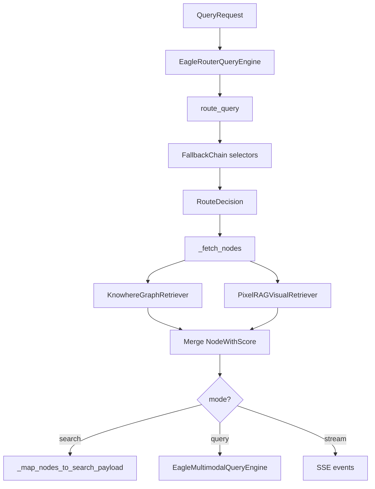

# 路由引擎

路由引擎决定**调用哪些检索模态**（文本、视觉或两者），并编排完整查询路径：路由 → 检索 →（可选）生成。它位于 API 层与检索器/生成引擎之间。

**源码模块：** `eagle_rag/router/router_engine.py`、`eagle_rag/router/selectors.py`、`eagle_rag/router/models.py`、`eagle_rag/router/llm_factory.py`

---

## 1. 理论背景

### 1.1 自适应检索路由

并非每个查询都适合同一检索策略。偏文本的政策问题需要稠密段落检索；读图表问题需要视觉 tile 搜索；复杂问题可能需要**混合**检索合并两模态。自适应路由是活跃研究方向（Ma et al., *Query Rewriting for Retrieval-Augmented LLMs*, arXiv:2310.03135；Self-RAG 中的 self-routing, Asai et al., arXiv:2310.11511）。

Eagle-RAG 将路由实现为选择器的 **FallbackChain** —— 在昂贵检索前毫秒级运行的规则 + LLM 增强分类器。

### 1.2 多索引检索

混合模式查询两个独立向量索引（`eagle_text` 1536 维 cosine，`eagle_visual` 2048 维 IP）并合并结果。这是与单索引多模态嵌入不同的**多索引融合**模式。

### 1.3 双编码器召回 vs 交叉编码器重排

路由负责**召回路由**（查哪些索引）。**精度 refinement**（重排）交给生成引擎的交叉编码器 —— 分离快的双编码器召回与慢的交叉编码器重排（Nogueira & Cho, arXiv:1901.04085）。

### 1.4 范围约束检索

高级范围过滤实现**元数据过滤的近似最近邻** —— 在向量相似度前按租户（`kb_name`）、文档集或关键词标签预过滤搜索空间。遵循 Milvus 混合搜索支持的过滤向量搜索模式（Milvus 文档：标量过滤 + ANN）。

---

## 2. 架构



两个类：

| 类 | 角色 |
|-------|------|
| `route_query()` | 纯路由决策（不检索） |
| `EagleRouterQueryEngine` | 路由 + 检索 + search/query/stream |

---

## 3. 代码走读：查询路由选择器

**文件：** `eagle_rag/router/selectors.py`

### 3.1 FallbackChain 顺序

| # | 选择器 | 何时决定 | 何时返回 None |
|---|----------|-------------|-------------------|
| 1 | `ForcedModeSelector` | `mode=text/visual/hybrid` | `mode=auto` |
| 2 | `AttachmentSelector` | 用户附加文档 | 无文档附件 |
| 3 | `LLMIntentSelector` | LLM 分类查询意图 | LLM 禁用/失败 |
| 4 | `HeuristicSelector` | 关键词规则 | 从不（总会决定） |

所有选择器经构造注入配置（选择器内不调用全局 `get_settings()` —— 可测）。

### 3.2 ForcedModeSelector

映射显式 API `mode` 参数：

```python
mode="text"    → selected=["text"]
mode="visual"  → selected=["visual"]
mode="hybrid"  → selected=["text", "visual"]
mode="auto"    → None (defer)
```

当 `filters.pipeline == "knowhere"` 时也触发 → text，`"pixelrag"` → visual。

### 3.3 AttachmentSelector

`has_doc_attachments=True`（解析附件含文档文件）时强制混合检索 —— 附件可能同时含文本与视觉内容。

### 3.4 LLMIntentSelector

经 DashScope 调用 DeepSeek，使用 `settings.router.llm.prompt_template`：

```
判断以下查询应使用哪种检索方式，只回复一个单词：text、visual 或 hybrid。
查询：{query}
```

解析响应中的 `text`、`visual` 或 `hybrid`。失败 → `None`（落到启发式）。

遥测：`ai_logger.info("llm_intent", model=..., latency_ms=...)`。

### 3.5 HeuristicSelector

`settings.router.heuristic.rules` 中首匹配关键词规则：

| 关键词（示例） | 路由 |
|-------------------|-------|
| 架构图, diagram, figure | hybrid |
| 表格, 报表, chart, table | visual |
| 政策, 法规, policy, law | text |
| 工商, 招投标, bid, tender | visual |

无关键词匹配时默认：`settings.router.heuristic.default`（text）。

### 3.6 RouteDecision 模型

```python
@dataclass
class RouteDecision:
    mode: str           # auto | text | visual | hybrid
    selected: list[str] # ["text"] | ["visual"] | ["text", "visual"]
    reason: str         # human-readable explanation
    kb_name: str | None
    selector: str       # forced | attachment | llm | heuristic | default
```

---

## 4. 代码走读：EagleRouterQueryEngine

**文件：** `eagle_rag/router/router_engine.py`

### 4.1 构造

```python
EagleRouterQueryEngine(
    text_retriever=KnowhereGraphRetriever(top_k=5, kb_name=kb),
    visual_retriever=PixelRAGVisualRetriever(top_k=5, kb_name=kb),
    mode=settings.router.mode,
    top_k=5,
)
```

单例在 `eagle_rag/api/query.py` 应用启动时创建。

### 4.2 范围过滤解析（`_resolve_scope_filter`）

输入：`scope_filter: {kb_names, document_ids, tags}`。

1. 标签 → document ID（`resolve_tags_to_document_ids(tags, cap=max_scope_documents)`）。
2. 显式列表与标签解析结果的 document ID 并集。
3. 返回 `(kb_names, document_ids, active)`。

`active=True` 时，**重新实例化**检索器并将范围参数下推到 Milvus。

### 4.3 检索编排（`_fetch_nodes`）

按 `RouteDecision.selected`：

```python
if "text" in selected:
    nodes.extend(text_retriever.retrieve(query))
if "visual" in selected:
    nodes.extend(visual_retriever.retrieve(query))
```

检索器选择逻辑：

| 条件 | 检索器配置 |
|-----------|-----------------|
| `scope_filter` 激活 | 带 `kb_names` + `document_ids` 的新检索器 |
| 分面或 `kb_name` | 带单 `kb_name` + 分面的新检索器 |
| 默认 | 构造器中的单例检索器 |

每次检索器调用包在 `trace_span("retrieve.text")` / `trace_span("retrieve.visual")` 中，异常隔离（失败 → 跳过该模态，记 warning）。

### 4.4 附件准备（`_prepare_attachments`）

经 `attachments.parser.parse_attachments()` 懒解析附件 ID：

- 文本节点前置，`score=1.0`（始终包含）。
- 图片文档单独传给生成引擎。
- 设置 `has_doc_attachments` 供路由使用。

### 4.5 API 模式

| 方法 | LLM | SSE 事件 |
|--------|-----|-----------|
| `search()` | 否 | 否 |
| `search_stream()` | 否 | step, sources, done |
| `query()` | 是（VLM） | 否 |
| `query_stream()` | 是（VLM） | session, step, sources, token, done |

纯 search 在过滤与范围上与生成 query **完全对等**。

### 4.6 Source 映射（`_map_nodes_to_search_payload`）

拆分 text/image，经 `EagleMultimodalQueryEngine._text_source()` / `_image_source()` 映射，返回：

```json
{
  "sources": {"text": [...], "image": [...]},
  "route": {"mode", "selected", "reason", "selector"},
  "steps": [{"name": "route", ...}, {"name": "recall", "text_count", "visual_count"}]
}
```

---

## 5. Milvus 过滤表达式（经检索器）

路由引擎不直接构建 Milvus 表达式 —— 它配置检索器，由下游下推过滤。

**单租户：**

```
kb_name == "finance"
```

**范围并集（OR）：**

```
(kb_name in ["finance", "pharma"] or document_id in ["doc-1", "doc-2"])
```

**带分面（AND）：**

```
kb_name == "finance" and source_type == "policy" and year == 2025
```

完整 schema 见 [retrieval](retrieval.md) 与 [vector-stores](vector-stores.md)。

---

## 6. LlamaIndex 集成

| LlamaIndex 类型 | 在 router 中的用法 |
|-----------------|----------------|
| `NodeWithScore` | 统一检索输出 |
| `TextNode` / `ImageNode` | 拆分做 source 映射 |
| `CustomQueryEngine` | 生成委托给 `EagleMultimodalQueryEngine` |
| `MetadataFilters` | 在检索器内构建，非 router |

路由引擎本身**不是** LlamaIndex query engine —— 它编排检索器并将生成委托给 `EagleMultimodalQueryEngine`（继承 `CustomQueryEngine`）。

---

## 7. 设计张力与调参

| 张力 | 选择器 / 方法 | 行为 | 调节 |
| --- | --- | --- | --- |
| **LLM vs 启发式路由** | `LLMIntentSelector` → `HeuristicSelector` 回退 | API key 缺失时同 query 不同 `selected` | 开发设 `router.llm.enabled: false` 求确定性 |
| **附件强制 hybrid** | `AttachmentSelector` | 上传文档即 text+visual，即使定义型问题 | 预期行为；延迟尖峰时降视觉 `top_k` |
| **Pipeline facet 覆盖** | `_route_decision` 中 `filters.pipeline` | `knowhere` pipeline 过滤强制 `text`，无视 `mode=hybrid` | 在混用 facet + mode 的 API 客户端文档化 |
| **Scope filter 重建** | `use_scope_filter` 时 `_fetch_nodes` 新建 retriever | 每请求 Milvus 过滤对象 —— 正确但无连接复用 | 不可调；避免超大 `document_ids` 列表 |
| **遗留 `scope` 后过滤** | ANN 后 `_filter_by_scope` | 先取全局邻居再丢弃 —— 召回偏向语义匹配但越界的 doc | 客户端迁移到 `scope_filter` |
| **决策 vs 请求的 kb_name** | `route_query` kb 回退 | 选择器漏租户时 `RouteDecision.kb_name` 可能与 retriever 过滤不一致 | `QueryRequest` 始终传 `kb_name` |
| **启发式关键词碰撞** | `config.router.heuristic.rules` 首匹配 | 金融词表可能在非金融同形词上误触 | 每部署领域定制 YAML 规则 |
| **Search/query 对等** | `search()` vs `query()` 附件处理 | `/search` 忽略附件 —— 与带文件的 `/query` 召回不同 | 附件场景用 `/query` |

**延迟预算：** `route_query` 同步且轻；`_fetch_nodes` 占主导（2× ANN + embed_query）。优化选择器前先 profile `trace_span` 的 `retrieve.text` / `retrieve.visual`。

---

## 8. 配置与调优

```yaml
router:
  mode: auto                    # auto | text | visual | hybrid
  max_scope_documents: 500      # tag → doc_id cap
  source_content_max_chars: 4000
  structure_max_nodes: 2000
  llm:
    enabled: true
    prompt_template: |
      判断以下查询应使用哪种检索方式...
  heuristic:
    rules:
      - keywords: [表格, chart, table]
        route: visual
      - keywords: [政策, policy, law]
        route: text
    default: text
```

**环境覆盖：**

```
ROUTER_MODE=hybrid
ROUTER_LLM_ENABLED=false
ROUTER_MAX_SCOPE_DOCUMENTS=1000
```

**调优指南：**

| 场景 | 建议 |
|----------|---------------|
| 关闭 LLM 路由延迟 | `router.llm.enabled: false` |
| 全查询强制视觉 | `router.mode: visual` |
| 领域关键词 | 向 `heuristic.rules` 添加规则 |
| 大量标签选择 | 增大 `max_scope_documents` |
| 更小 API 载荷 | 降低 `source_content_max_chars` |

查询时覆盖：在 `QueryRequest` 传 `mode` 可绕过全局设置。

---

## 9. 测试

**主测：** `tests/test_router_generation.py`

| 契约 | 验证 |
|----------|-------------|
| 强制模式路由 | `mode=text` → 仅文本检索器 |
| 启发式关键词 | 图表查询 → visual |
| LLM 意图回退 | LLM 失败 → 启发式默认 |
| 混合检索 | 两检索器均调用，节点合并 |
| 范围过滤下推 | 标签解析 → 检索器 document_ids |
| search vs query 对等 | 相同过滤产生相同召回 |
| SSE 事件序列 | route → recall → sources → token → done |
| 附件混合 | 文档附件 → hybrid 路由 |

**相关：** `tests/test_retrievers.py`（检索器过滤契约隔离测试）。

---

## 10. 遥测与追踪

每次路由决策发出：

```json
{"event": "route", "query": "...", "mode": "auto", "selected": ["text"], "reason": "heuristic: ...", "selector": "heuristic"}
```

OpenTelemetry span：`route`、`retrieve.text`、`retrieve.visual`（嵌在查询 trace 下）。

---

## 11. 参考文献

- Asai et al., *Self-RAG: Learning to Retrieve, Generate, and Critique*, [arXiv:2310.11511](https://arxiv.org/abs/2310.11511)
- Ma et al., *Query Rewriting for Retrieval-Augmented LLMs*, [arXiv:2310.03135](https://arxiv.org/abs/2310.03135)
- Nogueira & Cho, *Passage Re-ranking with BERT*, [arXiv:1901.04085](https://arxiv.org/abs/1901.04085)
- Karpukhin et al., *Dense Passage Retrieval*, [arXiv:2004.04906](https://arxiv.org/abs/2004.04906)
- Milvus filtered search: [milvus.io/docs/single-vector-search.md](https://milvus.io/docs/single-vector-search.md)
- LlamaIndex query engines: [docs.llamaindex.ai/module_guides/deploying/query_engine](https://docs.llamaindex.ai/en/stable/module_guides/deploying/query_engine/)
