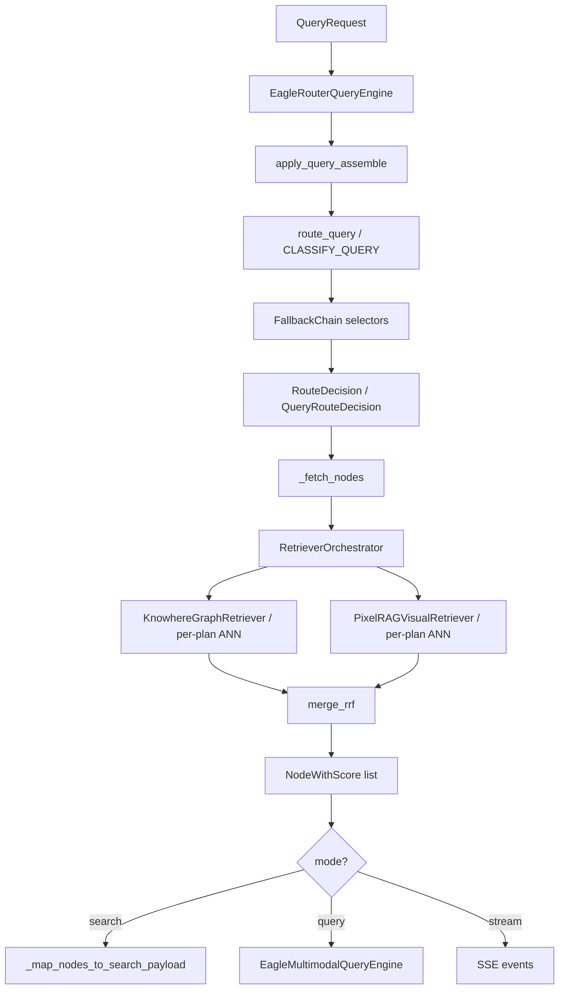

# 路由引擎

路由引擎决定**调用哪些检索模态与 Milvus collection**（文本、视觉、混合或域多 collection 计划），并编排完整查询路径：路由 → 检索 →（可选）生成。它位于 API 层与检索器/生成引擎之间。插件集成增加 `apply_query_assemble` 钩子、`QueryRouteClassifier`（`CLASSIFY_QUERY`）以及带 RRF 合并的 `RetrieverOrchestrator`。

**源模块：** `eagle_rag/router/router_engine.py`、`eagle_rag/router/selectors.py`、`eagle_rag/router/models.py`、`eagle_rag/router/llm_factory.py`、`eagle_rag/router/rerank_fusion.py`、`eagle_rag/plugins/retriever_orchestrator.py`、`eagle_rag/plugins/hotpath_hooks.py`

查询路径与 G4 Core 默认见[插件架构](../architecture/plugin-architecture.md)。

---

## 1. 理论背景

### 1.1 自适应检索路由

并非每个查询都适合同一检索策略。文本密集政策问题需要稠密段落检索；读图问题需要视觉瓦片搜索；复杂问题可能需要**混合**检索合并两模态。自适应路由是活跃研究领域（Ma 等，*Query Rewriting for Retrieval-Augmented LLMs*，arXiv:2310.03135；Self-RAG 中的自路由，Asai 等，arXiv:2310.11511）。

Eagle-RAG 将路由实现为选择器的 **FallbackChain** — 在昂贵检索前毫秒级运行的规则 + LLM 增强分类器。

### 1.2 多索引检索

混合模式查询两个独立向量索引（`eagle_text` 1536 维 cosine，`eagle_visual` 2048 维 IP）并合并结果。域插件可添加专用 collection；`RetrieverOrchestrator` 每 `CollectionQueryPlan` 跑 ANN 并用 **RRF**（`eagle_rag/router/rerank_fusion.py`）合并 — 永不使用原始跨嵌入分数。Core 默认（G4）永不自动查询专用 collection。

### 1.3 双编码器召回 vs 交叉编码器重排

路由处理**召回路由**（查哪些索引）。**精度精炼**（重排）委托给生成引擎的交叉编码器 — 将快速双编码器召回与较慢交叉编码器重排分离（Nogueira & Cho，arXiv:1901.04085）。

### 1.4 Scope 约束检索

高级 scope 过滤实现**元数据过滤 ANN** — 在向量相似度之前按租户（`kb_name`）、文档集或关键词标签预过滤搜索空间。遵循 Milvus 混合搜索支持的过滤向量搜索模式（Milvus 文档：标量过滤 + ANN）。

---

## 2. 架构



两个类：

| 类 | 角色 |
|-------|------|
| `route_query()` | 模态路由决策（无检索） |
| `QueryRouteClassifier` / `CLASSIFY_QUERY` | 多 collection 计划选择（域插件） |
| `EagleRouterQueryEngine` | 查询组装 → 路由 → 检索（编排器）→ search/query/stream |

---

## 3. 代码走读：查询路由选择器

**文件：** `eagle_rag/router/selectors.py`

### 3.1 FallbackChain 顺序

| # | 选择器 | 何时决定 | 何时返回 None |
|---|----------|-------------|-------------------|
| 1 | `ForcedModeSelector` | `mode=text/visual/hybrid` | `mode=auto` |
| 2 | `AttachmentSelector` | 用户附加文档 | 无文档附件 |
| 3 | `LLMIntentSelector` | LLM 分类查询意图 | LLM 禁用/失败 |
| 4 | `HeuristicSelector` | 关键词规则 | 永不（总有决定） |

所有选择器经构造器注入配置（选择器内无全局 `get_settings()` — 可测试）。

### 3.2 ForcedModeSelector

映射显式 API `mode` 参数：

```python
mode="text"    → selected=["text"]
mode="visual"  → selected=["visual"]
mode="hybrid"  → selected=["text", "visual"]
mode="auto"    → None (defer)
```

当 `filters.pipeline == "knowhere"` 时也触发 → text，`"pixelrag"` → visual。

### 3.3 AttachmentSelector

当 `has_doc_attachments=True`（解析附件含文档文件）时强制混合检索 — 附件可能同时含文本与视觉内容。

### 3.4 LLMIntentSelector

经 DashScope 调用 DeepSeek，使用 `settings.router.llm.prompt_template`：

```
判断以下查询应使用哪种检索方式，只回复一个单词：text、visual 或 hybrid。
查询：{query}
```

解析响应中的 `text`、`visual` 或 `hybrid`。失败 → `None`（落到启发式）。

遥测：`ai_logger.info("llm_intent", model=..., latency_ms=...)`。

### 3.5 HeuristicSelector

`settings.router.heuristic.rules` 的首匹配关键词规则：

| 关键词（示例） | 路由 |
|-------------------|-------|
| 架构图, diagram, figure | hybrid |
| 表格, 报表, chart, table | visual |
| 政策, 法规, policy, law | text |
| 工商, 招投标, bid, tender | visual |

无关键词匹配时默认：`settings.router.heuristic.default`（text）。

### 3.6 RouteDecision 模型

```python
@dataclass
class RouteDecision:
    mode: str           # auto | text | visual | hybrid
    selected: list[str] # ["text"] | ["visual"] | ["text", "visual"]
    reason: str         # human-readable explanation
    kb_name: str | None
    selector: str       # forced | attachment | llm | heuristic | default
```

---

## 4. 代码走读：EagleRouterQueryEngine

**文件：** `eagle_rag/router/router_engine.py`

### 4.1 构造

```python
EagleRouterQueryEngine(
    text_retriever=KnowhereGraphRetriever(top_k=5, kb_name=kb),
    visual_retriever=PixelRAGVisualRetriever(top_k=5, kb_name=kb),
    mode=settings.router.mode,
    top_k=5,
)
```

单例在 `eagle_rag/api/query.py` 应用启动时创建。

### 4.2 Scope 过滤解析（`_resolve_scope_filter`）

输入：`scope_filter: {kb_names, document_ids, tags}`。

1. 标签 → 文档 ID，经 `resolve_tags_to_document_ids(tags, cap=max_scope_documents)`。
2. 并集显式列表与标签解析的文档 ID。
3. 返回 `(kb_names, document_ids, active)`。

当 `active=True` 时，检索器**重新实例化**，scope 参数下推到 Milvus。

### 4.3 检索编排（`_fetch_nodes`）

路由前，`apply_query_assemble` 运行 `QUERY_ASSEMBLE` 钩子（当 `plugins.query_assemble_enabled`）。

基于 `RouteDecision.selected` 与 `QueryRouteDecision` 计划：

```python
if "text" in selected:
    nodes.extend(text_retriever.retrieve(query))  # 或每计划 RetrieverOrchestrator
if "visual" in selected:
    nodes.extend(visual_retriever.retrieve(query))
```

域插件活跃时，`_fetch_nodes` 委托 `RetrieverOrchestrator.retrieve()`：

1. `QUERY_DENSE_EXPAND`（first）— 稠密改写 + 稀疏词项 + `retrieval_hints` 中的 `QueryRetrievalIntent`。
2. 每 `CollectionQueryPlan` 跑 ANN（尽力而为）；当 collection 在 `router.hybrid_text_collections` 或 `EncoderRegistry.CollectionProfile.hybrid_enabled` 时做 hybrid 融合。
3. 分路 `RERANK`（first）— Tier-1 领域重排。
4. `RETRIEVE_SUPPLEMENT`（all）— 实体锚定等补充命中。
5. RRF 合并 + 去重（`merge_rrf`）。
6. `RRF_POST_MERGE`（first）— 合并重排前可选候选注入。
7. `RERANK_MERGED`（first）或按 `RerankPolicy` 走 Core `qwen3-rerank`。

Core 在此路径上不 import 领域插件；领域逻辑均经 hook 注册。见[插件架构](../architecture/plugin-architecture.md) § 查询路径。

**Core 默认（G4）：** 仅 `eagle_text`（混合/图像时加 `eagle_visual`）。专用 collection 需域 `CLASSIFY_QUERY` 或 scope 感知 `collections_used` catalog 并集。

检索器选择逻辑：

| 条件 | 检索器配置 |
|-----------|-----------------|
| `scope_filter` 活跃 | 新检索器，`kb_names` + `document_ids` |
| 分面过滤或 `kb_name` | 新检索器，单 `kb_name` + 分面 |
| 默认 | 构造器中的单例检索器 |

每次检索器调用包在 `trace_span("retrieve.text")` / `trace_span("retrieve.visual")` 中，异常隔离（失败 → 跳过模态，记录警告）。

### 4.4 附件准备（`_prepare_attachments`）

经 `attachments.parser.parse_attachments()` 惰性解析附件 ID：

- 文本节点前置，`score=1.0`（始终包含）。
- 图像文档单独传给生成引擎。
- 为路由设置 `has_doc_attachments`。

### 4.5 API 模式

| 方法 | LLM | SSE 事件 |
|--------|-----|-----------|
| `search()` | 否 | 否 |
| `search_stream()` | 否 | step, sources, done |
| `query()` | 是（VLM） | 否 |
| `query_stream()` | 是（VLM） | session, step, sources, token, done |

纯搜索在过滤与 scope 上与生成查询**完全对等**。

### 4.6 来源映射（`_map_nodes_to_search_payload`）

将节点拆为 text/image，经 `EagleMultimodalQueryEngine._text_source()` / `_image_source()` 映射，返回：

```json
{
  "sources": {"text": [...], "image": [...]},
  "route": {"mode", "selected", "reason", "selector"},
  "steps": [{"name": "route", ...}, {"name": "recall", "text_count", "visual_count"}]
}
```

---

## 5. Milvus 过滤表达式（经检索器）

路由引擎不直接构建 Milvus 表达式 — 它配置将过滤器下推的检索器。

**单租户：**

```
kb_name == "finance"
```

**Scope 并集（OR）：**

```
(kb_name in ["finance", "pharma"] or document_id in ["doc-1", "doc-2"])
```

**带分面（AND）：**

```
kb_name == "finance" and source_type == "policy" and year == 2025
```

完整 schema 参考见 [retrieval](retrieval.md) 与 [vector-stores](vector-stores.md)。

---

## 6. LlamaIndex 集成

| LlamaIndex 类型 | 在路由中的用法 |
|-----------------|----------------|
| `NodeWithScore` | 统一检索输出 |
| `TextNode` / `ImageNode` | 拆分用于来源映射 |
| `CustomQueryEngine` | 生成委托给 `EagleMultimodalQueryEngine` |
| `MetadataFilters` | 在检索器内构建，非路由 |

路由引擎本身**不是** LlamaIndex 查询引擎 — 它编排检索器并将生成委托给 `EagleMultimodalQueryEngine`（扩展 `CustomQueryEngine`）。

---

## 7. 设计张力与调优

| 张力 | 选择器 / 方法 | 行为 | 调节 |
| --- | --- | --- | --- |
| **LLM vs 启发式路由** | `LLMIntentSelector` → `HeuristicSelector` 回退 | API key 缺失时相同查询 `selected` 不同 | 开发中设 `router.llm.enabled: false` 求确定性 |
| **附件强制混合** | `AttachmentSelector` | 上传文档即 text+visual，即使定义性问题 | 预期；延迟尖峰时降低视觉 `top_k` |
| **管线分面覆盖** | `_route_decision` 中 `filters.pipeline` | `knowhere` 管线过滤强制 `text`，无视 `mode=hybrid` | 在混用分面 + mode 的 API 客户端中文档化 |
| **Scope 过滤重建** | `use_scope_filter` 时 `_fetch_nodes` 构造新检索器 | 每请求 Milvus 过滤对象 — 正确但无连接复用 | 不可调；避免巨大 `document_ids` 列表 |
| **遗留 `scope` 后过滤** | ANN 后 `_filter_by_scope` | 先取全局邻居再丢弃 — 召回偏向语义匹配但越界的文档 | 客户端迁移到 `scope_filter` |
| **决策 vs 请求的 kb_name** | `route_query` kb 回退 | 选择器省略租户时 `RouteDecision.kb_name` 可能与检索器过滤不一致 | 始终在 `QueryRequest` 传 `kb_name` |
| **启发式关键词碰撞** | `config.router.heuristic.rules` 首匹配 | 金融关键词列表可能在非金融同形词上触发 | 每部署域专用 YAML 规则 |
| **G4 专用弃权** | Core `CLASSIFY_QUERY` | Core profile 永不查专用 collection | 启用域 profile + 分类器或 scope catalog 并集 |
| **RRF 延迟** | `RetrieverOrchestrator` 多计划 | N 个 collection → 合并前 N 次 ANN | 收窄 scope；监控每计划审计 |
| **QUERY_ASSEMBLE 降级** | 每订阅者 try/except | 钩子失败跳过；查询继续 | 在 admin health 检查 HookBus 审计 |

| **Search/query 对等** | `search()` vs `query()` 附件处理 | `/search` 忽略附件 — 与带文件的 `/query` 召回不同 | 附件重要时用 `/query` |

**延迟预算：** `route_query` 与 `apply_query_assemble` 同步且便宜；`_fetch_nodes` / `RetrieverOrchestrator` 占主导（N× ANN + embed_query）。优化选择器前先分析 `trace_span` `retrieve.text` / `retrieve.visual`。

---

## 8. 配置与调优

```yaml
router:
  mode: auto                    # auto | text | visual | hybrid
  max_scope_documents: 500      # 标签 → doc_id 上限
  parent_doc_retrieval: true    # Core 两阶段 section_summary 下钻
  recall_top_k: 30              # 重排前每路 ANN 池大小
  hybrid_text_collections: []   # profile 覆盖，如 biomed: [eagle_text_biomed, eagle_text_medcpt]
  source_content_max_chars: 4000
  structure_max_nodes: 2000
  llm:
    enabled: true
    prompt_template: |
      判断以下查询应使用哪种检索方式...
  heuristic:
    rules:
      - keywords: [表格, chart, table]
        route: visual
      - keywords: [政策, policy, law]
        route: text
    default: text

plugins:
  query_assemble_enabled: true
  default_namespace: core
```

**环境覆盖：**

```
ROUTER_MODE=hybrid
ROUTER_LLM_ENABLED=false
ROUTER_MAX_SCOPE_DOCUMENTS=1000
```

**调优指南：**

| 场景 | 建议 |
|----------|---------------|
| 禁用 LLM 路由延迟 | `router.llm.enabled: false` |
| 所有查询强制视觉 | `router.mode: visual` |
| 域专用关键词 | 添加到 `heuristic.rules` |
| 大标签选择 | 提高 `max_scope_documents` |
| 领域 hybrid 稀疏 | 在 profile 设 `router.hybrid_text_collections` 或 `EncoderRegistry.register_collection(..., hybrid_enabled=True)` |
| 更小 API 载荷 | 降低 `source_content_max_chars` |

查询时覆盖：在 `QueryRequest` 传 `mode` 绕过全局设置。

---

## 9. 测试

**主要：** `tests/test_router_generation.py`

| 契约 | 验证 |
|----------|-------------|
| 强制模式路由 | `mode=text` → 仅文本检索器 |
| 启发式关键词 | 图表查询 → 选 visual |
| LLM 意图回退 | LLM 失败 → 启发式默认 |
| 混合检索 | 两检索器均调用，节点合并 |
| Scope 过滤下推 | 标签解析 → 检索器中的 document_ids |
| Search vs query 对等 | 相同过滤产生相同召回 |
| SSE 事件序列 | route → recall → sources → token → done |
| 附件混合 | 文档附件 → hybrid 路由 |

**相关：** `tests/test_retrievers.py`（隔离的检索器过滤契约）、`tests/plugins/test_hotpath_hooks.py`（QUERY_ASSEMBLE 接线）。

---

## 10. 遥测与追踪

每次路由决策发出：

```json
{"event": "route", "query": "...", "mode": "auto", "selected": ["text"], "reason": "heuristic: ...", "selector": "heuristic"}
```

OpenTelemetry span：`route`、`retrieve.text`、`retrieve.visual`（嵌套在查询 trace 下）。

---

## 11. 参考文献

- Asai 等，*Self-RAG: Learning to Retrieve, Generate, and Critique*，[arXiv:2310.11511](https://arxiv.org/abs/2310.11511)
- Ma 等，*Query Rewriting for Retrieval-Augmented LLMs*，[arXiv:2310.03135](https://arxiv.org/abs/2310.03135)
- Nogueira & Cho，*Passage Re-ranking with BERT*，[arXiv:1901.04085](https://arxiv.org/abs/1901.04085)
- Karpukhin 等，*Dense Passage Retrieval*，[arXiv:2004.04906](https://arxiv.org/abs/2004.04906)
- Milvus 过滤搜索：[milvus.io/docs/single-vector-search.md](https://milvus.io/docs/single-vector-search.md)
- LlamaIndex 查询引擎：[docs.llamaindex.ai/module_guides/deploying/query_engine](https://docs.llamaindex.ai/en/stable/module_guides/deploying/query_engine/)
