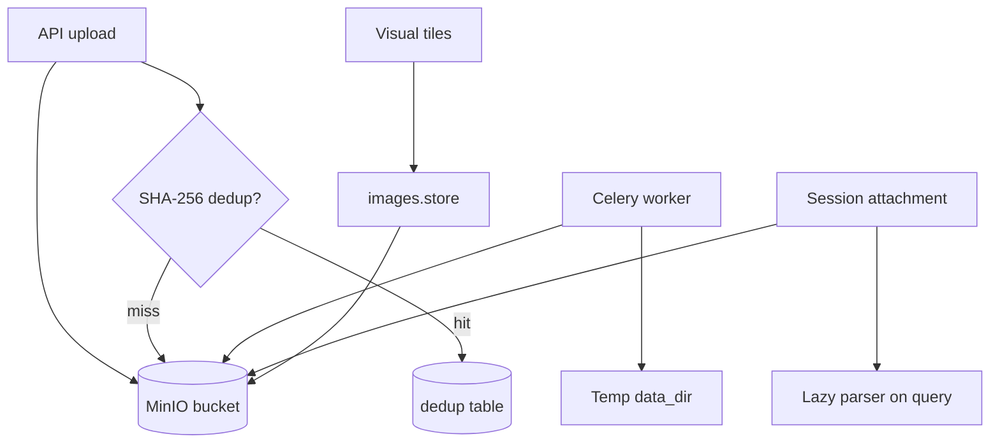

# 存储

Eagle-RAG 存储横跨三个后端：**MinIO**（S3 兼容对象存储，存放文件与 tile 图片）、**PostgreSQL**（去重索引与元数据）以及本地文件系统（worker 临时文件）。存储层提供内容寻址去重与会话级附件处理。

**源码模块：** `eagle_rag/storage/minio_client.py`、`eagle_rag/storage/dedup.py`、`eagle_rag/attachments/store.py`、`eagle_rag/attachments/parser.py`、`eagle_rag/images/store.py`

---

## 1. 理论背景

### 1.1 内容寻址存储

SHA-256 内容哈希实现**去重** —— 同一知识库内相同文件只索引一次（将 Merkle 树思想用于文档存储）。复合键 `(sha256, kb_name)` 允许相同内容存在于不同租户。

### 1.2 RAG 工件的对象存储

二进制工件（原始文档、渲染 tile JPEG）应放在对象存储，而非向量库。这遵循 **lambda 架构**模式：热路径（Milvus 近似最近邻）与冷路径（MinIO blob）分离。

### 1.3 懒解析附件

会话附件在查询时解析，而非上传时 —— 避免对临时上下文做不必要的 Milvus 写入。这是与永久 KB 入库不同的**查询时增强**（Lewis et al., arXiv:2005.11401）。

---

## 2. 架构



---

## 3. 代码走读：MinIO 客户端

**模块：** `eagle_rag/storage/minio_client.py`

| 函数 | 用途 |
|----------|---------|
| `ensure_bucket()` | 不存在则创建 bucket |
| `upload_file(key, path)` | 上传本地文件 |
| `upload_bytes(key, data)` | 上传内存字节 |
| `download_file(key, path)` | 下载到本地路径 |
| `presigned_url(key)` | 生成临时访问 URL |
| `delete_prefix(prefix)` | 批量删除（KB 清理） |

**Object key 约定：**

| 模式 | 内容 |
|---------|---------|
| `{source_type}/{document_id}/{filename}` | 已入库文档 |
| `{document_id}/visual_chunks/{chunk_id}.png` | Knowhere 视觉 chunk |
| `tiles/{image_id}.jpg` | PixelRAG tile 图片 |
| `attachments/{session_id}/{attachment_id}` | 会话附件 |

### 配置

```yaml
minio:
  endpoint: localhost:9000
  access_key: minioadmin
  secret_key: minioadmin
  bucket: eagle-rag
  secure: false
```

---

## 4. 代码走读：去重

**模块：** `eagle_rag/storage/dedup.py`

```python
sha256 = compute_sha256(file_path)          # streaming hash
dup = check_duplicate(sha256, kb_name=kb)   # PostgreSQL lookup
# ... on success:
dedup.register(sha256, document_id, kb_name=kb, ...)
```

**生命周期：**

1. 在入库入口检查（Celery 派发前）。
2. 仅在 `knowhere_parse` 成功后注册（失败时不阻塞重新上传）。
3. 同一文件在不同 KB → 独立去重记录（多租户）。

---

## 5. 代码走读：图片 store

**模块：** `eagle_rag/images/store.py`

```python
store_tile(image_id, document_id, data=bytes, kb_name=..., page=..., position=...)
# → {"url", "object_key", "local_path"}
```

由 `pixelrag_build` 与 `knowhere_visual_chunks` 任务共用。`get_image_bytes(image_id)` 在预签名 URL 不可达时提供字节回退（VLM 生成路径）。

---

## 6. 代码走读：附件

**模块：** `eagle_rag/attachments/store.py`、`eagle_rag/attachments/parser.py`

### 上传（`POST /attachments`）

1. 将会话前缀下的字节存入 MinIO。
2. 在 `attachments` 表记录并设置 TTL。
3. 返回 `attachment_id`。

### 懒解析（查询时）

```python
parse_attachments(attachment_ids) → ParsedAttachments(
    text_nodes=[TextNode(...)],     # metadata.source = "attachment"
    image_docs=[ImageDocument(...)],
)
```

- 文档使用 Knowhere 风格分块，纯文本直接读取。
- **不写 Milvus** —— 附件为临时查询上下文。
- 配置限制：`max_bytes`、`max_chunks`、`timeout_sec`、`chunk_size`。

解析器复用 `knowhere_adapter._meta()` 与 chunk 类型约定以保持一致。

---

## 7. 与 Milvus 的关系

存储层间接喂给 Milvus：

| 存储工件 | Milvus 字段 |
|-----------------|-------------|
| MinIO object key | `eagle_visual` 中的 `image_path` |
| 文档元数据 | `document_id`、`kb_name` 标量 |
| Knowhere chunk 文本 | `eagle_text` 中的 `text` 字段 |

过滤表达式引用存储衍生的标量：

```
document_id == "550e8400-..." and kb_name == "finance"
```

---

## 8. LlamaIndex 集成

| 组件 | 存储交互 |
|-----------|-------------------|
| `TextNode` | 由附件解析器或 Knowhere chunk 构建 |
| `ImageDocument` | 由附件图片或 Milvus 视觉命中构建 |
| `ImageNode.image_path` | 指向 MinIO 预签名 URL 或本地路径 |

附件节点携带 `metadata.source = "attachment"`，生成引擎在 prompt 中单独放入 `【用户附件】` 段。

---

## 9. 设计张力与调参

| 张力 | 组件 | 效果 | 缓解 |
| --- | --- | --- | --- |
| **内容哈希去重** | `dedup.compute_sha256` | 语义不同但字节相同则 dedup；重命名不重入库 | 改内容或版本文件以强制新 hash |
| **MinIO key 布局** | `{source_type}/{document_id}/{name}` | 移动对象破坏节点内 `source_uri` | 用 document API 下载，勿猜 key |
| **视觉 chunk sidecar** | `visual_chunks/{chunk_id}.html` | 表预览依赖 MinIO，与 Milvus 分离 | sidecar 缺失但文本节点在则重入库 |
| **附件 ephemeral** | `attachments/` 前缀，不入索引 | 客户端重复传 ID 则每 query 大上传 | 仅在同 session 持久化 attachment ID |
| **Tile PNG 体积** | `store_tile` quality + 尺寸 | 存储成本 ∝ 页数 × tile | 调 `pixelrag.quality` 与 `tile_height` |
| **去重短路** | 命中不发 Celery | 强制不重跑则 metadata（如 `source_type`）不刷新 | 删 dedup 行以 reprocess |

---

## 10. 配置与调优

```yaml
storage:
  data_dir: ./data          # Worker 临时文件
  image_store: ./data/images

attachments:
  ttl_hours: 24
  parse:
    max_bytes: 10485760     # 10 MB
    max_chunks: 50
    timeout_sec: 120
    cache_enabled: true
    chunk_size: 2000
```

---

## 11. 测试

| 测试文件 | 契约 |
|-----------|----------|
| `tests/test_attachments_parser.py` | 懒解析、chunk 限制、文本/图片提取 |
| `tests/test_api_kb_attachments_notifications_users.py` | 上传 + TTL |
| `tests/test_ingest_smoke.py` | 入库流程中的 MinIO 上传 |

---

## 12. 参考文献

- MinIO Python SDK: [min.io/docs/minio/linux/developers/python/minio-py.html](https://min.io/docs/minio/linux/developers/python/minio-py.html)
- Lewis et al., *Retrieval-Augmented Generation*, [arXiv:2005.11401](https://arxiv.org/abs/2005.11401)
- Content-addressed storage: [en.wikipedia.org/wiki/Content-addressable_storage](https://en.wikipedia.org/wiki/Content-addressable_storage)
