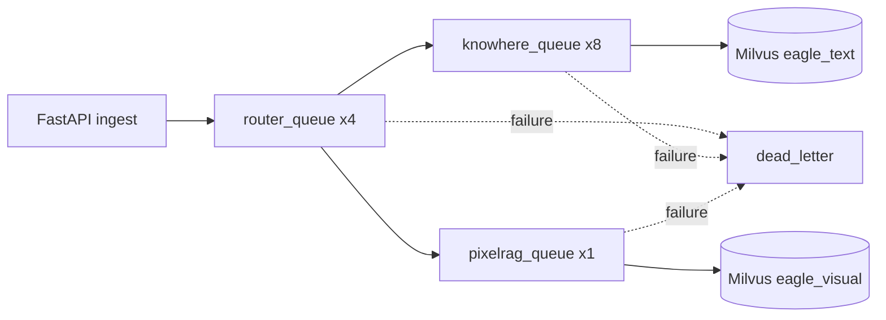

# 任务队列

Eagle-RAG 将文档入库卸载到由 Redis 支撑的 **Celery** worker。三条流水线队列隔离路由、Knowhere 解析与 PixelRAG 视觉编码负载。失败任务以指数退避重试，最终进入**死信队列**供管理端检查。

**源码模块：** `eagle_rag/tasks/celery_app.py`、`eagle_rag/tasks/dead_letter.py`、`eagle_rag/tasks/state.py`

---

## 1. 理论背景

### 1.1 RAG 流水线中的异步任务队列

文档入库 I/O 与计算密集（解析、嵌入、索引）。经**消息代理**（Redis）将入库与 API 解耦，可水平扩展、背压与容错 —— 生产 RAG 常见做法。

### 1.2 至少一次投递

Celery 在 `task_acks_late=True` 与 `task_reject_on_worker_lost=True` 下提供至少一次语义：worker 执行中途崩溃则任务重新入队。幂等写入（Milvus 按 PK upsert、去重延后到成功）防止重复副作用。

### 1.3 指数退避重试

瞬态失败（网络闪断、Knowhere 超时）适合**指数退避**重试 —— 减轻恢复服务的惊群（AWS Architecture Blog: exponential backoff and jitter）。

### 1.4 死信队列

达最大重试后，失败消息进入**死信队列（DLQ）**供人工检查与重放 —— 企业消息模式（Enterprise Integration Patterns: Dead Letter Channel）。

---

## 2. 队列拓扑



| 队列 | 并发 | 任务 | 瓶颈 |
|-------|------------|-------|-----------|
| `router_queue` | 4 | `ingest_router` | CPU（路由逻辑） |
| `knowhere_queue` | 8 | `knowhere_parse` | Knowhere SDK I/O |
| `pixelrag_queue` | 1 | `pixelrag_build`, `knowhere_visual_chunks` | GPU/CPU 视觉编码 |
| `dead_letter` | —（仅 admin） | 失败消息 | — |

---

## 3. 代码走读：celery_app.py

### 3.1 应用构造

```python
app = Celery(
    "eagle_rag",
    broker=settings.celery.broker_url,
    backend=settings.celery.result_backend,
    include=[
        "eagle_rag.ingest.router",
        "eagle_rag.ingest.knowhere_adapter",
        "eagle_rag.ingest.pixelrag_adapter",
        "eagle_rag.kb.lifecycle",
    ],
)
```

任务经 included 模块中 `@app.task` / `@with_retry` 注册。

### 3.2 队列声明

```python
app.conf.task_queues = (
    Queue("router_queue", routing_key="router_queue"),
    Queue("knowhere_queue", routing_key="knowhere_queue"),
    Queue("pixelrag_queue", routing_key="pixelrag_queue"),
)
app.conf.task_routes = settings.celery.task_routes
```

`settings.yaml` 任务路由：

```yaml
task_routes:
  eagle_rag.tasks.ingest_router: router_queue
  eagle_rag.tasks.knowhere_parse: knowhere_queue
  eagle_rag.tasks.pixelrag_build: pixelrag_queue
```

### 3.3 可靠性设置

| 设置 | 值 | 用途 |
|---------|-------|---------|
| `task_acks_late` | True | 完成后 ack |
| `worker_prefetch_multiplier` | 1 | 不囤积任务 |
| `task_reject_on_worker_lost` | True | 崩溃时重新入队 |
| `task_time_limit` | 3600s | 硬杀 |
| `task_soft_time_limit` | 3300s | 优雅清理窗口 |

### 3.4 遥测集成

- `worker_process_init` → `configure_telemetry()`
- `task_prerun` → 回退遥测初始化
- `register_celery_signals(app)` → OpenTelemetry trace 传播
- `send_task_with_trace()` 从 FastAPI 向 Celery 注入 trace 头

### 3.5 Celery Beat

```python
app.conf.beat_schedule = {
    "sample-queue-metrics": {
        "task": "eagle_rag.admin.metrics.sample_queue_metrics",
        "schedule": 30.0,
    },
}
```

每 30 秒采样队列深度到 `metric_samples` 表。

---

## 4. 代码走读：dead_letter.py

### 4.1 两种重试机制

| 机制 | 用法 | 行为 |
|-----------|-------|----------|
| `@with_retry` 装饰器 | 任务注册 | Celery `autoretry_for=(Exception,)`，指数退避 |
| `retry_on_failure(task, exc)` | try/except 内手动 | 显式 `task.retry()` 或 DLQ |

共用退避公式：

```
countdown = retry_backoff * (2 ** retries)
# Default: 60, 120, 240 seconds
```

### 4.2 `@with_retry` 装饰器

```python
@with_retry(name="eagle_rag.tasks.knowhere_parse", queue="knowhere_queue", bind=True)
def knowhere_parse(self, ...):
    ...
```

默认：

- `base=DeadLetterTask` — 耗尽后自动 DLQ
- `max_retries=3`
- `retry_backoff=60`
- `retry_backoff_max=60 * 2^3 = 480`
- `acks_late=True`

传 `base=None` 可禁用自动 DLQ，仅用 `retry_on_failure`。

### 4.3 DeadLetterTask 基类

```python
class DeadLetterTask(app.Task):
    def on_failure(self, exc, task_id, args, kwargs, einfo):
        send_to_dead_letter(task_id, self.name, payload, repr(exc))
```

autoretry 耗尽且异常传播时触发。

### 4.4 `retry_on_failure`

```python
if task.request.retries < max_retries:
    update_state(job_id, TaskState.RETRYING, ...)
    raise task.retry(exc=exc, countdown=countdown)
else:
    send_to_dead_letter(job_id, task.name, payload, repr(exc))
```

重试前审计更新为 `RETRYING`，耗尽为 `FAILED`。

### 4.5 死信队列操作

| 函数 | 用途 |
|----------|---------|
| `send_to_dead_letter(job_id, task_name, payload, error)` | 发布到 `dead_letter` 队列 |
| `drain_dead_letter(limit=100)` | Admin：拉取并 ack |
| `replay_dead_letter(job_id)` | 按 job_id 重新派发原任务 |

DLQ **不在** `task_queues` 中 —— 业务 worker 不消费。

---

## 5. 任务状态机

**模块：** `eagle_rag/tasks/state.py`

| 状态 | 含义 |
|-------|---------|
| `PENDING` | 审计已创建，未开始 |
| `RENDERING` | 路由 / 解析 / 渲染 |
| `EMBEDDING` | 向量编码中 |
| `INDEXING` | 写入 Milvus |
| `RETRYING` | 退避重试已调度 |
| `SUCCESS` | 流水线完成 |
| `FAILED` | 重试耗尽或致命错误 |

持久化在 `task_audit` PostgreSQL 表，含进度、日志项与错误消息。

### 子任务隔离

Knowhere 视觉 chunk 使用独立 job_id（`{parent_job_id}:visual`），避免与父任务终态 SUCCESS 的状态机冲突。

---

## 6. 已注册任务

| 任务名 | 队列 | 模块 |
|-----------|-------|--------|
| `eagle_rag.tasks.ingest_router` | router_queue | `ingest/router.py` |
| `eagle_rag.tasks.knowhere_parse` | knowhere_queue | `ingest/knowhere_adapter.py` |
| `eagle_rag.tasks.pixelrag_build` | pixelrag_queue | `ingest/pixelrag_adapter.py` |
| `eagle_rag.tasks.knowhere_visual_chunks` | pixelrag_queue | `ingest/pixelrag_adapter.py` |
| `eagle_rag.admin.metrics.sample_queue_metrics` | (beat) | `admin/metrics.py` |

`kb/lifecycle.py` 中 KB 生命周期任务（delete、rebuild）亦经 `include` 注册。

---

## 7. Milvus 交互（经任务）

任务不构建 Milvus 过滤表达式 —— 只写向量：

| 任务 | Milvus 写入 |
|------|-------------|
| `knowhere_parse` | `upsert_text_nodes()` → `eagle_text` |
| `pixelrag_build` | `upsert_visual()` → `eagle_visual` |
| `knowhere_visual_chunks` | 带融合锚定的 `upsert_visual()` |

入库时写入标量（`kb_name`, `source_type`, `document_id`），供检索时过滤。

---

## 8. LlamaIndex 集成

Celery 任务产出 LlamaIndex `TextNode`（Knowhere 路径），经 `VectorStoreIndex.insert_nodes()` 插入。视觉任务绕过 LlamaIndex，直接 pymilvus 写入。

任务队列本身无 LlamaIndex 依赖 —— 集成在任务实现内部。

---

## 9. 设计张力与调参

| 张力 | Celery / 任务行为 | 风险 | 缓解 |
| --- | --- | --- | --- |
| **至少一次 upsert** | `acks_late` + `max_retries` | 重试时同一 tile `image_id` upsert 两次 —— ID 确定则安全 | 勿随机化 `image_id` 后缀 |
| **ready 后的视觉** | `knowhere_visual_chunks` 晚于 `update_status(ready)` | 视觉索引未完成用户已查询 | 表面视觉子任务的任务审计 |
| **Poll 超时 vs 文档大小** | `knowhere_parse` 阻塞 SDK poll | 默认 1800s 仍可能在大 Excel 上失败 | 拆分源文件；有意识提高 timeout |
| **Router 扇出** | `ingest_router` 发 N 个 pipeline 任务 | Hybrid 入库双倍队列负载 | 同时监控 `knowhere_queue` 与 `pixelrag_queue` 深度 |
| **死信重放** | `replay_dead_letter` 再派发 | 临时文件消失时 `local_path` 过期 | 仅重放有效 `object_key` 的近期 DLQ |
| **Beat 指标采样** | 30s `sample_queue_metrics` | 采样间隔内积压尖峰不可见 | 事故响应用 Redis `LLEN` |
| **Worker 时限** | 默认 `task_time_limit` 1h | 长 PixelRAG PDF 可能在 embed 中途硬杀 | 拆 PDF 或留内存余量提高 limit |
| **Prefetch=1 公平** | `worker_prefetch_multiplier=1` | 每 worker 吞吐低于 Celery 默认 | 扩 worker 数，勿提 prefetch |

**OOM 张力（视觉 worker）：** `embed_tiles` 加载 Qwen3-VL 权重 + batch 图像 —— concurrency >1 成倍 peak RSS。提高 worker 并发前先调 `pixelrag.tile_height`。

---

## 10. 配置与调优

```yaml
celery:
  broker_url: redis://localhost:6379/0
  result_backend: redis://localhost:6379/1
  max_retries: 3
  retry_backoff: 60
  task_routes:
    eagle_rag.tasks.ingest_router: router_queue
    eagle_rag.tasks.knowhere_parse: knowhere_queue
    eagle_rag.tasks.pixelrag_build: pixelrag_queue
  queues:
    router_queue: { concurrency: 4 }
    knowhere_queue: { concurrency: 8 }
    pixelrag_queue: { concurrency: 1 }
```

**Worker 启动：**

```bash
# Router workers
celery -A eagle_rag.tasks.celery_app worker -Q router_queue -c 4

# Knowhere workers
celery -A eagle_rag.tasks.celery_app worker -Q knowhere_queue -c 8

# PixelRAG workers (GPU recommended)
celery -A eagle_rag.tasks.celery_app worker -Q pixelrag_queue -c 1

# Beat (metrics)
celery -A eagle_rag.tasks.celery_app beat
```

**调优指南：**

| 场景 | 动作 |
|----------|--------|
| Knowhere 入库积压 | 扩展 `knowhere_queue` worker |
| 视觉编码 GPU OOM | `pixelrag_queue` 并发保持 1 |
| 频繁瞬态失败 | 增大 `max_retries` 或 `retry_backoff` |
| 长 PDF 解析超时 | 增大 `task_time_limit`（默认 1h） |
| 监控队列深度 | 启用 Celery Beat + admin 指标面板 |

---

## 11. 测试

| 测试文件 | 契约 |
|-----------|----------|
| `tests/test_ingest_smoke.py` | 派发到正确队列 |
| `tests/test_ingest_assets.py` | Router 任务路由矩阵 |
| `tests/test_api_ingest_queue_metrics.py` | 队列指标采样 |
| `tests/test_telemetry_tracing.py` | FastAPI → Celery trace 传播 |

---

## 12. 运维手册

### 检查失败任务

```python
from eagle_rag.ingest.runner import get_job_status
get_job_status("job-uuid")  # → task_audit record
```

### 排空死信队列

```python
from eagle_rag.tasks.dead_letter import drain_dead_letter, replay_dead_letter
records = drain_dead_letter(limit=50)
replay_dead_letter("job-uuid")  # re-dispatch
```

### 常见失败模式

| 错误 | 可能原因 | 修复 |
|-------|-------------|-----|
| KnowhereError | SDK/服务宕机 | 检查 Knowhere :5005 |
| ValueError embed provider | 视觉 provider 配置错误 | 设 `embedding.visual.provider: pixelrag` |
| SoftTimeLimitExceeded | 大文档 | 增大 time limit 或拆分文档 |
| MinIO download failure | object key 缺失 | 检查 API runner 上传 |

---

## 13. 参考文献

- Celery routing: [docs.celeryq.dev/en/stable/userguide/routing.html](https://docs.celeryq.dev/en/stable/userguide/routing.html)
- Celery retry: [docs.celeryq.dev/en/stable/userguide/tasks.html#retry](https://docs.celeryq.dev/en/stable/userguide/tasks.html#retry)
- Dead letter pattern: [enterpriseintegrationpatterns.com/DeadLetterChannel.html](https://www.enterpriseintegrationpatterns.com/patterns/messaging/DeadLetterChannel.html)
- Milvus upsert: [milvus.io/docs/insert_upsert_en.md](https://milvus.io/docs/insert_upsert_en.md)
- OpenTelemetry Celery: [opentelemetry.io/docs/instrumentation/python/celery](https://opentelemetry.io/docs/instrumentation/python/celery/)
