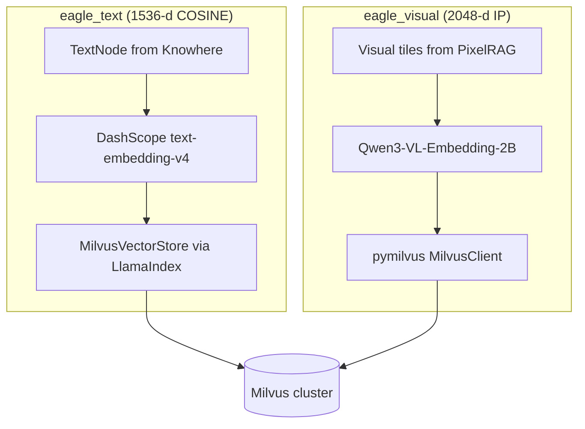

# 向量存储

Eagle-RAG 在单一 Milvus 集群上持久化两个 collection 的嵌入：**`eagle_text`**（1536 维文本，LlamaIndex 管理）与 **`eagle_visual`**（2048 维视觉 tile，pymilvus 管理）。PostgreSQL 存放文档 registry、去重索引与标签 catalog。

**源码模块：** `eagle_rag/index/milvus_text_store.py`、`eagle_rag/index/milvus_visual_store.py`、`eagle_rag/index/registry.py`、`eagle_rag/index/tag_catalog.py`

---

## 1. 理论背景

### 1.1 近似最近邻（ANN）索引

向量库用 ANN 算法亚线性搜索高维空间。Milvus 支持 **HNSW**（Hierarchical Navigable Small World；Malkov & Yashunin, arXiv:1603.09320）与 **DiskANN** 应对十亿级语料。Eagle-RAG 两 collection 默认 HNSW。

### 1.2 双编码器非对称检索

文本嵌入使用**非对称** query/document 编码（`text_type=query` vs `document`）—— 双编码器系统中可提升检索（Khattab & Zaharia, *ColBERT*, arXiv:2004.12832；商业 API 如 Cohere/Qwen 亦采用）。

### 1.3 跨模态向量空间

视觉向量（2048 维，内积）与文本向量（1536 维，余弦）处于**不同空间**。跨模态对齐在 VLM 嵌入模型层（Qwen3-VL）完成，而非共享 Milvus collection —— **双索引**架构。

### 1.4 元数据过滤的混合搜索

Milvus 支持**过滤的近似最近邻**：标量谓词（如 `kb_name == "finance"`）在向量搜索前/中应用。标量字段倒排索引加速过滤（Milvus 文档：INVERTED 索引类型）。

### 1.5 标量分区多租户

`kb_name` 作为标量过滤字段实现逻辑多租户，无需每租户独立 collection —— Milvus 多租户指南推荐模式。

---

## 2. 双 collection 架构



| Collection | 维度 | 度量 | 索引 | 管理者 |
|------------|-----|--------|-------|-----------|
| `eagle_text` | 1536 | COSINE | HNSW（LlamaIndex 默认） | `llama-index-vector-stores-milvus` |
| `eagle_visual` | 2048 | IP | HNSW M=16, efConstruction=256 | `pymilvus.MilvusClient` |

---

## 3. 代码走读：milvus_text_store.py

### 3.1 嵌入模型

`_DimensionalDashScopeEmbedding` 子类修复 LlamaIndex 向 DashScope API 转发 `dimension` 的缺陷：

```python
dashscope.TextEmbedding.call(
    model="text-embedding-v4",
    input=texts,
    text_type="document",  # query side uses "query"
    dimension=1536,
)
```

批大小上限 10（DashScope API 限制）。

### 3.2 单例

| 函数 | 返回 |
|----------|---------|
| `get_text_vector_store()` | `MilvusVectorStore(uri, collection_name, dim=1536, metric=COSINE)` |
| `get_text_index()` | `VectorStoreIndex.from_vector_store(store, embed_model)` |

懒初始化 —— import 时不连 Milvus。

### 3.3 写入路径

```python
upsert_text_nodes(nodes: list[TextNode]) -> list[str]:
    index = get_text_index()
    index.insert_nodes(nodes)
    return [n.node_id for n in nodes]
```

LlamaIndex 将完整节点内容存于 `_node_content` JSON 字段，并提升标量元数据。

### 3.4 读取路径

两种访问模式：

1. **经检索器：** `VectorStoreIndex.as_retriever()` → 近似最近邻 + MetadataFilters。
2. **直接搜索：** `search_text(query, top_k, kb_name, source_type)` → 手动 `VectorStoreQuery`。

### 3.5 管理操作

| 函数 | 用途 |
|----------|---------|
| `count_text(kb_name?)` | 按租户实体数 |
| `delete_text_by_kb(kb_name)` | 级联 KB 删除 |
| `fetch_text_nodes_by_kb(kb_name)` | 重建索引源数据 |
| `fetch_text_nodes_by_document_id(...)` | 结构重建 |
| `reindex_kb_text(kb_name)` | 不重新解析而重嵌入 |

### 3.6 结构 fetch 回退

`fetch_text_nodes_by_document_id` 先尝试标量过滤（`document_id`, `doc_id`），再回退范围扫描 + 客户端 `_node_content` 过滤 —— 处理 `document_id` 标量为空的历史行。

---

## 4. 代码走读：milvus_visual_store.py

### 4.1 Schema 创建（`ensure_collection`）

幂等：缺失时创建 collection + 索引，并迁移旧 schema。

**字段：**

| 字段 | DataType | 说明 |
|-------|----------|-------|
| `id` | VARCHAR(64) PK | 同 `image_id` |
| `vector` | FLOAT_VECTOR(2048) | |
| `image_path` | VARCHAR(512) | MinIO key |
| `image_id` | VARCHAR(64) | |
| `document_id` | VARCHAR(64) | |
| `page` | INT64 nullable | |
| `position` | VARCHAR(64) nullable | 如 `strip_3` |
| `kb_name` | VARCHAR(64) | 默认 `default` |
| `year` | INT64 nullable | |
| `source_type` | VARCHAR(32) nullable | |
| `chunk_type` | VARCHAR(16) | 默认 `tile` |
| `parent_section` | VARCHAR(512) nullable | 融合锚定 |
| `content_summary` | VARCHAR(2048) nullable | 融合锚定 |
| `source_chunk_id` | VARCHAR(128) nullable | 融合锚定 |

### 4.2 索引参数

**HNSW（默认）：**

```python
{
    "index_type": "HNSW",
    "metric_type": "IP",
    "params": {"M": 16, "efConstruction": 256},
}
# Search: {"metric_type": "IP", "params": {"ef": 64}}
```

**DiskANN：**

```python
{"index_type": "DISKANN", "metric_type": "IP", "params": {}}
```

**标量倒排索引：** `kb_name`, `document_id`, `source_type`, `year`, `chunk_type`, `parent_section`。

### 4.3 搜索（`search_visual`）

```python
client.search(
    collection_name="eagle_visual",
    data=[query_vector],
    anns_field="vector",
    search_params={"metric_type": "IP", "params": {"ef": 64}},
    limit=top_k,
    filter=expr,  # boolean expression
    output_fields=[...],
)
```

### 4.4 过滤器构建（`_build_search_expr`）

构建带 AND/OR 语义的布尔表达式：

```python
# Single tenant
'kb_name == "finance" and source_type == "financial"'

# Scope union
'(kb_name in ["finance", "pharma"] or document_id in ["doc-1"]) and year in [2024, 2025]'

# Fusion anchor
'chunk_type == "table" and parent_section like "%Balance Sheet%"'
```

---

## 5. Milvus 过滤表达式参考

### 5.1 文本 collection（经 LlamaIndex MetadataFilters）

LlamaIndex 自动将过滤翻译为 Milvus expr：

| MetadataFilter | Milvus expr |
|---------------|-------------|
| `EQ kb_name="finance"` | `kb_name == "finance"` |
| `IN kb_name=["a","b"]` | `kb_name in ["a", "b"]` |
| `EQ source_type="policy"` | `source_type == "policy"` |
| `EQ year=2025` | `year == 2025` |

用 `FilterCondition.AND` / `OR` 组合。

**直接 expr 示例：**

```
kb_name == "default" and type == "section_summary"
```

```
document_id == "550e8400-e29b-41d4-a716-446655440000" and type in ["text", "table"]
```

```
path like "Annual Report/Chapter 3%"
```

### 5.2 视觉 collection（直接 expr）

```
kb_name == "pharma" and chunk_type == "tile" and year == 2025
```

```
document_id == "abc-123"
```

```
(kb_name in ["finance"] or document_id in ["doc-x", "doc-y"]) and source_type == "financial"
```

```
parent_section like "%Model Architecture%" and source_chunk_id == "chunk_img_42"
```

### 5.3 转义

用户字符串经 `_escape_milvus_str()`（双引号反斜杠）转义后再插值。

---

## 6. LlamaIndex 集成

### 6.1 文本路径

```
TextNode → VectorStoreIndex.insert_nodes()
         → MilvusVectorStore (collection=eagle_text)
         → ANN search via as_retriever(filters=MetadataFilters)
         → NodeWithScore
```

**关键映射：**

| LlamaIndex | Milvus |
|-----------|--------|
| `node_id` | Primary key / `id` |
| `node.text` | `text` field |
| `node.metadata.*` | Dynamic scalar fields |
| `_node_content` | Full JSON serialization |

### 6.2 视觉路径（非 LlamaIndex）

视觉向量绕过 LlamaIndex vector store。检索时 `PixelRAGVisualRetriever._to_node_with_score()` 从 Milvus 命中 dict 构建 `ImageNode` —— 将 pymilvus 结果桥接到 LlamaIndex 节点类型供下游生成。

`eagle_visual` 由 `pymilvus` 管理，因锚定字段（`parent_section`、`chunk_type` 等）与 Qwen3-VL 2048 维 IP 索引无法干净映射到 LlamaIndex `MilvusVectorStore` 默认行为。运维后果见 **§8 设计张力**。

---

## 7. PostgreSQL 文档 registry

**模块：** `eagle_rag/index/registry.py`

| 字段 | 用途 |
|-------|---------|
| `document_id` | UUID 主键 |
| `name` | 显示文件名 |
| `source_type` | policy/financial/... |
| `pipeline` | knowhere/pixelrag/combined |
| `kb_name` | 租户键 |
| `status` | pending/indexing/ready |
| `chunk_count` | 已索引节点数 |
| `extra` | JSONB（doc_nav 树） |
| `sha256` | 内容哈希 |

Registry 是文档生命周期的**权威来源**；Milvus 存可搜索向量。

### 标签 catalog

**模块：** `eagle_rag/index/tag_catalog.py`

`document_keywords` 表映射 `(document_id, keyword, kb_name)`，供查询时范围标签解析。

---

## 8. 设计张力与调参

| 张力 | 机制（`milvus_*_store.py`） | 会出什么问题 | 调节 |
| --- | --- | --- | --- |
| **ANN 召回 vs p99** | `_search_params`：HNSW `ef=64`（视觉）；文本走 LlamaIndex 默认 | 用户看到「UI 里有 chunk 但答案里没有」 | 先提高 `ef` 再提高 `top_k`；分析 Milvus `search` 延迟 |
| **构建 vs 搜索质量** | 建 collection 时固定 `M=16`、`efConstruction=256` | 改参后重建索引需重新入库或 rebuild 任务 | 大批量回填前规划好索引参数 |
| **DiskANN vs HNSW** | `visual_index_type: diskann` | RAM 上限更低；冷段 tail 延迟更高 | 在 `count_visual` 超 RAM 预算时再切换，勿 preemptive |
| **度量语义** | 文本 COSINE vs 视觉 L2 归一化后 IP | 把 text/visual `score` 合并排序无意义 —— router 保持分列表 | 遥测中按模态比较排名，勿比 raw score |
| **Schema 迁移影响面** | `ensure_collection` 缺 `kb_name` 字段时删 collection | 某升级路径会清空整个 `eagle_visual` | 部署前备份；迁移后跑 KB rebuild |
| **倒排索引可选** | 标量索引创建包在 try/except | 旧 Milvus → 过滤退化为 post-filter 扫描；过滤器丢失时有 `kb_name` 泄漏风险 | 升级后验证 `list_indexes` |
| **嵌入吞吐** | `_DimensionalDashScopeEmbedding` 中 DashScope batch 上限 10 | 大 Knowhere 文档 → 线性 embed API 往返 | 入库时间 ∝ `len(chunks)/10` |
| **Registry 漂移** | 任务里 `update_chunk_count` vs Milvus 真值 | 部分 upsert 失败后 `documents.chunk_count` ≠ Milvus 行数 | 信 UI 计数前先经 `GET /admin` / KB stats 对账 |
| **`parent_section LIKE`** | 512 字符 path 上的前缀/子串过滤 | 模式过宽拉无关 tile；过窄漏章节兄弟 | 调查询侧过滤；锚定 path 为层级（`a/b/c`） |

**症状 → 检查：**

- [ ] 仅视觉 QA 慢 → `ef`、每文档 tile 数、`embed_device`
- [ ] 错误租户命中 → **两** collection 上 `_build_filters` / `expr`
- [ ] 升级后搜索为空 → worker 启动日志中的 collection 重建

---

## 9. 配置与调优

```yaml
milvus:
  host: localhost
  port: 19530
  text_collection: eagle_text
  visual_collection: eagle_visual
  dim_text: 1536
  dim_visual: 2048
  visual_index_type: hnsw    # hnsw | diskann

embedding:
  text:
    model: text-embedding-v4
    dim: 1536
  visual:
    provider: pixelrag
    model: Qwen/Qwen3-VL-Embedding-2B
    dim: 2048

kb:
  text_entity_limit: 500000
  visual_entity_limit: 200000
```

**调优指南：**

| 场景 | 建议 |
|----------|---------------|
| >100 万视觉 tile | 切换 `diskann` |
| 更高视觉召回 | 增大 HNSW 搜索 `ef`（64 → 128） |
| 更快视觉构建 | 降低 `efConstruction`（256 → 128） |
| 模型维度变更 | **必须**删建 collection |
| KB 重建 | 文本 `reindex_kb_text(kb_name)`；视觉需重新入库 |
| 多租户隔离 | 始终过滤 `kb_name` —— 勿依赖 collection 分离 |

---

## 10. 测试

| 测试文件 | 契约 |
|-----------|----------|
| `tests/test_retrievers.py` | MetadataFilters 过滤下推到 Milvus |
| `tests/test_milvus_structure_fetch.py` | `fetch_text_nodes_by_document_id` 标量 + 回退 |
| `tests/test_knowhere_sections.py` | Milvus 中章节节点元数据 |
| `tests/test_api_admin_health.py` | 健康检查中的 Milvus 连通性 |

---

## 11. 生命周期操作

### 11.1 KB 删除

`kb/lifecycle.py` 编排：

1. `delete_text_by_kb(kb_name)` — Milvus 文本
2. `delete_visual_by_kb(kb_name)` — Milvus 视觉
3. PostgreSQL 级联（documents, keywords, dedup）
4. MinIO 前缀清理

### 11.2 重建索引

文本：`reindex_kb_text()` — 取现有 text/metadata，删旧向量，用当前模型设置重嵌入。

视觉：无重建捷径 —— 需重新入库（渲染 + 嵌入计算重）。

### 11.3 迁移

视觉 store 处理 schema 迁移：

- 缺失 `kb_name` → 删建（旧版 Milvus 无法 ALTER ADD）。
- 新融合字段 → `add_collection_field()` + 倒排索引回填。

---

## 12. 参考文献

- Malkov & Yashunin, *Efficient and Robust Approximate Nearest Neighbor Search Using HNSW*, [arXiv:1603.09320](https://arxiv.org/abs/1603.09320)
- Khattab & Zaharia, *ColBERT*, [arXiv:2004.12832](https://arxiv.org/abs/2004.12832)
- Karpukhin et al., *Dense Passage Retrieval*, [arXiv:2004.04906](https://arxiv.org/abs/2004.04906)
- Milvus HNSW index: [milvus.io/docs/index.md](https://milvus.io/docs/index.md)
- Milvus DiskANN: [milvus.io/docs/diskann.md](https://milvus.io/docs/diskann.md)
- Milvus boolean expressions: [milvus.io/docs/boolean.md](https://milvus.io/docs/boolean.md)
- Milvus INVERTED index: [milvus.io/docs/index.md#inverted-index](https://milvus.io/docs/index.md)
- LlamaIndex MilvusVectorStore: [docs.llamaindex.ai/examples/vector_stores/MilvusIndexDemo](https://docs.llamaindex.ai/en/stable/examples/vector_stores/MilvusIndexDemo/)
- LlamaIndex metadata filters: [docs.llamaindex.ai/en/stable/examples/vector_stores/pinecone_metadata_filter](https://docs.llamaindex.ai/en/stable/examples/vector_stores/pinecone_metadata_filter/)
