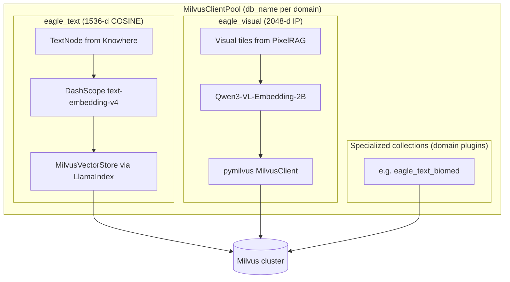

# 向量存储

Eagle-RAG 将嵌入持久化在**按域 Database** 内的 Milvus collection 中。每个域的基础 collection：**`eagle_text`**（1536 维文本，LlamaIndex 管理）与 **`eagle_visual`**（2048 维视觉瓦片，pymilvus 管理）。域插件可添加专用 collection（如 `eagle_text_biomed`）。PostgreSQL 通过 repositories 持有文档 registry、去重索引与标签 catalog。

**源模块：** `eagle_rag/index/milvus_pool.py`、`eagle_rag/index/milvus_text_store.py`、`eagle_rag/index/milvus_visual_store.py`、`eagle_rag/index/registry.py`、`eagle_rag/index/tag_catalog.py`、`eagle_rag/db/repositories/`

域隔离与专用 collection 见[插件架构](../architecture/plugin-architecture.md)。

---

## 1. 理论背景

### 1.1 近似最近邻（ANN）索引

向量数据库使用 ANN 算法在亚线性时间内搜索高维空间。Milvus 支持 **HNSW**（Hierarchical Navigable Small World；Malkov & Yashunin，arXiv:1603.09320）与 **DiskANN** 面向十亿级语料。Eagle-RAG 默认对两个 collection 使用 HNSW。

### 1.2 双编码器非对称检索

文本嵌入使用**非对称**查询/文档编码（`text_type=query` vs `document`）— 该技术在双编码器系统中可提升检索（Khattab & Zaharia，*ColBERT*，arXiv:2004.12832；应用于 Cohere/Qwen 等商业 API）。

### 1.3 跨模态向量空间

视觉向量（2048 维，内积）与文本向量（1536 维，余弦）处于**不同空间**。跨模态对齐发生在 VLM 嵌入模型层（Qwen3-VL），而非共享 Milvus collection — **双索引**架构。

### 1.4 元数据过滤混合搜索

Milvus 支持**过滤 ANN**：标量谓词（如 `kb_name == "finance"`）在向量搜索前/中应用。标量字段上的倒排索引加速过滤（Milvus 文档：INVERTED 索引类型）。

### 1.5 通过标量分区实现多租户

`kb_name` 作为标量过滤字段，在单个 Milvus Database 内实现逻辑多租户 — Milvus 多租户指南推荐的模式。**域**隔离是物理的：每个 `plugin_namespace` 一个 Milvus Database，在 `MilvusClientPool` 客户端构造时绑定（无按请求 `using_database`）。

---

## 2. 双 collection 架构



| Collection | Dim | Metric | Index | 管理者 |
|------------|-----|--------|-------|-----------|
| `eagle_text` | 1536 | COSINE | HNSW（LlamaIndex 默认） | `llama-index-vector-stores-milvus` |
| `eagle_visual` | 2048 | IP | HNSW M=16, efConstruction=256 | `pymilvus.MilvusClient` |
| 插件 collection | 各异 | 按 manifest | 按插件 | `EncoderRegistry` + `UPSERT_VECTORS` 钩子 |

### 2.1 MilvusClientPool

**模块：** `eagle_rag/index/milvus_pool.py`

进程级 `MilvusClient(uri, db_name=)` 实例缓存：

| 方法 | 用途 |
|--------|---------|
| `get(db_name=..., plugin_namespace=...)` | 域 Database 的池化客户端 |
| `ensure_database(db_name)` | 当 `milvus.auto_create_db` 时创建 DB |
| `admin_client()` | 仅默认 DB 用于数据库管理 |

客户端在构造时绑定 — **切勿**对池化客户端调用 `close()` 或按请求切换 DB。Namespace → DB 映射：`eagle_rag/plugins/milvus_ns.py`。

---

## 3. 代码走读：milvus_text_store.py

### 3.1 嵌入模型

`_DimensionalDashScopeEmbedding` 子类修复 LlamaIndex 向 DashScope API 转发 `dimension` 的缺陷：

```python
dashscope.TextEmbedding.call(
    model="text-embedding-v4",
    input=texts,
    text_type="document",  # 查询侧使用 "query"
    dimension=1536,
)
```

批大小上限 10（DashScope API 限制）。

### 3.2 单例

| 函数 | 返回 |
|----------|---------|
| `get_text_vector_store()` | `MilvusVectorStore(uri, collection_name, dim=1536, metric=COSINE)` |
| `get_text_index()` | `VectorStoreIndex.from_vector_store(store, embed_model)` |

惰性初始化 — 导入时不连接 Milvus。

### 3.3 写入路径

```python
upsert_text_nodes(nodes: list[TextNode]) -> list[str]:
    index = get_text_index()
    index.insert_nodes(nodes)
    return [n.node_id for n in nodes]
```

LlamaIndex 将完整节点内容存入 `_node_content` JSON 字段，并提升标量元数据。

### 3.4 读取路径

两种访问模式：

1. **经检索器：** `VectorStoreIndex.as_retriever()` → ANN + MetadataFilters。
2. **直接搜索：** `search_text(query, top_k, kb_name, source_type)` → 手动 `VectorStoreQuery`。

### 3.5 管理操作

| 函数 | 用途 |
|----------|---------|
| `count_text(kb_name?)` | 按租户统计实体数 |
| `delete_text_by_kb(kb_name)` | 级联 KB 删除 |
| `fetch_text_nodes_by_kb(kb_name)` | 重索引源数据 |
| `fetch_text_nodes_by_document_id(...)` | 结构重建 |
| `reindex_kb_text(kb_name)` | 不重新解析即可重嵌入 |

### 3.6 结构获取回退

`fetch_text_nodes_by_document_id` 先尝试标量过滤（`document_id`、`doc_id`），再回退到带 `_node_content` 客户端过滤的范围扫描 — 处理 `document_id` 标量为空的历史行。

---

## 4. 代码走读：milvus_visual_store.py

### 4.1 Schema 创建（`ensure_collection`）

幂等：缺失时创建 collection + 索引，迁移旧 schema。

**字段：**

| 字段 | DataType | 说明 |
|-------|----------|-------|
| `id` | VARCHAR(64) PK | 与 `image_id` 相同 |
| `vector` | FLOAT_VECTOR(2048) | |
| `image_path` | VARCHAR(512) | MinIO 键 |
| `image_id` | VARCHAR(64) | |
| `document_id` | VARCHAR(64) | |
| `page` | INT64 nullable | |
| `position` | VARCHAR(64) nullable | 如 `strip_3` |
| `kb_name` | VARCHAR(64) | 默认 `default` |
| `year` | INT64 nullable | |
| `source_type` | VARCHAR(32) nullable | |
| `chunk_type` | VARCHAR(16) | 默认 `tile` |
| `parent_section` | VARCHAR(512) nullable | 融合锚点 |
| `content_summary` | VARCHAR(2048) nullable | 融合锚点 |
| `source_chunk_id` | VARCHAR(128) nullable | 融合锚点 |

### 4.2 索引参数

**HNSW（默认）：**

```python
{
    "index_type": "HNSW",
    "metric_type": "IP",
    "params": {"M": 16, "efConstruction": 256},
}
# 搜索：{"metric_type": "IP", "params": {"ef": 64}}
```

**DiskANN：**

```python
{"index_type": "DISKANN", "metric_type": "IP", "params": {}}
```

**标量倒排索引：** `kb_name`、`document_id`、`source_type`、`year`、`chunk_type`、`parent_section`。

### 4.3 搜索（`search_visual`）

```python
client.search(
    collection_name="eagle_visual",
    data=[query_vector],
    anns_field="vector",
    search_params={"metric_type": "IP", "params": {"ef": 64}},
    limit=top_k,
    filter=expr,  # 布尔表达式
    output_fields=[...],
)
```

### 4.4 过滤器构建（`_build_search_expr`）

构建带 AND/OR 语义的布尔表达式：

```python
# 单租户
'kb_name == "finance" and source_type == "financial"'

# Scope 并集
'(kb_name in ["finance", "pharma"] or document_id in ["doc-1"]) and year in [2024, 2025]'

# 融合锚点
'chunk_type == "table" and parent_section like "%Balance Sheet%"'
```

---

## 5. Milvus 过滤表达式参考

### 5.1 文本 collection（经 LlamaIndex MetadataFilters）

LlamaIndex 自动将过滤器翻译为 Milvus expr：

| MetadataFilter | Milvus expr |
|---------------|-------------|
| `EQ kb_name="finance"` | `kb_name == "finance"` |
| `IN kb_name=["a","b"]` | `kb_name in ["a", "b"]` |
| `EQ source_type="policy"` | `source_type == "policy"` |
| `EQ year=2025` | `year == 2025` |

与 `FilterCondition.AND` / `OR` 组合。

**直接 expr 示例：**

```
kb_name == "default" and type == "section_summary"
```

```
document_id == "550e8400-e29b-41d4-a716-446655440000" and type in ["text", "table"]
```

```
path like "Annual Report/Chapter 3%"
```

### 5.2 视觉 collection（直接 expr）

```
kb_name == "pharma" and chunk_type == "tile" and year == 2025
```

```
document_id == "abc-123"
```

```
(kb_name in ["finance"] or document_id in ["doc-x", "doc-y"]) and source_type == "financial"
```

```
parent_section like "%Model Architecture%" and source_chunk_id == "chunk_img_42"
```

### 5.3 转义

用户提供的字符串在插值前经 `_escape_milvus_str()`（双引号反斜杠）转义。

---

## 6. LlamaIndex 集成

### 6.1 文本路径

```
TextNode → VectorStoreIndex.insert_nodes()
         → MilvusVectorStore (collection=eagle_text)
         → ANN search via as_retriever(filters=MetadataFilters)
         → NodeWithScore
```

**关键映射：**

| LlamaIndex | Milvus |
|-----------|--------|
| `node_id` | 主键 / `id` |
| `node.text` | `text` 字段 |
| `node.metadata.*` | 动态标量字段 |
| `_node_content` | 完整 JSON 序列化 |

### 6.2 视觉路径（非 LlamaIndex）

视觉向量绕过 LlamaIndex vector store。检索时 `PixelRAGVisualRetriever._to_node_with_score()` 从 Milvus 命中字典构造 `ImageNode` — 将 pymilvus 结果桥接到 LlamaIndex 节点类型供下游生成使用。

`eagle_visual` 由 `pymilvus` 管理，因为锚点字段（`parent_section`、`chunk_type` 等）与 Qwen3-VL 2048 维 IP 索引无法干净映射到 LlamaIndex `MilvusVectorStore` 默认行为。运营后果见 **§8 设计张力**。

---

## 7. PostgreSQL 文档 registry

**模块：** `eagle_rag/index/registry.py`、`eagle_rag/db/repositories/documents.py`、`eagle_rag/db/repositories/catalog.py`

| 字段 | 用途 |
|-------|---------|
| `document_id` | UUID 主键 |
| `name` | 显示文件名 |
| `source_type` | policy/financial/... |
| `pipeline` | knowhere/pixelrag/combined |
| `kb_name` | 租户键 |
| `plugin_namespace` | 域绑定（仓储注入） |
| `status` | pending/indexing/ready |
| `chunk_count` | 已索引节点数 |
| `extra` | JSONB（doc_nav 树、`collections_used` catalog） |
| `sha256` | 内容哈希 |

Registry 是文档生命周期的**权威来源**；Milvus 持有可搜索向量。摄取成功后，`collections_used` 合并入 `documents.extra` 与 `knowledge_bases.collections_used`（见 [database](database.md) §5）。

### 标签 catalog

**模块：** `eagle_rag/index/tag_catalog.py`、`eagle_rag/db/repositories/catalog.py`

`document_keywords` 表映射 `(document_id, keyword, kb_name, plugin_namespace)`，供查询时 scope 标签解析。

---

## 8. 设计张力与调优

| 张力 | 机制（`milvus_*_store.py`） | 会出现什么问题 | 调节 |
| --- | --- | --- | --- |
| **ANN 召回 vs p99** | `_search_params`：视觉 HNSW `ef=64`；文本 LlamaIndex 默认 | 用户看到「UI 有分块但回答里没有」 | 先提高 `ef` 再提高 `top_k`；分析 Milvus `search` 延迟 |
| **构建 vs 搜索质量** | 创建 collection 时固定 `M=16`、`efConstruction=256` | 改参后重建索引需重摄取或重建任务 | 大批量回填前规划索引参数 |
| **DiskANN vs HNSW** | `visual_index_type: diskann` | 更低 RAM 上限；冷段更高尾延迟 | 当 `count_visual` 超 RAM 预算再切换，勿预防性切换 |
| **度量语义** | 文本 COSINE vs 视觉 IP（L2 归一化向量） | 在同一排序键合并 text/visual `score` 无意义 — 路由保持独立列表 | 遥测中按模态比较排名，非原始分数 |
| **Schema 迁移爆炸半径** | 缺 `kb_name` 字段时 `ensure_collection` 删除 collection | 一次升级路径清空整个 `eagle_visual` | 部署前备份；迁移后跑 KB 重建 |
| **倒排索引可选** | 标量索引创建包在 try/except | 旧 Milvus → 过滤退化为后过滤扫描；丢弃过滤器时有 `kb_name` 泄漏风险 | 升级后验证 `list_indexes` |
| **嵌入吞吐** | `_DimensionalDashScopeEmbedding` 中 DashScope 批上限 10 | 大 Knowhere 文档 → 线性嵌入 API 往返 | 摄取时间 ∝ `len(chunks)/10` |
| **Registry 漂移** | 任务中 `update_chunk_count` vs Milvus 真值 | 部分 upsert 失败后 `documents.chunk_count` ≠ Milvus 行数 | 信任 UI 计数前经 `GET /admin` / KB 统计核对 |
| **`parent_section LIKE`** | 512 字符路径上的前缀/子串过滤 | 过宽模式拉入无关瓦片；过窄模式漏掉同级章节 | 调查询侧过滤器；锚点路径为层级（`a/b/c`） |

**症状 → 检查：**

- [ ] 仅视觉 QA 慢 → `ef`、每文档瓦片数、`embed_device`
- [ ] 错误租户命中 → **两个** collection 上的 `_build_filters` / `expr`
- [ ] 升级后搜索为空 → worker 启动时的 collection 重建日志

---

## 9. 配置与调优

```yaml
milvus:
  host: localhost
  port: 19530
  db_name: default              # 按 profile 覆盖（biomed、lakehouse_bi 等）
  auto_create_db: true
  text_collection: eagle_text
  visual_collection: eagle_visual
  dim_text: 1536
  dim_visual: 2048
  visual_index_type: hnsw    # hnsw | diskann

plugins:
  default_namespace: core     # 经 milvus_ns 绑定 Milvus db_name
```

embedding:
  text:
    model: text-embedding-v4
    dim: 1536
  visual:
    provider: pixelrag
    model: Qwen/Qwen3-VL-Embedding-2B
    dim: 2048

kb:
  text_entity_limit: 500000
  visual_entity_limit: 200000
```

**调优指南：**

| 场景 | 建议 |
|----------|---------------|
| >100 万视觉瓦片 | 切换到 `diskann` |
| 更高视觉召回 | 提高 HNSW 搜索 `ef`（64 → 128） |
| 更快视觉构建 | 降低 `efConstruction`（256 → 128） |
| 模型维度变更 | **必须**删除并重建 collection |
| KB 重建 | 文本用 `reindex_kb_text(kb_name)`；视觉需重新摄取 |
| 多租户隔离 | 始终过滤 `kb_name` — 域隔离靠 Milvus Database，非 collection 分离 |
| 多域部署 | 每 `plugin_namespace` 一实例；勿跨域共享池化客户端 |

---

## 10. 测试

| 测试文件 | 契约 |
|-----------|----------|
| `tests/test_retrievers.py` | 经 MetadataFilters 下推过滤器到 Milvus |
| `tests/test_milvus_structure_fetch.py` | `fetch_text_nodes_by_document_id` 标量 + 回退 |
| `tests/test_knowhere_sections.py` | Milvus 中章节节点元数据 |
| `tests/test_api_admin_health.py` | 健康检查中的 Milvus 连通性 |
| `tests/plugins/test_namespace_isolation.py` | 按 namespace 的 Milvus DB 隔离 |

---

## 11. 生命周期操作

### 10.1 KB 删除

`kb/lifecycle.py` 编排：

1. `delete_text_by_kb(kb_name)` — Milvus 文本
2. `delete_visual_by_kb(kb_name)` — Milvus 视觉
3. PostgreSQL 级联（documents、keywords、dedup）

### 10.2 重索引

文本：`reindex_kb_text()` — 获取现有文本/元数据，删除旧向量，用当前模型设置重嵌入。

视觉：无重索引捷径 — 需重新摄取（渲染 + 嵌入计算密集）。

### 10.3 迁移

视觉 store 处理 schema 迁移：

- 缺失 `kb_name` → 删除并重建（旧版 Milvus 无法 ALTER ADD）。
- 新融合字段 → `add_collection_field()` + 倒排索引回填。

---

## 12. 参考文献

- Malkov & Yashunin，*Efficient and Robust Approximate Nearest Neighbor Search Using HNSW*，[arXiv:1603.09320](https://arxiv.org/abs/1603.09320)
- Khattab & Zaharia，*ColBERT*，[arXiv:2004.12832](https://arxiv.org/abs/2004.12832)
- Karpukhin 等，*Dense Passage Retrieval*，[arXiv:2004.04906](https://arxiv.org/abs/2004.04906)
- Milvus HNSW 索引：[milvus.io/docs/index.md](https://milvus.io/docs/index.md)
- Milvus DiskANN：[milvus.io/docs/diskann.md](https://milvus.io/docs/diskann.md)
- Milvus 布尔表达式：[milvus.io/docs/boolean.md](https://milvus.io/docs/boolean.md)
- Milvus INVERTED 索引：[milvus.io/docs/index.md#inverted-index](https://milvus.io/docs/index.md)
- LlamaIndex MilvusVectorStore：[docs.llamaindex.ai/examples/vector_stores/MilvusIndexDemo](https://docs.llamaindex.ai/en/stable/examples/vector_stores/MilvusIndexDemo/)
- LlamaIndex 元数据过滤：[docs.llamaindex.ai/en/stable/examples/vector_stores/pinecone_metadata_filter](https://docs.llamaindex.ai/en/stable/examples/vector_stores/pinecone_metadata_filter/)
