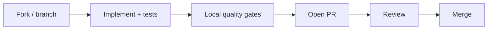

# :material-source-pull: 贡献

如何向 Eagle-RAG 提议变更。项目位于 [github.com/fintax-ai/eagle-rag](https://github.com/fintax-ai/eagle-rag)。

首次 PR 前阅读 [`AGENTS.md`](https://github.com/fintax-ai/eagle-rag/blob/master/AGENTS.md) —— 它编码不可协商的架构边界（Knowhere vs PixelRAG、模型厂商、已移除依赖）。

## 工作流



1. 从 `master`（或仓库默认）分支：`feat/short-description` 或 `fix/issue-slug`。
2. 提交聚焦；避免无关格式化大扫除。
3. 打开带清晰摘要与测试计划的 PR。
4. 处理评审意见；每次 push 后重跑门禁。

## PR 清单 {#pr-checklist}

复制到 PR 描述并逐项勾选：

### 范围与设计

- [ ] 变更符合 [`AGENTS.md`](https://github.com/fintax-ai/eagle-rag/blob/master/AGENTS.md) 模块边界（无 pixelrag-serve、FAISS、OpenAI、Cohere、LibreOffice）。
- [ ] 多租户路径传播 `kb_name`（API、MCP、Celery kwargs、Milvus 过滤）。
- [ ] 新 HTTP 端点使用 `eagle_rag/api/schemas/` 中 Pydantic schema 与 `response_model=`。
- [ ] DB schema 变更含 Alembic revision（store 中无 DDL）。
- [ ] 配置变更在 `settings.yaml` 添加 `${VAR:-default}` + `config.py` 中 pydantic 字段。
- [ ] 面向架构的行为更新 `README.md`、`AGENTS.md` 和/或 `docs/en/architecture/multimodal-fusion.md`（AGENTS.md 同步规则要求时）。

### 后端门禁

```bash
uv run ruff check          # task be:lint
uv run ruff format --check # or task be:format then commit
uv run mypy eagle_rag      # task be:typecheck
uv run pytest              # task be:test
```

- [ ] `ruff check` —— 零违规（`pyproject.toml` 中 `E`、`F`、`I`、`W`、`UP`）。
- [ ] `ruff format` —— 已格式化（行宽 100）。
- [ ] `mypy eagle_rag` —— 通过（第三方 stub 用 `ignore_missing_imports = true`）。
- [ ] `pytest` —— 全部测试绿。

### 前端门禁（若触及 `frontend/`）

```bash
cd frontend && bun run lint && bun run format
```

- [ ] Biome lint 干净。
- [ ] 已应用 Biome format。
- [ ] 仅浅色主题；无仅暗色假设。
- [ ] 用户可见字符串变更时为 `en` 与 `zh` 添加 `next-intl` 键。

### 测试

- [ ] 非平凡新行为有 pytest 覆盖（见[测试](testing.md)）。
- [ ] Milvus、Knowhere HTTP、外部 LLM 用 mock —— CI 中无 live API 密钥。
- [ ] 遥测测试在 autouse fixture 重置下通过（`tests/conftest.py`）。

### 安全与卫生

- [ ] diff 中无 `.env`、API 密钥或凭据。
- [ ] 提交代码中无 `TODO` / `FIXME` / 个人备注（[`AGENTS.md`](https://github.com/fintax-ai/eagle-rag/blob/master/AGENTS.md)）。
- [ ] Docstring 与注释为**英文**，Google 风格。

### 运维（若触及 compose / Docker）

- [ ] 有意保留或更新 healthcheck 与 `depends_on: service_healthy`。
- [ ] 尊重 `COMPOSE_FILE` 生产说明（无仅 dev override 要求）。
- [ ] 若新增持久存储则记录卷名。

### 文档

- [ ] 仅在行为变更时更新面向用户文档（勿添加未请求的 `.md`）。
- [ ] 文档中 GitHub 链接指向 `https://github.com/fintax-ai/eagle-rag/blob/master/...`，非指向仓库根的相对 `../../../` 路径。

## 提交信息

遵循现有历史：简短祈使句主题，可选正文解释**为何**。

```
fix health probe celery timeout false positive

Celery inspect.ping used a 3s timeout inside a 3s wait_for, marking
celery down when workers were healthy. Lower inspect timeout to 1.0s.
```

## 代码评审关注点

评审者通常检查：

| 领域 | 问题 |
| --- | --- |
| 路由 | ingest 是否用格式 + 内容形态，而非仅 `source_type`？ |
| 融合 | 视觉分块是否带 `chunk_type`、`parent_section`、`content_summary`、`source_chunk_id`？ |
| Celery | 任务是否在 `include=` 与 `task_routes` 注册？`@with_retry` 或显式死信？ |
| Scope | `scope_filter` OR 语义是否保留？ |
| 流式 | SSE 事件类型变更是否无迁移说明？ |
| MCP | `TOOL_DEFINITIONS` 是否更新？新工具是否 `@with_metrics`？ |

## 本地开发命令

| 任务 | 命令 |
| --- | --- |
| 全 Docker 栈 | `task up` |
| 仅 API | `task be:api` |
| 全部 Celery 队列 | `task be:worker` |
| 单队列 | `task be:worker QUEUES=knowhere_queue CONCURRENCY=8` |
| 迁移 | `task db:migrate` |
| 文档预览 | `task docs:serve` |

## PR 中的数据库迁移

1. 编辑 `eagle_rag/db/models/`。
2. `uv run alembic revision --autogenerate -m "add_foo_column"`。
3. 审查生成 SQL —— autogenerate 非 infallible。
4. 本地 `task db:migrate`。
5. PR 包含 revision 文件。

降级策略：可行时提供 `downgrade()`；若必然数据丢失则注明。

## 破坏性变更

在 PR 中明确说明：

- API schema 字段重命名或删除端点。
- Milvus collection schema 变更（可能需重新 ingest）。
- `settings.yaml` 中环境变量重命名。
- MCP 工具签名变更。

## 我们不合并的内容

- 未经 owner 批准重新引入已移除栈（pixelrag-serve、FAISS、OpenAI 适配器）。
- 核心路径中金融特定硬编码（`AGENTS.md`：行业无关）。
- API 路由上的 auth 中间件（内网假设），除非项目方向变更。
- 从运行时 store 执行 DDL 而非 Alembic。

## CI 说明

仓库可能不在每个 PR 的 GitHub Actions 中运行全部门禁 —— **请求评审前本地执行清单为强制**。MCP 部署工作流在 `.github/workflows/mcp-deploy.yml` 供 MCP 专用发布。

## 为评审者提供上下文

链接到：

- `docs/en/backend/` 或 `docs/en/ops/` 相关节
- 你遵循的 `AGENTS.md` 规则
- API 变更的截图 / curl 示例

## 许可与行为

许可为 Apache License 2.0，见仓库根目录 `LICENSE` 与 `pyproject.toml`。issue 与 PR 中使用专业沟通。

## 新增 API 端点（清单）

1. 在 `eagle_rag/api/schemas/<domain>.py` 定义请求/响应模型。
2. 在 `eagle_rag/api/<domain>.py` 实现处理器，`response_model=`。
3. 若新文件则在 [`app.py`](https://github.com/fintax-ai/eagle-rag/blob/master/eagle_rag/api/app.py) 注册路由。
4. 在 `tests/test_api_*.py` 添加 pytest，patch store。
5. 若端点面向用户则更新 MkDocs 后端页（仅在被要求或文档任务一部分时）。

## 新增 Celery 任务（清单）

1. 在 `ingest/` 或合适模块实现任务体。
2. 用 `@with_retry(name="eagle_rag.tasks.<name>", queue="<queue>")` 装饰。
3. 在 `eagle_rag/settings.yaml` `celery.task_routes` 添加路由。
4. 确保模块列入 `celery_app.include`（若新文件）。
5. 记录队列选择：router (4) / knowhere (8) / pixelrag (1)。
6. API/runner 分发路径使用 `send_task_with_trace`。
7. 在 [`tasks/state.py`](https://github.com/fintax-ai/eagle-rag/blob/master/eagle_rag/tasks/state.py) 验证 `task_audit` 状态转换。

## 新增 MCP 工具（清单）

1. 在 [`mcp_server.py`](https://github.com/fintax-ai/eagle-rag/blob/master/eagle_rag/api/mcp_server.py) 实现处理器。
2. 将 schema 追加到 `TOOL_DEFINITIONS`。
3. 使用独立 MCP HTTP 时对 Prometheus 应用 `@with_metrics("<tool_name>")`。
4. 添加测试：`tests/test_mcp_*.py`（快乐路径 + 带 `error` 字段的降级 dict）。
5. 确认 `/mcp/tools` 与管理 `/admin/mcp` 列出该工具。

## 前端贡献说明

- push 前运行 `bun run lint` 与 `bun run format`。
- 用户可见字符串需更新 `messages/en.json` 与 `messages/zh.json`。
- API 调用经现有 `lib/` 客户端 —— 匹配相邻页错误处理模式。
- 勿引入仅暗色主题样式；Eagle-RAG UI 按 AGENTS.md 仅浅色。

## 依赖变更

- Python：编辑 [`pyproject.toml`](https://github.com/fintax-ai/eagle-rag/blob/master/pyproject.toml)，若跟踪锁文件则 `uv lock`，`uv sync`。
- 勿添加 OpenAI/Cohere/LibreOffice/pixelrag-serve 依赖。
- PixelRAG 仍为 StarTrail-org/PixelRAG 的 git 依赖；pin 变更在 PR 正文中说明。
- 前端：`cd frontend && bun install`，依赖变更时提交 `bun.lock`。

## 评审 SLA 期望

- 在合理窗口内回复评审意见；每次修复 push 后重跑全部门禁。
- Squash vs merge 为仓库维护者偏好 —— 未经同意勿对共享分支 force-push。

## 相关

- [编码规范](coding-standards.md)
- [测试](testing.md)
- [开发索引](index.md)
