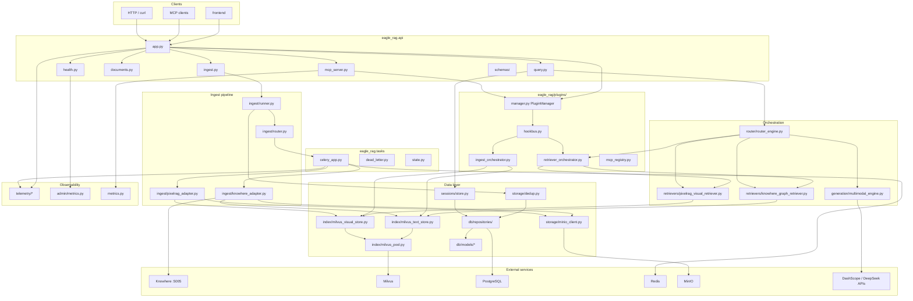
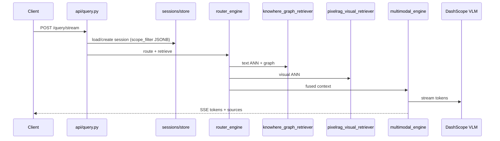
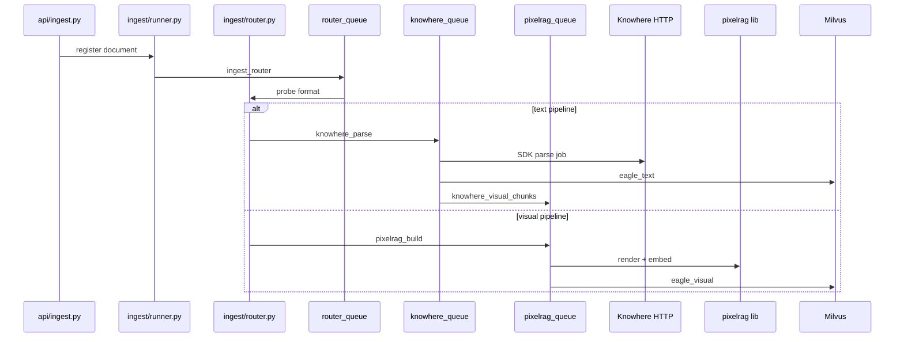

# :material-folder: 项目结构

Eagle-RAG 仓库布局与**模块依赖图**。除非另有说明，路径均相对于仓库根目录。

入口文档：[`README.md`](https://github.com/fintax-ai/eagle-rag/blob/master/README.md)、[`AGENTS.md`](https://github.com/fintax-ai/eagle-rag/blob/master/AGENTS.md)。

## 顶层树

```
eagle-rag/
├── eagle_rag/              # Python 后端包（主包）
├── plugins/                # 同仓领域插件（biomed / lakehouse_bi / _template）
├── frontend/               # Next.js 16 应用（Bun）— Core 橱窗 UI only
├── tests/                  # Pytest 套件（含 tests/plugins/）
├── alembic/                # 数据库迁移
│   └── versions/
├── docker/                 # Dockerfile + knowhere-self-hosted/
├── docs/                   # MkDocs（en/ + zh/）
├── design/                 # 设计产物
├── data/                   # 运行时目录（gitignore）：上传、HF 缓存
├── docker-compose.yml
├── docker-compose.override.yml
├── Taskfile.yml
├── pyproject.toml          # uv / hatchling / ruff / mypy / pytest
├── mkdocs.yml
├── eagle_rag/settings.yaml
├── AGENTS.md
└── README.md
```

## `eagle_rag/` 包地图

| 目录 | 职责 |
| --- | --- |
| `api/` | FastAPI 应用、路由、MCP、Pydantic schema |
| `ingest/` | 路由、Knowhere/PixelRAG 适配器、Celery 任务体 |
| `retrievers/` | LlamaIndex 检索器（文本图、视觉） |
| `router/` | `EagleRouterQueryEngine`、LLM 路由、scope filter 解析 |
| `generation/` | 多模态答案合成（VLM 流式） |
| `index/` | Milvus 文本/视觉存储、标签目录、文档结构 |
| `db/` | SQLModel 模型、异步/同步 DB 辅助 |
| `storage/` | MinIO 客户端、去重注册表 |
| `kb/` | 知识库注册表、生命周期、统计 |
| `sessions/` | 会话与消息持久化 |
| `attachments/` | 临时附件解析（不写 Milvus） |
| `notifications/` | 用户通知存储 |
| `tasks/` | Celery 应用、死信、任务状态审计 |
| `admin/` | 队列指标采样、MCP 日志、系统设置 |
| `plugins/`（包内） | 微内核：HookBus、PluginManager、hotpath_hooks、mcp_registry |
| `telemetry/` | loguru、structlog、OpenTelemetry |
| `metrics.py` | Prometheus MCP 指标（独立应用） |
| `config.py` | 设置加载器（含 `plugin_options()`） |

仓库根另有同仓领域插件目录 `plugins/`（`biomed`、`lakehouse_bi`、`_template`）。二开见 [编写行业插件](../guides/authoring-industry-plugin.md)；产品边界见 [ADR-008](../architecture/adr/008-rag-only-plugin-platform.md)。

## 模块依赖图

高层导入/调用方向（运行时）。外部系统在边界上。



### 分层规则

1. **`api/`** 可调用 `router`、`ingest/runner`、`plugins`（经引擎）、`sessions`、`kb`、`admin` — 路由不得直接访问 Milvus（须经 store/retriever/orchestrator）。
2. **`ingest/`** 任务经 `index/` + `IngestOrchestrator` hooks + `storage/` 写入；派发使用 `send_task_with_trace`。
3. **`router/`** + **`generation/`** 经 retriever 与 `RetrieverOrchestrator` 读取向量。
4. **`db/repositories/`** 在所有 PG 读写注入 `plugin_namespace` — models 中无业务逻辑。
5. **`telemetry/`** — 不得从 api/ingest 导入（避免循环）；由消费者导入 telemetry。

## 请求路径（查询）



## 摄入路径



## `frontend/` 结构

```
frontend/
├── app/                 # Next.js App Router（locale 段）
├── components/          # UI 组件（HeroUI）
├── lib/                 # API 客户端辅助
├── messages/            # next-intl zh/en
├── package.json
└── biome.json
```

前端仅通过 HTTP 与后端通信（`NEXT_PUBLIC_API_BASE`）。无共享 Python/TS 类型 —— OpenAPI 即契约。

## `tests/` 结构

扁平布局 —— `tests/test_*.py` 按领域镜像：

| 模式 | 领域 |
| --- | --- |
| `test_api_*` | FastAPI 路由（TestClient / async） |
| `test_router_*`、`test_retrievers` | 检索与生成 |
| `test_ingest_*` | 路由、URL 校验、冒烟 |
| `test_mcp_*` | MCP 工具、HTTP 传输、指标 |
| `test_telemetry_*` | 日志与追踪 |
| `test_knowhere_*`、`test_milvus_*` | 适配器边界情况 |

共享 fixture：[`tests/conftest.py`](https://github.com/fintax-ai/eagle-rag/blob/master/tests/conftest.py)。详情见[测试](testing.md)。

## `docker/` 布局

```
docker/
├── Dockerfile.api
├── Dockerfile.worker
├── Dockerfile.frontend
├── Dockerfile.docs
└── knowhere-self-hosted/
    ├── compose.yaml
    ├── .env.example
    └── env.defaults
```

## `alembic/` 布局

```
alembic/
├── env.py               # 导入 SQLModel metadata
├── script.py.mako
└── versions/
    ├── 0001_*.py
    └── 0002_health_module_tables.py
```

模型位于 `eagle_rag/db/models/`；迁移是唯一 DDL 路径。

## 关键文件速查

| 文件 | 为何阅读 |
| --- | --- |
| [`ingest/router.py`](https://github.com/fintax-ai/eagle-rag/blob/master/eagle_rag/ingest/router.py) | 格式 + PDF 探测路由矩阵 |
| [`router/router_engine.py`](https://github.com/fintax-ai/eagle-rag/blob/master/eagle_rag/router/router_engine.py) | `_resolve_scope_filter`、混合检索 |
| [`tasks/celery_app.py`](https://github.com/fintax-ai/eagle-rag/blob/master/eagle_rag/tasks/celery_app.py) | 队列、beat 调度、ack 语义 |
| [`tasks/dead_letter.py`](https://github.com/fintax-ai/eagle-rag/blob/master/eagle_rag/tasks/dead_letter.py) | 重试 + 死信 |
| [`api/health.py`](https://github.com/fintax-ai/eagle-rag/blob/master/eagle_rag/api/health.py) | 探测与管理 |
| [`telemetry/tracing.py`](https://github.com/fintax-ai/eagle-rag/blob/master/eagle_rag/telemetry/tracing.py) | `trace_span`、Celery 传播 |
| [`db/models/sessions.py`](https://github.com/fintax-ai/eagle-rag/blob/master/eagle_rag/db/models/sessions.py) | `scope_filter` JSONB |

## 各模块数据存储

| 模块 | PostgreSQL | Milvus | MinIO | Redis |
| --- | --- | --- | --- | --- |
| `sessions/` | sessions、messages | — | — | — |
| `storage/dedup` | 去重注册表 | — | 对象 | — |
| `index/milvus_*` | — | eagle_text、eagle_visual | — | — |
| `tasks/` | task_audit | — | — | broker |
| `admin/metrics` | metric_sample | — | — | LLEN 队列 |
| `attachments/` | attachments 元数据 | — | 临时文件 | — |

## 新增功能（代码放哪里）

| 功能类型 | 涉及位置 |
| --- | --- |
| REST 端点 | `api/schemas/`、`api/<router>.py`、`app.py` include |
| MCP 工具 | `mcp_registry.py` + 域 `mcp_tools.py`、`TOOL_DEFINITIONS`、测试 |
| 摄入格式 | `ingest/router.py`、settings `ingest.routing`、适配器 |
| 检索模式 | `router/`、`retrievers/`、`settings.yaml` router 段 |
| 持久化实体 | `db/models/`、Alembic 修订、`db/repositories/` 模块 |
| 后台任务 | `ingest/*_adapter.py` 或新模块、`celery_app.include`、`task_routes` |

## 相关

- [开发索引](index.md)
- [编码规范](coding-standards.md)
- [架构文档](../architecture/index.md)
