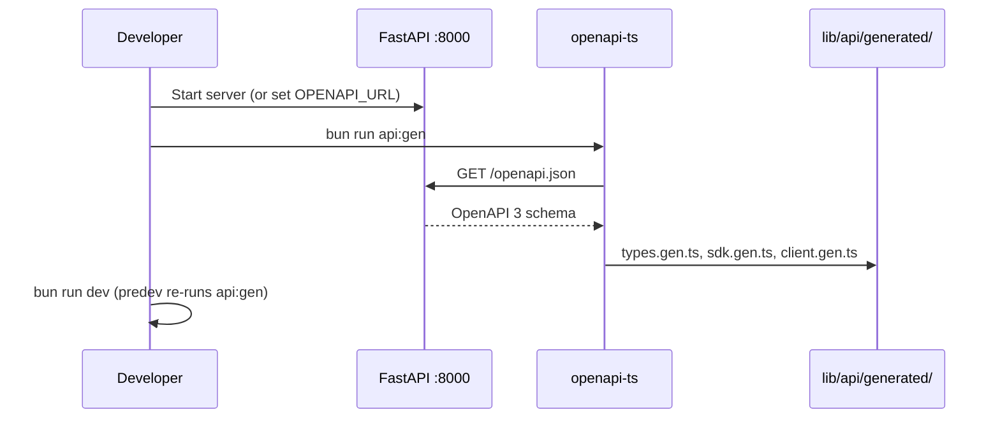

# API 客户端

前端通过 **生成的 TypeScript SDK**（`@hey-api/openapi-ts`）及 SSE 与证据 URL 的薄封装与 FastAPI 通信。

---

## OpenAPI 生成流程



### 配置（`openapi-ts.config.ts`）

```typescript
export default defineConfig({
  input: {
    path: `${apiBase}/openapi.json`,
    watch: process.env.OPENAPI_WATCH === "1",
  },
  output: "./lib/api/generated",
  plugins: ["@hey-api/typescript", "@hey-api/sdk", "@hey-api/client-fetch"],
});
```

**环境解析**（按匹配顺序）：

1. `OPENAPI_URL`
2. `API_BASE`
3. `NEXT_PUBLIC_API_BASE`
4. `http://localhost:8000`

### 脚本（`package.json`）

| 脚本 | 动作 |
|--------|--------|
| `api:gen` | 一次性重新生成 |
| `api:gen:watch` | 活跃 API 开发时的监视模式 |
| `predev` | `next dev` 前运行 `api:gen` |

### 生成产物

| 文件 | 内容 |
|------|----------|
| `types.gen.ts` | `QueryRequest`、`SessionSummary` 等 |
| `sdk.gen.ts` | `postQueryQueryPost`、`listTasksTasksGet` 等 |
| `client.gen.ts` | 配置好的 fetch 客户端 + SSE 支持 |
| `core/serverSentEvents.gen.ts` | `StreamEvent`、SSE 选项 |

**勿手改** `generated/` —— 变更会被覆盖。

---

## 运行时客户端（`lib/api/client.ts`）

```typescript
export const API_BASE = process.env.NEXT_PUBLIC_API_BASE ?? "http://localhost:8000";

client.setConfig({ baseUrl: API_BASE });
```

### 拦截器

| 钩子 | 当前行为 | 扩展点 |
|------|-------------------|-----------------|
| `request` | 透传 | 添加 `Authorization` 头 |
| `response` | 透传 | 全局 401 处理 |
| `error` | `console.error` | Toast / 遥测 |

### 证据 URL 构建器

以下端点常以原始 URL 消费（OpenAPI 中未必有类型化操作）：

```typescript
imageUrl(imageId)                    // GET /images/{id}
fileUrl(documentId)                  // GET /documents/{id}/file
chunkHtmlUrl(documentId, chunkId)    // GET /documents/{id}/chunks/{chunk_id}
```

用于 `FilePreview` 的 ``、`<iframe src>`。

---

## SSE 层（`lib/api/sse.ts`）

包装生成的 `client.sse.post` 与 SDK SSE getter。

### 核心类型

```typescript
export interface SseEvent {
  event: string;
  data: string;  // raw JSON string
}
```

`toSseEvent` 规范化 hey-api 的 `StreamEvent`（默认事件名 `message`）。

### `subscribeSse` 模式

1. 创建 `AbortController`
2. 用 `onSseEvent` / `onSseError` 回调打开流
3. 在 abort 前排空异步迭代器
4. 返回取消函数 → `controller.abort()`

### 导出的流

| 函数 | 端点 |
|----------|----------|
| `streamQuery` | `POST /query/stream` |
| `streamSearch` | `POST /search/stream` |
| `streamTaskProgress` | `GET /tasks/{id}/stream` |
| `streamAdminLogs` | `GET /admin/logs` |

### 错误处理

`apiErrorFromUnknown`（`lib/api/errors.ts`）规范化 fetch 失败以供 toast 展示。

---

## Hook 层（`lib/hooks/`）

Hooks 从 `@/lib/api/generated/sdk.gen` 导入并转换响应：

```typescript
const result = await postQueryQueryPost({ body: request });
if (result.error) throw result.error;
return result.data as unknown as QueryResponse;
```

类型别名在 `lib/types.ts`（生成类型的重导出/扩展）。

领域模块：

| 文件 | 领域 |
|------|--------|
| `useQA.ts` | 查询 + 会话 |
| `useIngest.ts` | 入库 + 任务 |
| `useKB.ts` | 知识库 |
| `useHealth.ts` | 健康 + 管理 |
| `useDocuments.ts` | 文档列表 |
| `useTags.ts` | 标签目录 |
| `useAttachments.ts` | 上传辅助 |

---

## 导入约定

```typescript
// Preferred — tree-shakeable SDK functions
import { postQueryQueryPost } from "@/lib/api/generated/sdk.gen";

// Types
import type { QueryRequest } from "@/lib/types";

// SSE + URLs
import { streamQuery } from "@/lib/api/sse";
import { fileUrl } from "@/lib/api/client";

// Side-effect: client config (import once in app)
import "@/lib/api/client";
```

`lib/api/index.ts` 重导出常用入口。

---

## CI 建议

PR 中 API schema 变更时：

1. 启动 API 或在 CI 导出 `openapi.json`
2. 运行 `bun run api:gen`
3. 提交重新生成的 `lib/api/generated/*`

生成类型 diff 可及早发现破坏性的前端契约变更。

---

## 相关文档

- [API 索引](../api/index.md)
- [查询 API](../api/query.md) —— SSE 字节协议
- [问答模块](qa-module.md) —— 流消费者
