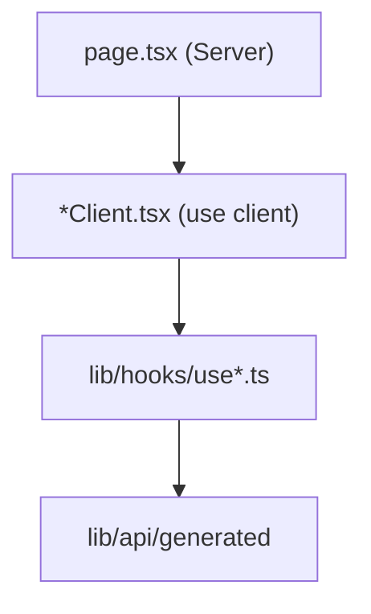

# 应用结构

前端使用带 `[locale]` 动态段的 **Next.js 16 App Router** 做国际化。所有运维路由均为包在共享外壳中的可访问页面。

---

## 目录布局

```
frontend/
├── app/
│   ├── [locale]/
│   │   ├── layout.tsx      # Root shell: fonts, i18n, sidebar
│   │   ├── page.tsx        # Redirect / home
│   │   ├── qa/page.tsx
│   │   ├── ingest/page.tsx
│   │   ├── kb/page.tsx
│   │   ├── kb/[kbName]/page.tsx
│   │   └── health/page.tsx
│   ├── globals.css         # Design tokens
│   └── providers.tsx       # TanStack Query
├── components/
│   ├── qa/                 # Q&A module
│   ├── ingest/
│   ├── kb/
│   ├── health/
│   ├── ai-elements/        # Vercel AI Elements primitives
│   └── ui/                 # Shared wrappers
├── lib/
│   ├── api/                # Generated SDK + SSE + URL builders
│   ├── hooks/              # TanStack Query hooks per domain
│   └── stores/             # Zustand stores
├── messages/               # i18n JSON + fragments/
└── i18n/
    ├── routing.ts
    └── request.ts
```

---

## 路由表

| URL 路径 | 文件 | 组件 |
|----------|------|-----------|
| `/` | `[locale]/page.tsx` | 落地 / 重定向 |
| `/qa` | `qa/page.tsx` | `QAClient` |
| `/ingest` | `ingest/page.tsx` | 入库工作区 |
| `/kb` | `kb/page.tsx` | `KBManagementClient` |
| `/kb/:kbName` | `kb/[kbName]/page.tsx` | `KBDetailClient` |
| `/health` | `health/page.tsx` | 健康仪表盘 |

`localePrefix: "never"` —— URL 不含 `/en` 前缀；语言由 cookie / `Accept-Language` 经 `proxy.ts` 解析。

---

## 根布局（`app/[locale]/layout.tsx`）

Server Component 职责：

1. 用 `routing.locales` 校验 `locale` —— 无效则 `notFound()`
2. `setRequestLocale(locale)` 以静态渲染
3. 经 `getMessages()` 加载文案（合并 fragments）
4. 应用字体：**Inter**（`--font-inter`）、**JetBrains Mono**（`--font-jetbrains-mono`）
5. 强制浅色：`className="light"`、`data-theme="light"`

```tsx
<html lang={locale} className={`light ${inter.variable} ${jetbrainsMono.variable}`}>
  <body className="light bg-background text-foreground">
    <NextIntlClientProvider messages={messages}>
      <Providers>
        <div className="flex min-h-screen">
          <Sidebar />
          <div className="flex min-w-0 flex-1 flex-col">{children}</div>
        </div>
      </Providers>
    </NextIntlClientProvider>
  </body>
</html>
```

### 问答布局例外

`QAClient` 自渲染 `AppBar` 并使用全视口高度（`h-screen`）—— 仍继承父布局侧栏（当前：侧栏可见）。

---

## Providers（`app/providers.tsx`）

仅客户端包装：

```tsx
new QueryClient({
  defaultOptions: {
    queries: {
      staleTime: 30_000,
      retry: 1,
      refetchOnWindowFocus: false,
    },
  },
});
```

HeroUI v3 **无需** `HeroUIProvider` —— 主题基于 CSS 变量（`globals.css`）。

未来全局 Provider（toast 区域、auth 上下文）的扩展点。

---

## 导航外壳

| 组件 | 角色 |
|-----------|------|
| `Sidebar` | 带语言感知 `Link` 的主导航 |
| `AppBar` | 问答顶栏（历史、scope、模式） |

图标：`lucide-react`。活动路由样式通过 pathname 匹配。

---

## 页面组合模式



Server 页面保持精简 —— 多数模块不在 RSC 层取数（客户端 TanStack Query）。例外：日后可通过 `generateMetadata` 设置元数据。

---

## React 19 注意点

- **Ref 作 props** —— 新组件无需 `forwardRef`
- **`use` hook** —— 尚非主模式；异步数据经 TanStack Query
- **Strict Mode** —— 开发环境双挂载；SSE 订阅须在 cleanup 中 abort（`QAClient` 的 `streamCancelRef`）

---

## 构建与开发脚本

| 脚本 | 动作 |
|--------|--------|
| `bun run dev` | `predev` → `api:gen`，然后 `next dev` |
| `bun run build` | 生产 bundle |
| `bun run lint` | Biome 检查 |
| `bun run api:gen` | 重新生成 OpenAPI 客户端 |

---

## 相关文档

- [i18n](i18n.md) —— 语言路由
- [API 客户端](api-client.md) —— SDK 接线
- [设计系统](design-system.md) —— `globals.css` token
