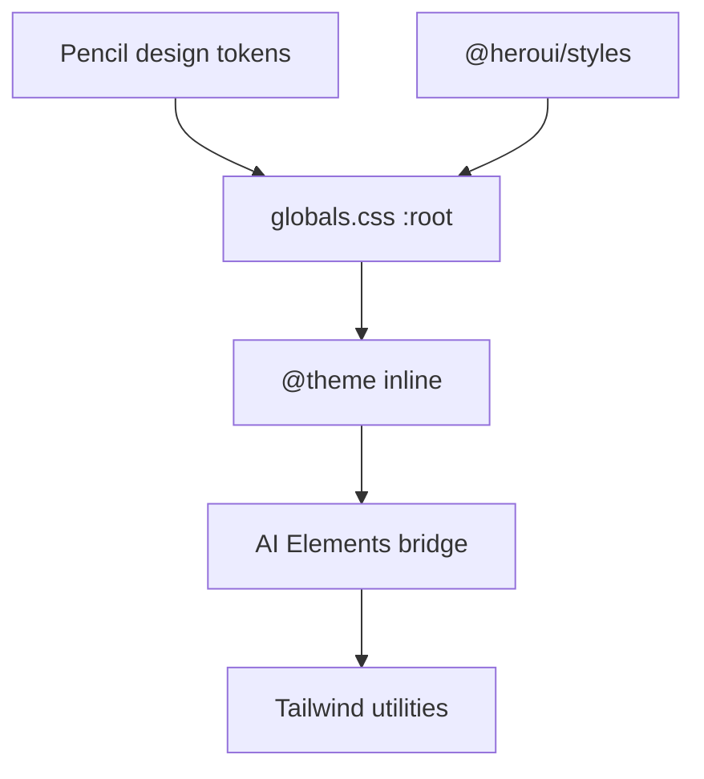

# 设计系统

Eagle-RAG 使用 **HeroUI v3** 与 **Tailwind v4**，仅浅色调色板源自 Pencil 设计 token，聊天基元使用 **Vercel AI Elements**。主题经 `app/globals.css` 中的 CSS 变量贯通。

---

## 技术栈

| 层 | 技术 |
|-------|------------|
| 组件库 | `@heroui/react` + `@heroui/styles` |
| 工具类 CSS | Tailwind v4（`@import "tailwindcss"`） |
| 聊天基元 | `components/ai-elements/*`（兼容 shadcn） |
| Markdown 答案 | `streamdown` + `@streamdown/math` |
| 图标 | `lucide-react` |
| 动效 | `framer-motion`（抽屉、模态框） |
| 类名合并 | `clsx` + `tailwind-merge` → `lib/utils.ts` 中的 `cn()` |

HeroUI v3 **无 Provider** —— 无 `HeroUIProvider`。主题 = `:root` / `.light` 上的 CSS 变量。

---

## Token 架构



### 核心语义 token（`:root`、`.light`）

| 变量 | 角色 |
|----------|------|
| `--background` / `--foreground` | 页面底 + 文字 |
| `--surface` / `--surface-muted` | 卡片、面板 |
| `--border` / `--divider` | 边框 |
| `--accent` / `--accent-foreground` | 品牌蓝（主操作） |
| `--danger` | 破坏性操作 |
| `--focus` | 焦点环 |
| `--overlay` | 模态玻璃 |

### 字体

```css
--font-sans: var(--font-inter), …;
--font-mono: var(--font-jetbrains-mono), …;
```

在 `layout.tsx` 经 `next/font/google` 加载。

### 间距

`--spacing: 0.25rem` —— HeroUI 按其比例缩放。

---

## AI Elements 桥接（`@theme inline`）

AI Elements 期望 shadcn 色名。桥接映射：

| shadcn token | Eagle 来源 |
|--------------|--------------|
| `--color-primary` | `--accent` |
| `--color-muted-foreground` | `--foreground-secondary` |
| `--color-card` | `--surface` |
| `--color-destructive` | `--danger` |
| `--color-ring` | `--focus` |

使 `components/ai-elements/*` 中 `bg-primary`、`text-muted-foreground` 等无视觉漂移。

### streamdown 扫描

```css
@source "../node_modules/streamdown/dist/index.js";
```

确保 Tailwind 为 markdown 渲染器生成所用工具类。

---

## 共享 UI（`components/ui/`）

| 组件 | 用途 |
|-----------|-------|
| `Card` | KPI 面板 |
| `IconButton` | 工具栏操作 |
| `StatCard` | 健康 / KB 指标 |

交互控件优先 HeroUI 基元（`Button`、`Drawer`、`Modal`、`Spinner`）。

---

## AI Elements 目录

| 组件 | 问答用途 |
|-----------|-----------|
| `prompt-input` | `Composer` 文本区 + 提交 |
| `message` | 气泡布局 |
| `response` | 答案体外壳 |
| `chain-of-thought` | `ThinkingTrace` 步骤 |
| `code-block` | 答案中围栏代码 |
| `actions` | 消息操作行 |

折叠动画：

```css
--animate-collapsible-down: collapsible-down 220ms …;
```

---

## KB 主题色板

知识库带 `theme` 字符串（`blue`、`violet`、`emerald` 等）。`kb-visuals.tsx` + `ThemeSwatchPicker` 映射到卡片 pastel 背景 —— 非完整暗色主题。

---

## 布局基元

| 模式 | 类 |
|---------|---------|
| 页面最大宽度 | `max-w-360`（自定义间距 token） |
| 问答分栏 | `lg:flex-row` 聊天 + `lg:w-110` 侧栏 |
| 玻璃模态 | HeroUI `Modal` + `overlay` token |

`design-frames.ts` —— 与 Figma 对齐的共享框架尺寸（若引用）。

---

## 无障碍

- 仅浅色：`:root` 上 `color-scheme: light`
- 焦点环经 `--focus`
- 图标按钮须 `aria-label`（代码评审 / 已配置的 Biome a11y 规则）

---

## Biome

`biome.json` —— 格式化 + lint。提交前运行 `bun run lint`。

无 ESLint —— Biome 为唯一 JS/TS linter。

---

## 相关文档

- [问答模块](qa-module.md) —— 组件用法
- [应用结构](app-structure.md) —— 字体加载
- [i18n](i18n.md) —— 组件内翻译字符串
