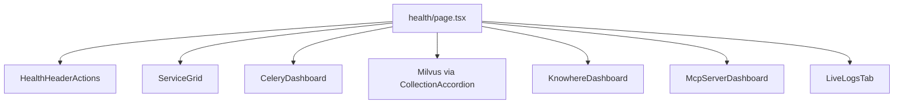

# 健康模块

运维仪表盘：`/health`（`components/health/`）。展示依赖探测、Celery/Milvus/Knowhere 管理视图、MCP 工具目录与实时日志流。

---

## 页面结构



---

## 服务网格（`ServiceGrid.tsx`）

`GET /health` → `HealthResponse.dependencies[]`。

每个 `ServiceCard` 显示：

- 状态点（`up` / `down` / `unknown`）
- 延迟 ms
- 运行时间字符串
- 展开 `detail` 文本

`health-visuals.ts` 将依赖名映射到图标与颜色。

---

## 管理仪表盘

经抽屉模式（`drawer-parts.tsx`）从服务卡片或标签打开。

| 仪表盘 | API | 要点 |
|-----------|-----|------------|
| `CeleryDashboard` | `GET /admin/celery` | Workers、队列深度、活跃任务 |
| `CollectionAccordion` | `GET /admin/milvus` | 每 collection 行数、KB 分区 |
| `StorageDashboard` | `GET /admin/minio` | 桶用量 |
| `KnowhereDashboard` | `GET /admin/knowhere` | 远程解析器 :5005 状态 |
| `McpServerDashboard` | `GET /admin/mcp`、`/mcp/tools` | 工具定义 + 近期调用日志 |

`ToggleSwitch` 组件 PATCH 管理设置（`PATCH /admin/model-router`、资源限制）。

---

## 实时日志（`LiveLogsTab.tsx`）

SSE 订阅：

```typescript
import { streamAdminLogs } from "@/lib/api/sse";

const cancel = streamAdminLogs((evt) => {
  if (evt.event === "log") appendLog(JSON.parse(evt.data));
});
```

标签卸载时清理 —— abort controller。

---

## Hooks（`lib/hooks/useHealth.ts`）

| Hook | 端点 | Query key |
|------|----------|-----------|
| `useHealth` | `/health` | `["health"]` |
| `useAdminCelery` | `/admin/celery` | `["admin", "celery"]` |
| `useAdminMilvus` | `/admin/milvus` | `["admin", "milvus"]` |
| … | | `["admin", …]` |

为运维新鲜度，refetch 间隔可能短于全局 30s staleTime。

---

## 类型（`lib/health/types.ts`）

为图表 props 收窄管理响应形状。

---

## UX 模式

- 密集 Milvus 分区表用 **Accordion**
- 数值 KPI 用 **StatCard**（`components/ui/StatCard.tsx`）
- 仅浅色图表 —— Recharts 颜色来自 CSS 变量

---

## 相关文档

- [健康与管理 API](../api/health-admin.md)
- [API 客户端](api-client.md) —— `streamAdminLogs`
- [MCP 工具](../api/mcp-tools.md)
