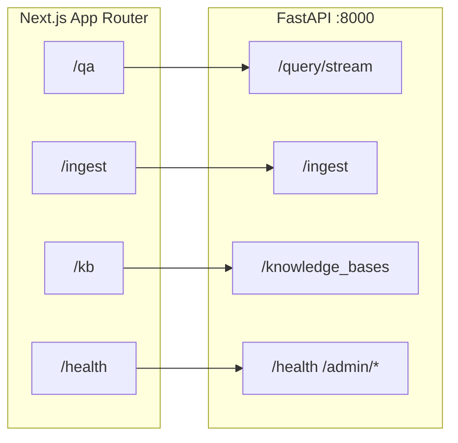

# Eagle-RAG 前端

Eagle-RAG 前端是基于 **Next.js 16** 的多模态检索增强生成（RAG）平台运维控制台。覆盖全生命周期：**入库 → 索引 → 检索 → 生成**，双语 UI（**英文 / 中文**）、仅浅色主题，以及生成的 OpenAPI 客户端。

本页为前端文档入口。

> **范围锁定（ADR-008）**：内置前端 **仅展示 Core**（knowhere 语义结构 + pixelrag 视觉混合检索）。biomed / lakehouse-bi 等垂类 **不做前端**，由 MCP/API 交给下游 Agent。前端 backlog 不含：生物医学实体面板、湖仓语义浏览器、行业 collection 切换器、垂类 MCP playground。详见 [ADR-008](../architecture/adr/008-rag-only-plugin-platform.md)。

### 橱窗应聚焦

| 能力 | UI 落点 |
| --- | --- |
| KB 选择与 ingest | `/kb`、`/ingest` |
| 混合检索（text / visual / hybrid） | `/qa` Composer 模式 |
| 四锚点溯源 | `VisualSourceCard`（chunk_type / parent_section / content_summary / source_chunk_id） |
| 文档结构 + 视觉命中 | `DocumentStructureTree`、Sources 栏 |
| 路由 / `collection_plans` 可读性 | `ThinkingTrace` 路由步骤 |
| Core 健康与部署域只读标签 | `/health`（不做垂类功能） |

---

## 控制台地图

| 区域 | 路由 | RAG 角色 |
|------|-------|----------|
| **问答** | `/qa` | 流式答案、引用检视、scope 过滤检索 |
| **入库** | `/ingest` | 上传文件/URL、监控 Celery 任务 |
| **知识库** | `/kb`、`/kb/[kbName]` | 部署领域内的知识库（`kb_name`）、Milvus 统计、清空/重建 |
| **健康** | `/health` | 依赖探测、管理仪表盘、实时日志 |

---

## 技术栈

| 关注点 | 选型 | 说明 |
|---------|--------|-------|
| 框架 | Next.js 16 App Router | `[locale]` 段；`proxy.ts` 语言协商 |
| UI 运行时 | React 19 | 流式/交互的 Client 孤岛 |
| 组件 | HeroUI v3 | 无 Provider；CSS 变量主题 |
| 样式 | Tailwind v4 | `@import "tailwindcss"` + `@heroui/styles` |
| 服务端数据 | TanStack Query v5 | `staleTime: 30s`、`retry: 1` |
| 客户端状态 | Zustand v5 | Scope、过滤、UI 偏好 —— 选择性 `persist` |
| i18n | next-intl v4 | 语言 `zh` / `en`，`localePrefix: "never"` |
| 流式 | SSE | 查询 token、搜索步骤、任务进度、管理日志 |
| API | `@hey-api/openapi-ts` | `lib/api/generated/` |
| 答案渲染 | streamdown | Markdown + 数学（`@streamdown/math`） |
| 图表 | Recharts v3 | KB + 队列分析 |
| 工具链 | Bun、Biome | `bun run lint` / `format` |

---

## React 19 + App Router 模式

### 默认 Server Components

`app/[locale]/*/page.tsx` 除非标记 `"use client"` 否则为 Server Component。它们：

- 调用 `setRequestLocale(locale)` 以静态渲染
- 向 Client 外壳传入最少 props（`QAClient`、`KBManagementClient` 等）

### Client 孤岛

重交互在 `components/*/*Client.tsx`：

| Client 外壳 | 为何客户端 |
|--------------|-----------------|
| `QAClient` | SSE 流式、消息列表变更 |
| Ingest 页 Client | 任务轮询、SSE 进度、文件上传 |
| `KB*Client` | 抽屉、模态框、图表 |

### 异步请求 API

Next.js 16 将 `params` 作为 `Promise<{ locale: string }>` —— layout 在 `setRequestLocale` 前 `await params`。

### 无 Pages Router

所有路由在 `app/[locale]/` 下。无 `getServerSideProps`。

---

## 文档地图

| 页面 | 主题 |
|------|-------|
| [应用结构](app-structure.md) | 路由、布局、Provider、侧栏 |
| [问答模块](qa-module.md) | 聊天、SSE、引用、证据栏 |
| [入库模块](ingest-module.md) | 上传、任务表、队列指标 |
| [KB 模块](kb-module.md) | 知识库卡片、详情 KPI |
| [健康模块](health-module.md) | 探测、管理抽屉 |
| [API 客户端](api-client.md) | 生成 SDK、SSE 辅助 |
| [状态管理](state-management.md) | Zustand + Query keys |
| [设计系统](design-system.md) | Token、HeroUI、AI Elements |
| [i18n](i18n.md) | 文案片段 |

---

## 环境

| 变量 | 默认 | 用途 |
|----------|---------|---------|
| `NEXT_PUBLIC_API_BASE` | `http://localhost:8000` | REST + SSE 基址 |
| `NEXT_PUBLIC_PLUGIN_NAMESPACE` | `core` | AppBar 只读**领域**标签（`plugin_namespace`） |
| `OPENAPI_URL` | 回退到 API 基址 | `bun run api:gen` 输入 |

---

## 运维检查清单

- [ ] API 在 `NEXT_PUBLIC_API_BASE` 可达
- [ ] `bun run api:gen` 成功（`predev` 时运行）
- [ ] 至少注册一个 KB
- [ ] 三个队列均有 Celery worker
- [ ] 问答前文档为 `ready`

!!! warning "警告"
    控制台假定**内网部署**。若暴露到可信网络之外，请在反向代理层加鉴权。

---

## 相关文档

- [API 参考](../api/index.md)
- [后端 API 层](../backend/api-layer.md)
- [安装](../getting-started/installation.md)
