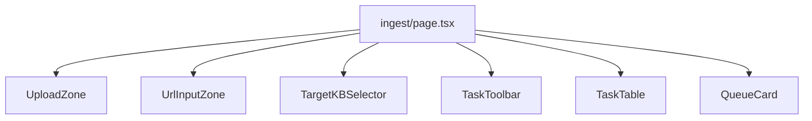

# 入库模块

入库工作区（`/ingest`，`components/ingest/`）将文档分派到 Celery 流水线，并通过轮询与 SSE 监控任务进度。

---

## 页面布局



---

## 上传流程

### 文件上传（`UploadZone.tsx`）

- 拖放或文件选择
- `POST /ingest` multipart：`file`、`source_type_hint`、`kb_name`
- 成功 / 去重命中时经 `IngestToast` toast

### URL 入库（`UrlInputZone.tsx`）

- 表单字段 `url` + 相同元数据字段
- 服务端 SSRF 防护 + 分发前预取

### 目标 KB（`TargetKBSelector.tsx`）

读取 `useKBStore` / `useKnowledgeBases` —— 所选 `kb_name` 附加到每次入库调用。**与**问答 scope store **分离**。

---

## 任务表（`TaskTable.tsx`）

数据：`useIngest` → `GET /tasks`，过滤来自 `filterStore.taskFilter`：

| 过滤 | 查询参数 |
|--------|-------------|
| `query` | 拉取后对 `job_id` / `document_id` 客户端过滤，或 `q` 参数 |
| `pipelines[]` | `pipeline` |
| `statuses[]` | `status` |
| `autoPoll` | 为 true 时 refetch 间隔 |

### 状态胶囊（`StatusPill.tsx`）

使用 API 的 `status_phase`（`pending | running | success | failed`），在 `status.ts` 映射 —— 与后端 `_STATUS_PHASE_MAP` 一致。

### 实时进度

`TaskTable` 在行展开或模态时经 `streamTaskProgress(jobId)` 打开 SSE：

- `progress` 事件更新行状态
- `timeout` → 用户通知

`TaskLogsModal` 拉取 `GET /tasks/{id}/logs`。

### 操作

| 操作 | API |
|--------|-----|
| 重试 | `POST /tasks/{id}/retry` |
| 删除审计 | `DELETE /tasks/{id}` |
| 查看文档 | 若设 `document_id` 则链到 `/kb` 详情 |

---

## 队列指标（`QueueCard.tsx`）

`GET /ingest/queue-metrics` → 每队列 `concurrency` + Redis `size`。

`QueueTrendChart`（可选历史）在接线时使用管理指标。

---

## 流水线徽章（`PipelineBadge.tsx`）

显示原始 `pipeline` 字段（`router`、`knowhere`、`pixelrag`），配色与 AGENTS.md 路由矩阵一致。

---

## Hooks（`lib/hooks/useIngest.ts`）

| 导出 | 用途 |
|--------|---------|
| `useTasks` | 分页任务列表查询 |
| `useTask` | 单任务详情 |
| `useIngestFile` | 上传 mutation |
| `useIngestUrl` | URL mutation |
| `useRetryTask` | 重试 mutation |
| `useQueueMetrics` | 队列深度查询 |
| `errorMessage` | 共享错误字符串辅助（问答也用） |

### TanStack Query keys

```
["tasks", params]
["task", jobId]
["ingest", "queue-metrics"]
```

---

## Zustand：任务过滤

`useFilterStore` → `taskFilter` 持久化为 `eagle-rag-filter`：

```typescript
{
  query: string;
  pipelines: string[];
  statuses: string[];
  autoPoll: boolean;
}
```

---

## 去重 UX

HTTP **200** 且 `dedup_hit: true` —— 显示信息 toast（「已索引」）而非错误。

---

## 相关文档

- [入库 API](../api/ingest.md)
- [任务 API](../api/tasks.md)
- [状态管理](state-management.md)
- [KB 模块](kb-module.md) —— 入库前先注册 KB
