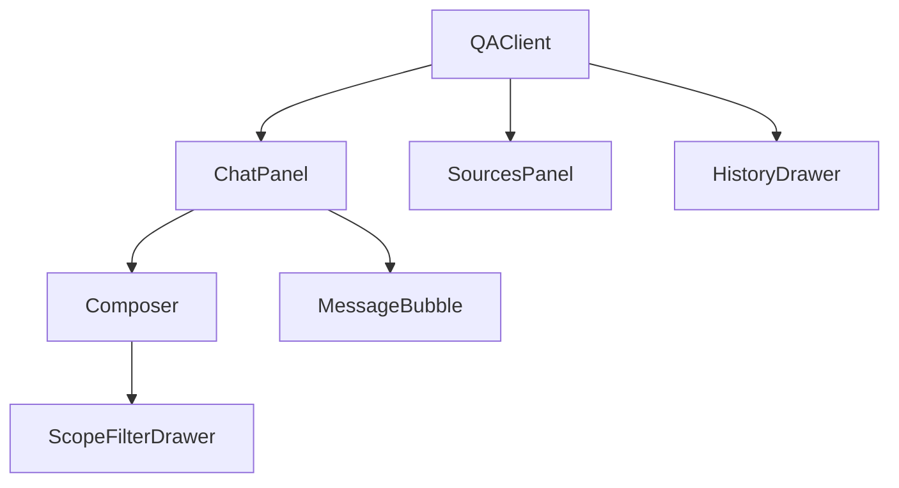

# 问答模块

问答工作区（`/qa`，`components/qa/`）是主要的**检索增强对话**界面。经 SSE 流式多模态答案、内联引用，并提供三栏**证据工作台**（来源、文档结构、文件预览）。

---

## 组件架构



| 组件 | 文件 | 职责 |
|-----------|------|----------------|
| `QAClient` | `QAClient.tsx` | 会话状态、SSE 编排、toast 错误 |
| `ChatPanel` | `ChatPanel.tsx` | 消息列表、composer 槽、滚动贴底 |
| `Composer` | `Composer.tsx` | 提示输入、模式切换、附件、scope 芯片 |
| `MessageBubble` | `MessageBubble.tsx` | 用户/助手渲染、思考轨迹、引用 |
| `AnswerBody` | `AnswerBody.tsx` | streamdown markdown + 引用按钮 |
| `ThinkingTrace` | `ThinkingTrace.tsx` | 可折叠步骤时间线 |
| `SourcesPanel` | `SourcesPanel.tsx` | 证据栏（来源 / 结构 / 预览） |
| `ScopeFilterDrawer` | `ScopeFilterDrawer.tsx` | KB / 文档 / 标签并集选择器 |
| `HistoryDrawer` | `HistoryDrawer.tsx` | 按时间分组的会话列表 |
| `DocumentStructureTree` | `DocumentStructureTree.tsx` | Knowhere 章节层级 |
| `FilePreview` | `FilePreview.tsx` | PDF / HTML / 图片内联查看 |
| `VisualSourceCard` / `TextSourceCard` | | 富引用卡片 |

---

## 提问模式

| 模式 | API | UX |
|------|-----|-----|
| **Ask** | `POST /query/stream` | 步骤 + 来源 + **token** 增量 + 答案 |
| **Search** | `POST /search/stream` | 仅步骤 + 来源（`retrievalOnly` 消息） |

在 `Composer` 切换 → `QAClient` 内 `askMode` state。

---

## SSE 消费者（`QAClient.handleSend`）

### 订阅

```typescript
import { streamQuery, streamSearch } from "@/lib/api/sse";

streamCancelRef.current = isSearch
  ? streamSearch(streamBody, onStreamEvent, onStreamError)
  : streamQuery(
      { ...streamBody, session_id: sessionId, attachments: attachmentIds ?? null },
      onStreamEvent,
      onStreamError,
    );
```

`streamCancelRef` 在新发送时经 `subscribeSse` 内 `AbortController` 中止先前流。

### 请求体组装

```typescript
const { scope_filter: scopeFilter, kb_name } = toQueryScope(useScopeStore.getState());

const streamBody = {
  query,
  mode,                    // auto | text | visual | hybrid
  scope: null,             // legacy — use scope_filter instead
  scope_filter: scopeFilter,
  kb_name,                 // always null from toQueryScope (drawer is authoritative)
  filters,                 // documentFilter facets from filterStore
};
```

### 事件处理矩阵

| 事件 | UI 变更 |
|-------|-------------|
| `session` | `setSessionId(data.session_id)` |
| `step` | 追加到 `pendingMsg.steps`；若 `name === "route"` 则设 `route` |
| `sources` | 设 `pendingMsg.sources`（证据栏提前填充） |
| `token` | 将 `delta` 追加到 `pendingMsg.content`（仅 Ask 模式） |
| `done` | 定稿消息 id、answer、sources、steps；`setSending(false)` |
| `error` | 移除 pending 消息，显示 toast |

### 流式 UX 理论

Eagle-RAG 实现与 HCI 延迟感知指导一致的**双阶段**流式模式：

1. **阶段 A —— 检索透明**（`step` + `sources`）：生成完成前用户即见路由决策与证据。这呼应长时 AI 的*渐进披露*（Shneiderman, 1998）及对话搜索 UI 的*证据优先*模式（Perplexity 类产品）。

2. **阶段 B —— Token 流式**（`token`）：逐字组装答案，在 VLM 延迟期间维持参与感（类似 NLP 增量生成文献）。

Search 模式跳过阶段 B —— 运维仅需可检视的检索质量时合适。

---

## 引用 UI 模式

### 内联引用（`AnswerBody`）

助手 markdown 可能按索引引用来源。引用芯片点击触发 `onCite(messageId, index)`。

### 焦点模型

```typescript
// Citation click → right rail focuses that source
handleCite(messageId, index) {
  setFocusedMessageId(messageId);
  setFocusedSourceIndex(index);
}
```

`SourcesPanel` 接收 `highlightIndex`（文本 + 图片来源的 1-based 扁平索引）。

### 视觉预览意图

重排步骤缩略图调用 `onPreviewVisual(messageId, imageId)` → 设 `previewIntent` → 侧栏切到 **Preview** 标签。

### 结构下钻

引用聚焦时，若有 `document_id`：

- 切换到 **Structure** 视图
- 设 `structureDoc` + `structureFocus`（文本用 `path`，图片用 `parent_section`）
- 在 `DocumentStructureTree` 高亮检索路径

实现生成文本与解析文档骨架间的**双向 grounding** —— 可审计 RAG 的最佳实践（参见 Gao et al., 2023 RAG 综述中的「可引用分块」）。

---

## 证据栏（`SourcesPanel`）

三个并列视图：

| 视图 | 数据来源 | API |
|------|-------------|-----|
| **Sources** | SSE / 历史的 `QuerySources` | — |
| **Structure** | 章节树 | `GET /documents/{id}/structure` |
| **Preview** | 文件 / 分块 HTML / 图片 | `/file`、`/chunks/{id}`、`/images/{id}` |

URL 构建器（`lib/api/client.ts`）：

```typescript
fileUrl(documentId)           // iframe PDF
chunkHtmlUrl(docId, chunkId)  // table HTML
imageUrl(imageId)             // PNG tile
```

展开模态（`expanded` state）—— 玻璃遮罩全屏阅读。

---

## Scope 过滤

### Zustand store（`lib/stores/scopeStore.ts`）

```typescript
interface ScopeSelectionState {
  kbNames: ScopeRef[];
  documents: ScopeRef[];
  tags: ScopeRef[];
}
```

持久化到 `localStorage` key `eagle-rag-scope`。

`toQueryScope()` → `{ scope_filter, kb_name: null }` —— **不**回退到入库 KB 选择器；空 scope = 全部 KB。

### 抽屉（`ScopeFilterDrawer`）

数据来源：

- `useKnowledgeBases()` —— KB 标签
- `useDocuments()` —— 文档标签
- `useTags()` —— 标签页（`GET /tags`）

Apply → `setScope(draft)` → `Composer` 中芯片。

### 会话持久化

每次查询经后端 `_resolve_session` → `set_session_scope_filter` 持久化 scope。

加载历史（`handleSelectSession`）从 `session.scope_filter` hydrate store。

---

## 文档分面（`filterStore`）

与 scope 并集分离 —— 对 `QueryFilters` 的 **AND** 分面：

| UI 字段 | API 字段 |
|----------|-----------|
| `sourceType` | `filters.source_type` |
| `pipeline` | `filters.pipeline` |
| `year` | `filters.year` |

存于 `eagle-rag-filter` localStorage。与 scope 独立清除。

---

## 附件（`Composer`）

1. `uploadAttachment(file)` → `POST /attachments`
2. 发送时收集 `attachment_id[]`
3. 仅 `streamQuery` 请求体传 `attachments`（非 search）

解析在查询时服务端进行 —— 不写 Milvus。

---

## 会话历史

`HistoryDrawer` 使用 `useSessions`、`useDeleteSession`。

分组：`history-utils.ts` → `today` / `week` / `older`。

`handleNewSession` 清空消息、会话 id 与 scope store。

TanStack Query keys —— 见[状态管理](state-management.md)。

---

## 消息渲染

| 角色 | 渲染器 |
|------|----------|
| User | 纯文本气泡 |
| Assistant（pending） | Spinner → `ThinkingTrace` + 部分 `AnswerBody` |
| Assistant（done） | streamdown 完整 markdown |

`ThinkingTrace` 使用 AI Elements `ChainOfThought` —— 步骤来自 SSE（`route`、`recall`、`rerank` 等）。

---

## 模式选择器

`mode` state：`auto | text | visual | hybrid` → `QueryRequest.mode`。

与 `askMode`（ask vs search）不同。图标：composer 工具栏 `Route`。

---

## 错误处理

`QAToast` 显示变体 toast。SSE `error` 事件与 `onStreamError` 移除 pending 助手气泡。

翻译 key：`messages/fragments/qa.{en,zh}.json` 命名空间 `qa.error.*`。

---

## 关键类型（`components/qa/types.ts`）

```typescript
interface ChatMessage {
  id: string;
  role: "user" | "assistant";
  content: string;
  sources?: QuerySources | null;
  steps?: Step[] | null;
  route?: RouteInfo | null;
  pending?: boolean;
  streaming?: boolean;
  retrievalOnly?: boolean;
  createdAt: string;
}
```

---

## 相关文档

- [查询 API](../api/query.md) —— SSE 协议
- [文档 API](../api/documents.md) —— 结构 + 分块 HTML
- [状态管理](state-management.md) —— scope store
- [API 客户端](api-client.md) —— `streamQuery`
- [设计系统](design-system.md) —— AI Elements 主题

### 参考文献

- Shneiderman, B. (1998). *Designing the User Interface* —— 响应性原则。
- Gao, Y. et al. (2023). Retrieval-Augmented Generation for Large Language Models: A Survey. [arXiv:2312.10997](https://arxiv.org/abs/2312.10997)
