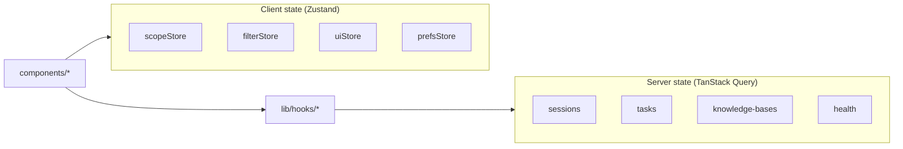

# 状态管理

客户端状态在 **TanStack Query**（服务端缓存）与 **Zustand**（UI 偏好 + scope）之间拆分。无 Redux。

---

## 架构概览



---

## TanStack Query 默认值

来自 `app/providers.tsx`：

| 选项 | 值 | 理由 |
|--------|-------|-----------|
| `staleTime` | 30_000 ms | 减少标签聚焦时的重复请求 |
| `retry` | 1 | 内网 API 快速失败 |
| `refetchOnWindowFocus` | false | 运维控制台常保持打开 |

---

## Query key 目录

### 问答 / 会话（`useQA.ts`）

| Key | Hook | 失效时机 |
|-----|------|----------------|
| `["sessions", params?]` | `useSessions` | 创建/删除会话 |
| `["session", sessionId]` | `useSession` | 更新会话 |
| `["messages", sessionId, params?]` | `useMessages` | （选中时手动拉取） |

`useQueryAction` / `useSearch` 为 **mutation** —— 默认无列表缓存。

`QAClient.handleSelectSession` 用 `queryClient.fetchQuery` 命令式拉取。

### 入库（`useIngest.ts`）

| Key | Hook |
|-----|------|
| `["tasks", params]` | `useTasks` |
| `["task", jobId]` | `useTask` |
| `["ingest", "queue-metrics"]` | `useQueueMetrics` |

Mutation：文件/URL 入库、重试 —— 使 `["tasks"]` 失效。

### 知识库（`useKB.ts`）

| Key | Hook |
|-----|------|
| `["knowledge-bases", params]` | `useKnowledgeBases` |
| `["knowledge-bases", "overview"]` | overview |
| `["knowledge-bases", kbName]` | detail |

### 文档与标签

| Key | Hook |
|-----|------|
| `["documents", params]` | `useDocuments` |
| `["tags", params]` | `useTags` |

### 健康（`useHealth.ts`）

| Key | Hook |
|-----|------|
| `["health"]` | `useHealth` |
| `["admin", segment]` | admin 仪表盘 |

### 缓存隔离

Key 在相关处包含 `kb_name` / 过滤参数 —— 入库页切换 KB 不会泄漏另一租户过滤下的任务列表缓存。

---

## Zustand stores

### `scopeStore.ts` —— 问答检索 scope

**持久化：** `localStorage` key `eagle-rag-scope`

```typescript
interface ScopeSelectionState {
  kbNames: ScopeRef[];
  documents: ScopeRef[];
  tags: ScopeRef[];
}
```

| 动作 | 效果 |
|--------|--------|
| `setScope` | 替换全部维度（抽屉 Apply、会话 hydrate） |
| `addDocument` | @ 提及去重添加 |
| `removeItem` | 芯片 dismiss |
| `clear` | 新会话 |

**API 桥接：**

```typescript
toScopeFilter(state)  // → ScopeSelection | null
toQueryScope(state)   // → { scope_filter, kb_name: null }
```

**Sessions API 同步：** 后端在每次查询持久化 `scope_filter`；加载会话时 hydrate store（见 [Sessions API](../api/sessions.md)）。

### `filterStore.ts` —— 入库 + 分面过滤

**持久化：** `eagle-rag-filter`

| 切片 | 使用者 |
|-------|---------|
| `taskFilter` | 入库任务表 |
| `documentFilter` | 问答 `QueryFilters` 分面 |

与 scope 并集独立 —— 分面与 scope **AND**。

### `uiStore.ts` —— 临时 UI

**不持久化**（默认）：

| 字段 | 用途 |
|-------|---------|
| `qaHistoryOpen` | 历史抽屉 |
| `qaLightboxImageId` | 图片灯箱 |

### `prefsStore.ts` —— 用户偏好

语言覆盖、侧栏折叠等（若启用）—— `eagle-rag-prefs`。

### 入库 KB 选择器

入库目标 KB 可能在 `useKBStore` 或组件本地 state —— **不是** `scopeStore`。问答刻意用 `toQueryScope` 且 `kb_name: null`，避免静默把查询 scope 绑到入库选择器。

---

## 何时用哪种

| 需求 | 工具 |
|------|------|
| API 列表/详情 | TanStack Query |
| 抽屉内表单草稿 | 本地 `useState` |
| 跨页 scope 选择 | Zustand `scopeStore` |
| 刷新后保留 | Zustand `persist` |
| 流式消息缓冲 | `QAClient` 内 `useState` |
| SSE 订阅清理 | `useRef` 取消句柄 |

---

## React 19 说明

- Zustand selector：`useScopeStore((s) => s.kbNames)` —— 细粒度重渲染
- 避免在 Zustand 存 SSE 部分 token —— 更新频繁；留在组件 state

---

## 相关文档

- [问答模块](qa-module.md) —— SSE + scope
- [Sessions API](../api/sessions.md) —— 持久化契约
- [入库模块](ingest-module.md) —— 任务过滤
