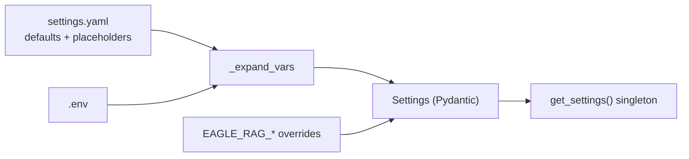

# 配置

Eagle-RAG 从三层加载设置，优先级清晰。理解该模型有助于调优路由、队列、模型端点与 Milvus 索引，而无需在代码中四处搜寻。

---

## 理论与基础

### 为何分层配置？

在 Python 中硬编码 URL 与 API 密钥会使部署脆弱。生产系统将：

1. **Schema 与默认值** —— 纳入版本控制
2. **密钥** —— 永不提交（`.env`、密钥管理器）
3. **运行时覆盖** —— 按容器或环境打补丁

这遵循 [12-factor app](https://12factor.net/config) 配置原则。Pydantic-settings 在加载时做类型校验 —— 错误类型的 `visual_index_type` 会快速失败，而非静默误配 Milvus。

### 配置 vs 代码路径

并非每个旋钮都在 YAML 中。**行为**路由逻辑在 Python（`eagle_rag/ingest/router.py`、`eagle_rag/router/router_engine.py`）；**数据驱动**规则（扩展名列表、关键词启发式）在 `settings.yaml` 的 `ingest` 与 `router.heuristic` 下。

---

## Eagle-RAG 实现

### 三层结构



**优先级**（低 → 高）：

1. `eagle_rag/settings.yaml` —— `${VAR:-default}` 占位符
2. `.env` —— 上述变量的值（由 Taskfile 与 Compose 加载）
3. `EAGLE_RAG_*` —— pydantic-settings 覆盖

### 代码中的加载路径

```python
# eagle_rag/config.py — simplified
@lru_cache(maxsize=1)
def get_settings() -> Settings:
    path = os.environ.get("EAGLE_RAG_SETTINGS_PATH", str(_DEFAULT_SETTINGS_PATH))
    data = _load_yaml(Path(path))  # _expand_vars resolves ${VAR:-default}
    return Settings(**data)          # EAGLE_RAG_* env vars override fields
```

`_expand_vars` 最多迭代 10 次以解析嵌套占位符。`Settings` 使用 `env_prefix="EAGLE_RAG_"` 与 `env_nested_delimiter="__"`。

**覆盖示例：**

```bash
EAGLE_RAG_MILVUS__HOST=staging-milvus
EAGLE_RAG_ROUTER__MODE=text
EAGLE_RAG_CELERY__MAX_RETRIES=5
```

### Settings 模型映射

完整 pydantic 模型在 `eagle_rag/config.py`。节引用摘要：

| 节 | 类 | 主要消费者 |
| --- | --- | --- |
| `app` | `AppSettings` | `eagle_rag/api/app.py` |
| `kb_name` | `str` | 所有 API 路由、任务、Milvus 过滤 |
| `milvus` | `MilvusSettings` | `milvus_text_store.py`、`milvus_visual_store.py` |
| `knowhere` | `KnowhereSettings` | `knowhere_adapter.py` |
| `pixelrag` | `PixelRAGSettings` | `pixelrag_adapter.py` |
| `pdf_probe` | `PdfProbeSettings` | `probe_pdf_form()` |
| `llm` / `vlm` | `LLMSettings`、`VLMSettings` | 路由 LLM、多模态引擎 |
| `embedding` | `EmbeddingSettings` | 文本 + 视觉嵌入客户端 |
| `rerank` | `RerankSettings` | 检索后重排 |
| `router` | `RouterSettings` | `route_query()`、scope 限制 |
| `celery` | `CelerySettings` | `celery_app.py`、`@with_retry` |
| `ingest` | `IngestSettings` | `route()`、`infer_source_type()` |
| `attachments` | `AttachmentsSettings` | `attachments/parser.py` |
| `mcp` | `McpSettings` | `mcp_http.py`、`mcp_server.py` |
| `telemetry` | `TelemetrySettings` | structlog、loguru、OTel |

---

## Settings 各节（详细）

### `milvus`

```yaml
milvus:
  host: ${MILVUS_HOST:-localhost}
  port: ${MILVUS_PORT:-19530}
  text_collection: eagle_text
  visual_collection: eagle_visual
  dim_text: 1536
  dim_visual: 2048
  visual_index_type: ${MILVUS_VISUAL_INDEX_TYPE:-hnsw}   # hnsw | diskann
```

**代码：** `ensure_collection()` 读取 `visual_index_type` → `_vector_index_params()`：

| 类型 | Milvus 参数 | 时机 |
| --- | --- | --- |
| `hnsw` | `M=16`、`efConstruction=256`、`metric_type=IP` | 默认；适合 RAM |
| `diskann` | DiskANN build/search 参数 | 视觉语料超出内存 |

文本 collection 由 LlamaIndex 管理 —— 索引参数在 `milvus_text_store.py`。

### `knowhere`

```yaml
knowhere:
  base_url: ${KNOWHERE_BASE_URL:-http://localhost:5005}
  api_key: ${KNOWHERE_API_KEY:-}
  timeout: 60
  upload_timeout: 600
  max_retries: 5
  poll_interval: 10
  poll_timeout: 1800
  parsing_params:
    model: advanced
    ocr_enabled: true
```

转发至 `Knowhere(api_key, base_url).parse(file=..., parsing_params=...)`。

### `pixelrag`

```yaml
pixelrag:
  chunk_size: 1024
  tile_height: 8192        # Per-page tile height (px)
  quality: 85              # JPEG quality
  viewport_width: 875      # Render viewport — aligns to 28px patches
  backend: ${PIXELRAG_BACKEND:-cdp}   # cdp | playwright
  pdf_dpi: 200
  embed_device: ${PIXELRAG_EMBED_DEVICE:-auto}   # auto | cuda | mps | cpu
  embed_instruction: "Represent the user's input."
```

**`embed_instruction`：** Qwen3-VL-Embedding 查询与文档向量共用的编码指令。

### `pdf_probe`

```yaml
pdf_probe:
  text_page_ratio: 0.2       # Fraction of pages with extractable text
  avg_chars_per_page: 50     # Mean chars threshold
```

由 `probe_pdf_form()` 使用 —— 见[路由矩阵](../architecture/routing-matrix.md)。按 KB 覆盖：`knowledge_bases.pdf_text_page_ratio`。

### `router`

```yaml
router:
  mode: ${ROUTER_MODE:-auto}
  max_scope_documents: 500
  source_content_max_chars: 4000
  structure_max_nodes: 2000
  llm:
    enabled: true
    prompt_template: |-
      判断以下查询应使用哪种检索方式...
  heuristic:
    rules: [...]
    default: text
```

| 字段 | 用途 |
| --- | --- |
| `mode` | 查询时默认：`auto` / `text` / `visual` / `hybrid` |
| `max_scope_documents` | 限制 Milvus `document_id in [...]` 中标签解析出的文档数 |
| `source_content_max_chars` | 截断 `/search` 与 `/query` sources 中的分块正文 |
| `structure_max_nodes` | 限制持久化到 `documents.extra` 的 `doc_nav` 树节点数 |
| `llm.enabled` | `false` → 跳过 DeepSeek 分类；仅用启发式 |

### `celery`

```yaml
celery:
  broker_url: ${CELERY_BROKER_URL:-redis://localhost:6379/0}
  result_backend: ${CELERY_RESULT_BACKEND:-redis://localhost:6379/1}
  task_routes:
    eagle_rag.tasks.ingest_router: router_queue
    eagle_rag.tasks.knowhere_parse: knowhere_queue
    eagle_rag.tasks.pixelrag_build: pixelrag_queue
  queues:
    router_queue:   { concurrency: 4 }
    knowhere_queue: { concurrency: 8 }
    pixelrag_queue: { concurrency: 1 }
  max_retries: 3
  retry_backoff: 60
```

`@with_retry` 读取 `max_retries` 与 `retry_backoff` 做指数退避：`countdown = retry_backoff * 2^retries`。

### `ingest.routing`

驱动 `route()` 选择器链：

```yaml
ingest:
  routing:
    prefix_force:
      "knowhere:": knowhere
      "pixelrag:": pixelrag
    knowhere_exts: [.docx, .doc, .md, ...]
    pixelrag_exts: [.png, .jpg, .html, ...]
    pdf_exts: [.pdf]
    content_type_rules: [...]
    default_pipeline: knowhere
  source_type:
    rules: [...]    # metadata only
    default: other
```

### `attachments`

仅查询时 —— **不写 Milvus**：

```yaml
attachments:
  ttl_hours: 24
  parse:
    max_bytes: 10485760
    max_chunks: 50
    timeout_sec: 120
    cache_enabled: true
    chunk_size: 2000
```

旁路缓存：`cache_enabled=true` 时 `{path}.parsed.json`。

### `mcp`

```yaml
mcp:
  transport: http              # stdio | http
  streamable_http_path: /mcp
  stateless_http: true
  tool_timeout: 30
  circuit_fail_threshold: 5
  cache_ttl: 300
  redis_url: ""                # falls back to celery.broker_url
```

### `telemetry`

```yaml
telemetry:
  enabled: true
  ai_log_file: logs/ai_telemetry.jsonl
  op_log_file: logs/eagle_rag.log
  tracing_enabled: false
  otlp_endpoint: ""
```

`eagle_rag/api/app.py` 中的 `TelemetryMiddleware` —— OTel 启用时每请求 SERVER span。

---

## 路由配置（查询时）

路由器决定**检索模式**，而非 ingest 流水线：

=== "`ROUTER_MODE=auto`（默认）"

    当 `router.llm.enabled=true` 时，DeepSeek 用 `router.llm.prompt_template` 分类 `text` / `visual` / `hybrid`。失败或禁用时应用 `router.heuristic.rules`（关键词 → 路由）。

=== "强制模式"

    `text`、`visual` 或 `hybrid` 跳过 LLM 分类。适用于基准测试或受限 Agent。

每请求覆盖：`POST /query` 或 MCP `query` 工具上的 `mode`。

**Ingest 覆盖（不同旋钮）：** `settings.router.mode` 非 `auto` 时，`route()` 中 `ForcedModeSelector` 也会强制 ingest 流水线。

---

## 配置张力

| 张力 | 旋钮 | 效果 |
| --- | --- | --- |
| 设置缓存 | `get_settings()` 上 `@lru_cache` | 进程在重启前忽略 `.env` 编辑 |
| YAML 中的摄入规则 | `ingest.routing.*` | 笔误可能在启动解析时将扩展名送到错误管线 |
| 嵌套 env 覆盖 | `EAGLE_RAG_ROUTER__MODE` | K8s manifest 中双下划线嵌套易打错 |
| 无 LLM 密钥的查询路由 | `HeuristicSelector` 回退 | 确定性关键词规则 — 更便宜但比 `LLMIntentSelector` 粗糙 |
| 视觉索引类型 | `MILVUS_VISUAL_INDEX_TYPE` | `diskann` 用于十亿级切片；查询延迟高于内存 HNSW |

---

## 运行时覆盖

```bash
# Force text-only routing for this process
EAGLE_RAG_ROUTER__MODE=text task be:api

# Alternative settings file
EAGLE_RAG_SETTINGS_PATH=/etc/eagle-rag/staging.yaml task be:api

# DiskANN for large visual corpus
MILVUS_VISUAL_INDEX_TYPE=diskann task up:prod
```

!!! tip "提示"
    `get_settings()` 按进程缓存。编辑 `.env` 后重启 API 与 workers。测试中：`get_settings.cache_clear()`。

---

## 故障模式与运维

| 误配置 | 现象 | 修复 |
| --- | --- | --- |
| Compose 中 `MILVUS_HOST` 错误 | 所有查询返回空 | 用服务 DNS `milvus`，非 `localhost` |
| `embedding.visual.provider` ≠ `pixelrag` | 视觉 ingest 在 `_ensure_loaded` 失败 | 保持 `provider: pixelrag` |
| `pixelrag_queue` 并发 > 1 | OOM 杀死 worker | 在 `settings.yaml` 重置为 1 |
| `poll_timeout` 过低 | 大 PDF 在 `RENDERING` 失败 | 增大 `knowhere.poll_timeout` |
| 宿主机 dev 缺少 `KNOWHERE_BASE_URL` | ingest 上 `KnowhereError` | 指向运行中的 Knowhere |
| 长驻 worker 中陈旧 `get_settings()` | 部署后仍是旧配置 | 配置变更后重启 workers |

### 运行时验证配置

```bash
uv run python -c "
from eagle_rag.config import get_settings
s = get_settings()
print('kb:', s.kb_name)
print('milvus:', s.milvus.host, s.milvus.visual_index_type)
print('router:', s.router.mode)
"
```

---

## 新增设置（贡献者）

1. 在 `eagle_rag/settings.yaml` 添加 `${VAR:-default}` 占位符
2. 在 `eagle_rag/config.py` 的相应 `*Settings` 类添加 pydantic 字段
3. 应用代码通过 `get_settings()` 读取 —— **不要**直接 `os.environ`
4. 在 `.env.example` 中记录环境变量

见[编码规范](../development/coding-standards.md)。

---

## 参考文献

- [Pydantic Settings](https://docs.pydantic.dev/latest/concepts/pydantic_settings/)
- [Milvus 索引参数](https://milvus.io/docs/index.md)
- [LlamaIndex 配置](https://docs.llamaindex.ai/)
- [任务队列](../backend/task-queue.md)
- 下一步：[部署](deployment.md)
