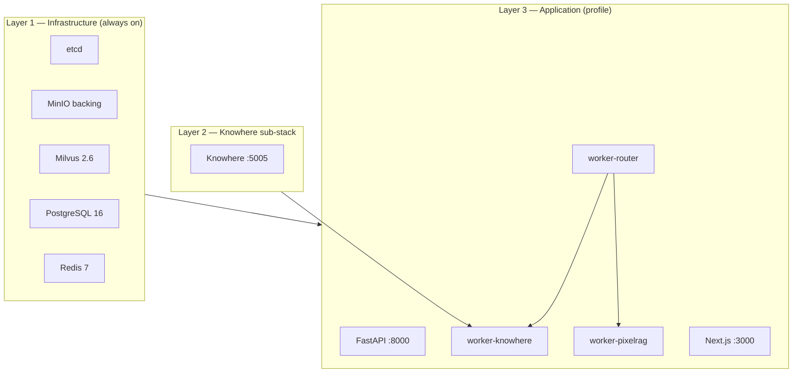

# 部署

使用 Taskfile 包装 Docker Compose，在开发或生产环境启动 Eagle-RAG。

---

## 理论与基础

### RAG 系统的部署拓扑

生产 RAG 具有**异构资源画像**：

| 组件 | CPU | 内存 | GPU | 扩展轴 |
| --- | --- | --- | --- | --- |
| FastAPI API | 低 | 低 | 否 | 水平（无状态） |
| `router_queue` | 中 | 低 | 否 | 水平 |
| `knowhere_queue` | 中 | 中 | 否 | 水平（I/O 绑定 Knowhere HTTP） |
| `pixelrag_queue` | 高 | **极高** | 可选 | **垂直** —— 并发 1 |
| Milvus | 中 | 高（HNSW）或磁盘（DiskANN） | 否 | 水平集群 |
| Knowhere | 高 | 高 | 常有 | 独立服务 |

[Gao et al., 2023](https://arxiv.org/abs/2312.10997) 指出 ingest 吞吐与查询延迟常需**解耦**的 worker 池 —— Eagle-RAG 的三队列 Celery 拓扑即为此实现。

### 有状态 vs 无状态层

| 层 | 有状态？ | 备份关注点 |
| --- | --- | --- |
| PostgreSQL | 是 | `task db:migrate`；pg_dump |
| Milvus | 是 | etcd + MinIO 支撑数据 |
| MinIO | 是 | 对象 blob —— 原文件、瓦片 |
| Redis | 临时 | 仅代理；任务状态在 PostgreSQL 审计 |
| API / workers | 否 | 可自由替换容器 |

---

## Eagle-RAG 实现

### 部署模型

Eagle-RAG 分为三层：



1. **基础设施** —— etcd、MinIO（Milvus 支撑）、Milvus、PostgreSQL、Redis（无 Compose profile —— 始终启动）
2. **Knowhere 子栈** —— `docker/knowhere-self-hosted/` 在共享 `knowhere-net` 上
3. **应用** —— API、三个 Celery worker、frontend（`dev` / `test` / `prod` profile）

### 最小序列

```bash
task setup          # .env + uv sync + bun install
# edit .env — API keys and DB credentials
task up             # dev profile
task db:migrate     # alembic upgrade head — first run and after model changes
task health
```

`task up` 执行顺序：

1. `knowhere:up` —— 创建 `knowhere-net`，启动解析器
2. `docker compose --profile dev up -d` —— 基础设施 + 应用服务

FastAPI lifespan：`eagle_rag/api/app.py` 中的 `get_combined_lifespan(mcp_app)` —— 将应用启动与 FastMCP `StreamableHTTPSessionManager`（`/mcp`）链接。

---

## dev vs prod

| 方面 | `task up`（dev） | `task up:prod` |
| --- | --- | --- |
| Compose 文件 | 基础 + 自动合并 `docker-compose.override.yml` | `COMPOSE_FILE=docker-compose.yml` 仅基础 |
| Frontend | override 中 Bun + `next dev` HMR | 多阶段镜像，`next start` |
| 基础设施端口 | 暴露 Postgres、Redis、Milvus、MinIO | 不向宿主机暴露 |
| Worker 限制 | 宽松 | 强制执行（如 pixelrag worker 4 GB） |
| 热重载 | API `--reload`；workers 需重启 | 生产镜像 |
| Uvicorn workers | 1 个带 reload | 多个 worker |

!!! warning "警告"
    生产环境切勿使用裸 `docker compose up`。自动合并的 dev override 会泄漏 `--reload` 与源码挂载。始终使用 `task up:prod`。

```bash
task build:prod
task up:prod
```

---

## 宿主机开发（无应用容器）

需要 Python/TypeScript 在宿主机热重载时：

```bash
task dev            # parallel be:api + fe:dev

# Separate terminals — one queue each (recommended)
task be:worker QUEUES=router_queue CONCURRENCY=4
task be:worker QUEUES=knowhere_queue CONCURRENCY=8
task be:worker QUEUES=pixelrag_queue CONCURRENCY=1
```

将 `.env` 指向 Milvus、Postgres、Redis、MinIO、Knowhere 的 `localhost`。

**惰性初始化收益：** API 可在无 Milvus 连接时启动；首次查询/ingest 才构造客户端。

---

## 端口映射（dev profile）

| 服务 | 宿主机 | 用途 |
| --- | --- | --- |
| api | 8000 | FastAPI REST + SSE + `/mcp` 挂载 |
| frontend | 3000 | Next.js |
| docs | 8001 | MkDocs（`task docs:serve`） |
| postgres | 5432 | 元数据 |
| redis | 6379 | Celery 代理 |
| minio | 9000 / 9001 | S3 API / 控制台 |
| milvus | 19530 / 9091 | gRPC / 指标 |
| knowhere | 5005 | 解析器 HTTP API |
| mcp（独立） | 8081 | 可选 `MCP_STANDALONE=true` |

生产仅向宿主机暴露 **8000** 与 **3000**。

Prometheus：API 上 `GET /metrics` —— 抓取队列深度与依赖 gauge。

---

## 数据库迁移

Schema 由 Alembic + SQLModel 管理（`alembic/versions/`）：

```bash
task db:migrate     # uv run alembic upgrade head
```

首次使用前及拉取触及 `eagle_rag/db/models/` 的变更后执行。

!!! note "说明"
    store 中无 DDL。所有 schema 变更经 Alembic revision —— 切勿在 `eagle_rag/db/stores/` 中写原始 DDL。

Milvus schema：`milvus_visual_store.py` 中的 `ensure_collection()` —— 幂等创建 + `add_collection_field` 迁移新标量字段。

---

## Celery worker 部署

| 队列 | 任务名 | 并发 | 内存说明 |
| --- | --- | --- | --- |
| `router_queue` | `eagle_rag.tasks.ingest_router` | 4 | 轻量 —— 路由 + 分发 |
| `knowhere_queue` | `eagle_rag.tasks.knowhere_parse` | 8 | 到 Knowhere 的 HTTP I/O |
| `pixelrag_queue` | `pixelrag_build`、`knowhere_visual_chunks` | **1** | Chromium + Qwen3-VL 编码器 |

Celery 应用配置（`eagle_rag/tasks/celery_app.py`）：

- `task_acks_late=True`
- `worker_prefetch_multiplier=1`
- `task_reject_on_worker_lost=True`
- 硬时限 3600s（软 3300s）

Beat 任务（若启用）：每 30s 采样队列 `LLEN` → `metric_sample` 表。

---

## 部署张力

| 张力 | 设置 | 指引 |
| --- | --- | --- |
| Dev vs prod compose 合并 | `COMPOSE_FILE` | 生产仅锁定 `docker-compose.yml` — override 会加入 `--reload` 与宿主机挂载 |
| 视觉 worker 内存 | `worker-pixelrag` 4g 限制 | 大 PDF 上 `embed_tiles` OOM — 通过 `tile_height` 减切片数或拆分文档 |
| 至少一次摄入 | `acks_late`、`prefetch_multiplier=1` | 重试可能重复 Milvus upsert — ID 须保持确定性 |
| API 端口上的 MCP | `:8000` 上 `/mcp` | Agent 单入口；多租户 API 时用网络策略隔离 |
| 索引 vs 注册表 | 摄入时 Milvus 尽力而为 | 灾难恢复后，对照 Postgres `documents` 与 Milvus 实体数 |

---

## 部署相关配置

| 环境变量 | Dev 典型 | Prod 典型 |
| --- | --- | --- |
| `APP_ENV` | `dev` | `prod` |
| `MILVUS_HOST` | `milvus` | `milvus` |
| `MILVUS_VISUAL_INDEX_TYPE` | `hnsw` | 语料大时用 `diskann` |
| `TELEMETRY_ENABLED` | `true` | `true` |
| `OTEL_TRACING_ENABLED` | `false` | `true` 且设 `OTEL_EXPORTER_OTLP_ENDPOINT` |
| `AUTH_ENABLED` | `false` | 边缘暴露时 `true` |

完整 schema 见[配置](configuration.md)。

---

## 健康与日志

```bash
task health
task knowhere:health
task ps

task logs:api
task logs:worker SERVICE=worker-knowhere
task logs:worker SERVICE=worker-pixelrag
task logs              # all services, follow
```

`/health` 探测（各 3s 超时，隔离）：

- PostgreSQL
- Redis
- Milvus
- MinIO
- Knowhere HTTP
- PixelRAG（未配置时为 `unknown`）

Knowhere `down` 会降级文本解析；API 进程仍可启动。

SSE 日志流：Redis pub/sub 频道 `logs`（配置：`telemetry.redis_log_channel`）。Redis 不可用时回退到内存 `asyncio.Queue`。

---

## 故障模式与运维

| 事件 | 检测 | 响应 |
| --- | --- | --- |
| `pixelrag_queue` 积压 | Admin 队列指标；LLEN 增长 | 勿提高并发；加 RAM 或第二台 worker 主机 |
| Milvus OOM（HNSW） | Milvus pod 重启 | 切换 `diskann`；清理旧 KB |
| Worker 中途丢失 | `task_reject_on_worker_lost` 重新入队 | 查日志；从死信重放 |
| 部署时迁移失败 | `task db:migrate` 退出码 ≠ 0 | 切流量前修复 Alembic 冲突 |
| Knowhere 网络分裂 | `knowhere:health` 失败 | `task knowhere:up`；验证 `knowhere-net` |
| MinIO 磁盘满 | ingest 上传失败 | 扩容；附件生命周期 |

### 运维检查清单

- [ ] 每次含模型变更的部署后执行 `task db:migrate`
- [ ] 切流量前验证 `/health` 关键依赖均为 `up`
- [ ] 监控 `pixelrag_queue` 深度
- [ ] 备份 PostgreSQL + MinIO —— 见 [ops/backup-restore](../ops/backup-restore.md)
- [ ] 根因修复后排空死信

### 生产构建命令

```bash
task build:prod
task up:prod
task down              # stop
task clean             # down -v — deletes volumes (destructive)
```

| 命令 | 说明 |
| --- | --- |
| `task setup` | 引导依赖 |
| `task up` / `up:prod` / `down` | 启动 / 生产启动 / 停止 |
| `task dev` | 宿主机热重载 |
| `task be:api` / `be:worker` | API / 参数化 worker |
| `task be:test` / `be:lint` / `be:typecheck` | 质量门禁 |
| `task db:migrate` | 应用迁移 |
| `task health` | API 探测 |

---

## 参考文献

- [Milvus 生产指南](https://milvus.io/docs/install-overview.md)
- [Celery 最佳实践](https://docs.celeryq.dev/en/stable/userguide/tasks.html)
- [Docker Compose profiles](https://docs.docker.com/compose/profiles/)
- 配置：[配置](configuration.md)
- 容器拓扑：[ops/docker](../ops/docker.md)
- 可靠性：[architecture/reliability](../architecture/reliability.md)
