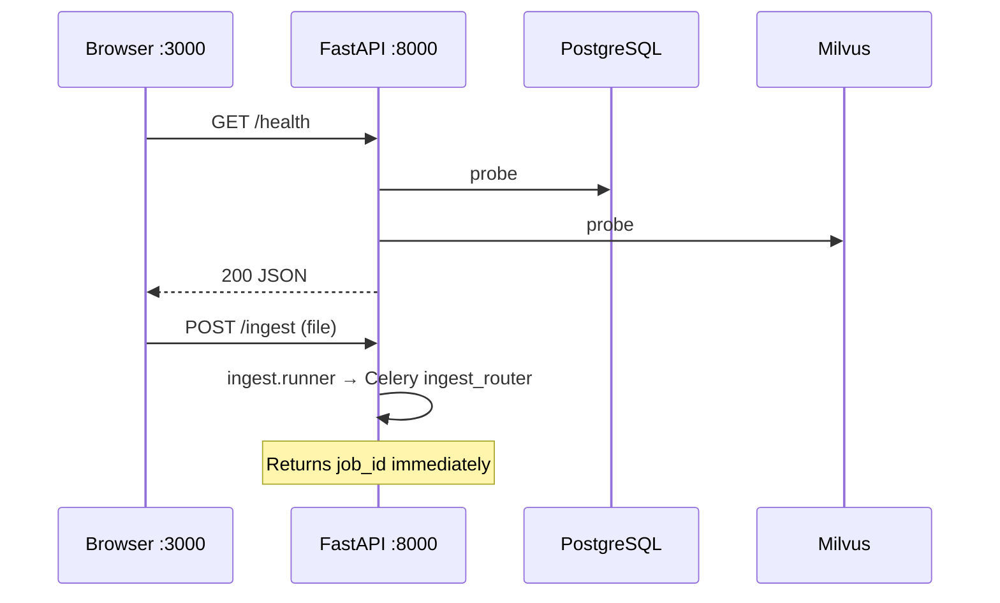
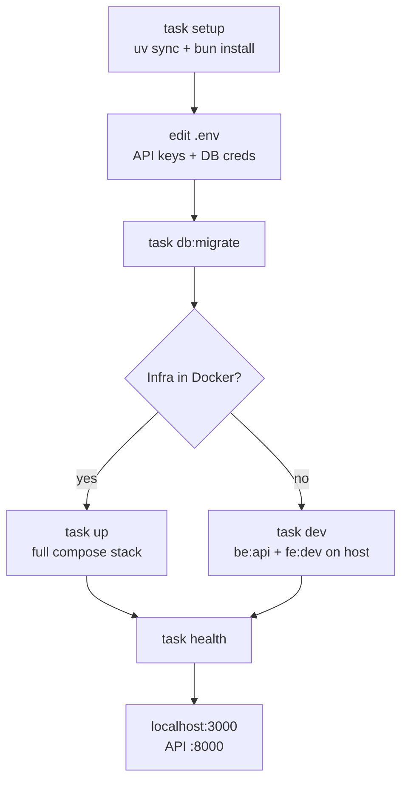

# 快速开始

约三分钟在本地运行 Eagle-RAG。本指南是从零到可用栈的最短路径；更深理论见 [架构](../architecture/index.md) 与 [学习路径](../learning-path.md)。

---

## 理论与基础

### 你正在启动什么

Eagle-RAG 是**多模态 RAG 数据层** — 不是围绕单一 LLM 的聊天包装。它实现 [Lewis 等，2020](https://arxiv.org/abs/2005.11401) 的检索后生成模式，带两个向量索引（文本 1536 维、视觉 2048 维）与双入库流水线。

| 层 | 角色 | 技术 |
| --- | --- | --- |
| 客户端 | QA、入库、健康 UI | Next.js 16 + React 19 |
| API | REST、SSE、MCP | FastAPI `:8000` |
| Worker | 异步入库 | Celery — 3 队列 |
| 解析器 | 文档 → 块 | Knowhere HTTP `:5005` + PixelRAG 库 |
| 存储 | 向量 + 元数据 + 文件 | Milvus、PostgreSQL、MinIO、Redis |

单个 `Taskfile.yml` 编排搭建；偏好容器时 `docker-compose.yml` 捆绑基础设施。

---

## Eagle-RAG 实现

### 引导序列

`task setup` 执行：

1. 复制 `.env.example` → `.env`（不覆盖已有）
2. `uv sync` — 从 `pyproject.toml` 安装 Python 依赖
3. `frontend/` 中 `bun install`

`task up` 然后：

1. `knowhere:up` — `knowhere-net` 上自托管 Knowhere
2. `docker compose --profile dev up -d` — 基础设施 + API + worker + 前端
3. 服务经 Compose DNS 互联（`milvus`、`postgres`、`redis`、`minio`、`knowhere`）

### 首次请求路径



配置单例：`eagle_rag/config.py` 中 `get_settings()` — 每进程经 `@lru_cache` 加载一次。默认部署 profile 为 **`core`**（`EAGLE_RAG_PROFILE=core` 或未设置）；域插件经 profile 覆盖层激活 — 见 [配置](configuration.md#plugins)。

---

## 本地开发模式

| 模式 | 何时使用 | 实用说明 |
| --- | --- | --- |
| `task up`（Docker） | 首次搭建、演示、类 CI 一致性 | Worker 代码变更需重启容器，除非 bind mount |
| `task dev`（主机 API + 前端） | 快速 API/`--reload` 迭代 | 自行运行 Milvus、Postgres、Redis、MinIO、Knowhere |
| 幂等 `task setup` | 新克隆 | 不覆盖已有 `.env` — 手动合并新键 |

默认关闭认证 — 本地可接受；任何非可信网络暴露前启用 `auth.enabled`。

---

## 前置条件（一行）

```bash
python3.12 --version && uv --version && bun --version && docker compose version
```

任一命令失败则安装缺失工具：

- **Python ≥ 3.12** + [`uv`](https://docs.astral.sh/uv/) — 后端依赖
- **Node.js + [Bun](https://bun.sh/)** — 前端
- **Docker + Docker Compose** — 全栈启动

完整矩阵见 [安装](installation.md)。

---

## 三分钟路径

```bash
# 1. 引导：复制 .env，安装依赖
task setup

# 2. 编辑 .env — 设置 API 密钥与数据库凭据
$EDITOR .env

# 3a. Docker 全栈（推荐）
task up
task db:migrate    # 仅首次

# 3b. 或主机热重载（自行启动基础设施）
task dev
```

`task up` 后打开：

| 服务 | URL |
| --- | --- |
| 前端 | <http://localhost:3000> |
| API | <http://localhost:8000/health> |
| API 文档 | <http://localhost:8000/docs> |
| MkDocs | <http://localhost:8001>（`task docs:serve`） |

!!! warning "需要 API 密钥"
    查询前至少设置 `LLM_API_KEY`、`VLM_API_KEY`、`DASHSCOPE_API_KEY`。见 [安装 — 模型 API 密钥](installation.md#model-api-keys)。

---

## 配置（最小）

| 变量 | 用途 |
| --- | --- |
| `KB_NAME` | 绑定域内默认 KB（`default`） |
| `EAGLE_RAG_PROFILE` | 部署域覆盖（默认 `core`） |
| `LLM_API_KEY` | DeepSeek 路由 + 文本 |
| `VLM_API_KEY` | Qwen-VL 生成 |
| `DASHSCOPE_API_KEY` | 文本嵌入 + 重排 |
| `KNOWHERE_BASE_URL` | 解析器服务（主机上 `http://localhost:5005`） |

完整分层：[配置](configuration.md)。

---

## 验证可用

```bash
task health              # API /health JSON
task knowhere:health     # Knowhere 解析器 :5005
task ps                  # docker compose ps — 服务健康
```

预期 `/health` 形状：每依赖状态（`up` / `down` / `unknown`）。单依赖 `down` **降级**该功能而非崩溃 API — 设计如此。见 [可靠性](../architecture/reliability.md)。

### 冒烟测试入库 + 查询

```bash
# 经 API 上传（替换为你的文件）
curl -F "file=@README.md" -F "kb_name=default" http://localhost:8000/ingest

# 轮询任务状态，然后查询
curl -s http://localhost:8000/query -H 'Content-Type: application/json' \
  -d '{"query":"What is Eagle-RAG?","kb_name":"default"}' | jq .answer
```

---

## 故障模式与运维

| 症状 | 可能原因 | 修复 |
| --- | --- | --- |
| `task up` 在 Knowhere 失败 | 缺少 `docker/knowhere-self-hosted/.env` | 复制示例 env；设置 `DS_KEY` |
| `/health` 显示 milvus `down` | Milvus 仍在启动（约 60s） | 等待；`task ps` |
| 查询返回 API 错误 | 缺少 `LLM_API_KEY` / `VLM_API_KEY` | 编辑 `.env`；重启 API |
| 入库任务 `FAILED` | Knowhere 不可达 | `task knowhere:health` |
| 前端无法连 API | `NEXT_PUBLIC_API_URL` 错误 | 设为 `http://localhost:8000` |

---

## 开发工作流



=== "Docker（`task up`）"

    基础设施、API、worker 与前端 HMR 在 Compose 中运行。Worker 代码重载需重启容器。

=== "主机（`task dev`）"

    主机上 Uvicorn 与 Next.js 热重载。须单独运行 Milvus、PostgreSQL、Redis、MinIO、Knowhere，并将 `.env` 指向 `localhost`。

!!! note "Knowhere 在 Python 包外"
    Knowhere（`Ontos-AI/knowhere`，HTTP `:5005`）在 Compose 栈中作为自托管服务捆绑。`task dev` 时将 `KNOWHERE_BASE_URL` 指向运行实例，用 `task knowhere:health` 探测。

### Worker 进程（主机开发）

```bash
task be:worker QUEUES=router_queue CONCURRENCY=4
task be:worker QUEUES=knowhere_queue CONCURRENCY=8
task be:worker QUEUES=pixelrag_queue CONCURRENCY=1   # 保持为 1
```

---

## 下一步

| 目标 | 文档 |
| --- | --- |
| 完整安装矩阵 | [安装](installation.md) |
| 设置深入 | [配置](configuration.md) |
| 开发 vs 生产部署 | [部署](deployment.md) |
| 系统设计 | [架构概览](../architecture/index.md) |
| RAG 理论路径 | [学习路径](../learning-path.md) |

---

## 参考文献

- [Lewis 等，2020](https://arxiv.org/abs/2005.11401) — RAG 基础
- [Knowhere](https://github.com/Ontos-AI/knowhere) — 解析器服务
- [uv 文档](https://docs.astral.sh/uv/)
- [Taskfile](https://taskfile.dev/) — 项目自动化
