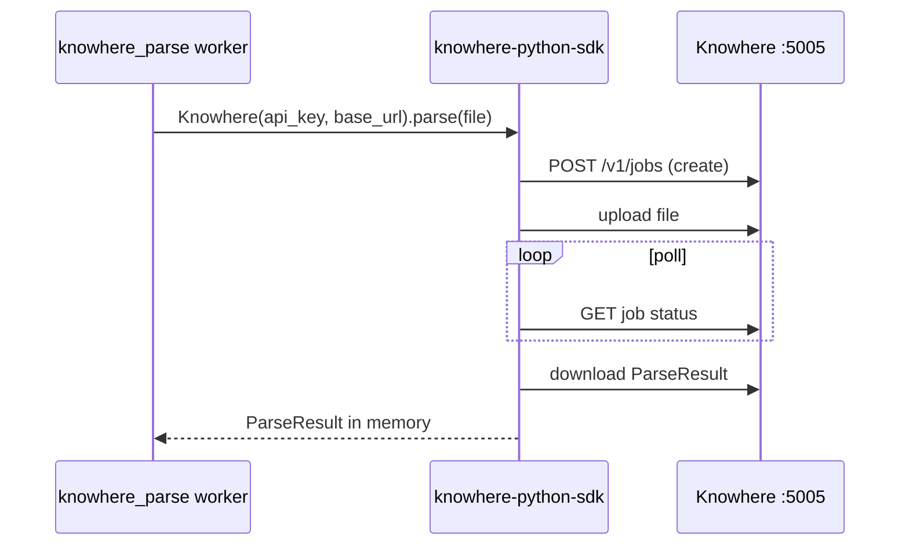

# 安装

在运行 Eagle-RAG 之前，安装宿主机工具、Python 依赖、前端包与模型 API 密钥。

!!! tip "提示"
    `task setup` 会自动完成下文大部分步骤。本页说明该命令做了什么，以及各依赖背后的原理。

---

## 理论与基础

### 为何需要这些依赖

Eagle-RAG 是**分布式 RAG 系统**，而非单一 Python 包：

| 组件 | CS/ML 角色 | 为何与 API 进程分离 |
| --- | --- | --- |
| **Milvus** | ANN 索引（[HNSW](https://arxiv.org/abs/1603.09320) / [DiskANN](https://papers.nips.cc/paper/2019/hash/09853c7ff1cb93b59a86b8e886786b9b-Abstract.html)） | 大规模向量检索；标量过滤支持多租户 |
| **PostgreSQL** | ACID 元数据、去重、会话 | `(sha256, kb_name)` 与任务审计的关系完整性 |
| **Redis** | 消息代理 | Celery 任务分发；可选 SSE 日志扇出 |
| **MinIO** | 对象存储 | 原始文件、视觉分块 blob、瓦片 PNG |
| **Knowhere** | 文档解析器 | 重型版式/OCR 模型 —— 独立 HTTP 服务 |
| **PixelRAG** | 视觉渲染 + 嵌入 | 进程内库；GPU 内存隔离在 `pixelrag_queue` worker |

[Gao et al., 2023](https://arxiv.org/abs/2312.10997) 综述了生产 RAG 栈如何组合这些层。

---

## 前置条件

| 依赖 | 版本 | 用途 |
| --- | --- | --- |
| Python | ≥ 3.12 | 后端运行时；[`uv`](https://docs.astral.sh/uv/) 管理包 |
| Node.js + Bun | 最新 | 前端（`bun install`） |
| Docker + Compose | 最新 | 一键全栈 |
| Milvus | 2.6+ | `eagle_text`（1536 维）+ `eagle_visual`（2048 维） |
| PostgreSQL | 16 | 会话、去重、任务审计 |
| Redis | 7 | Celery 代理与结果后端 |
| MinIO | 最新 | 对象存储 |

Milvus、PostgreSQL、Redis、MinIO 在 `docker-compose.yml` 中声明 —— 使用 `task up` 时宿主机安装可选。`task dev` 自管基础设施时版本很重要。

!!! tip "提示"
    ```bash
    curl -LsSf https://astral.sh/uv/install.sh | sh
    curl -fsSL https://bun.sh/install | bash
    ```

---

## Eagle-RAG 实现

### 后端安装（`uv sync`）

依赖在 `pyproject.toml`：

| 命令 | 安装内容 | 时机 |
| --- | --- | --- |
| `uv sync` | FastAPI、Celery、LlamaIndex、Milvus 客户端、DashScope、`pixelrag_render` / `pixelrag_embed`、`knowhere-python-sdk` | 始终 |
| `uv sync --extra biomed` | `open-clip-torch`（BiomedCLIP 放射图文检索） | biomed 配置且需原生医学影像编码 |
| `uv sync --group dev` | pytest、ruff、mypy | 测试与 lint |
| `uv sync --group docs` | MkDocs Material | 本地文档站 |

```bash
uv sync                  # 核心（必需）
uv sync --extra biomed   # 可选：BiomedCLIP（open_clip）
uv sync --group dev      # 可选：测试/lint
uv sync --group docs     # 可选：文档
```

**关键包与代码路径：**

| 包 | Eagle-RAG 用途 |
| --- | --- |
| `llama-index-vector-stores-milvus` | `eagle_rag/index/milvus_text_store.py` |
| `pymilvus` | `eagle_rag/index/milvus_visual_store.py` |
| `knowhere`（SDK） | `parse_with_knowhere_sdk()` |
| `pixelrag_render`、`pixelrag_embed` | `eagle_rag/ingest/pixelrag_adapter.py` |

### 前端安装

```bash
cd frontend
bun install
```

技术栈：Next.js 16（App Router）、React 19、HeroUI v3、Tailwind v4、TanStack Query、Zustand、`next-intl`。

`frontend/lib/api/generated/` 下的 OpenAPI SDK 通过 `predev` 钩子（`bun run api:gen`）重新生成。

### 数据库 schema

```bash
task db:migrate    # uv run alembic upgrade head
```

Schema 定义于 `eagle_rag/db/models/` —— **store 模块中无 DDL**。迁移在 `alembic/versions/`。

近期插件命名空间迁移：`0007_plugin_namespace`、`0008_namespace_unique_constraints` — `plugin_namespace` 列与命名空间范围唯一性所需。

---

## 模型 API 密钥 {#model-api-keys}

Eagle-RAG **仅使用 DeepSeek + Qwen** —— 无 OpenAI 或 Cohere 适配器。

| 用途 | 模型 | 环境变量 | 代码消费者 |
| --- | --- | --- | --- |
| 文本 LLM / 路由 | DeepSeek-V4-Pro | `LLM_API_KEY`、`LLM_BASE_URL`、`LLM_MODEL` | `route_query()`、生成 |
| VLM（读图） | Qwen-VL-Max | `VLM_API_KEY`、`VLM_BASE_URL`、`VLM_MODEL` | `EagleMultimodalQueryEngine` |
| 文本嵌入（1536 维） | `text-embedding-v4` | `DASHSCOPE_API_KEY`、`TEXT_EMBEDDING_MODEL` | `upsert_text_nodes()` |
| 文本重排 | `qwen3-rerank` | `DASHSCOPE_API_KEY`、`RERANK_TEXT_MODEL` | 生成中的重排步骤 |
| 视觉嵌入（2048 维） | Qwen3-VL-Embedding-2B / 百炼 `qwen3-vl-embedding` | `VISUAL_EMBEDDING_PROVIDER=pixelrag`（本地 HF）或 `dashscope`（需 `DASHSCOPE_API_KEY`） | `get_visual_encoder()` |

`DASHSCOPE_API_KEY` 由嵌入与重排客户端共用。兼容模式 base URL：`https://dashscope.aliyuncs.com/compatible-mode/v1`。

!!! warning "警告"
    新模型须通过 LlamaIndex 包集成。见[贡献](../development/contributing.md)。

---

## 外部服务

### Knowhere（`:5005`）

文档语义解析器 —— [Ontos-AI/knowhere](https://github.com/Ontos-AI/knowhere)。

**集成流程：**



- 默认：`KNOWHERE_BASE_URL=http://localhost:5005`
- SDK 不可达 → `KnowhereError`，任务 `FAILED` —— **无 mock 回退**
- 自托管栈：`docker/knowhere-self-hosted/`，自有 `.env`（`DS_KEY`、`ALI_API_KEYS`）

**轮询设置**（`settings.yaml` → `knowhere`）：

| 键 | 默认 | 含义 |
| --- | --- | --- |
| `poll_interval` | 10s | 状态轮询间隔 |
| `poll_timeout` | 1800s | 解析完成最长等待 |
| `upload_timeout` | 600s | 大文件上传上限 |

### PixelRAG 库

进程内 `pixelrag_render` + `pixelrag_embed`。

- **不使用 `pixelrag-serve` 与 FAISS** —— 视觉向量写入 Milvus HNSW/DiskANN
- `pixelrag_adapter.py` 惰性导入 —— 渲染库缺失则快速失败
- 嵌入经 `get_visual_encoder()`：`provider=pixelrag`（本地 HF）或 `dashscope`（百炼）。ingest+query 须同 provider；切换需重建 `eagle_visual`

!!! note "说明"
    PixelRAG 为核心依赖。在 `linux/aarch64` 上，传递依赖 `cef-capi-py` 通过 uv override 跳过；功能不受影响。

---

## 安装时注意事项

| 主题 | 说明 |
| --- | --- |
| 视觉编码器惰性加载 | `provider=pixelrag`：本地 HF 在首次 `embed_*` 时加载。`provider=dashscope`：无本地权重（仅 API）。API 容器可无 GPU 启动 |
| Knowhere 轮询窗口 | SDK 在 worker 内最长阻塞 `knowhere.poll_timeout`（默认 1800s）— 非 API 超时 |
| 嵌入提供方锁定 | ingest 与 query 须共享 `embedding.visual.provider`（`pixelrag` \| `dashscope`）；切换后端需重建 `eagle_visual` |
| Worker 镜像中的 Chrome | HTML 表格渲染在 `Dockerfile.worker` 中用无头浏览器 — Knowhere 表块所需 |

---

## `.env` 配置

`task setup` 复制 `.env.example` → `.env`。变量映射到 `eagle_rag/settings.yaml` 中的 `${VAR:-default}`。

| 分区 | 关键变量 | 备注 |
| --- | --- | --- |
| App | `APP_ENV`、`APP_HOST`、`APP_PORT`、`LOG_LEVEL` | |
| KB | `KB_NAME` | 绑定域内默认租户 |
| Profile | `EAGLE_RAG_PROFILE` | 可选 — `core`（默认）、`biomed`（**实验性**）、`lakehouse-bi`（**开发中**）；合并 `profiles:` 覆盖层 |
| Knowhere | `KNOWHERE_BASE_URL`、`KNOWHERE_API_KEY` | 解析服务 |
| LLM | `LLM_API_KEY`、`LLM_BASE_URL`、`LLM_MODEL` | DeepSeek |
| VLM | `VLM_API_KEY`、`VLM_BASE_URL`、`VLM_MODEL` | Qwen-VL |
| DashScope | `DASHSCOPE_API_KEY`、`TEXT_EMBEDDING_MODEL`、`RERANK_TEXT_MODEL` | 文本嵌入 + 重排（`provider=dashscope` 时亦用于视觉） |
| 视觉嵌入 | `VISUAL_EMBEDDING_PROVIDER`、`VISUAL_EMBEDDING_MODEL` | `pixelrag`（默认）或 `dashscope`；可选 `VISUAL_EMBEDDING_BATCH_SIZE` / `_TIMEOUT_S` / `_MAX_RETRIES` |
| 插件 | `PLUGIN_NAMESPACE`、`PLUGIN_AUDIT_ENABLED`、`PLUGIN_AUDIT_REDIS_ENABLED` | 实例绑定 + PluginAudit sinks |
| Milvus | `MILVUS_HOST`、`MILVUS_PORT`、`MILVUS_VISUAL_INDEX_TYPE` | `hnsw` 或 `diskann` |
| Redis | `CELERY_BROKER_URL`、`CELERY_RESULT_BACKEND` | DB 0 / DB 1 |
| MinIO | `MINIO_ENDPOINT`、`MINIO_ACCESS_KEY`、`MINIO_SECRET_KEY` | 对象存储 |
| Postgres | `POSTGRES_DSN`、`POSTGRES_*` | 元数据 |
| Router | `ROUTER_MODE` | `auto` / `text` / `visual` / `hybrid` |
| Frontend | `NEXT_PUBLIC_API_URL` | 浏览器 → API URL |

备用配置文件路径：

```bash
EAGLE_RAG_SETTINGS_PATH=/path/to/staging.yaml task be:api
```

---

## 容器 vs 宿主机服务名

`settings.yaml` 默认使用 `localhost`。Compose 内须用服务 DNS：

| 服务 | Docker（`.env`） | 宿主机（`task dev`） |
| --- | --- | --- |
| Milvus | `MILVUS_HOST=milvus` | `localhost` |
| Redis | `redis://redis:6379/0` | `redis://localhost:6379/0` |
| MinIO | `minio:9000` | `localhost:9000` |
| Postgres | `postgres:5432` | `localhost:5432` |
| Knowhere | `http://knowhere:5005` | `http://localhost:5005` |

---

## 故障模式与运维

| 故障 | 行为 | 处理 |
| --- | --- | --- |
| `uv sync` 在 PixelRAG 失败 | 平台特定 wheel 缺失 | 检查 `pyproject.toml` override；用 Docker |
| Knowhere 健康检查失败 | 子栈未启动 | `task knowhere:up`；检查 `docker/knowhere-self-hosted/.env` |
| Milvus 连接被拒绝 | 服务仍在启动 | `task up` 后等待约 60s |
| `alembic upgrade` 失败 | Schema 漂移 | 拉取最新；检查迁移冲突 |
| 缺少 API 密钥 | 运行时查询/生成错误 | 在 `.env` 设置密钥；重启进程 |
| 视觉嵌入 OOM | Worker 被杀死 | `pixelrag_queue` 并发仅能为 1 |

### 验证命令

```bash
uv run python -c "from eagle_rag.config import get_settings; print(get_settings().kb_name)"
task health
task knowhere:health
uv run pytest tests/test_ingest_smoke.py -q   # after dev install
```

---

## 参考文献

- [uv 文档](https://docs.astral.sh/uv/)
- [Milvus 安装概览](https://milvus.io/docs/install-overview.md)
- [Knowhere 仓库](https://github.com/Ontos-AI/knowhere)
- [PixelRAG 仓库](https://github.com/StarTrail-org/PixelRAG)
- [LlamaIndex 安装](https://docs.llamaindex.ai/en/stable/getting_started/installation/)
- 下一步：[配置](configuration.md) 或[部署](deployment.md)
