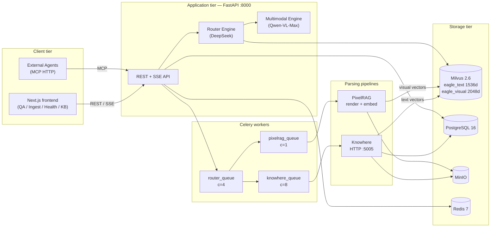

# Eagle-RAG

> 面向 Agent 与 LLM 的、行业无关、多租户（`kb_name`）**多模态检索增强生成（RAG）** 知识库 — 数据层。

## 理论与基础

### 为何需要 RAG

大语言模型（LLM）从**参数化记忆**作答 — 权重在训练时冻结。若不微调，它们无法引用你的内部文档、无法在政策变更时更新，也无法将答案限定在某一租户的知识库范围内。

**检索增强生成（RAG）** 在生成前插入检索步骤：


经典表述见 [Lewis 等，2020](https://arxiv.org/abs/2005.11401)（*Retrieval-Augmented Generation for Knowledge-Intensive NLP Tasks*）。Lewis 等表明，在稠密向量索引中检索段落并条件化生成，可降低知识密集型任务上的幻觉，且无需重训 LLM 即可更新知识。

[Gao 等，2023](https://arxiv.org/abs/2312.10997)（*Retrieval-Augmented Generation for Large Language Models: A Survey*）对完整 RAG 栈分类：分块策略、嵌入模型、检索器（稀疏、稠密、混合）、重排器与生成策略。Eagle-RAG 实现该栈的**多模态**变体：双稠密索引与查询时路由。

### 为何需要多模态 RAG

文本嵌入会压缩对版式敏感的内容 — 图表、表格、示意图 — 为短摘要。[Chen 等，2022 — MuRAG](https://arxiv.org/abs/2210.02928) 表明，同时检索**文本**与**视觉**证据，可提升答案位于图表或表格结构中的文档问答。Eagle-RAG 的**语义树锚定融合**（见 [多模态融合](architecture/multimodal-fusion.md)）延伸该思路：视觉切片在独立向量空间中索引，但通过 Knowhere 章节 `path` 回链，以支持范围检索与 VLM 提示。

### 为何使用近似最近邻（ANN）

高维精确 k 近邻搜索每次查询为 O(n)。生产 RAG 使用 **ANN 索引** — [HNSW](https://arxiv.org/abs/1603.09320)（Malkov & Yashunin，2016）构建分层可导航小世界图以实现亚线性搜索；[DiskANN](https://papers.nips.cc/paper/2019/hash/09853c7ff1cb93b59a86b8e886786b9b-Abstract.html)（Subramanya 等，NeurIPS 2019）将图搜索扩展到磁盘以支撑十亿级语料。Eagle-RAG 将向量存入 [Milvus 2.6](https://milvus.io/docs)，`eagle_visual` 使用 HNSW（默认）或 DiskANN，并对 `kb_name` 及融合锚定字段建立倒排标量索引。

---

## Eagle-RAG 概览

Eagle-RAG 在经典文本 RAG 上扩展三点，对应真实企业文档场景：

| 挑战 | Eagle-RAG 应对 | 主要代码 |
| --- | --- | --- |
| 混合格式（PDF、Excel、图片、URL） | 双摄入管线：Knowhere（文本/结构）+ PixelRAG（扫描/视觉） | `eagle_rag/ingest/router.py` `route()` |
| 图表、表格、示意图在文本中丢失细节 | 语义树锚定融合 — 视觉切片关联 Knowhere `path` | `extract_visual_chunks()` → `upsert_visual()` |
| 多团队共享集群 | `kb_name` 多租户 — 从 API 到 Milvus 的标量过滤 | `router_engine._resolve_scope_filter()` |

!!! note "延伸阅读"
    刚接触 RAG？从 [学习路径](learning-path.md) 开始。融合设计见 [多模态融合](architecture/multimodal-fusion.md)。

---

## 核心能力

- :octicons-git-branch-24: **双摄入管线** — Knowhere（HTTP `:5005`，`knowhere-python-sdk`）处理文本型 PDF、Office、CSV、Markdown；PixelRAG（`pixelrag_render` + `pixelrag_embed`）处理扫描 PDF、图片与网页。
- :octicons-organization-24: **多租户** — 文档、向量、会话、任务均以 `kb_name` 划分；去重键 `(sha256, kb_name)`。
- :octicons-search-24: **混合检索** — Milvus ANN：`eagle_text`（1536 维）与 `eagle_visual`（2048 维）；文本节点经 `connect_to` 图扩展；`kb_name` / `document_id` / 标签标量过滤。
- :octicons-eye-24: **多模态生成** — DeepSeek 路由查询；Qwen-VL-Max 在文本块与图像切片上综合作答；`qwen3-rerank` / `qwen3-rerank` 重排。
- :octicons-plug-24: **MCP 工具服务** — `/mcp` 提供 `ingest`、`query`、`retrieve_text`、`retrieve_visual`（[Model Context Protocol](https://modelcontextprotocol.io/)）。
- :octicons-pulse-24: **可观测运维** — 依赖探测、SSE 日志流、队列指标、管理仪表盘。

---

## 系统架构



### 控制流摘要

| 阶段 | 入口 | 关键函数 |
| --- | --- | --- |
| 摄入 | `POST /ingest` → `ingest.runner` | `route()` → `ingest_router` → `knowhere_parse` / `pixelrag_build` |
| 查询 | `POST /query` → `EagleRouterQueryEngine` | `route_query()` → `_fetch_nodes()` → `EagleMultimodalQueryEngine.custom_query()` |
| Agent | `POST /mcp` → FastMCP 工具 | `mcp_server.py` → 与 REST 相同引擎 |

基础设施：Milvus（etcd + MinIO 后端）· PostgreSQL（会话、去重、审计）· Redis（Celery broker）· MinIO（原文件与切片 PNG）。

---

## 设计张力与调参

以下参数在生产中真正影响检索质量、延迟与一致性 — 而非栈组件的清单式对比。

| 张力 | 旋钮 | 调高时效果 | 调低时效果 |
| --- | --- | --- | --- |
| 召回 vs ANN 延迟 | Milvus HNSW `ef`（搜索，默认 64） | 视觉/文本 ANN 召回更好 | 查询更快，更易漏邻居 |
| 候选广度 vs 重排成本 | `top_k`（检索）vs `top_n`（qwen3-rerank） | VLM 上下文更丰富；DashScope 费用更高 | 更便宜；可能上下文空或偏题 |
| 摄入路由精度 | `pdf_probe.text_page_ratio`、`avg_chars_per_page` | 更少扫描 PDF 误路由到 Knowhere | 更多文本 PDF 走 PixelRAG（更慢、版式感知） |
| 视觉索引粒度 | `pixelrag.tile_height` | 切片更细；小图召回更好 | 每页向量更少；摄入成本更低 |
| 范围广度 vs Milvus expr 成本 | `router.max_scope_documents`（标签 → 文档并集） | 更广的多文档 QA | 更小的 `document_id in [...]` 谓词 |
| 索引完整度 vs 就绪时间 | 非阻塞 `dispatch_visual_chunks` | 文档 `ready` 时文本已可搜 | 视觉答案滞后或缺失，直至 `knowhere_visual_chunks` 完成 |
| 注册表 vs 向量一致性 | 摄入失败时尽力 `upsert_text_nodes` | 摄入审计达 `SUCCESS`；运维可重索引 | 更严格失败会阻塞去重短路语义 |

交叉链接：[检索](../backend/retrieval.md)（DPR + 图扩展 + 重排链）、[多模态融合](architecture/multimodal-fusion.md)（池化 + 切片几何）、[路由矩阵](architecture/routing-matrix.md)（PDF 探测数学）。

---

## 配置

设置自三层加载（见 [配置](getting-started/configuration.md)）：

1. `eagle_rag/settings.yaml` — 含 `${VAR:-default}` 占位符的默认值
2. `.env` — 密钥与环境相关值
3. `EAGLE_RAG_*` — pydantic-settings 运行时覆盖

| 关注点 | 关键设置 | 环境变量 |
| --- | --- | --- |
| 默认租户 | `kb_name` | `KB_NAME` |
| Milvus | `milvus.host`、`visual_index_type` | `MILVUS_HOST`、`MILVUS_VISUAL_INDEX_TYPE` |
| 摄入路由 | `ingest.routing`、`pdf_probe` | `ROUTER_MODE`（查询时；摄入用 `ingest.routing`） |
| 模型 | `llm`、`vlm`、`embedding`、`rerank` | `LLM_API_KEY`、`VLM_API_KEY`、`DASHSCOPE_API_KEY` |
| 队列 | `celery.queues` | `CELERY_BROKER_URL` |

单例访问：`eagle_rag/config.py` 中 `get_settings()` — `@lru_cache(maxsize=1)`。

---

## 故障模式与运维

Eagle-RAG 假定**部分失败是常态**。完整矩阵见 [可靠性](architecture/reliability.md)。

| 故障 | 系统行为 | 运维动作 |
| --- | --- | --- |
| Knowhere 不可达 | `KnowhereError` → 任务 `FAILED`；无 mock 解析 | 修复 `:5005` 服务；重放任务 |
| 摄入时 Milvus 写入错误 | 记录日志；文档可能 `SUCCESS` 但索引不全 | 检查 Milvus 健康；重新摄入文档 |
| PixelRAG OOM | Worker 崩溃；任务重试 → 死信 | 保持 `pixelrag_queue` 并发为 1 |
| VLM API 密钥缺失 | 生成返回错误字符串 | 设置 `VLM_API_KEY` |
| Redis 宕机影响 SSE | 内存队列 + 5 秒心跳 | 恢复 Redis 以支持多实例日志扇出 |

健康探测：`GET /health` — 每依赖 3 秒超时、独立 `try/except`。未配置视觉提供方时 PixelRAG 为 `unknown`（非红色 `down`）。

```bash
task health              # API 聚合探测
task knowhere:health     # Knowhere 解析器
task ps                  # Compose 服务状态
```

---

## 技术栈

| 层 | 技术 |
| --- | --- |
| **后端** | Python ≥ 3.12、FastAPI、Celery 5、[LlamaIndex](https://docs.llamaindex.ai/)、Pydantic v2、SQLModel、Alembic |
| **前端** | Next.js 16、React 19、TypeScript、HeroUI v3、Tailwind v4、TanStack Query、Zustand、`next-intl`（中/英） |
| **AI 模型** | DeepSeek-V4-Pro（LLM / 路由）、Qwen-VL-Max（VLM）、`text-embedding-v4`（1536 维）、Qwen3-VL-Embedding-2B（2048 维）、`qwen3-rerank` — 仅 DeepSeek + Qwen |
| **向量库** | [Milvus 2.6](https://milvus.io/docs) — 双 collection `eagle_text` + `eagle_visual`；HNSW 或 DiskANN |
| **基础设施** | PostgreSQL 16、Redis 7、MinIO、Docker Compose |
| **集成** | MCP（HTTP `/mcp` + stdio）、OpenAPI 生成 TypeScript SDK |

!!! tip "多模态融合"
    `eagle_visual` 中的视觉切片通过四个字段锚定到 Knowhere 语义树：`chunk_type`、`parent_section`、`content_summary`、`source_chunk_id`。详见 [多模态融合](architecture/multimodal-fusion.md)。

---

## 下一步

:octicons-arrow-right-24:{ .lg .middle } **[RAG 学习路径](learning-path.md)** — 含论文与外部文档的阅读顺序

| 目标 | 从这里开始 |
| --- | --- |
| 本地运行 | [快速开始](getting-started/index.md) |
| 理解设计 | [架构](architecture/index.md) |
| 阅读模块内部 | [后端](backend/index.md) · [前端](frontend/index.md) |
| API 或 Agent 集成 | [API 参考](api/index.md) · [MCP 工具](api/mcp-tools.md) |
| 生产运维 | [运维](ops/index.md) |
| 术语 | [术语表](glossary.md) |

---

## 参考文献

| 资源 | 对 Eagle-RAG 的贡献 |
| --- | --- |
| [Lewis 等，2020](https://arxiv.org/abs/2005.11401) | RAG 检索-再-生成基础模式 |
| [Gao 等，2023](https://arxiv.org/abs/2312.10997) | 分块、混合检索、重排综述 |
| [MuRAG，Chen 等，2022](https://arxiv.org/abs/2210.02928) | 多模态检索动机 |
| [HNSW，Malkov & Yashunin，2016](https://arxiv.org/abs/1603.09320) | Milvus 默认视觉 ANN 索引 |
| [DiskANN，NeurIPS 2019](https://papers.nips.cc/paper/2019/hash/09853c7ff1cb93b59a86b8e886786b9b-Abstract.html) | 大规模视觉语料的磁盘 ANN |
| [Milvus 文档](https://milvus.io/docs) | 双 collection、标量过滤、混合搜索 |
| [LlamaIndex RAG](https://docs.llamaindex.ai/en/stable/understanding/rag/) | TextNode 抽象、向量库集成 |
| [Knowhere](https://github.com/Ontos-AI/knowhere) | 文档语义解析器 |
| [PixelRAG](https://github.com/StarTrail-org/PixelRAG) | 视觉切片渲染与嵌入库 |
| [MCP 规范](https://modelcontextprotocol.io/) | Agent 工具传输 `/mcp` |
