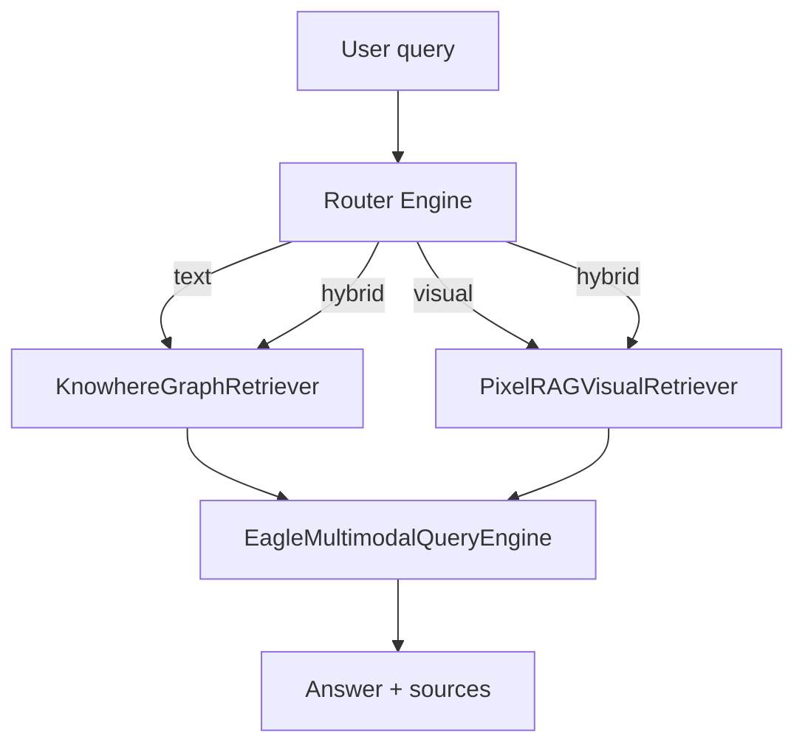

# RAG 学习路径

:material-school:{ .lg .middle } 从 RAG 基础到生产环境运维 Eagle-RAG 的 curated 路径。每一级说明概念*为何*重要、映射到 Eagle-RAG 代码，并指向更深文档。

## 前置知识

开始前，你应熟悉：

- [ ] Python 异步基础（FastAPI 处理器、Celery worker）
- [ ] 向量数据库概念 — 嵌入、近似最近邻（ANN）搜索
- [ ] LLM API — 对话补全、流式 token

!!! tip "本地文档站"
    运行 `task docs:serve`，在 `http://localhost:8001` 浏览。

---

## Level 0 — 数学与系统背景

### 稠密检索一页纸

给定查询 \(q\) 与语料块 \(\{c_i\}\)，稠密检索：

1. 编码 \(q \rightarrow \mathbf{e}_q \in \mathbb{R}^d\)，各 \(c_i \rightarrow \mathbf{e}_{c_i}\)
2. 按相似度排序 — 通常在 L2 归一化向量上用**余弦**或**内积（IP）**
3. 返回 top-\(k\) 块用于构造提示

[HNSW](https://arxiv.org/abs/1603.09320) 通过多层邻近图导航，以亚线性时间近似第 2 步。Eagle-RAG 在 `eagle_rag/index/milvus_visual_store.py` 中对 L2 归一化的 2048 维视觉向量使用 IP — 数学上等价于余弦相似度。

### 优先阅读的论文

| 论文 | 年份 | 贡献 | Eagle-RAG 映射 |
| --- | --- | --- | --- |
| [Lewis 等](https://arxiv.org/abs/2005.11401) | 2020 | RAG = 检索 + 生成 | `EagleRouterQueryEngine.query()` → `EagleMultimodalQueryEngine` |
| [Gao 综述](https://arxiv.org/abs/2312.10997) | 2023 | 完整 RAG 分类 | 分块（`chunks_to_text_nodes`）、重排（`qwen3-rerank`）、混合检索 |
| [MuRAG](https://arxiv.org/abs/2210.02928) | 2022 | 多模态证据检索 | 双 collection `eagle_text` + `eagle_visual` |
| [HNSW](https://arxiv.org/abs/1603.09320) | 2016 | 图 ANN | `MILVUS_VISUAL_INDEX_TYPE=hnsw` |
| [DiskANN](https://papers.nips.cc/paper/2019/hash/09853c7ff1cb93b59a86b8e886786b9b-Abstract.html) | 2019 | 大规模磁盘 ANN | `MILVUS_VISUAL_INDEX_TYPE=diskann` |

---

## Level 1 — RAG 基础

### RAG 解决什么问题？

无检索时，LLM 可能幻觉事实或用过时训练数据作答。RAG 在生成前插入**检索步骤**：


经典流水线 — 分块 → 嵌入 → 索引 → 检索 → 生成 — 见 [LlamaIndex RAG 概念](https://docs.llamaindex.ai/en/stable/understanding/rag/)。

### Eagle-RAG 映射

| RAG 阶段 | Eagle-RAG 组件 | 关键函数 / 模块 | 文档 |
| --- | --- | --- | --- |
| 解析与分块 | Knowhere 类型化块 + PixelRAG 切片 | `parse_with_knowhere_sdk()`、`pixelrag_build` | [摄入管线](backend/ingest-pipeline.md) |
| 嵌入 | Qwen 文本 1536 维 + 视觉 2048 维 | `upsert_text_nodes()`、`upsert_visual()` | [向量存储](backend/vector-stores.md) |
| 检索 | 混合文本 + 视觉、标量过滤 | `EagleRouterQueryEngine.retrieve()` | [检索](backend/retrieval.md) |
| 重排 | DashScope `qwen3-rerank` | `EagleMultimodalQueryEngine` | [生成](backend/generation.md) |
| 生成 | Qwen-VL-Max 基于检索上下文 | `custom_query()`、`stream_custom_query()` | [生成](backend/generation.md) |

### 动手：验证文本管线

```bash
task setup && task up
# 经前端或 POST /ingest 摄入 .md 文件
# 以 mode=text 查询
curl -s localhost:8000/query -H 'Content-Type: application/json' \
  -d '{"query":"What is in the document?","mode":"text","kb_name":"default"}' | jq .
```

### Level 1 调参

| 概念 | Eagle-RAG 旋钮 | 延伸阅读 |
| --- | --- | --- |
| ANN 召回 vs 延迟 | HNSW `ef`、检索 `top_k` | [向量存储](backend/vector-stores.md) |
| 双编码器 → 交叉编码器鸿沟 | `top_k` 后 gte-rerank `top_n` | [生成](backend/generation.md) |
| 父文档噪声 | `section_summary` + `path` 前缀下钻 | [检索](backend/retrieval.md) |
| 图扩展 token | Knowhere 块中 `connect_to` 边 | [检索](backend/retrieval.md) |

**外部参考**

- [Milvus — 多向量搜索](https://milvus.io/docs/multi-vector-search.md)
- [Gao 等，2023](https://arxiv.org/abs/2312.10997)

---

## Level 2 — 多模态与路由

### 为何单一管线不够

纯文本 RAG 在答案位于**图表、表格版式或示意图**时失败。如 *「见图 3」* 无法召回像素。



### 摄入路由 vs 查询路由

这是**不同**决策点：

| 时机 | 函数 | 决定 |
| --- | --- | --- |
| 文档上传 | `eagle_rag/ingest/router.py` `route()` | Knowhere vs PixelRAG 管线 |
| 用户问题 | `eagle_rag/router/router_engine.py` `route_query()` | text / visual / hybrid 检索器 |

摄入路由用 PDF 形态探测（`probe_pdf_form`）、扩展名列表与文件名前缀。查询路由用 DeepSeek 分类或关键词启发式。

### 代码走读：`route()`（摄入）

```python
# eagle_rag/ingest/router.py — 简化控制流
def route(...) -> list[str]:
    cfg = get_settings().ingest.routing
    ctx = _build_context(filename, content_type, source_uri, local_path, kb_name, ...)
    chain = _build_chain(cfg, probe=probe_pdf_form)
    return chain.select(ctx)  # ["knowhere"] | ["pixelrag"] | both
```

选择器优先级（首个非 `None` 胜出）：

1. `PrefixSelector` — `knowhere:` / `pixelrag:` 文件名前缀
2. `ForcedModeSelector` — `settings.router.mode` 非 `auto` 时
3. `HttpUriSelector` — URL → PixelRAG
4. `PdfFormSelector` — `.pdf` 上 `probe_pdf_form()`
5. `ExtensionSelector` — 配置的扩展名列表
6. `ContentTypeSelector` — MIME 回退
7. 默认 — `knowhere`

完整走读：[路由矩阵](architecture/routing-matrix.md)。

### 融合锚定字段

Knowhere 解析含嵌入图/表的文档时，`extract_visual_chunks()` 按序遍历块，将最近文本块的 `path` 记为 `parent_section`。视觉向量写入 `eagle_visual` 并带四个锚定字段 — 见 [多模态融合](architecture/multimodal-fusion.md)。

### 清单

- [ ] [路由矩阵](architecture/routing-matrix.md) — 摄入时管线选择
- [ ] [多模态融合](architecture/multimodal-fusion.md) — 视觉切片锚定语义树
- [ ] [路由引擎](backend/router-engine.md) — 查询时模式与范围过滤

### 动手：对比管线

- [ ] 摄入**文本 PDF**与**扫描 PDF**；在 `/tasks` 对比任务日志
- [ ] 对含图表文档运行 `hybrid` 查询
- [ ] 打开 `GET /documents/{id}/structure` — 验证 `doc_nav` 树

**外部参考**

- [Chen 等，2022 — MuRAG](https://arxiv.org/abs/2210.02928)
- [PixelRAG](https://github.com/StarTrail-org/PixelRAG)
- [Knowhere](https://github.com/Ontos-AI/knowhere)

---

## Level 3 — 生产 RAG

生产 RAG 意味着**隔离**、**降级**与**可观测** — 不只是更大的 `top_k`。

### 多租户（`kb_name`）

单 Milvus 集群服务所有租户。隔离靠标量过滤，非独立索引：

```
kb_name == 'pharma' and document_id in ['doc_a', 'doc_b']
```

去重键 `(sha256, kb_name)` 允许同一文件存在于多 KB。详见 [多租户](architecture/multi-tenancy.md)。

### 可靠性模式

| 模式 | 代码位置 | 效果 |
| --- | --- | --- |
| `@with_retry` + 死信 | `eagle_rag/tasks/dead_letter.py` | 指数退避；耗尽 → `dead_letter` 队列 |
| 检索器空列表 | `EagleRouterQueryEngine._fetch_nodes()` | 记录警告；继续其他模态 |
| 非阻塞视觉派发 | `dispatch_visual_chunks()` | 视觉队列失败时文本索引仍成功 |
| 任务状态机 | `eagle_rag/tasks/state.py` | 非法转移抛错 — 审计一致 |

### 范围过滤（高级检索）

`QueryRequest.scope_filter = {kb_names, document_ids, tags}` — **并集（OR）**语义。标签经 `document_keywords` → `resolve_tags_to_document_ids()`。上限 `router.max_scope_documents`（默认 500）。

### 清单

- [ ] [多租户](architecture/multi-tenancy.md)
- [ ] [可靠性](architecture/reliability.md)
- [ ] [可观测性](ops/observability.md)
- [ ] [MCP 工具](api/mcp-tools.md)

### 动手：生产练习

- [ ] 带 `scope_filter`（KB + 标签）的混合查询
- [ ] 经 `/mcp` 调用 `query`
- [ ] 模拟 Knowhere 宕机 — 验证 `/health` 降级且 API 不崩溃
- [ ] 强制任务失败后经管理端检查死信队列

**外部参考**

- [Anthropic — Building effective agents](https://www.anthropic.com/research/building-effective-agents)
- [Model Context Protocol 规范](https://modelcontextprotocol.io/)
- [Milvus 生产指南](https://milvus.io/docs/install-overview.md)

---

## Level 4 — 贡献

- [ ] [项目结构](development/project-structure.md)
- [ ] [编码规范](development/coding-standards.md)
- [ ] [测试](development/testing.md)
- [ ] [AGENTS.md](https://github.com/fintax-ai/eagle-rag/blob/master/AGENTS.md) — Agent 与架构约束

架构变更时同步：`README.md`、`AGENTS.md`、`docs/en/architecture/multimodal-fusion.md`、`docs/zh/architecture/multimodal-fusion.md`、`eagle_rag/settings.yaml`。

---

## 配置速查

| 学习目标 | 可调设置 |
| --- | --- |
| 强制纯文本检索 | `ROUTER_MODE=text` 或请求级 `mode` |
| PDF 扫描检测 | `pdf_probe.text_page_ratio`、`pdf_probe.avg_chars_per_page` |
| 大规模视觉索引 | `MILVUS_VISUAL_INDEX_TYPE=diskann` |
| 范围过滤边界 | `router.max_scope_documents` |
| 队列背压 | `celery.queues.pixelrag_queue.concurrency`（保持为 1） |

---

## 故障模式速查

| 症状 | 可能原因 | 文档 |
| --- | --- | --- |
| 任务卡在 `RENDERING` | Knowhere 轮询超时 | [可靠性](architecture/reliability.md) |
| 视觉来源为空 | `pixelrag_queue` 积压或 OOM | [运维排障](ops/troubleshooting.md) |
| 跨租户泄漏 | 自定义代码缺 `kb_name` 过滤 | [多租户](architecture/multi-tenancy.md) |
| 重复上传被拒 | 去重命中 `(sha256, kb_name)` | [摄入 API](api/ingest.md) |

---

## 完整动手清单

- [ ] `task setup && task up` — 启动全栈
- [ ] 摄入文本 PDF 与扫描 PDF；在 `/tasks` 对比管线
- [ ] 带 `scope_filter`（KB + 标签）的混合查询
- [ ] 经 `/mcp` 调用 `query`
- [ ] 在前端证据查看器中打开文档结构
- [ ] 经 `POST /query/stream` 流式查询 — 观察 SSE 事件顺序
- [ ] 提交 PR 前运行 `task be:test`

---

## 参考文献

- [Lewis 等，2020](https://arxiv.org/abs/2005.11401) — RAG 基础
- [Gao 等，2023](https://arxiv.org/abs/2312.10997) — RAG 综述
- [MuRAG](https://arxiv.org/abs/2210.02928) — 多模态检索
- [LlamaIndex 文档](https://docs.llamaindex.ai/)
- [Milvus 文档](https://milvus.io/docs)
- [MCP 规范](https://modelcontextprotocol.io/)
