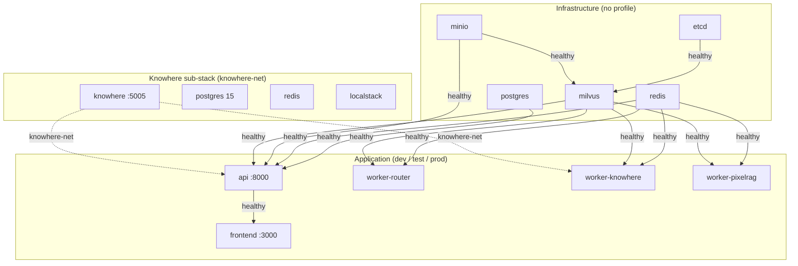
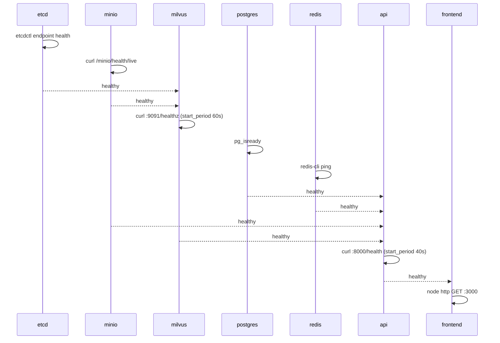

# :material-docker: Docker Compose 与镜像

Eagle-RAG 以名为 `eagle-rag` 的单一 Docker Compose 项目部署。基础文件 [`docker-compose.yml`](https://github.com/fintax-ai/eagle-rag/blob/master/docker-compose.yml) 由 `dev`、`test`、`prod` profile 共用；仅 dev 的覆盖在 [`docker-compose.override.yml`](https://github.com/fintax-ai/eagle-rag/blob/master/docker-compose.override.yml)。`docker/` 下四个多阶段 Dockerfile 构建应用镜像。Healthcheck 门控启动顺序，使各服务仅在依赖健康后开始。

编排快捷方式在 [`Taskfile.yml`](https://github.com/fintax-ai/eagle-rag/blob/master/Taskfile.yml)（`task up`、`task up:prod`、`task down`）。

## 分层拓扑



### 基础设施层

| 服务 | 镜像 | 卷 | 角色 |
| --- | --- | --- | --- |
| `etcd` | `quay.io/coreos/etcd:v3.5.5` | `vol-etcd` | Milvus 元数据；revision 自动压缩，4 GB 后端配额 |
| `minio` | `minio/minio:RELEASE.2023-03-20T20-16-18Z` | `vol-minio` | 瓦片 PNG 与原文件对象存储 |
| `milvus` | `milvusdb/milvus:v2.6.19` | `vol-milvus` | 单机向量库；`ETCD_ENDPOINTS=etcd:2379`，`MINIO_ADDRESS=minio:9000` |
| `postgres` | `postgres:16-alpine` | `vol-postgres` | 会话、去重、任务审计、`metric_sample`；DB `eagle_rag`，用户 `eagle` |
| `redis` | `redis:7-alpine` | `vol-redis` | Celery 代理（`/0`）与结果后端（`/1`） |

所有基础设施服务挂到桥接网络 `eagle-net`。日志使用共享锚点 `x-logging`：json-file 驱动，10 MB × 3 文件轮转。

### Knowhere 自托管子栈

Knowhere 从 [`docker/knowhere-self-hosted/compose.yaml`](https://github.com/fintax-ai/eagle-rag/blob/master/docker/knowhere-self-hosted/compose.yaml) 以**独立 compose 项目**运行。Eagle-RAG 加入外部网络 `knowhere-net`，DNS 名 `knowhere` 解析解析器。

| 服务 | 镜像 | 卷 | 说明 |
| --- | --- | --- | --- |
| `app` | `ghcr.io/ontos-ai/knowhere:latest` | `knowhere_user_data`、`knowhere_model_cache`、`knowhere_secrets` | API `:5005`，仪表盘 `:13000`（宿主机绑定） |
| `postgres` | `postgres:15-alpine` | `postgres_data` | DB `Knowhere`，用户 `root` |
| `redis` | `redis:7-alpine` | `redis_data` | 2 GB LRU，AOF |
| `localstack` | `localstack/localstack:3.8` | `localstack_data` | Knowhere 内部 S3 兼容桩 |

`task knowhere:up` 在 `docker compose up` 前执行 `unset POSTGRES_PASSWORD APP_ENV`，避免根 `.env` 覆盖 Knowhere 默认（Taskfile 中有说明）。

### 应用层

| 服务 | 镜像构建 | 端口 | Profiles |
| --- | --- | --- | --- |
| `api` | `docker/Dockerfile.api` → `eagle-rag-api:latest` | `8000:8000` | dev, test, prod |
| `worker-router` | `docker/Dockerfile.worker` → `eagle-rag-worker:latest` | — | dev, test, prod |
| `worker-knowhere` | 同一 worker 镜像 | — | dev, test, prod |
| `worker-pixelrag` | 同一 worker 镜像 | — | dev, test, prod |
| `frontend` | `docker/Dockerfile.frontend` → `eagle-rag-frontend:latest` | `3000:3000` | dev, test, prod |
| `docs` | `docker/Dockerfile.docs` → `eagle-rag-docs:latest` | `8001:8001` | docs, prod |

Workers 共享 `x-worker-build` context `.` 与 `docker/Dockerfile.worker`。环境变量 `QUEUES` 与 `CONCURRENCY` 在运行时选择队列集：

| 容器 | `QUEUES` | `CONCURRENCY` | CPU / 内存限制 |
| --- | --- | --- | --- |
| `worker-router` | `router_queue` | `4` | 无 |
| `worker-knowhere` | `knowhere_queue` | `8` | `cpus: 2.0` |
| `worker-pixelrag` | `pixelrag_queue` | `1` | `memory: 4g`，`cpus: 2.0` |

`worker-pixelrag` 挂载 `./data:/app/data` 存放上传与本地产物。

**本地视觉嵌入（`VISUAL_EMBEDDING_PROVIDER=pixelrag`，默认）：** Qwen3-VL-Embedding-2B 在 **`docker build`** 的独立 `model-prefetch` 阶段写入镜像 `/opt/huggingface/model`（与 `eagle_rag` 源码变更解耦）。BuildKit 缓存挂载 `eagle-rag-visual-model-cache` 在阶段重跑时复用本地约 4 GB 权重，避免重复下载。默认 `MODEL_DOWNLOAD_SOURCE=modelscope`（国内更稳）；可设 `huggingface` 或 `auto` 走 `HF_ENDPOINT`（如 hf-mirror.com），失败时 `auto` 回退 ModelScope。运行时 `VISUAL_EMBEDDING_MODEL=/opt/huggingface/model`，容器启动不再拉 Hub。

**百炼视觉嵌入（`VISUAL_EMBEDDING_PROVIDER=dashscope`）：** 设置 `VISUAL_EMBEDDING_MODEL=qwen3-vl-embedding` 与 `DASHSCOPE_API_KEY`。Worker 仍需 `pixelrag_render`（Chrome）做切片，但**不再加载本地 HF 权重** — 可跳过 `model-prefetch` / 不烘焙 `/opt/huggingface/model` 以缩小镜像。保持 `dim: 2048`；从本地 HF 切到百炼时需重建 `eagle_visual`。

## Healthcheck 依赖链 {#healthcheck-dependency-chain}

Compose `depends_on: condition: service_healthy` 形成**启动 DAG**。`starting` 状态的服务会阻塞依赖方，直到探测成功或重试耗尽。



### 各服务探测定义

| 服务 | 测试命令 | 间隔 | start_period | 说明 |
| --- | --- | --- | --- | --- |
| `etcd` | `etcdctl endpoint health` | 30s | — | 数据目录 `/etcd` 在 `vol-etcd` |
| `minio` | `curl -fsS http://localhost:9000/minio/health/live` | 30s | — | 使用镜像自带 `curl` |
| `milvus` | `curl -f http://localhost:9091/healthz` | 30s | **60s** | 冷启动慢 |
| `postgres` | `pg_isready -U eagle -d eagle_rag` | 10s | — | 探测更密 |
| `redis` | `redis-cli ping` | 10s | — | |
| `api` | `curl -f http://localhost:8000/health` | 30s | **40s** | 命中完整依赖探测包 |
| `worker-*` | `celery inspect ping -d celery@$(hostname)` | 30s | **60s** | 范围限于本地 worker 名 |
| `frontend` | `node -e "require('http').get(...)"` | 30s | 40s | 精简镜像无 curl |
| `docs` | `wget -q -O /dev/null http://localhost:8001/` | 30s | 20s | nginx alpine |

Workers 仅依赖 **redis + milvus**（非 postgres）。API 依赖 postgres、redis、minio、milvus。Knowhere 与 eagle-rag compose **无** `depends_on` 边 —— 运维须先启动 Knowhere（`task up` 将 `knowhere:up` 作为依赖）。

### API 容器内 `/health` 检查项

API healthcheck 调用 [`eagle_rag/api/health.py`](https://github.com/fintax-ai/eagle-rag/blob/master/eagle_rag/api/health.py)，并发探测：

| 探测 | 通过条件 |
| --- | --- |
| `milvus` | `MilvusClient.list_collections()` 成功 |
| `knowhere` | `mode=api`：HTTP GET `settings.knowhere.base_url`。`mode=parser`：进程内 parser + 可写 tmp |
| `pixelrag` | 渲染库可导入；`provider=dashscope` 时还需 `DASHSCOPE_API_KEY`（detail 含 `visual=…`） |
| `vlm` | `GET {base_url}/models` 带 Bearer → 200 |
| `redis` | 代理 URL 上 `PING` |
| `minio` | `list_buckets()` |
| `celery` | `inspect.ping()` **1.0s** 超时（避免 3s 广播等待误报 `down`） |
| `postgres` | asyncpg `SELECT 1` |

聚合规则：任一探测 `down` → `status: degraded`；`unknown`（可选 pixelrag）**不**降级。

## 为何 `pixelrag_queue` 并发为 1 {#why-pixelrag_queue-concurrency-is-1}

PixelRAG 不再是独立 serve 进程。`worker-pixelrag` 加载重型进程内依赖：

1. **`pixelrag_render`** —— Chrome/CDP 或 Playwright HTML/PDF 光栅；大页瓦片（默认瓦片高度 8192 px）。
2. **视觉编码** —— 本地 HF `LocalQwen3VLEncoder`（`provider=pixelrag`：`transformers` + `torch`）或百炼 `DashScopeQwen3VLEncoder`（`provider=dashscope`：仅 API，RSS 显著更低）。2048 维向量写入 Milvus `eagle_visual`。

每容器超过一个并发任务会导致：

- **内存压力** —— 多 Chrome 实例（`provider=pixelrag` 时另加 GPU/CPU 张量）；compose 设 `deploy.resources.limits.memory: 4g`。
- **编码器 / 设备争用** —— 本地编码器为进程级；并行嵌入争抢同一设备（DashScope 则压力转为 API 限流）。
- **Milvus 写入突发** —— 视觉插入体量大；串行平滑 segment flush。

`settings.yaml` 明确意图：

```yaml
pixelrag_queue:
  concurrency: 1        # Strict low concurrency to avoid OOM.
```

要提高视觉吞吐，应**水平**扩展（多台主机上多个 `worker-pixelrag` 容器），而非在单容器内提高 `-c`。`knowhere_queue` 保持 8，因绑定外部 Knowhere HTTP。`router_queue` 为 4，匹配快速分发工作。

## Dockerfile

| 文件 | 基础 | 输出 |
| --- | --- | --- |
| `docker/Dockerfile.api` | Python 3.12 slim + `uv` | 端口 8000 的 FastAPI 应用 |
| `docker/Dockerfile.worker` | Python 3.12 slim + PixelRAG 用 Chrome + `/opt/huggingface` 预置 Qwen3-VL-Embedding-2B | Celery worker 入口读 `QUEUES` / `CONCURRENCY` |
| `docker/Dockerfile.frontend` | Bun 多阶段 → Node 运行时 | Next.js 生产服务器 |
| `docker/Dockerfile.docs` | MkDocs 构建 → nginx alpine | 8001 静态文档 |

Worker 镜像设 `CHROME_PATH=/usr/local/bin/chrome` 供 `pixelrag_render` CDP 后端。

## Dev override 行为

`docker-compose.override.yml` 合并时（默认 `docker compose up`）：

| 变更 | 理由 |
| --- | --- |
| API `command: uvicorn ... --reload --reload-dir eagle_rag` | 热重载；**勿**监视 `./data`（HF 缓存写入会重启 SSE） |
| api + workers 绑定 `./eagle_rag:/app/eagle_rag:ro` | 无需重建镜像即可改代码 |
| api + workers 绑定 `./plugins:/app/plugins:ro` | 仓库内域插件（`--reload-dir plugins` 热重载） |
| api + workers 上 `EAGLE_RAG_PROFILE: ${EAGLE_RAG_PROFILE:-core}` | 每实例单域绑定（[ADR-007](../architecture/adr/007-plugin-implementation-status.md)） |
| `worker-knowhere` / `worker-pixelrag` `deploy: !reset null` | 本地调试移除 prod CPU/内存限制 |
| Frontend → `oven/bun:1.2.18` + `bunx next dev` | 跳过生产镜像构建 |
| 暴露 postgres/redis/minio/milvus 端口 | 宿主机侧调试 |

生产命令：

```bash
COMPOSE_FILE=docker-compose.yml docker compose --profile prod up -d
```

## 环境接线

Compose `env_file: .env` 加显式 `environment:` 覆盖 `settings.yaml` 默认。来自 [`docker-compose.yml`](https://github.com/fintax-ai/eagle-rag/blob/master/docker-compose.yml) 的关键容器注入：

```yaml
KNOWHERE_BASE_URL: ${KNOWHERE_BASE_URL:-http://knowhere:5005}
EAGLE_RAG_PROFILE: ${EAGLE_RAG_PROFILE:-core}
HF_HOME: /opt/huggingface          # worker-pixelrag（镜像内预置）
CHROME_PATH: /usr/local/bin/chrome   # 仅 worker-pixelrag
```

若 `.env` 缺少 `MILVUS_HOST`、`CELERY_BROKER_URL` 或 `POSTGRES_DSN`，容器内回退 `localhost` 导致探测失败 —— compose 部署务必设服务 DNS 名。

## 网络

```yaml
networks:
  eagle-net:
    driver: bridge
  knowhere-net:
    external: true
    name: knowhere-net
```

`api` 与 `worker-knowhere` 加入两网。`worker-router` 与 `worker-pixelrag` 仅用 `eagle-net`（瓦片构建时 PixelRAG 不调 Knowhere HTTP）。

创建外部网络一次：

```bash
docker network create knowhere-net
```

`task setup` 与 `task net:ensure` 幂等执行。

## 卷（compose 名称） {#volumes-compose-names}

在顶层 `volumes:` 块声明：

| Compose 卷 | 挂载点 | 存储 |
| --- | --- | --- |
| `vol-etcd` | `/etcd` | Milvus 元数据 |
| `vol-minio` | `/data` | 对象 blob |
| `vol-milvus` | `/var/lib/milvus` | 向量 segment |
| `vol-postgres` | `/var/lib/postgresql/data` | 关系数据 |
| `vol-redis` | `/data` | 代理持久化（若启用） |

宿主机绑定 `./data` **不是**命名卷 —— 在仓库旁。备份流程：[备份与恢复](backup-restore.md)。

## 代码变更后重启 worker

Dev override **不**自动重载 Celery。编辑任务代码后：

```bash
docker compose restart worker-router worker-knowhere worker-pixelrag
```

或 `task logs:worker SERVICE=worker-knowhere` 跟踪单个 worker。

## Swarm / MCP 独立（可选）

[`docker/swarm/mcp-stack.yml`](https://github.com/fintax-ai/eagle-rag/blob/master/docker/swarm/mcp-stack.yml) 记录独立 MCP HTTP 部署及其来自 [`eagle_rag/metrics.py`](https://github.com/fintax-ai/eagle-rag/blob/master/eagle_rag/metrics.py) 的 `/metrics` 与 `/health`。该路径与主 `api` 服务独立。

## 常用 compose 操作

```bash
# Rebuild after Dockerfile change
docker compose --profile dev build api worker-router

# Scale is not used for workers (fixed service names); add duplicate services manually if needed

# Inspect health state
docker inspect --format='{{.State.Health.Status}}' eagle-rag-api-1

# Exec into API container
docker compose exec api bash

# Sync frontend node_modules inside dev container
task fe:deps
```

## 启动时故障模式

| 现象 | 可能原因 |
| --- | --- |
| `network knowhere-net could not be found` | 运行 `docker network create knowhere-net` |
| `api` 卡在 `starting` | Milvus `start_period` 未过，或 `/health` 依赖 down |
| Worker 立即 `unhealthy` | Celery 尚未监听；等 60s 或查 `CONCURRENCY` env |
| `worker-pixelrag` OOMKilled | 瓦片过大或并发高于 1 |
| Frontend 永不 healthy | API 不健康；查上游 |

日志关联见[排障](troubleshooting.md)。
