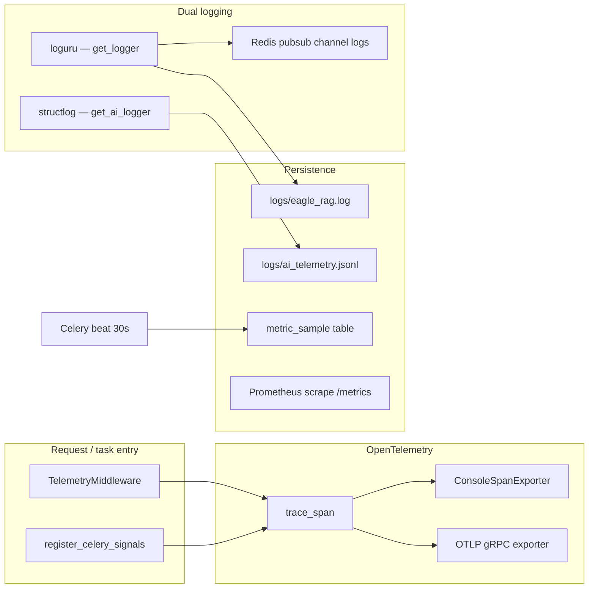
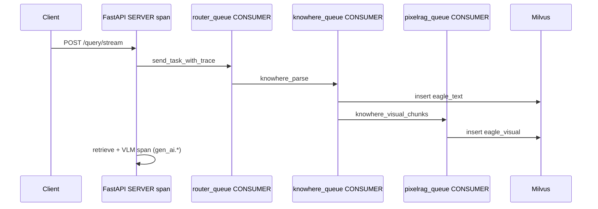

# :material-chart-line: 可观测性

Eagle-RAG 暴露三个互补的可观测平面：**运维日志**（loguru）、**AI 事件日志**（structlog JSONL，经 `get_ai_logger`）与**分布式追踪**（OpenTelemetry）。HTTP 管理路由聚合依赖健康、队列指标与实时日志流。MCP 独立部署在 `/metrics` 上增加 Prometheus 计数器。

配置在 [`eagle_rag/settings.yaml`](https://github.com/fintax-ai/eagle-rag/blob/master/eagle_rag/settings.yaml) 的 `telemetry:` 下，由 [`eagle_rag/telemetry/`](https://github.com/fintax-ai/eagle-rag/tree/master/eagle_rag/telemetry) 加载。

## 架构概览



## 遥测配置

| 设置 | 环境覆盖 | 默认 | 用途 |
| --- | --- | --- | --- |
| `telemetry.enabled` | `TELEMETRY_ENABLED` | `true` | 总开关；关 → 仅 stdlib 日志 |
| `telemetry.tracing_enabled` | `OTEL_TRACING_ENABLED` | `false` | 为 true 时导出 span |
| `telemetry.otlp_endpoint` | `OTEL_EXPORTER_OTLP_ENDPOINT` | 空 | gRPC collector 地址 |
| `telemetry.otlp_insecure` | `OTEL_EXPORTER_OTLP_INSECURE` | `true` | 本地 collector 关闭 TLS |
| `telemetry.service_name` | `OTEL_SERVICE_NAME` | `eagle-rag` | `service.name` 资源属性 |
| `telemetry.op_log_file` | `OP_LOG_FILE` | `logs/eagle_rag.log` | 轮转运维日志 |
| `telemetry.ai_log_file` | `AI_TELEMETRY_LOG_FILE` | `logs/ai_telemetry.jsonl` | AI 事件 JSONL |
| `telemetry.redis_log_channel` | `REDIS_LOG_CHANNEL` | `logs` | SSE `/admin/logs` 扇出 |

Span 中 prompt/completion 文本按 `prompt_truncate`（512）与 `completion_truncate`（1024）截断。

## OpenTelemetry 追踪

实现：[`eagle_rag/telemetry/tracing.py`](https://github.com/fintax-ai/eagle-rag/blob/master/eagle_rag/telemetry/tracing.py)。

### 引导

`configure_tracing(settings)` 在 API lifespan 与 Celery `worker_process_init` 中运行。行为：

| 条件 | TracerProvider | 导出 |
| --- | --- | --- |
| `enabled=false` 或 `tracing_enabled=false` | SDK provider，无 processor | Span 仅用于日志关联 |
| 追踪开 + 设 `otlp_endpoint` | 带 `service.name`、`deployment.environment` 的 Resource | `OTLPSpanExporter` + `BatchSpanProcessor` |
| 追踪开、无 endpoint | 同上 Resource | `ConsoleSpanExporter`（dev） |

OpenTelemetry 文档中的 [GenAI 语义约定](https://opentelemetry.io/docs/specs/semconv/gen-ai/) 由 Eagle-RAG 经 `set_llm_span_attributes` 遵循（`gen_ai.system`、`gen_ai.request.model`、`gen_ai.prompt`、`gen_ai.completion`、token 用量）。

### `trace_span` API

双形式 —— 上下文管理器或装饰器：

```python
from eagle_rag.telemetry import trace_span

with trace_span("knowhere.parse") as span:
  ...

@trace_span
def route_document(...):
  ...
```

进入时：将 `trace_id`、`span_id` 绑定到遥测 contextvars（loguru 格式 `{extra[trace_id]}` 可见）。异常时：`record_exception` + `StatusCode.ERROR`。退出时：清除 span 绑定上下文。

热路径包括 ingest 适配器（`knowhere_adapter`、`pixelrag_adapter`）、`router_engine`、`multimodal_engine`。

### HTTP 请求 span

`TelemetryMiddleware`（Starlette）：

- 打开名为 `{METHOD} {path}` 的 **SERVER** span。
- 从入站头提取 W3C `traceparent` 以延续上游。
- 绑定 `request_id`、`http_method`、`http_route`、`trace_id`、`span_id`。
- 设 `http.status_code`；5xx 标 ERROR。
- **不**读请求体（会破坏流式查询体）。

### Celery 追踪传播

`register_celery_signals` 钩子：

| 信号 | 动作 |
| --- | --- |
| `task_prerun` | 从 `task.request.headers` 提取父上下文；打开 **CONSUMER** span `{task.name}:{task_id}`；从 kwargs 绑定 `job_id`、`document_id`、`kb_name` |
| `task_postrun` | 结束 span；`clear_context()` |
| `task_failure` | 在 span 上 `record_exception` |

`send_task_with_trace` 包装 `celery_app.send_task` 并将活跃 span 上下文**注入**消息头，使 API → router → knowhere/pixelrag 链共享一条 trace。

### RAG 流水线 trace 形态（典型）



在 Jaeger 或 Grafana Tempo 中，按 `service.name=eagle-rag` 过滤，在 SERVER span 下找嵌套 CONSUMER span。

### Docker 中启用 OTLP

在 `.env` 添加：

```bash
OTEL_TRACING_ENABLED=true
OTEL_EXPORTER_OTLP_ENDPOINT=otel-collector:4317
OTEL_EXPORTER_OTLP_INSECURE=true
```

运行接收 gRPC 4317 的 OpenTelemetry Collector sidecar 或宿主机 agent。

## 双日志系统

实现：[`eagle_rag/telemetry/logging_setup.py`](https://github.com/fintax-ai/eagle-rag/blob/master/eagle_rag/telemetry/logging_setup.py)。

### 运维 logger —— `get_logger`

- 遥测启用时由 **loguru** 支撑。
- Sink：stderr（TTY 上彩色）、轮转文件（`op_log_rotation` / `op_log_retention`）、可选 Redis pubsub `redis_log_channel`。
- 安装 `_InterceptHandler`，使 uvicorn、FastAPI、Celery、LlamaIndex stdlib logger 流入 loguru。
- 格式含组件名与 `trace_id` 便于关联。

示例行：

```text
2026-07-05 09:15:22.431 | WARNING  | eagle_rag.admin.metrics:abc123def456 | queue length sampling skipped: Redis unavailable
```

### AI 事件 logger —— `get_ai_logger`

- **structlog** 支撑，处理器链含 `add_open_telemetry_span`（向每条 JSON 事件注入 `trace_id` / `span_id`）。
- 经专用 logger `eagle_ai_telemetry` 轮转 JSONL 写入 `ai_log_file`（从 loguru 拦截排除以防循环）。

用于稳定 schema 的业务事件：

| 模块 | 事件示例 |
| --- | --- |
| `api/query.py` | `query_started`、`query_completed`、流式 token 里程碑 |
| `ingest/knowhere_adapter.py` | 解析任务提交、分块计数 |
| `ingest/pixelrag_adapter.py` | `pixelrag_render`、`pixelrag_embed` 耗时 |
| `generation/multimodal_engine.py` | 检索路由、VLM 完成 |

JSONL 记录示例：

```json
{
  "event": "query_completed",
  "component": "eagle_rag.api.query",
  "session_id": "…",
  "kb_name": "default",
  "trace_id": "abc123…",
  "latency_ms": 842,
  "timestamp": "2026-07-05T01:15:22.431Z"
}
```

下游分析（Databricks、ELK、ClickHouse）应单独摄取 `ai_telemetry.jsonl`，与运维日志分开。

### 上下文绑定

[`eagle_rag/telemetry/context.py`](https://github.com/fintax-ai/eagle-rag/blob/master/eagle_rag/telemetry/context.py) 提供 `bind_context` / `get_context` / `clear_context`，供中间件、span 与查询处理器（`session_id`、`kb_name`）使用。

## HTTP 可观测端点

定义于 [`eagle_rag/api/health.py`](https://github.com/fintax-ai/eagle-rag/blob/master/eagle_rag/api/health.py)。

### 公开

| 路由 | 响应模型 | 说明 |
| --- | --- | --- |
| `GET /health` | `HealthResponse` | 8 个依赖；任一 `down` 则 `degraded` |
| `GET /mcp/tools` | `McpToolsResponse` | 工具目录镜像 |

### 管理（`/admin/*`，无鉴权 —— 仅内网）

| 路由 | 用途 |
| --- | --- |
| `GET /admin/probes` | 每探测 `latency_ms`、运行时间字符串、psutil CPU/内存 |
| `GET /admin/celery` | Workers、活跃任务、队列大小、24h 成功数、积压序列 |
| `GET /admin/milvus` | Collection 统计、字段 schema、索引元数据 |
| `POST /admin/milvus/flush`、`/clean` | 刷新 / 压缩所有 collection |
| `GET /admin/knowhere` | Knowhere 探测 + 按 `kb_name` 文档/分块计数 |
| `GET /admin/pixelrag` | 库状态 + `eagle_visual` 行数 + 24h 渲染/嵌入指标 |
| `GET /admin/vlm` | 模型配置 + 24h 延迟/token/错误聚合 |
| `GET /admin/redis` | 代理 INFO、脱敏 URL |
| `GET /admin/minio` | 桶列表、默认桶对象数（上限 10k） |
| `GET /admin/mcp` | 工具注册、近期 MCP 调用日志 |
| `GET /admin/config` | 脱敏设置 dump |
| `GET /admin/logs` | **SSE** 流（`event: log` / `heartbeat`） |

运行时间显示用 `humanize.naturaldelta` 基于进程内单调计时器（API 重启后重置）。

## 队列指标与 Celery beat

[`eagle_rag/admin/metrics.py`](https://github.com/fintax-ai/eagle-rag/blob/master/eagle_rag/admin/metrics.py) 定义 `sample_queue_metrics`，在 [`celery_app.py`](https://github.com/fintax-ai/eagle-rag/blob/master/eagle_rag/tasks/celery_app.py) `beat_schedule` 中每 **30 秒**调度。

对 `router_queue`、`knowhere_queue`、`pixelrag_queue` 各：

1. Redis 对队列 list key 的 `LLEN`。
2. `INSERT INTO metric_sample (metric_name='queue_size', labels='{"queue": "…"}', value=…)`。

`get_queue_backlog_series` 将最近 N 个样本整形供 `/admin/celery` 图表。

失败日志：

```text
queue length sampling skipped: Redis unavailable: …
metric_sample write failed (queue=knowhere_queue): …
```

**说明：** Compose 默认不附带 `celery beat` 容器。需要持续采样时与 worker 一起运行 beat：

```bash
uv run celery -A eagle_rag.tasks.celery_app beat --loglevel=info
```

## Prometheus 指标（MCP）

[`eagle_rag/metrics.py`](https://github.com/fintax-ai/eagle-rag/blob/master/eagle_rag/metrics.py) 定义 MCP 埋点（主 FastAPI 应用除非独立挂载 MCP 否则无）。

| 指标 | 标签 | 类型 |
| --- | --- | --- |
| `mcp_tool_calls_total` | `tool`、`status` | Counter |
| `mcp_tool_duration_seconds` | `tool` | Histogram |
| `mcp_active_requests` | `tool` | Gauge |
| `mcp_circuit_state` | `tool` | Gauge（`0=closed`、`1=half-open`、`2=open`） |

`status` 值：`success`、`cache_hit`、`circuit_open`、`timeout`、`error` —— 由 `@with_metrics` 从返回载荷或异常推断。

抓取目标：MCP HTTP 服务器上 `GET /metrics`（`prometheus_client.generate_latest`）。

VLM 运维指标（`vlm_latency_ms`、`vlm_tokens`、`vlm_error`）由应用代码采样进 `metric_sample`，经 `get_metric_aggregate` 在 `/admin/vlm` 聚合，非 Prometheus gauge。

## 实时日志 SSE

`GET /admin/logs`：

1. 优先 **Redis pubsub** 订阅频道 `logs`（loguru Redis sink 在此发布）。
2. 回退：每连接客户端内存 `asyncio.Queue` + 5 s 心跳。

Redis pubsub 使用 `socket_timeout=None` 避免空闲频道误超时。

## 指标目录（`metric_sample` 表）

| `metric_name` | 来源 | 管理消费者 |
| --- | --- | --- |
| `queue_size` | Celery beat | `/admin/celery` |
| `pixelrag_render` | pixelrag 适配器 | `/admin/pixelrag` |
| `pixelrag_embed` | pixelrag 适配器 | `/admin/pixelrag` |
| `vlm_latency_ms` | 多模态引擎 | `/admin/vlm` |
| `vlm_tokens` | 多模态引擎 | `/admin/vlm` |
| `vlm_error` | 多模态引擎 | `/admin/vlm` |

`get_metric_aggregate(name, agg, window_hours)` 支持滑动窗口上的 `avg`、`sum`、`count`。

## MCP 调用审计

[`eagle_rag/admin/mcp_log.py`](https://github.com/fintax-ai/eagle-rag/blob/master/eagle_rag/admin/mcp_log.py) 将近期工具调用持久化到 PostgreSQL；`/admin/mcp` 以 `console_logs` 展示最近 50 条。

## 运维手册

### 端到端验证追踪

1. 启用 `OTEL_TRACING_ENABLED=true` 与控制台导出器（无 endpoint）。
2. `POST /query` 简单问题。
3. 在 worker stdout 确认 SERVER + CONSUMER span。
4. 确认 `eagle_rag.log` 与 `ai_telemetry.jsonl` 中 `trace_id` 一致。

### 验证队列采样

```sql
SELECT metric_name, labels, value, sampled_at
FROM metric_sample
WHERE metric_name = 'queue_size'
ORDER BY sampled_at DESC
LIMIT 10;
```

### 跟踪 AI 事件

```bash
tail -f logs/ai_telemetry.jsonl | jq -c '{event, kb_name, trace_id, latency_ms}'
```

### 订阅实时运维日志

```bash
curl -N http://localhost:8000/admin/logs
```

## 参考文献

- [OpenTelemetry Python](https://opentelemetry.io/docs/languages/python/)
- [OpenTelemetry GenAI 语义约定](https://opentelemetry.io/docs/specs/semconv/gen-ai/)
- [Celery 监控](https://docs.celeryq.dev/en/stable/userguide/monitoring.html)
- Eagle-RAG Agent 规则：[`AGENTS.md`](https://github.com/fintax-ai/eagle-rag/blob/master/AGENTS.md)
