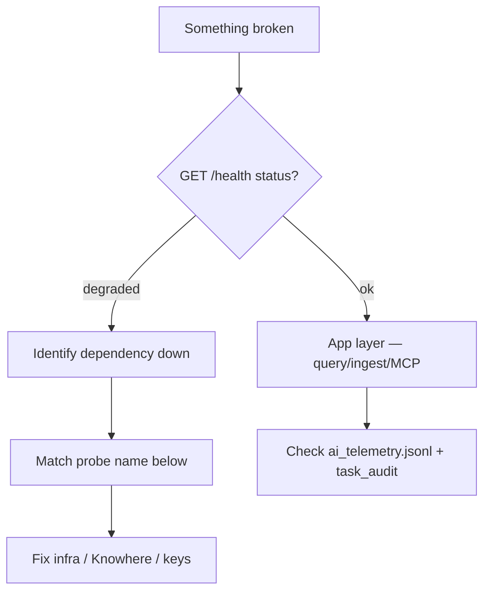

# :material-wrench: 排障

面向 Eagle-RAG 运维人员的症状导向指南。每节将**所见**（UI、探测、日志 行）映射到**可能原因**与**修复**。用 `task health`、`task ps` 与 [`GET /admin/probes`](http://localhost:8000/admin/probes) 对照实时状态。

源码参考：[`eagle_rag/api/health.py`](https://github.com/fintax-ai/eagle-rag/blob/master/eagle_rag/api/health.py)、[`eagle_rag/tasks/dead_letter.py`](https://github.com/fintax-ai/eagle-rag/blob/master/eagle_rag/tasks/dead_letter.py)、[`Taskfile.yml`](https://github.com/fintax-ai/eagle-rag/blob/master/Taskfile.yml)。

## 快速诊断流程



```bash
task health                    # pretty JSON
curl -s localhost:8000/admin/probes | jq '.dependencies'
task ps                        # both compose projects
docker compose logs -f api worker-knowhere --tail=200
```

---

## 依赖探测矩阵

### `milvus` —— down

| 观察 | detail 字符串示例 |
| --- | --- |
| 探测 `down` | `Connection refused`、`timeout after 3.0s` |
| `/health` `degraded` | `milvus.status = down` |
| API 容器 `starting` | Milvus healthcheck 尚未绿 |

**原因**

- Milvus 仍在 `start_period`（60 s 冷启动）。
- etcd 或 MinIO 不健康（Milvus 依赖两者）。
- 容器内 `MILVUS_HOST` 错误（`localhost` 而非 `milvus`）。

**修复**

```bash
docker compose ps milvus etcd minio
docker compose logs milvus --tail=100
# Verify env
docker compose exec api printenv MILVUS_HOST
```

---

### `knowhere` —— down

| 观察 | detail 字符串示例 |
| --- | --- |
| 探测 `down` | `ConnectError`、`Connection refused` |
| Ingest 任务 `FAILED` | `task_audit.log_entry` 含 Knowhere HTTP 错误 |
| `task knowhere:health` | HTTP 非 2xx 或超时 |

**原因**

- Knowhere 子栈未运行（`task knowhere:up`）。
- `knowhere-net` 缺失。
- 容器内 `KNOWHERE_BASE_URL` 指向 `localhost`。

**修复**

```bash
docker network inspect knowhere-net
task knowhere:ps
task knowhere:logs
curl -s http://localhost:5005/health
```

Eagle-RAG **失败关闭**：无静默回退解析器。Knowhere 恢复后文本 ingest 自动恢复；失败任务可能需重新 ingest 或死信重放。

---

### `pixelrag` —— unknown（非 down）

| 观察 | detail 字符串示例 |
| --- | --- |
| 探测 `unknown` | `optional vision extra not installed (mock fallback)` |
| 探测 `up` | `libraries=pixelrag_render,pixelrag_embed` |

**原因**

- 精简安装中预期 —— PixelRAG 在 `pyproject.toml` 为核心，但模块缺失时 import 探测报 `unknown`。
- 视觉流水线不可用；扫描 PDF 可能失败或 mock。

**修复**

```bash
docker compose exec worker-pixelrag python -c "import pixelrag_render, pixelrag_embed"
docker compose logs worker-pixelrag --tail=50
```

---

### `vlm` —— down

| 观察 | detail 字符串示例 |
| --- | --- |
| 探测 `down` | `api_key not set` |
| 探测 `down` | `status_code=401` |
| `/admin/vlm` | `error_rate` 升高 |

**原因**

- `.env` 缺少 `VLM_API_KEY`。
- DashScope 配额 / `VLM_BASE_URL` 错误。

**修复**

```bash
grep VLM_ .env
curl -s -H "Authorization: Bearer $VLM_API_KEY" "$VLM_BASE_URL/models" | head
```

---

### `redis` —— down

| 观察 | detail 字符串示例 |
| --- | --- |
| 探测 `down` | `Connection refused` |
| 日志 | `queue length sampling skipped: Redis unavailable` |
| `/admin/celery` 503 | `celery inspect failed` |

**原因**

- Redis 容器停止。
- `CELERY_BROKER_URL` 错误（DB 索引、密码、主机）。

**修复**

```bash
docker compose exec redis redis-cli ping
docker compose exec api printenv CELERY_BROKER_URL
```

---

### `minio` —— down

| 观察 | detail 字符串示例 |
| --- | --- |
| 探测 `down` | `list_buckets` 失败 |
| Ingest | worker 日志中对象上传错误 |

**修复**

```bash
docker compose ps minio
curl -fsS http://localhost:9000/minio/health/live
```

---

### `celery` —— down

| 观察 | detail 字符串示例 |
| --- | --- |
| 探测 `down` | `no worker responded` |
| Worker 容器 `unhealthy` | `celery inspect ping` 失败 |
| 历史误报 | 探测曾用 3 s inspect 超时 —— 代码已改为 1.0 s |

**原因**

- 无 worker 容器运行。
- Worker 仍在 60 s `start_period`。
- Worker 崩溃循环（import 错误、OOM）。

**修复**

```bash
docker compose ps worker-router worker-knowhere worker-pixelrag
docker compose logs worker-router --tail=100
celery -A eagle_rag.tasks.celery_app inspect ping -t 5   # from host with same broker URL
```

---

### `postgres` —— down

| 观察 | detail 字符串示例 |
| --- | --- |
| 探测 `down` | `asyncpg` 连接错误 |
| API 错误 | 会话 / ingest 注册 500 |

**修复**

```bash
docker compose exec postgres pg_isready -U eagle -d eagle_rag
task db:migrate
```

---

## 入库与队列症状

### 队列积压单调增长

| 队列 | 检查 | 动作 |
| --- | --- | --- |
| `router_queue` | `/admin/celery` `queues[].size` | 扩展 `worker-router` 或提高 `CONCURRENCY`（默认 4） |
| `knowhere_queue` | 活跃任务卡在 HTTP | Knowhere 容量、`KNOWHERE_POLL_TIMEOUT` |
| `pixelrag_queue` | 单 worker、长任务 | **勿**将每容器并发高于 1；加第二台主机 |

日志关联：

```text
# Normal idle
metric_sample write failed ...   # only if DB down

# Stuck visual job
worker-pixelrag | pixelrag_render ... timeout
```

### 上传后文档状态 `FAILED`

1. `GET /tasks/{job_id}` 或 `task_audit` 行。
2. 在运维日志搜 `job_id` / `document_id`。
3. 常见模式：

| 日志 / 审计线索 | 原因 |
| --- | --- |
| `Knowhere` + `ConnectError` | 解析器 down |
| `SoftTimeLimitExceeded` | 任务 > 55 分钟 |
| `dead-letter:` | 重试耗尽 |
| `retry#1:` | 瞬态错误，将重试 |

### 重新 ingest 后重复分块

去重主键为 `(sha256, kb_name)`。同字节同 KB 应跳过；不同 `kb_name` 为有意。若同一 KB 内出现重复，检查删除文档时 Milvus 删除是否执行。

---

## 查询与生成症状

### 答案空、有来源

- 查 `/admin/vlm` 模型路由开关（`system_setting.model_router`）。
- AI 日志：`query_completed` 且 `token_count=0` → LLM/VLM 调用静默失败；在运维日志搜 DashScope 错误。

### 流式 SSE 断开

- Dev API `--reload` 监视 `./data` —— override 将 reload 限制为 `eagle_rag/`；若自定义命令，排除 `data/`。
- 代理缓冲 —— 对 `text/event-stream` 关闭 nginx 缓冲。

### Scope 过滤无命中

`scope_filter` 对 `kb_names`、`document_ids`、`tags` 使用 **OR** 并集。与索引数据无交集在标签不匹配时预期。持久化过滤：`sessions.scope_filter` JSONB —— 验证会话行。

---

## Celery 至少一次投递与死信 {#celery-at-least-once-delivery-and-dead-letters}

Redis 上 Celery 在以下配置时保证**至少一次**语义：

```python
task_acks_late = True
worker_prefetch_multiplier = 1
task_reject_on_worker_lost = True
```

（来自 [`celery_app.py`](https://github.com/fintax-ai/eagle-rag/blob/master/eagle_rag/tasks/celery_app.py)）

若 worker 在执行后、ack 前死亡，任务可能**运行多于一次**。Ingest 任务应在可能处幂等（去重注册、Milvus upsert 键）。

### 重试路径（`@with_retry`）

[`eagle_rag/tasks/dead_letter.py`](https://github.com/fintax-ai/eagle-rag/blob/master/eagle_rag/tasks/dead_letter.py)：

- `autoretry_for=(Exception,)`
- 退避：`countdown = retry_backoff * (2 ** retries)`（默认基数 60 s，最多 3 次重试）
- `task_audit` → `RETRYING`，日志项 `retry#N:`

### 死信路径

重试耗尽时，`DeadLetterTask.on_failure` 发布到队列 **`dead_letter`**（worker 不消费）：

```json
{
  "job_id": "...",
  "task_name": "eagle_rag.tasks.knowhere_parse",
  "payload": {"args": [], "kwargs": {"document_id": "..."}},
  "error": "…",
  "retries_exhausted": true
}
```

管理 Python API：

```python
from eagle_rag.tasks.dead_letter import drain_dead_letter, replay_dead_letter
records = drain_dead_letter(limit=10)
replay_dead_letter(job_id="…")
```

`replay_dead_letter` 最多 drain 1000 条消息，重分发匹配项，并**重新发布**其余项以免丢失。

### 症状 → 死信

| 症状 | `task_audit.status` | 日志 |
| --- | --- | --- |
| Knowhere 永久 4xx | `FAILED` | `dead-letter: …` |
| Milvus schema 不匹配 | `FAILED` | 同上 |
| 瞬态网络 | `RETRYING` 后成功 | `retry#1:` |

---

## worker-pixelrag OOM

| 观察 | 原因 |
| --- | --- |
| 容器退出 137 | 内核 OOM killer |
| Compose `OOMKilled` | 超过 4 GB 限制 |
| 日志 | Chrome / torch 分配失败 |

**修复**

- 保持 `CONCURRENCY=1`。
- 在 settings 降低 `pixelrag.tile_height` / `pdf_dpi`。
- GPU 内存紧时设 `embed_device=cpu`。
- 上游拆分 PDF，减少每文档页数。

---

## Knowhere / Taskfile 环境冲突

| 症状 | 原因 |
| --- | --- |
| `task up` 后 Knowhere Postgres 认证失败 | 根 `.env` `POSTGRES_PASSWORD` 覆盖 Knowhere compose |
| Knowhere app 错误模式 | 根 `APP_ENV` 泄漏 |

Taskfile 对 knowhere 任务执行 `unset POSTGRES_PASSWORD APP_ENV`。若在 `docker/knowhere-self-hosted/` 手动 `docker compose`，须先 unset。

---

## 插件与 profile 问题

### 错误的 `EAGLE_RAG_PROFILE` 或命名空间不匹配

| 症状 | 可能原因 |
| --- | --- |
| API 带 `plugin_namespace` detail 返回 HTTP **403** | 客户端 `plugin_namespace` ≠ `settings.plugins.default_namespace` |
| `/mcp/tools` 缺少域 MCP 工具 | Profile 启用插件但 `default_namespace` 与工具命名空间不匹配（G3） |
| Milvus 空但 Postgres 有文档 | API/worker `EAGLE_RAG_PROFILE` 不一致 — 写入另一 Database |
| `GET /health/plugins` 的 `enabled_modules` 意外 | Worker 环境陈旧；插件模块导入路径错误 |

**修复**

```bash
# API 与所有 worker 必须共享同一 profile
docker compose exec api printenv EAGLE_RAG_PROFILE
docker compose exec worker-router printenv EAGLE_RAG_PROFILE
curl -s localhost:8000/health/plugins | jq '.default_namespace, .manifests[].namespace'
curl -s localhost:8000/mcp/tools | jq '.tools[].name'
```

更改 `.env` 后重启所有应用容器（`get_settings()` 每进程缓存）。

### 插件导入 / 清单错误

| 症状 | 检查 |
| --- | --- |
| `enabled_modules` 短于 `settings.plugins.enabled` | `plugins/<name>/__init__.py` 导入错误 — 查 API 启动日志 |
| `celery_modules` 与 API 不一致 | Worker 缺少 `EAGLE_RAG_PROFILE` 或 `./plugins` 挂载 |
| 专用集合从未被查询 | Core G4 — 需要域 `QueryRouteClassifier` 或范围感知目录并集 |

确保 dev override 在 api 与 worker 上挂载 `./plugins:/app/plugins:ro`（[docker](docker.md)）。

---

## MCP 相关问题

| 症状 | 指标 / 日志 | 修复 |
| --- | --- | --- |
| 工具总报错 | `mcp_tool_calls_total{status="circuit_open"}` | 等断路器半开；查上游 `/health` |
| 工具慢 | `mcp_tool_duration_seconds` 直方图 | 提高 `mcp.tool_timeout` |
| 缓存陈旧 | `status="cache_hit"` | 降低 `mcp.cache_ttl` 或失效 |

Prometheus 指标在 MCP 独立 `/metrics`（[`eagle_rag/metrics.py`](https://github.com/fintax-ai/eagle-rag/blob/master/eagle_rag/metrics.py)）。

---

## 前端无法访问 API

| 症状 | 原因 |
| --- | --- |
| 浏览器网络错误 | 前端构建中 `NEXT_PUBLIC_API_URL` 错误 |
| CORS（本地） | 浏览器无法到达 API 主机 |

Dev Docker：`NEXT_PUBLIC_API_URL=http://localhost:8000`。Frontend `depends_on: api: service_healthy`。

---

## 数据库迁移失败

```bash
task db:migrate
# alembic.util.exc.CommandError: Can't locate revision
```

确保容器镜像与仓库迁移一致。切勿从应用 store 运行 DDL —— 仅 Alembic（[`AGENTS.md`](https://github.com/fintax-ai/eagle-rag/blob/master/AGENTS.md)）。

---

## 遥测缺口

| 症状 | 原因 |
| --- | --- |
| 日志无 `trace_id` | `TELEMETRY_ENABLED=false` |
| 无导出 span | `OTEL_TRACING_ENABLED=false` 或缺少 collector |
| `/admin/logs` SSE 空 | Redis down 且无进程内日志生产者 |
| 队列图表平坦 | Celery beat 未运行 |

---

## 升级问题数据包

提 issue 时附上：

1. `curl -s localhost:8000/health | jq`
2. `docker compose ps`
3. 最近 200 行：`docker compose logs api worker-knowhere worker-pixelrag`
4. 相关 `task_audit` 行或 `job_id`
5. 脱敏 `.env` 键列表（仅名称）
6. `grep '"event":' logs/ai_telemetry.jsonl | tail -20`（失败 `session_id`）

---

## 相关页面

- [Docker — healthcheck 链](docker.md#healthcheck-dependency-chain)
- [可观测性 — 日志与 trace 位置](observability.md)
- [备份与恢复](backup-restore.md)
